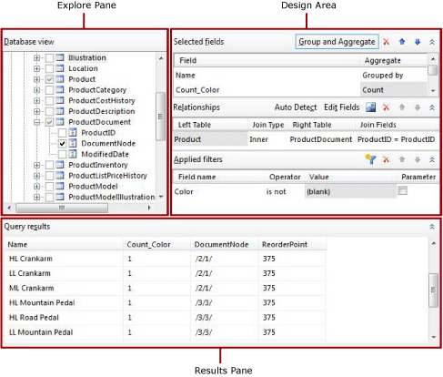
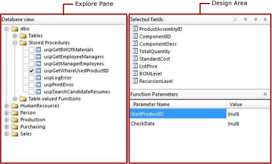
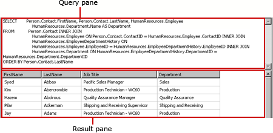
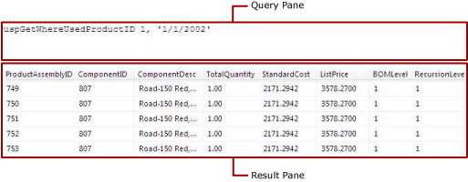

# Relational Query Designer (SSAS)
  The relational query designer helps you create a query that specifies the data to retrieve from [!INCLUDE[msCoName](../includes/msconame-md.md)] [!INCLUDE[ssNoVersion](../includes/ssnoversion-md.md)] and [!INCLUDE[msCoName](../includes/msconame-md.md)] [!INCLUDE[ssSDSfull](../includes/sssdsfull-md.md)] relational databases and [!INCLUDE[msCoName](../includes/msconame-md.md)] [!INCLUDE[ssDWfull](../includes/ssdwfull-md.md)]. Use the graphical query designer to explore the metadata, interactively build the query, and view the results of your query.  Use the text-based query designer to view the query that was built by the graphical query designer or to modify a query. You can also import an existing query from a file or report.  
  
 If you prefer, you can write the query in the SQL language by using the text-based editor. To switch to the text-based query designer, in the toolbar, click **Edit As Text**. After you edit a query in the text-based query designer, you can no longer use the graphical query designer.  
  
> [!NOTE]  
>  To specify a query for data source types Oracle, OLE DB, ODBC, and Teradata, you must use the text-based query designer.  
  
> [!IMPORTANT]  
>  Users access data sources when they create and run queries. You should grant minimal permissions on the data sources, such as read-only permissions.  
>   
>  The credentials of the current user, not the credentials specified in the Impersonation Information page, are used to connect to the data source when a query is executed.  
  
## Graphical Query Designer  
 In the graphical query designer you can explorer the database tables and views, interactively build the SQL SELECT statement that specifies the database tables and columns from which to retrieve data for a dataset. You choose the fields to include in the dataset and optionally, specify filters that limit the data in the dataset. You can specify that filters are used as parameters and provide the value of the filter at run-time. If you choose multiple tables, the query designer describes the relationship between sets of two tables.  
  
 The graphical query designer is divided into three areas. Depending on whether the query uses tables/views or stored procedures/table-valued functions the layout of the query designer changes.  
  
> [!NOTE]  
>  [!INCLUDE[ssDWfull](../includes/ssdwfull-md.md)] does not support stored procedures or table-valued functions.  
  
 The following figure shows the graphical query designer when it is used with tables or views.  
  
   
  
 The following figure shows the graphical query designer when it is used with stored procedures or table-valued functions.  
  
   
  
 The following table describes the function of each pane.  
  
|Pane|Function|  
|----------|--------------|  
|[Database view](#DatabaseView)|Displays a hierarchical view of tables, views, stored procedures, and table-valued functions that are organized by database schema.|  
|[Selected fields](#SelectedFields)|Displays the list of database field names from the selected items in the Database view pane. These fields become the field collection for the dataset.|  
|[Function parameters](#FunctionParameters)|Displays the list of input parameters for stored procedures or table-valued functions in the Database view pane.|  
|[Relationships](#Relationships)|Displays a list of relationships that are inferred from selected fields for tables or views in the Database view pane or the relationships that you created manually.|  
|[Applied filters](#AppliedFilters)|Displays a list of fields and filter criteria for tables or views in the Database view.|  
|[Query results](#QueryResults)|Displays sample data for the result set for the automatically generated query.|  
  
###  <a name="DatabaseView"></a> Database View Pane  
 The Database View pane displays the metadata for database objects that you have the permissions to view, which is determined by the data source connection and credentials. The hierarchical view displays database objects organized by database schema. Expand the node for each schema to view tables, views, stored procedures, and table-valued functions. Expand a table or view to display the columns.  
  
###  <a name="SelectedFields"></a> Selected Fields Pane  
 The Selected Fields pane displays the fields in the dataset and the groups and aggregates to include in the query.  
  
 The following options are displayed:  
  
-   **Selected fields** Displays the database fields that you select for tables or views or the input parameters for stored procedures or table-valued functions. The fields that are displayed in this pane become the field collection for the dataset.  
  
     Use the Report Data pane to view the field collection for a dataset.  
  
-   **Group and Aggregate** Toggles the use of grouping and aggregates in the query. If you turn off the grouping and aggregate feature after you added grouping and aggregates, they are removed. The text, **(none)**, indicates no grouping and aggregates are used. If you turn the grouping and aggregate feature on again, the previous grouping and aggregates are restored.  
  
-   **Delete Field** Deletes the selected field.  
  
#### Group and Aggregate  
 Queries to databases with a large table might return a number of data rows that is too large to be useful and has a performance impact on the network that transports the vast amount of data. To limit the number of data rows, the query can include SQL aggregates that summarize the data on the database server.  
  
 Aggregates provide summaries of data and the data is grouped to support the aggregate that deliver the summary data. When you use an aggregate in the query, the other fields returned by the query are automatically grouped and the query includes the SQL GROUP BY clause. You can summarize data without adding an aggregate by using only the **Grouped by** option in the **Group and Aggregate** list. Many of the aggregates include a version that uses the DISTINCT keyword. Including DISTINCT eliminates duplicate values.  
  
 [!INCLUDE[msCoName](../includes/msconame-md.md)] [!INCLUDE[ssNoVersion](../includes/ssnoversion-md.md)] uses [!INCLUDE[tsql](../includes/tsql-md.md)] and [!INCLUDE[msCoName](../includes/msconame-md.md)] [!INCLUDE[ssDWfull](../includes/ssdwfull-md.md)] uses [!INCLUDE[DWsql](../includes/dwsql-md.md)]. Both dialects of the SQL language support the clause, keyword, and aggregates that the query designer provides.  
  
 For more information about [!INCLUDE[tsql](../includes/tsql-md.md)], see [Transact-SQL Reference &#40;Database Engine&#41;](/sql/t-sql/language-reference)in [!INCLUDE[ssNoVersion](../includes/ssnoversion-md.md)] [Books Online](https://go.microsoft.com/fwlink/?LinkId=141687) on msdn.microsoft.com.  
  
 The following table list the aggregates and provides brief descriptions of them.  
  
|Aggregate|Description|  
|---------------|-----------------|  
|Avg|Return the average of the values in a group. Implements the SQL AVG aggregate.|  
|Count|Return the number of items in a group. Implements is the SQL COUNT aggregate.|  
|Count Big|Returns the number of items in a group. It is the SQL COUNT_BIG aggregate. The difference between COUNT and COUNT_BIG is that COUNT_BIG always returns a `bigint` data type value.|  
|Min|Returns the minimum value in a group. Implements is the SQL MIN aggregate.|  
|Max|Returns the maximum value in a group. Implements is the SQL MAX aggregate.|  
|StDev|Returns the statistical standard deviation of all values in a group. Implements the SQL STDEV aggregate.|  
|StDevP|Returns the statistical standard deviation for the population of the all values in a group specified expression. Implements the SQL STDEVP aggregate.|  
|Sum|Returns the sum of all the values in the group. Implements the SQL SUM aggregate.|  
|Var|Returns the statistical variance of all values in the group. Implements the SQL VAR aggregate.|  
|VarP|Returns the statistical variance for the population for all values in the group. Implements the SQL VARP aggregate.|  
|Avg Distinct|Returns unique averages. Implements a combination of the AVG aggregation and the DISTINCT keyword.|  
|Count Distinct|Returns unique counts. Implements a combination of the COUNT aggregate and the DISTINCT keyword.|  
|Count Big Distinct|Return unique count of items in a group. Implements a combination of the COUNT_BIG aggregate and the DISTINCT keyword.|  
|StDev Distinct|Returns unique statistical standard deviations. Implements a combination of the STDEV aggregate and the DISTINCT keyword.|  
|StDevP Distinct|Returns unique statistical standard deviations. Implements combination of the STDEVP aggregate and the DISTINCT keyword.|  
|Sum Distinct|Returns unique sums. Implements a combination of the SUM aggregate and the DISTINCT keyword.|  
|Var Distinct|Returns unique statistical variances. Implements a combination of the VAR aggregate and the DISTINCT keyword.|  
|VarP Distinct|Returns unique statistical variances. Implements combination of the VARP aggregate and the DISTINCT keyword.|  
  
###  <a name="FunctionParameters"></a> Function Parameters Pane  
 The Function Parameters pane displays the parameters for a stored procedure or table-valued function. The following columns are displayed:  
  
-   **Parameter Name** Displays the name of the parameter that is defined by the stored procedure or table-valued function.  
  
-   **Value** A value to use for the parameter when the query runs to retrieve data to display in the Query Results pane at design time. This value is not used at run time.  
  
###  <a name="Relationships"></a> Relationships Pane  
 The Relationships pane displays the join relationships. The relationships can be detected automatically from the foreign key relationships that are retrieved from the database metadata or you can create them manually.  
  
 The following options are displayed:  
  
-   **Auto Detect** Toggles the auto-detect feature that automatically creates relationships between tables. If auto detect is turned on, the query designer creates relationships from foreign keys in tables; otherwise, you must create the relationships manually. When you select tables in the **Database view** pane, auto detect automatically attempts to create relationships. If you turn on auto detect after you have manually created joins, those joins will be discarded.  
  
    > [!IMPORTANT]  
    >  When using with [!INCLUDE[ssDWfull](../includes/ssdwfull-md.md)] the metadata needed to create joins is not provided and relationships cannot be detected automatically. If your query retrieves data from [!INCLUDE[ssDWfull](../includes/ssdwfull-md.md)], all table joins must be created manually.  
  
-   **Add Relationship** Adds a relationship to the **Relationship** list.  
  
     If auto detect is turned on, the tables from which columns are used in the query are automatically added to the **Relationship** list. When auto detect identifies that two tables are related, one table is added to the **Left Table** column, the other the **Right Table** column, and an inner join is created between them. Each relationship generates a JOIN clause in the query. If the tables are not related, all of them are listed in **Left Table** column and the **Join Type** column indicates the tables are not related to other tables. When auto detect is turned on, you cannot manually add relationships between tables that auto detect determines are unrelated.  
  
     If auto detect is turned off, you can add and change relationships between tables. Click **Edit Fields** to specify the fields to use to join the two tables.  
  
     The order in which the relationships appear in the **Relationship** list is the order in which the joins will be performed in the query. You can change the order of relationships by moving them up and down in the list.  
  
     When using multiple relationships in a query, one of the tables in each relationship, except the first one, must be referenced in a proceeding relationships.  
  
     If both tables in a relationship are referenced by a preceding relationship then the relationship does not generate a separate join clause; instead a join condition is added to the join clause generated for the preceding relationship. The join type is inferred by the preceding relationship that referenced the same tables.  
  
-   **Edit Fields** Opens the **Edit Related Fields** dialog box in which you add and modify relationships between tables. You chose the fields in the right and left tables to join. You can join multiple fields from the left table and right table to specify multiple join conditions in a relationship. The two fields that join the left and right tables do not need to have the same name. The data type of the joined fields must have compatible data types.  
  
-   **Delete Relationship**  Deletes the selected relationship**.**  
  
-   **Move Up** and **Move Down** Moves relationships up or down the **Relationship** list. The sequence in which relationships are placed in the query can impact the query results. The relationships are added to the query in the order they appear in the **Relationship** list.  
  
 The following columns are displayed:  
  
-   **Left Table** Displays the name of the first table that is part of a join relationship.  
  
-   **Join Type** Displays the type of SQL JOIN statement that is used in the automatically generated query. By default, if a foreign key constraint is detected, INNER JOIN is used. Other joins types can be LEFT JOIN or RIGHT JOIN. If none of these join types apply, the **Join Type** column displays **Unrelated**. No CROSS JOIN joins are created for unrelated tables; instead, you must manually create relationships by joining columns in the left and right tables. For more information about types of JOINs, see "JOIN Fundamentals" in [!INCLUDE[ssNoVersion](../includes/ssnoversion-md.md)] [Books Online](https://go.microsoft.com/fwlink/?LinkId=141687) on msdn.microsoft.com..  
  
-   **Right Table** Displays the name of the second table in the join relationship.  
  
-   **Join Fields** Lists the pairs of joined fields, if a relationship has multiple join conditions the pairs of joined fields are separated by commas (,).  
  
###  <a name="AppliedFilters"></a> Applied Filters Pane  
 The Applied Filters pane displays the criteria that are used to limit the number of rows of data that are retrieved at run time. Criteria specified in this pane are used to generate an SQL WHERE clause. When you select the parameter option, a parameter is automatically created.  
  
 The following columns are displayed:  
  
-   **Field Name** Displays the name of the field to apply the criteria to.  
  
-   **Operator** Displays the operation to use to in the filter expression.  
  
-   **Value** Displays the value to use in the filter expression.  
  
-   **Parameter** Displays the option to add a query parameter to the query.  
  
###  <a name="QueryResults"></a> Query Results Pane  
 The Query results pane displays the results for the automatically generated query that is specified by selections in the other panes. The columns in the result set are the fields that you specify in the Selected Fields pane and the row data is limited by the filters that you specify in the Applied Filters pane.  
  
 This data represents values from the data source at the time that you run the query.  
  
 Sort order in the result set is determined by the order the data is retrieved from the data source. Sort order can be changed by modifying the query text directly. For more information about using the GROUP BY clause in a query, see "GROUP BY (Transact-SQL)" in [SQL Server Books Online](https://go.microsoft.com/fwlink/?linkid=98335).  
  
### Graphical Query Designer Toolbar  
 The graphical query designer toolbar provides the following buttons to help you specify or view the results of a query.  
  
|Button|Description|  
|------------|-----------------|  
|**Edit As Text**|Toggle to the text-based query designer to view the automatically generated query or to modify the query.|  
|**Import**|Import an existing query from a file or report. File types .sql and .rdl are supported.|  
|**Run Query**|Run the query. The Query results pane displays the result set.|  
  
## Understanding Automatically Generated Queries  
 When you select tables and columns or stored procedures and views in the Database View pane, the query designer retrieves the underlying primary key and foreign key relationships from the database schema. By analyzing these relationships, the query designer detects relationships between two tables and adds joins to the query. You can then modify the query by adding groups and aggregates, adding or changing relationships, and adding filters. To view the query text that shows the columns from which to retrieve data, the joins between tables, and any groups or aggregates, click **Edit As Text**.  
  
## Text-based Query Designer  
 The text-based query designer provides a way to specific a query by using the query language supported by the data source, run the query, and view the results at design time. You can specify multiple SQL statements, query or command syntax for custom data processing extensions, and queries that are specified as expressions.  
  
 Because the text-based query designer does not preprocess the query, it can accommodate any kind of query syntax. It is the default query designer tool for many data source types.  
  
 The text-based query designer displays a toolbar and the following two panes:  
  
-   **Query** Shows the query text, table name, or stored procedure name depending on the query type. Not all query types are available for all data source types. For example, table name is supported only for the data source type OLE DB.  
  
-   **Result** Shows the results of running the query at design time.  
  
### Text-based Query Designer Toolbar  
 The text-based query designer provides a single toolbar for all the command types. The following table lists each button on the toolbar and its function.  
  
|Button|Description|  
|------------|-----------------|  
|**Edit As Text**|Toggle between the text-based query designer and the graphical query designer. Not all data source types support graphical query designers.|  
|**Import**|Import an existing query from a file or report. Only file types sql and rdl are supported.|  
||Run the query and display the result set in the Result pane.|  
|**Command Type**|Select **Text**, **StoredProcedure**, or **TableDirect**. If a stored procedure has parameters, the **Define Query Parameters** dialog box appears when you click **Run** on the toolbar, and you can fill in values as needed.<br /><br /> Note that if a stored procedure returns more than one result set, only the first result set is used to populate the dataset. Note also that <br />                      **TableDirect** is available only for the data source type OLE DB.|  
  
#### Command Type Text  
 When you create a [!INCLUDE[ssNoVersion](../includes/ssnoversion-md.md)] dataset, the relational query designer opens by default. To switch to the text-based query designer, click the **Edit As Text** toggle button on the toolbar. The text-based query designer presents two panes: the Query pane and the Result pane. The following figure labels each pane.  
  
   
  
 The following table describes the function of each pane.  
  
|Pane|Function|  
|----------|--------------|  
|Query|Displays the SQL query text. Use this pane to write or edit a SQL query.|  
|Result|Displays the results of the query. To run the query, right-click in any pane and click **Run**, or click the **Run** button on the toolbar.|  
  
#### Example  
 The following query returns the list of names from a table named `ContactType`.  
  
```  
SELECT Name FROM ContactType  
```  
  
 When you click **Run** on the toolbar, the command in the **Query** pane runs and the results, a list of names, are displayed in the **Result** pane.  
  
#### Command Type StoredProcedure  
 When you select **Command typeStoredProcedure**, the text-based query designer presents two panes: the Query pane and the Result pane. Enter the stored procedure name in the Query pane and click **Run** on the toolbar. If the stored procedures uses parameters, the **Define Query Parameters** dialog box opens. Enter the parameter values for the stored procedure.  
  
 The following figure shows the Query and Results panes when you run a stored procedure. In this case, the input parameters are constants.  
  
   
  
 The following table describes the function of each pane.  
  
|Pane|Function|  
|----------|--------------|  
|Query|Displays the name of the stored procedure and any input parameters.|  
|Result|Displays the results of the query. To run the query, right-click in any pane and click **Run**, or click the **Run** button on the toolbar.|  
  
#### Example  
 The following query calls the a stored procedure named `uspGetWhereUsedProductID`. When the stored procedure has input parameters you must provide parameter values when you run the query.  
  
```  
uspGetWhereUsedProductID  
```  
  
 Click the **Run** (**!**) button. The following table provides an example of `uspGetWhereUsedProductID` parameters for which you provide values in the **Define Query Parameter** dialog box.  
  
|||  
|-|-|  
|*@StartProductID*|820|  
|*@CheckDate*|20010115|  
  
#### Command Type TableDirect  
 When you select **Command typeTableDirect**, the text-based query designer presents two panes: the Query pane and the Result pane. When you enter a table and click the **Run** button, all the columns for that table are returned.  
  
#### Example  
 For a data source type OLE DB, the following dataset query returns a result set for all contact types in the `ContactType` table.  
  
 `ContactType`  
  
 When you enter the table name `ContactType`, it is the equivalent of creating the SQL statement `SELECT * FROM ContactType`.  
  
  
