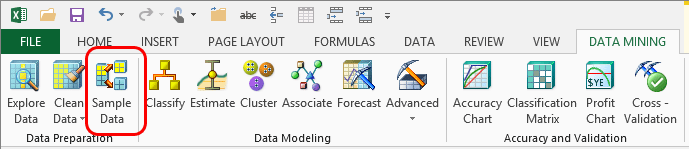

# Sample Data (SQL Server Data Mining Add-ins)
    
  
 The **Sample Data** wizard makes it easy to divide your source data into two sets, one for building (training) the model and one for testing the model. This wizard also provides an option for resampling the data to build a new data set that better represents your target.  
  
 Creating the right kind of data for training and testing your models is an important part of data mining, but one that can be tedious without the right tools. The wizard performs stratified sampling to make sure that training and testing sets are well balanced.  
  
## Random Sampling and Oversampling  
 . Random sampling is the best way to ensure that the data you use for testing a model fairly represents the data that you use for creating the model. You can randomly sample data that is stored in Excel or in an external data source  
  
 If you use the random sampling option, the **Sample Data** wizard automatically creates training and test data sets and outputs them into separate Excel worksheets for later reference.  
  
 If your data is stored in an Excel workbook, and not an external data source, you also have the option to use *oversampling*. With this option, you specify a target value that might be scarce in your data, and the wizard will collect a balanced set that includes more of the target value. You can direct the wizard to achieve a targeted percentage, or to create a certain number of rows.  
  
 If you use the oversampling option, the **Sample Data** wizard creates a new worksheet that contains the newly balanced sample data.  
  
## Using the Sample Data Wizard  
  
#### To separate data into training and testing sets  
  
1.  In the **Data Mining** ribbon, click **Sample Data**.  
  
2.  On the **Select Source Data** page, specify whether the **data** that you want to partition is in an Excel range or table, or in an external data source.  
  
3.  On the **Select Sampling Type** page, specify whether you want to create training and test data sets by random sampling, or create a new data set by oversampling.  
  
    > [!NOTE]  
    >  If you are using an external data source, only the random sampling option is available. If you want to use oversampling with external data, you can import the data to an Excel workbook by using an Excel data connection, and then use the Sample Data wizard.  
  
4.  Set options specific to the sampling method that you selected.  
  
    -   For random sampling, specify either a percentage of the original data to use for testing, or the total number of rows to use in the test data set.  
  
    -   For oversampling, select the column and value that you want to emphasize. Then, specify the total number of rows in the new data set, and the percentage of rows in the new data set that should include the target value.  
  
         The target value for oversampling must be a discrete value; you cannot oversample continuous numeric data.  
  
5.  On the **Finish page**, accept the default names for the new data sets, or type a new name.  
  
     The wizard creates new worksheets for each set of data.  
  
 Most of the wizards in the Data Mining Client for Excel also provide an option to randomly separate your data into training and testing sets. However, if you use the wizards, your data stays in the same worksheet (or other data source), and the information about whether a particular row is a test case or training case is stored internally. In contrast, when you use the **Sample Data** wizard, the testing and training data are output to separate worksheets for easy reference.  
  
## Related Options  
 As you progress through the wizard, you will have these options:  
  
|Options|Comments|  
|-------------|--------------|  
|Select Source Data Dialog Box (Data Mining Client for Excel)|Select an Excel range or table that contains the data. If you want to use external data, the data can be relational, but it must be included in an [!INCLUDE[ssASnoversion](../includes/ssasnoversion-md.md)] data source. T|  
|Select Sampling Type Page (Data Mining Client for Excel)|If you use an external data source, you are limited to using the random sampling option. Also, you must specify the number of rows to create in the final data set, by using the **Row count** option. You cannot specify a percentage of the source data.|  
|Random Sampling Page (Data Mining Client for Excel)|You can copy a percentage of rows from the source, or a specific number of rows.|  
|Oversampling Page (Data Mining Client for Excel)|**Target state**   Select a value from the list that is underrepresented in the original data set. Oversampling will increase the proportion of data rows that include this state.   **Sample size**   Select the total number of rows to extract. This value represents the size of the final data set.|  
  
## Other Sampling Options  
 If the sampling options in this wizard do not meet your needs, you can use the sampling transformation in SQL Server Integration Services (SSIS) to sample rows from multiple data sources.  
  
 For more information, see [Row Sampling Transformation](../integration-services/data-flow/transformations/row-sampling-transformation.md) and [Percentage Sampling Transformation](../integration-services/data-flow/transformations/percentage-sampling-transformation.md).  
  
## See Also  
 [Checklist of Preparation for Data Mining](checklist-of-preparation-for-data-mining.md)  
  
  
