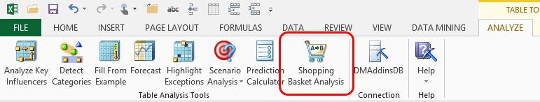

# Shopping Basket Analysis (Table AnalysisTools for Excel)
    
  
 The **Shopping Basket Analysis** tool helps you find `associations` in your data. An association might tell you which items are frequently purchased at the same time. In data mining, this technique is a well-known method known as *market basket analysis*, used to analyze the purchasing behavior of customers in very large data sets. Marketers might use the information to make recommend related products to customers and to promote related products by placing them in close proximity on web pages, in catalogs, or on the shelf.  
  
 To use shopping basket analysis, the items that you want to analyze must be related by a transaction ID. For example, if you are analyzing all the orders received through a Web site, each order would have an order ID or transaction ID that is associated with one or more purchased items.  
  
 When the wizard finishes analyzing the data, it creates two new worksheets, **Shopping Basket Item Groups** and **Shopping Basket Rules**.  
  
 The **Shopping Basket Item Groups** worksheet contains a list of the items that frequently appear together in transactions. These common groupings are called *itemsets*. The worksheet also contains statistics, such as *support* and *lift*, to help you understand the significance of the itemset. If price information is available, the worksheet also creates a sum of the value of all the related items, to give an indication of the total value of the transactions.  
  
 You can filter and sort on the columns in the report. For example, you might want to view only those itemsets with 2 or more products, or order the itemsets by **Average Basket Value**.  
  
 The **Shopping Basket Rules** worksheet uses the statistics derived from analysis to create rules about how items are related. For example, a rule might be that if customers purchase Product A, they are highly likely to purchase Product B. The rules can be used to create recommendations. Each rule has supporting statistics that help you evaluate the potential strength of the rule, so that you can make a recommendation only if the rule exceeds a certain probability threshold.  
  
## Using the Shopping Basket Analysis Tool  
  
1.  Open an Excel table that contains appropriate data. In the sample workbook, click the Associate worksheet.  
  
2.  Click **Shopping Basket Analysis**.  
  
3.  In the **Shopping Basket Analysis** dialog box, choose the column that contains the transaction ID, and then choose the column that contains the items or products you want to analyze.  
  
4.  Optionally, you can add a column that contains product values.  
  
5.  Click**Advanced**to open the **Advanced Parameters Setting** dialog box. Increase the value for **Minimum support** to reduce the number of products that are grouped as itemsets. Increase the **Minimum rule probability** to filter out very common itemsets.  
  
### Requirements  
 To use the **Shopping Basket Analysis** tool, your data must be stored in an Excel table and must contain the following columns:  
  
-   Column that contains a unique ID representing the transaction. The ID can be numeric or text, so long as the value in each row is unique.  
  
-   Column that contains the item or product you are analyzing.  
  
-   An optional numeric column that represents the price or value of each item. This column is used to aggregate the value of the itemsets each product is found in, and can help you understand the total value of certain transactions.  
  
## How Items are Associated  
 The individual items that you are analyzing must be grouped by some identifier that represents the case, transaction, or occasion. Therefore, you would choose this transaction ID column as the identifier, and not the customer ID number or product ID number.  
  
 When the tool examines the products within each transaction, it creates an itemset for each combination of items that it finds. For example, if a customer bought three items on a single visit, there are 7 possible itemsets: each product considered on its own, each product grouped with one other product, and the combination of all three products.  
  
> [!NOTE]  
>  You can filter out the itemsets that contain single items, but the tool needs to analyze these to generate meaningful statistics for the data set.  
  
 Support for each itemset is calculated as the number of customers who buy an itemset. In the example just stated, if there is just one customer who purchased 3 items, with 7 possible itemsets, each of the 7 itemsets has a support value of 1. As the number of customers grows, and the number of possible combinations grows, it can take much longer to process the report. However, some itemsets might have very small support. Therefore, you might decide to reduce the time it takes to generate the report by limiting the number of items in each itemset to 3 or less. Generally, larger itemsets have much lower support, so the trade-off is acceptable.  
  
## Specifying Minimum Support and Rule Probability  
 As your data set grows larger, the number of possible item groupings and rules can become overwhelming. However, you can control the number of results that are output by the tool, to focus on only the most valuable itemsets and rules. You set these options in the **Shopping Basket Advanced Parameters Dialog Box**.  
  
### Minimum Support  
 *Minimum support* means the number of transactions that must contain a particular itemset for the itemset to be considered significant. For example, you might not be interested in an itemset unless it had been purchased in at least 10 different transactions. There are two ways to control the threshold for itemset significance, and both use the **Minimum support** parameter.  
  
 **As an absolute value:** Enter a number that represents the count of transactions that contain the target items. For example, if you enter 10, any set of items that appears in at least 10 shopping baskets is included in the results.  
  
 **As a percentage:** Enter a number that represents a percentage of the entire collection of itemsets. For example, if you specify 10, all the itemsets are counted and the targeted itemset must appear constitute at least 10 percent of that total number of itemsets. If you have a very large dataset, using percentages instead of a count can help you focus on the most important item groupings.  
  
> [!NOTE]  
>  Remember, the number of itemsets is different from the number of transactions in your data. Each transaction can contain multiple itemsets; however, most itemsets repeat several times across the dataset.  
  
### Rule Probability and Rule Importance  
 The probability of a rule describes how likely the result of a rule is to occur. Rule probability is calculated by using the frequency of the itemsets that support a rule. If an itemset occurs very rarely, it will have a low probability.  
  
 However, rules that have high probability may not always be useful. They might indicate itemsets that are purchased frequently and therefore need no additional promotion. The importance is designed to measure the usefulness of a rule. Sometimes a rule might have very high probability but low importance, because the prediction does not provide new information. For example, if every itemset contains a specific state of an attribute, a rule that predicts that state is trivial, even though the probability is very high.  
  
 You should experiment with these settings to see different results and determine which setting yields the most interesting rules.  
  
## Understanding the Reports  
 The **Shopping Basket Analysis** tool creates two complementary reports. The first report, titled **Significant Groups of Items Identified during Analysis**, provides a list of all the itemsets that were found. You can use  the new table tools in Microsoft Excel to sort, filter, and explore the data.  
  
 The second report, titled **Shopping Basket Rules**, tells you what kind of inferences can be made based on the itemsets listed in the first report. Whereas the list of itemsets is more useful for exploring and understanding your data, the list of rules is more useful for making predictions and recommendations.  
  
### Shopping Basket Item Groups Report  
 This report contains a list of all the possible combinations of items that were found in your data set. For example, if your transaction data contains orders, for each order the **Shopping Basket Analysis** tool calculates how many times the individual item was ordered, and then calculates all combinations of that item with other items.  
  
 The report lists the itemsets that were found in order of their lift. Lift is a score that tells you the importance of the itemset.  
  
|Column in report|What it tells you|  
|----------------------|-----------------------|  
|Group of Items|Lists the itemsets, or combination of items.|  
|Group Size|A count of the number of items in the itemset. You can filter on this field to see only pairs of items, single items, etc.|  
|Support|A count of the number of cases where this combination occurred. You can sort on this column to see the itemsets that are most common.|  
|Average Value|A sum of the value of the items in just this itemsets, divided by the support. You can sort and filter on this column to target products in different price ranges.|  
|Average Basket Value|A sum of the values of all items in orders that contain this itemset, divided by support. This statistic is interesting when paired with the average value of the itemset.|  
|Lift|A score that represents how interesting this itemset is in the entire data set. Lift is calculated by getting the probability of the two items occurring together, and the dividing by the probability of two items occurring independently. As a result, if there is a strong correlation between the items, lift score will be higher.|  
  
### Shopping Basket Rules Report  
 This report contains a set of rules that were built by analyzing the itemsets that were found. For example, if your transaction data revealed that Products A and B were frequently purchased together, the Shopping Basket Analysis tool will create a rule that predicts A given the existence of B, or B given the existence of A.  
  
 Each rule is associated with a probability, derived from the supporting data. These probabilities are useful when making recommendations. For example, you might only want to see rules that have at least a 50 percent chance of being accurate, based on existing data.  
  
 The report lists the itemsets that were found in order of their lift. Lift is a score that tells you the importance of the itemset.  
  
|Column in report|What it tells you|  
|----------------------|-----------------------|  
|Existing Items|Lists the items that are needed to make a recommendation.   In data mining, these items are said to be on the *left side* of the association rule.|  
|Predicted Item|Lists the item to recommend.   In data mining, these items are said to be on the *right side* of the association rule.|  
|Probability|Displays the probability that this rule is correct.|  
|Support|Indicates the number of cases in existing data that provide evidence for this rule.|  
|Rule Value|If you provide a value for the items in the shopping basket, this column calculates the worth of the prediction, given the cost of the items.|  
|Lift|Indicates the strength of the correlation between the items in the first column and the items in the second column. Also referred to as *importance*.   A lift of 0 means that there is no correlation. A positive value means that the items in the first column predict the item in the second column. The higher the number, the stronger the correlation.|  
  
## Related Tools  
 The Data Mining Client for Excel, which is a separate add-in that provides more advanced data mining functionality, also contains a wizard that performs association analysis. For more information, see [Associate Wizard &#40;Data Mining Client for Excel&#41;](associate-wizard-data-mining-client-for-excel.md).  
  
 For more information about the algorithm used to perform this analysis, see the topic "Microsoft Association Algorithm" in SQL Server Books Online.  
  
## See Also  
 [Table Analysis Tools for Excel](table-analysis-tools-for-excel.md)  
  
  
