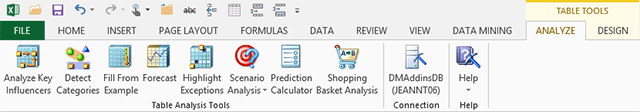

# Table Analysis Tools for Excel
  The data mining tools in the **Analyze** toolbar are the easiest way to get started with data mining. Each tool automatically analyzes the distribution and type of your data, and sets the parameters to ensure that results are valid. You do not have to select an algorithm or configure complex parameters.  
  
   
  
 The **Analyze** ribbon includes the following tools:  
  
 [Analyze Key Influencers &#40;Table Analysis Tools for Excel&#41;](analyze-key-influencers-table-analysis-tools-for-excel.md)  
 You choose a column or output value of interest, and then the algorithm analyzes all the input data to identify the factors that have the most influence on the target. Optionally, you can create a report that compares any two values, so that you can see how the influencers change.  
  
 The **Analyze Key Influencers** tool uses the Microsoft Naïve Bayes algorithm.  
  
 [Detect Categories &#40;Table Analysis Tools for Excel&#41;](detect-categories-table-analysis-tools-for-excel.md)  
 This tool lets you add any data set and apply clustering to find groupings of data. It's useful for finding similarities and for creating groups to further analyze.  
  
 The **Detect Categories** tool uses the Microsoft Clustering algorithm.  
  
 [Fill From Example &#40;Table Analysis Tools for Excel&#41;](fill-from-example-table-analysis-tools-for-excel.md)  
 This tool helps you impute missing values. You provide some examples of what the missing values should be, and the tool builds patterns based on all data in the table, and then recommends new values based on patterns in the data.  
  
 The **Fill From Example** tool uses the Microsoft Logistic Regression algorithm.  
  
 [Forecast &#40;Table Analysis Tools for Excel&#41;](forecast-table-analysis-tools-for-excel.md)  
 This tool takes data that changes over time, and predicts future values.  
  
 The **Forecast** tool uses the Microsoft Time Series algorithm.  
  
 [Highlight Exceptions &#40;Table Analysis Tools for Excel&#41;](highlight-exceptions-table-analysis-tools-for-excel.md)  
 This tool analyzes patterns in a table of data and finds rows and values that don't fit the pattern. You can then review and correct them and rerun the model, or flag values for later action.  
  
 The **Highlight Exceptions** tool uses the Microsoft Clustering algorithm.  
  
 [Goal Seek Scenario &#40;Table Analysis Tools for Excel&#41;](goal-seek-scenario-table-analysis-tools-for-excel.md)  
 In the **Goal Seek** tool, you specify a target value, and the tool identifies the underlying factors that must change to meet that target. For example, if you know that you must increase call satisfaction by 20%, you can ask the model to predict the factors that should change to produce that goal.  
  
 The **Goal Seek** tool uses the Microsoft Logistic Regression algorithm.  
  
 [What-If Scenario &#40;Table Analysis Tools for Excel&#41;](what-if-scenario-table-analysis-tools-for-excel.md)  
 The **What-If Analysis** tool complements the **Goal Seek** tool. With this tool, you entered the value you want to change, and the model predicts whether that change will be sufficient to achieve the desired outcome. For example, you might ask the model to infer whether adding one extra call operator would increase customer satisfaction by one point.  
  
 The **What-If** tool uses the Microsoft Logistic Regression algorithm.  
  
 [Prediction Calculator &#40;Table Analysis Tools for Excel&#41;](prediction-calculator-table-analysis-tools-for-excel.md)  
 This tool creates a model that analyzes the factors leading to the target outcome, and then predicts a result for any new inputs, based on scoring rules derived from the data. This tool also generates an interactive decision-making worksheet that lets you easily score new inputs. You can also create a printed version of the scoring worksheet for offline use.  
  
 The **Prediction Calculator** tool uses the Microsoft Logistic Regression algorithm.  
  
 [Shopping Basket Analysis &#40;Table AnalysisTools for Excel&#41;](shopping-basket-analysis-table-analysistools-for-excel.md)  
 This tool identifies patterns that can be used in cross-selling or up-selling. It identifies groups of products that are frequently purchased together, and also generates reports based on the price and cost of related product bundles, to aid in decision-making.  
  
 The tool is not limited to market basket analysis; you can apply it to any problem that lends itself to association analysis. For example, you might look for events that frequently occur together, factors leading to a diagnosis, or any other set of potential causes and outcomes.  
  
 The **Shopping Basket Analysis** tool uses the Microsoft Association algorithm.  
  
## Requirements for the Table Analysis Tools for Excel  
 To use the Table Analysis Tools for Excel, you must first create a connection to an instance of [!INCLUDE[ssASnoversion](../includes/ssasnoversion-md.md)]. This connection gives you access to the Microsoft data mining algorithms that are used to analyze your data. If you do not have access to an instance, we recommend that you ask your administrator to set up an instance that you can use for experimenting with data mining. For more information, see [Connect to Source Data &#40;Data Mining Client for Excel&#41;](connect-to-source-data-data-mining-client-for-excel.md).  
  
 To work with data using the Table Analysis Tools, you must convert the range of data you want to use to Excel tables.  
  
 If you cannot see the **Analyze** ribbon, try clicking inside a data table first. The menu is not activated until a data table is selected.  
  
## See Also  
 [Data Mining Client for Excel &#40;SQL Server Data Mining Add-ins&#41;](data-mining-client-for-excel-sql-server-data-mining-add-ins.md)   
 [Troubleshooting Visio Data Mining Diagrams &#40;SQL Server Data Mining Add-ins&#41;](troubleshooting-visio-data-mining-diagrams-sql-server-data-mining-add-ins.md)   
 [What's Included in the Data Mining Add-Ins for Office](what-s-included-in-the-data-mining-add-ins-for-office.md)  
  
  
