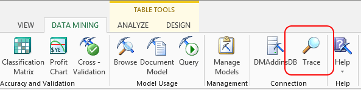

# Trace (Data Mining Client for Excel)
    
  
 The **Tracer** dialog box helps you monitor the statements that are sent to the instance of [!INCLUDE[ssASnoversion](../includes/ssasnoversion-md.md)] that you are using for data mining. After you have created a connection to an instance of [!INCLUDE[ssASnoversion](../includes/ssasnoversion-md.md)], all interactions between the client and the server are logged in the **Tracer** pane, including statements that create structures, add mining models, and make predictions, as well as some messages returning from the server.  
  
 Depending on the action that is requested, the statement might be a Data Mining Extensions (DMX) data definition query or data manipulation query, an Analysis Services Scripting Language (ASSL) packet, or a call to an Analysis Services stored procedure. Actual numerical results and data values are not shown, however.  
  
 **Trace** monitors only the current connection, and the contents of the **Tracer** dialog box are not stored.  
  
## Options  
 Tracer pane  
 Lists all statements sent from the Excel client to the server.  
  
 Depending on the action that is being requested, the statement might be a DMX data manipulation or data definition statement, a call to an Analysis Services stored procedure, or an XML/A packet.  
  
 **Current Connection**  
 Click to display the definition of the current connection. The definition includes the name of the connection, the provider, data source, and catalog, the time the connection was last used for a transaction, and the current state (Open, Inactive).  
  
 **Use session models**  
 Select this check box to store data mining models and structures as temporary objects on the server. The models and structures that you create will be available only for the duration of the current session.  
  
 Deselect this option to save your models or structures by storing them on an Analysis Services server.  
  
 **Note** The ability to use temporary objects is available only when you are using the Table Analysis Tools for Excel. The Visio Data Mining templates and the Data Mining Client for Excel require structures and models to be stored on the server.  
  
## Tracing Temporary Structures and Models  
 If you are using the Table Analysis Tools, which by default create temporary structures and models, the activity between the server and the client is monitored, but the models or structures that you create are not saved permanently to the server.  
  
 If you want to preserve your work when using one of the Table Analysis Tools, you can deselect the option, **Use session models**, to cause your models to be permanently saved on the server. You can also copy the statements in the **Tracer** pane to a file so that you can re-create your work later.  
  
## Understanding Sessions  
 When you connect to an instance of [!INCLUDE[ssASnoversion](../includes/ssasnoversion-md.md)], the data mining add-in initiates a session. Each session receives a session identifier that identifies an existing session on the [!INCLUDE[ssASnoversion](../includes/ssasnoversion-md.md)] instance. However, a session identifier does not guarantee that a session remains valid. The session can expire if the session times out or the connection associated with the session is disconnected. If the session expires and is no longer valid, [!INCLUDE[ssASnoversion](../includes/ssasnoversion-md.md)] ends the session and rolls back any transactions that are in process. If a message is sent with a session identifier that is no longer valid, the message fails with an error indicating that the specified session cannot be found.  
  
 Although some data mining models are explicitly stored on the server, session mining models and structures are not, and no record is persisted of session data mining activity. Because temporary mining models and structures are deleted as soon as you end the session, you should avoid closing your Excel workbook until after you have saved any work that you want to keep.  
  
## Changing Connections  
 Changing connections does not delete traces from previous connections. Only closing the workbook erases the session.  
  
 If you change connections while working in an Excel workbook, the change of connections is not recorded in the **Tracer** pane. To explicitly display the name and status of the current connection, you must click **Current Connection**.  
  
## Understanding Statements in the Tracer  
 DMX is a language that you can use to create and work with data mining models in [!INCLUDE[ssASnoversion](../includes/ssasnoversion-md.md)]. You can use DMX to create the structure of new data mining models, train these models, and to browse, manage, and predict against them. DMX is composed of data definition language (DDL) statements, data manipulation language (DML) statements, and functions and operators.  
  
 A complete discussion of DMX statements and their syntax is beyond the scope of this topic. However, you can use the information in the **Tracer** pane to find detailed information about the behavior of a DMX statement. The Data Mining Add-ins for Excel can also help you build complex DMX statements and interact with an [!INCLUDE[ssASnoversion](../includes/ssasnoversion-md.md)] server. For more information, see [Query &#40;SQL Server Data Mining Add-ins&#41;](query-sql-server-data-mining-add-ins.md).  
  
> [!NOTE]  
>  Many DMX statements are parameterized. For simple types, the values of the parameters are listed under the statement. However, for complex types, only the type of the parameter is listed.  
  
 SQL Server Analysis Services also uses the XML for Analysis (XMLA) protocol to handle all communications between client applications, including the Data Mining Client for Excel and an instance of [!INCLUDE[ssASnoversion](../includes/ssasnoversion-md.md)].  
  
 For more information about DMX syntax, and about the commands and elements in XMLA, see [!INCLUDE[ssNoVersion](../includes/ssnoversion-md.md)] Books Online.  
  
 Some of the statements sent to the server may include queries that call Analysis Services system stored procedures. For more information, see SQL Server Books Online.  
  
  
