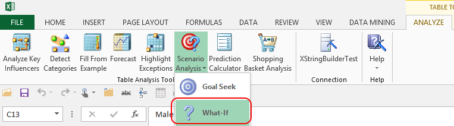

# What-If Scenario (Table Analysis Tools for Excel)
    
  
 The **What-If** scenario tool analyzes patterns in existing data, and then enables you to evaluate the effect that changes in one column would have on the value of a different column.  
  
 For example, you could explore the effect of raising the price of an item on its total sales.  
  
 The tool is flexible about the number of predictions you can create. After the initial analysis is complete, you can either predict changes for all the data in the table, or enter test values one at a time.  
  
## Using the What-If Scenario Tool  
  
1.  Open an Excel data table.  
  
2.  Click **Scenarios**, and then select **What-If**.  
  
3.  In the **Scenario** box, select the column that contains the value you will change, and specify the change either as a specific value or as a percentage of change (either increased or decreased) on the current values.  
  
4.  In the **What happens to** box, specify the column for which you want to assess the effect.  
  
5.  Optionally, click **Choose columns to be used for analysis** to select columns that are likely to be useful in making the prediction. You can also deselect columns that are likely to be of little use in detecting patterns, such as row IDs or names.  
  
6.  In the **Specify row or table** box, choose whether you want the impact assessed for the currently selected row only, or for the complete set of data in the table.  
  
7.  If you select **On this row**, the tool displays the result in the dialog box. While the dialog box remains open, you can modify your selections to test other scenarios.  
  
8.  If you select **Entire table**, the tool displays a status message in the dialog box, and adds two new columns to the original data table. Click **Close** to view the complete results in the worksheet.  
  
### Requirements  
 This tool uses the Microsoft Logistic Regression algorithm, which supports prediction of either numeric or discrete values. However, to achieve the best results, we suggest the following best practices:  
  
-   Select columns for analysis that contain useful information.  
  
-   If you include too few columns it may be difficult to obtain a result.  
  
-   If you use the **To value** option, you must type a value in the box or select a value from the list.  
  
-   If you use the **Percentage** option, set the change as a percentage increase or decrease. The default is 120%, meaning a 20% increase over the current value.  
  
> [!NOTE]  
>  If you do not set a value, you might receive an error.  
  
## Understanding the Results of What-If Analysis  
 When you create a **What-If** scenario, the tool does three things:  
  
-   Creates a data mining structure that stores key facts about the data in your table.  
  
-   Creates a logistic regression mining model based on the data.  
  
-   Creates a prediction query for each of the values you specify.  
  
 You can output all the predictions at one time by specifying **Entire table**. The tool then creates two new columns in the original data table.  
  
 The columns that are added to the table contain two types of information: the predicted value given the change, and its confidence. Confidence means the probability that the prediction is correct.  
  
 You can also enter change values one by one in the dialog box, and view the predictions interactively. This is the same as creating a *singleton prediction query*. The results of the prediction query are output with the following information: the success or failure of prediction, the predicted value, and the confidence level. The confidence level is shown as a bar that contains a dotted line. The longer the dotted line, the higher the confidence in the result.  
  
 For example, if you are trying to determine the effect of increasing the customer's age on the customer's willingness to buy, and increase the customer's age to 25, the **What-If** tool queries the data mining model and returns the following result:  
  
 **What-If Analysis for Purchases Bicycle has found a solution.**  
  
 **'Purchases Bicycle' = yes**  
  
 **Confidence: Fair**  
  
 Because this result is based on an existing row in the data table, it means that, for a particular customer, if all else about the customer stayed the same but the customer's age was increased to 25, the customer would likely buy a bicycle.  
  
 Outputting the predictions to the original data table might make it easier to determine whether the predictions are useful.  
  
## Related Tools  
 The Data Mining Client for Excel, which is a separate add-in that provides more advanced data mining functionality, includes wizards for creating data mining models that predict behavior. For more information, see [Creating a Data Mining Model](creating-a-data-mining-model.md).  
  
 For more information about the algorithm used by the **What-If** scenario tool, see the topic "Microsoft Logistic Regression Algorithm" in SQL Server Books Online.  
  
## See Also  
 [Table Analysis Tools for Excel](table-analysis-tools-for-excel.md)  
  
  
