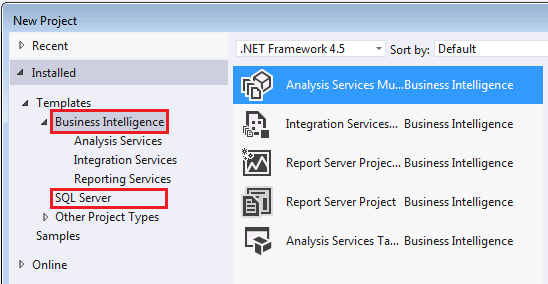
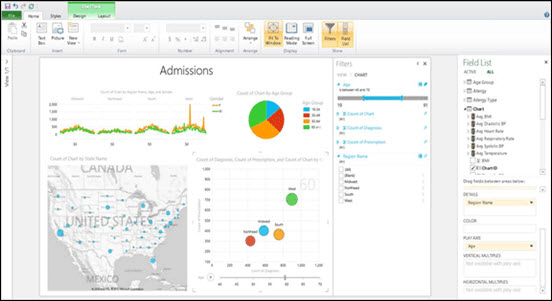

# What&#39;s New in Analysis Services and Business Intelligence
  With exception to added functionality supporting Power View Reports against Multidimensional Models, [!INCLUDE[ssCurrent](../includes/sscurrent-md.md)][!INCLUDE[ssASnoversion](../includes/ssasnoversion-md.md)] is unchanged from the previous release.  
  
 For information about other [!INCLUDE[ssCurrent](../includes/sscurrent-md.md)] products and technologies that are different in this release, see [What's New in SQL Server 2014](../sql-server/what-s-new-in-sql-server-2016.md).  
  
## Updates to Design Tool installation  
 [!INCLUDE[ssBIDevStudio](../includes/ssbidevstudio-md.md)] for Business Intelligence (SSDT-BI), previously known as Business Intelligence Development Studio (BIDS), is used to create Analysis Services models, Reporting Services reports, and Integration Services packages. You can download SSDT-BI from the following locations:  
  
-   [Download SSDT-BI for Visual Studio 2013](https://go.microsoft.com/fwlink/p/?LinkId=396526)  
  
-   [Download SSDT-BI for Visual Studio 2012](https://go.microsoft.com/fwlink/p/?LinkID=273673)  
  
 If you have a prior version of SSDT-BI or BIDS installed on your computer, the newer version is installed side-by-side the previous version. It's common to run newer and older versions of the design tools on a single workstation so that you can modify projects and solutions tied to specific versions of the server.  
  
> [!NOTE]  
>  There are several download sites for the Visual Studio 2012 and Visual Studio 2013 versions of SSDT. Most do not include the BI project templates. Using the links above will get you the correct version. You'll know that you have the correct version of SSDT-BI if you see the Business Intelligence project templates folder. This folder contains the project templates for Analysis Services, Reporting Services and Integration Services. Depending on how you installed SSDT-BI, you might also see an additional project template for SQL Server databases.  
  
   
  
## Features recently added: Power View for Multidimensional Models  
 The ability to create Power View reports against multidimensional models was first introduced in [!INCLUDE[ssSQL11](../includes/sssql11-md.md)] Service Pack 1 Cumulative Update 4. Power View for Multidimensional Models functionality is now included as part of [!INCLUDE[ssSQL14](../includes/sssql14-md.md)].  
  
 **Power View Report for a Multidimensional Model**  
  
   
  
 This functionality helps organizations maximize existing BI investments by enabling multidimensional models (also known as OLAP cubes) to be used with the latest client reporting tools. Depending on the types of data in the multidimensional model, users can easily create a variety of dynamic visualizations from tables and matrices, to bubble charts and geographical maps. Multidimensional models now also support queries using Data Analysis Expressions (DAX).  
  
 Power View for Multidimensional Models requires the built-in Power View reporting capability in [!INCLUDE[ssSQL14](../includes/sssql14-md.md)][!INCLUDE[ssRSnoversion](../includes/ssrsnoversion-md.md)] (in SharePoint mode). Other versions of Power View, specifically the Power View Add-in in Excel 2013, do not support multidimensional models.  
  
 To learn more, see [Power View for Multidimensional Models](https://msdn.microsoft.com/library/dn140246.aspx).  
  
  
