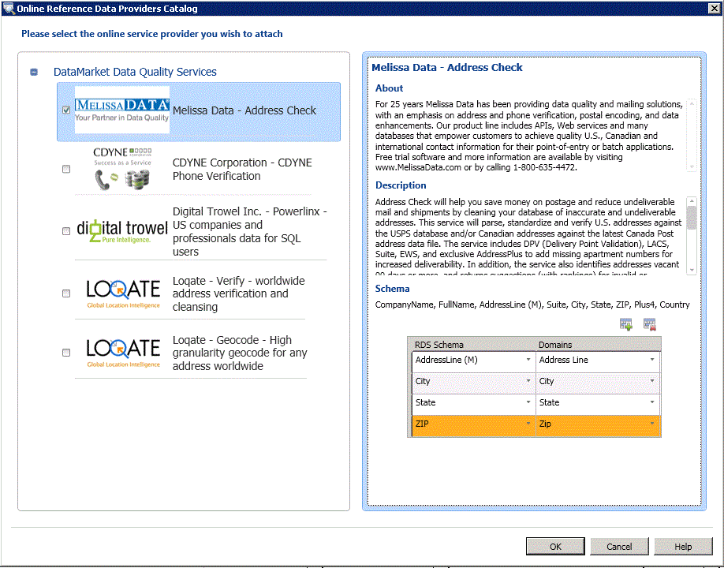

# Attach a Domain or Composite Domain to Reference Data
  This topic describes how to attach domains/composite domains in a data quality knowledge base to a reference data service in Windows Azure Marketplace to build knowledge against the high-quality reference data. Each reference data service contains a schema (data columns). After attaching a domain or a composite domain to a reference data service, you must map the attached domain or the individual domains within the attached composite domain to the appropriate columns in a reference data service schema. Attaching a composite domain to a reference data service enables you to attach just one domain to a reference data service, and then map the individual domains within the composite domain to appropriate columns in the reference data service schema.  
  
> [!WARNING]  
>  The composite domain attached to a reference data service is available in the domains drop-down list while mapping domains to the columns in the reference data service schema. Do not map the composite domain to a column in the reference data service schema; you must only map individual domains within a composite domain to the appropriate columns in the reference data service schema. Otherwise, it will result in an error.  
  
 A reference data service schema can have a mandatory column that must be mapped with appropriate domain should you choose to use the reference data service. The mandatory column in a reference data schema is identified with "(M)" against the column name. For example, **AddressLine** is the mandatory schema column in **Melissa Data - Address Data** and **CompanyName** is the mandatory schema column in **Digital Trowel Inc. - Us companies and professional data for SQL users**.  
  
 In this topic, we will create four domains: **Address Line**, **City**, **State**, and **Zip**, under a composite domain, **Address Verification**, attach the composite domain to the **Melissa Data - Address Check** reference data service, and then map the individual domains within the composite domain to appropriate columns in the reference data service schema.  
  
## Before You Begin  
  
###   Prerequisites  
 You must have configured [!INCLUDE[ssDQSnoversion](../includes/ssdqsnoversion-md.md)] (DQS) to use reference data services. See [Configure DQS to Use Reference Data](../../2014/data-quality-services/configure-dqs-to-use-reference-data.md).  
  
###   Security  
  
#### Permissions  
 You must have the dqs_kb_editor role on the DQS_MAIN database to map domains to reference data.  
  
##   Map domains to reference data from Melissa Data  
  
1.  [!INCLUDE[ssDQSInitialStep](../includes/ssdqsinitialstep-md.md)] [Run the Data Quality Client Application](../../2014/data-quality-services/run-the-data-quality-client-application.md).  
  
2.  In the [!INCLUDE[ssDQSClient](../includes/ssdqsclient-md.md)] home screen, under **Knowledge Base Management**, click **New knowledge base**.  
  
3.  In the **New knowledge base** screen, type a name for the new knowledge base, click the **Domain Management** activity, and click **Create**.  
  
4.  In the **Domain Management** screen, click the **Create a domain** icon to create a domain. Create the following four domains: **Address Line**, **City**, **State**, and **Zip**.  
  
5.  Click the **Create a composite domain** icon to create a composite domain. In the **Create a composite domain** dialog box, type **Address Verification** in the **Composite Domain Name** box, and include all the domains created in step 3 in the composite domain. Click **OK**.  
  
6.  In the **Domain** pane on the left side, select the composite domain by clicking **Address Verification**, and then click the **Reference Data** tab on the right side.  
  
7.  Click the **Browse** icon.  
  
8.  In the **Online Reference Data Providers Catalog** dialog box:  
  
    1.  Under **DataMarket Data Quality Services**, select the **Melissa Data - Address Check** box.  
  
    2.  Map the columns of the Melissa Data - Address Check reference data service with the appropriate domains (Address Line, City, State, and Zip). You map the columns by selecting a reference data service column in the **RDS Schema** column, and then selecting the appropriate domain in the **Domain** column. To add more rows in the table, click the **Add Schema Entry** icon.  
  
    3.  Click **OK** to save the changes, and close the **Online Reference Data Providers Catalog** dialog box.  
  
           
  
        > [!NOTE]  
        >  -   In the **Online Reference Data Providers Catalog** dialog box, the **DataMarket Data Quality Services** node displays all the reference data service providers that you have subscribed to in Windows Azure Marketplace. If you have configured direct online third-party reference data service providers in DQS, they will appear under another node called **3rd Party Direct Online Providers** (not available now as no direct online third-party reference data service providers are configured in DQS).  
  
9. You will return to the **Reference Data** tab. In the **Provider Settings** area, change values in the following boxes, if required:  
  
    -   **Auto Correction Threshold**: Corrections from reference data service with confidence level above this threshold values will be automatically done. Enter a value in the decimal notation of the corresponding percentage value. For example, enter 0.9 for 90%.  
  
    -   **Suggested Candidates**: Number of suggested candidates to display from the reference data service.  
  
    -   **Min Confidence**: Suggestions from reference data service with confidence level lower than this value will be ignored. Enter a value in the decimal notation of the corresponding percentage value. For example, enter 0.6 for 60%.  
  
10. Click **Finish** to publish the knowledge base. A confirmation message appears after the knowledge base is published successfully.  
  
 You can now use this knowledge base for cleansing activity in a data quality project to standardize and cleanse US addresses in your source data based on the knowledge provided by Melissa Data through Windows Azure Marketplace.  
  
##   Follow Up: After Mapping a Domain to Reference Data  
 Create a data quality project, and run the cleansing activity on your source data containing US addresses by comparing it against the knowledge base created in this topic. See [Cleanse Data Using Reference Data &#40;External&#41; Knowledge](../../2014/data-quality-services/cleanse-data-using-reference-data-external-knowledge.md).  
  
## See Also  
 [Reference Data Services in DQS](../../2014/data-quality-services/reference-data-services-in-dqs.md)   
 [Data Cleansing](../../2014/data-quality-services/data-cleansing.md)  
  
  
