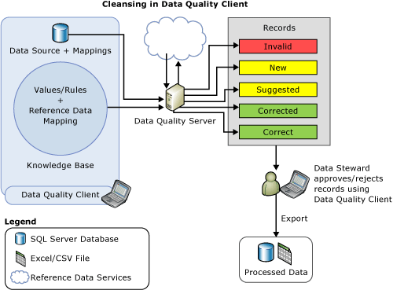

# Data Cleansing
  Data cleansing is the process of analyzing the quality of data in a data source, manually approving/rejecting the suggestions by the system, and thereby making changes to the data. Data cleansing in [!INCLUDE[ssDQSnoversion](../includes/ssdqsnoversion-md.md)] (DQS) includes a computer-assisted process that analyzes how data conforms to the knowledge in a knowledge base, and an interactive process that enables the data steward to review and modify computer-assisted process results to ensure that the data cleansing is exactly as they want to be done.  
  
 The data steward can also perform data cleansing in the Integration Services packaging process. In this case, the data steward would use the [!INCLUDE[ssDQSCleansingLong](../includes/ssdqscleansinglong-md.md)] that automatically performs data cleansing using an existing knowledge base. For more information, see [DQS Cleansing Transformation](../integration-services/data-flow/transformations/dqs-cleansing-transformation.md).  
  
 The data cleansing feature in DQS has the following benefits:  
  
-   Identifies incomplete or incorrect data in your data source (Excel file or SQL Server database), and then corrects or alerts you about the invalid data.  
  
-   Provides two-step process to cleanse the data: *computer-assisted* and *interactive*. The computer-assisted process uses the knowledge in a DQS knowledge base to automatically process the data, and suggest replacements/corrections. The next step, interactive, allows the data steward to approve, reject, or modify the changes proposed by the DQS during the computer-assisted cleansing.  
  
-   Standardizes and enriches customer data by using domain values, domain rules, and reference data. For example, standardize term usage by changing "St." to "Street", enrich data by filling in missing elements by changing "1 Microsoft way Redmond 98006" to "1 Microsoft Way, Redmond, WA 98006".  
  
-   Provides a simple, intuitive, and consistent wizard-like interface to the user to navigate data and inspect errors amongst a very large set of data.  
  
 The following illustration displays how data cleansing is done in DQS:  
  
   
  
##   Computer-assisted Cleansing  
 The DQS data cleansing process applies the knowledge base to the data to be cleansed, and proposes changes to the data. The data steward has access to each proposed change, enabling him or her to assess and correct the changes. To perform data cleansing, the data steward proceeds as follows:  
  
1.  Create a data quality project, select a knowledge base against which you want to analyze and cleanse your source data, and select the **Cleansing** activity. Multiple data quality projects can use the same knowledge base.  
  
2.  Specify the database table/view or an Excel file that contains the source data to be cleansed. The database or the Excel file can be the same one that was used for knowledge discovery, or it can be a different database or Excel file.  
  
    > [!NOTE]  
    >  If you select the same data source for knowledge discovery and cleansing activities, there will be no change to the data. It is recommended that you run knowledge discovery on a sample data, and later cleanse your source data against the knowledge built during the knowledge discovery activity.  
  
3.  Map the data fields to be cleansed to appropriate domains/composite domains in the knowledge base. If you map a field to a composite domain, the mapping happens between the field and the composite domain, and not with the individual domains in the composite domain. Also, the data cleansing for the mapped field is done based on the rules specified for the composite domain, and not for the individual domains in the composite domain. For more information about composite domains, see [DQS Knowledge Bases and Domains](../../2014/data-quality-services/dqs-knowledge-bases-and-domains.md).  
  
4.  Run the computer-assisted cleansing process by clicking **Start** on the **Cleanse** page.  
  
 The data cleansing process finds the best match of an instance of data to known data domain values. The process applies data quality knowledge to all source data, unlike the knowledge discovery process, which runs on a percentage of the sample data.  
  
 The computer-assisted process displays data quality information in [!INCLUDE[ssDQSClient](../includes/ssdqsclient-md.md)] that will be used for the interactive cleansing process. Apart from the adherence to the syntax error rules, DQS also uses reference data and advanced algorithms to categorize data using *confidence level*. The confidence level indicates the extent of certainty of DQS for the correction or suggestion. The confidence level is based on the following threshold values:  
  
-   An *auto-correction threshold* value above which DQS will suggest a change and make it unless the data steward rejects it. You can specify the auto correction threshold value in the **General Settings** tab in the **Configuration** screen. For more information, see [Configure Threshold Values for Cleansing and Matching](../../2014/data-quality-services/configure-threshold-values-for-cleansing-and-matching.md).  
  
-   An *auto-suggestion threshold* value, below the auto-correction threshold, above which DQS will suggest a change, and make it if the data steward approves it. You can specify the auto suggestion threshold value in the **General Settings** tab in the **Configuration** screen. For more information, see [Configure Threshold Values for Cleansing and Matching](../../2014/data-quality-services/configure-threshold-values-for-cleansing-and-matching.md).  
  
 Any value having a confidence level below the auto-suggestion threshold value is left as is by DQS unless the data steward specifies a change.  
  
##   Interactive Cleansing  
 Based on the computer-assisted cleansing process, DQS provides the data steward with information that they need to make a decision about changing the data. DQS categorizes the data under the following five tabs:  
  
-   **Suggested**: Values for which DQS found suggestions that have a confidence level higher than the *auto-suggestion threshold* value but lower than the *auto-correction threshold* value. You should review these values, and approve or reject as appropriate.  
  
-   **New**: Valid values for which DQS does not have enough information (suggestion), and therefore cannot be mapped to any other tab. Further, this tab also contains values that have confidence level less than the *auto-suggestion threshold* value, but high enough to be marked as valid.  
  
-   **Invalid**: Values that were marked as invalid in the domain in the knowledge base or values that failed a domain rule or reference data. This tab will also contain values that are rejected by the user in any of the other four tabs during the interactive cleansing process.  
  
-   **Corrected**: Values that are corrected by DQS during the automated cleansing process as DQS found a correction for the value with confidence level above the *auto-correction threshold* value. This tab will also contain values for which the user specified a correct value in the **Correct To** column during interactive cleansing, and then approved by clicking the radio button in the **Approve** column in any of the other four tabs.  
  
-   **Correct**: Values that were found correct. For example, the value matched a domain value. If required, you can override DQS cleansing by rejecting values under this tab, or by specifying an alternate word in the **Correct To** column, and then clicking the radio button in the **Accept** column. This tab will also contain values that were approved by the user during interactive cleansing by clicking the radio button in the **Approve** column in the **New** or **Invalid** tab.  
  
> [!NOTE]  
>  In the **Suggested**, **Corrected**, and **Correct** tabs, DQS displays the leading value for a domain, if applicable, in the **Correct To** column against the respective domain value.  
  
 The data steward uses [!INCLUDE[ssDQSClient](../includes/ssdqsclient-md.md)] to see the changes that DQS has proposed and to decide whether to implement them or not. He or she can verify that values DQS has designated as correct are in fact correct. He or she can verify that changes already made by DQS, with a high confidence level, should be made. He or she can decide whether to approve auto-suggested changes. And he or she can review values that have not been changed, just in case they want to make a change not found by the computer-assisted process.  
  
 DQS will merge any changes that the data steward has made with the results of the computer-assisted data cleansing. These changes will stay with the project; however, they will not be added to the knowledge base. During data cleansing, the associated knowledge base is read-only.  
  
 When the data cleansing process has completed, you can choose to export the processed data to a new table in a SQL Server database, .csv file, or Excel file. The source data on which cleansing is performed is maintained in its original state. The data steward can use the separate cleansed data to correct the actual source data.  
  
 The following illustration displays how data cleansing is done using the [!INCLUDE[ssDQSClient](../includes/ssdqsclient-md.md)] application:  
  
   
  
##   Leading Value Correction  
 Leading value correction applies to domain values that have synonyms, and the user wants to use one of the synonym values as the leading value instead of others for the consistent representation of the value. For example, "New York", "NYC", and "big apple" are synonyms, and the user wants to use "New York" as the leading value instead of "NYC" and "Big Apple". DQS supports leading value correction during the cleansing process to help you standardize your data. The leading value correction is done only if the domain was enabled for the same when it was created. By default, all domains are enabled for leading value correction unless you cleared the **Use Leading Values** check box while creating a domain. For more information about this check box, see [Set Domain Properties](../../2014/data-quality-services/set-domain-properties.md).  
  
##   Standardize Cleansed Data  
 You can choose whether to export the cleansed data in the standardized format based on the output format defined for domains. While creating a domain, you can select the formatting that will be applied when the data values in the domain are output. For more information about specifying output formats for a domain, see the **Format Output to** list in [Set Domain Properties](../../2014/data-quality-services/set-domain-properties.md).  
  
 While exporting the cleansed data on the **Export** page in the cleansing data quality project wizard, you specify whether you want the cleansed data to be exported in the standardized format by selecting the **Standardize Output** check box. By default, the cleansed data is exported in the standardized format, that is, the check box is selected. For more information about exporting the cleansed data, see [Cleanse Data Using DQS &#40;Internal&#41; Knowledge](../../2014/data-quality-services/cleanse-data-using-dqs-internal-knowledge.md).  
  
##   Related Tasks  
  
|Task Description|Topic|  
|----------------------|-----------|  
|Describes how to configure threshold values for the cleansing activity.|[Configure Threshold Values for Cleansing and Matching](../../2014/data-quality-services/configure-threshold-values-for-cleansing-and-matching.md)|  
|Describes how to cleanse data using knowledge built in DQS.|[Cleanse Data Using DQS &#40;Internal&#41; Knowledge](../../2014/data-quality-services/cleanse-data-using-dqs-internal-knowledge.md)|  
|Describes how to cleanse data using knowledge from reference data service.|[Cleanse Data Using Reference Data &#40;External&#41; Knowledge](../../2014/data-quality-services/cleanse-data-using-reference-data-external-knowledge.md)|  
|Describes how to cleanse a composite domain.|[Cleanse Data in a Composite Domain](../../2014/data-quality-services/cleanse-data-in-a-composite-domain.md)|  
  
## See Also  
 [Data Quality Projects &#40;DQS&#41;](../../2014/data-quality-services/data-quality-projects-dqs.md)   
 [Data Matching](../../2014/data-quality-services/data-matching.md)  
  
  
