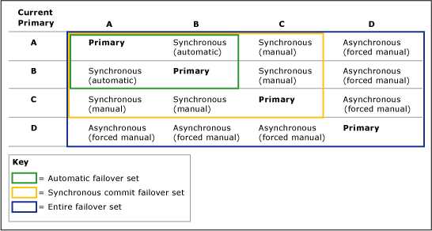

# Failover and Failover Modes (AlwaysOn Availability Groups)
  Within the context of an availability group, the primary role and secondary role of availability replicas are typically interchangeable in a process known as *failover*. Three forms of failover exist: automatic failover (without data loss), planned manual failover (without data loss), and forced manual failover (with possible data loss), typically called *forced failover*. Automatic and planned manual failover preserve all your data. An availability group fails over at the availability-replica level. That is, an availability group fails over to one of its secondary replicas (the current *failover target*).  
  
> [!NOTE]  
>  Issues at the database level, such as a database becoming suspect due to the loss of a data file, deletion of a database, or corruption of a transaction log, do not cause an availability group to failover.  
  
 During the failover, the failover target takes over the primary role, recovers its databases, and brings them online as the new primary databases. The former primary replica, when available, switches to the secondary role, and its databases become secondary databases. Potentially, these roles can switch back and forth (or to a different failover target) in response to multiple failures or for administrative purposes.  
  
 The form(s) of failover that a given availability replica supports is specified by the *failover mode* property. For a given availability replica, the possible failover modes depends on the [availability mode](availability-modes-always-on-availability-groups.md) of the replica, as follows:  
  
-   **Synchronous-commit replicas** support two settings-automatic or manual. The "automatic" setting supports both automatic failover and manual failover. To prevent data loss, automatic failover and planned failover require that the failover target be a synchronous-commit secondary replica with a healthy synchronization state (this indicates that every secondary database on the failover target is synchronized with its corresponding primary database). Whenever a secondary replica does not meet both of these conditions, it supports only forced failover. Note that forced failover is also supported a replicas whose role is in the RESOLVING state.  
  
-   **Asynchronous-commit replicas** support only the manual failover mode. Moreover, because they are never synchronized, they support only forced failover.  
  
> [!NOTE]  
>  After a failover, client applications that need to access the primary databases must connect to the new primary replica. Also, if the new secondary replica is configured to allow read-only access, read-only client applications can connect to it. For information about how clients connect to an availability group, see [Availability Group Listeners, Client Connectivity, and Application Failover &#40;SQL Server&#41;](../../listeners-client-connectivity-application-failover.md).  
  
  
##   Terms and Definitions  
 Automatic failover  
 A failover that occurs automatically on the loss of the primary replica. Automatic failover is supported only when the current primary and one secondary replica are both configured with failover mode set to AUTOMATIC and the secondary replica currently synchronized.  If the failover mode of either the primary or secondary replica is MANUAL, automatic failover cannot occur.  
  
 Planned manual failover (without data loss)  
 Planned manual failover, or *manual failover*, is a failover that is initiated by a database administrator, typically, for administrative purposes. A planned manual failover is supported only if both the primary replica and secondary replica are configured for synchronous-commit mode and the secondary replica is currently synchronized (in the SYNCHRONIZED state). When the target secondary replica is synchronized, manual failover (without data loss) is possible even if the primary replica has crashed because the secondary databases are ready for failover. A database administrator manually initiates a manual failover.  
  
 Forced failover (with possible data loss)  
 A failover that can be initiated by a database administrator when no secondary replica is SYNCHRONIZED with the primary replica or the primary replica is not running and no secondary replica is failover ready. Forced failover risks possible data loss and is recommended strictly for disaster recovery. Forced failover is also known as forced manual failover because it can only be initiated manually. This is the only form of failover supported by in asynchronous-commit availability mode.  
  
 [!INCLUDE[ssFosAutoC](../../../includes/ssfosautoc-md.md)]  
 Within a given availability group, a pair of availability replicas (including the current primary replica) that are configured for synchronous-commit mode with automatic failover, if any. An[!INCLUDE[ssFosAuto](../../../includes/ssfosauto-md.md)]takes effect only if the secondary replica is currently SYNCHRONIZED with the primary replica.  
  
 [!INCLUDE[ssFosSyncC](../../../includes/ssfossyncc-md.md)]  
 Within a given availability group, a set of two or three availability replicas (including the current primary replica) that are configured for synchronous-commit mode, if any. A [!INCLUDE[ssFosSync](../../../includes/ssfossync-md.md)]takes effect only if the secondary replicas are configured for manual failover mode and at least one secondary replica is currently SYNCHRONIZED with the primary replica.  
  
 [!INCLUDE[ssFosEntireC](../../../includes/ssfosentirec-md.md)]  
 Within a given availability group, the set of all availability replicas whose operational state is currently ONLINE, regardless of availability mode and of failover mode. The [!INCLUDE[ssFosEntire](../../../includes/ssfosentire-md.md)]becomes relevant when no secondary replica is currently SYNCHRONIZED with the primary replica.  
  
##   Overview of Failover  
 The following table summarizes which forms of failover are supported under different availability and failover modes. For each pairing, the effective availability mode and failover mode is determined by the intersection of the modes of the primary replica plus the modes of one or more secondary replicas.  
  
||Asynchronous-commit mode|Synchronous-commit mode with manual-failover mode|Synchronous-commit mode with automatic-failover mode|  
|-|-------------------------------|---------------------------------------------------------|------------------------------------------------------------|  
|Automatic failover|No|No|Yes|  
|Planned manual failover|No|Yes|Yes|  
|Forced failover|Yes|Yes|Yes*****|  
  
 *****  If you issue a forced failover command on a synchronized secondary replica, the secondary replica behaves the same as for a manual failover.  
  
 The amount of time that the database is unavailable during a failover depends on the type of failover and its cause.  
  
> [!IMPORTANT]  
>  To support client connections after failover, except for contained databases, logins and jobs defined on any of the former primary databases must be manually recreated on the new primary database. For more information, see [Management of Logins and Jobs for the Databases of an Availability Group &#40;SQL Server&#41;](../../logins-and-jobs-for-availability-group-databases.md).  
  
### Failover Sets  
 The forms of failover that are possible for a given availability group can be understood in terms of failover sets. A failover set consists of the primary replica and secondary replicas that support a given form of failover, as follows:  
  
-   **[!INCLUDE[ssFosAutoC](../../../includes/ssfosautoc-md.md)] (optional):**  Within a given availability group, a pair of availability replicas (including the current primary replica) that are configured for synchronous-commit mode with automatic failover, if any. An automatic failover set takes effect only if the secondary replica is currently SYNCHRONIZED with the primary replica.  
  
-   **[!INCLUDE[ssFosSyncC](../../../includes/ssfossyncc-md.md)] (optional):**  Within a given availability group, a set of two or three availability replicas (including the current primary replica) that are configured for synchronous-commit mode, if any. A synchronous-commit failover set takes effect only if the secondary replicas are configured for manual failover mode and at least one secondary replica is currently SYNCHRONIZED with the primary replica.  
  
-   **[!INCLUDE[ssFosEntireC](../../../includes/ssfosentirec-md.md)] :**  Within a given availability group, the set of all availability replicas whose operational state is currently ONLINE, regardless of availability mode and of failover mode. The entire failover set becomes relevant when no secondary replica is currently SYNCHRONIZED with the primary replica.  
  
 When you configure an availability replica as synchronous commit with automatic failover, the availability replica becomes part of the [!INCLUDE[ssFosAuto](../../../includes/ssfosauto-md.md)]. However whether the set takes effect depends the current primary. The forms of failover that are actually possible at a given time depends on what failover sets are currently in effect.  
  
 For example, consider an availability group that has four availability replicas, as follows:  
  
|Replica|Availability Mode and Failover Mode Settings|  
|-------------|--------------------------------------------------|  
|A|Synchronous commit with automatic failover|  
|B|Synchronous commit with automatic failover|  
|C|Synchronous commit with planned manual failover only|  
|D|Asynchronous commit (with only forced failover)|  
  
 The failover behavior for each secondary replica depends on which availability replica is currently the primary replica. Basically, for a given secondary replica, the failover behavior is the worst case given the current primary replica. The following figure illustrates how the failover behavior of secondary replicas varies depending on the current primary replica, and whether it is configured for asynchronous-commit mode (with only forced failover) or synchronous-commit mode (with or without automatic failover).  
  
   
  
##   Automatic Failover  
 An automatic failover causes a qualified secondary replica to automatically transition to the primary role after the primary replica becomes unavailable. Automatic failover is best suited when the WSFC node that hosts the primary replica is local to the node that hosts the secondary replica. This is because data synchronization works best with low message latency between computers and because client connections can remain local.  
  
  
###   Conditions Required for an Automatic Failover  
 Automatic failover occurs only under the following conditions:  
  
-   An automatic failover set exists. This set consists of a primary replica and a secondary replica (the *automatic failover target*) that are both configured for synchronous-commit mode and set to AUTOMATIC failover. HYPERLINK "file:///C:\\\Users\\\marshow\\\AppData\\\Local\\\Temp\\\DxEditor\\\DduePreview\\\Default\\\6fe88e12-4df1-4025-ba24-7579635ccecf\\\HTM\\\html\\\29e0ac5d-eb58-4801-82b9-e278f08db920"  If the primary replica is set MANUAL failover, automatic failover cannot occur, even if a secondary replica is set to AUTOMATIC failover.  
  
     For more information, see [Availability Modes &#40;AlwaysOn Availability Groups&#41;](availability-modes-always-on-availability-groups.md).  
  
-   The automatic failover target has a healthy synchronization state (this indicates that every secondary database on the failover target is synchronized with its corresponding primary database).  
  
    > [!TIP]  
    >  AlwaysOn Availability Groups monitors the health of both replicas in an automatic failover set. If either replica fails, the availability group's health state is set to CRITICAL. If the secondary replica fails, automatic failover is not possible because the automatic failover target is unavailable. If the primary replica fails, the availability group will fail over to the secondary replica. Until the former primary replica comes online, no automatic failover target exists. In either case, to ensure availability in the unlikely case of a sequential failure, we recommend that you configure a different secondary replica as the automatic failover target.  
    >   
    >  For more information, see [Use AlwaysOn Policies to View the Health of an Availability Group &#40;SQL Server&#41;](use-always-on-policies-to-view-the-health-of-an-availability-group-sql-server.md) and [Change the Failover Mode of an Availability Replica &#40;SQL Server&#41;](change-the-failover-mode-of-an-availability-replica-sql-server.md).  
  
-   The Windows Server Failover Clustering (WSFC) cluster has quorum. For more information, see [WSFC Quorum Modes and Voting Configuration &#40;SQL Server&#41;](../../../sql-server/failover-clusters/windows/wsfc-quorum-modes-and-voting-configuration-sql-server.md).  
  
-   The primary replica has become unavailable, and the failover-condition levels defined by your the flexible failover policy have been met. For information about failover-condition levels, see [Flexible Failover Policy for Automatic Failover of an Availability Group &#40;SQL Server&#41;](flexible-automatic-failover-policy-availability-group.md).  
  
###   How Automatic Failover Works  
 An automatic failover initiates the following sequence of actions:  
  
1.  If the server instance that is hosting the current primary replica is still running, it changes the state of the primary databases to DISCONNECTED and disconnects all clients.  
  
2.  If any log records are waiting in recovery queues on the target secondary replica, the secondary replica applies the remaining log records to finish rolling forward the secondary databases.  
  
    > [!NOTE]  
    >  The amount of time required to apply the log to a given database depends on the speed of the system, the recent work load, and the amount of log in the recovery queue.  
  
3.  The former secondary replica transitions to the primary role. Its databases become the primary databases. The new primary replica rolls back any uncommitted transactions (the undo phase of recovery) as quickly as possible. Locks isolate these uncommitted transactions, allowing roll back to occur in the background while clients use the database. This process does not roll back any committed transactions.  
  
     Until a given secondary database is connected, it is briefly marked as NOT_SYNCHRONIZED. Before the rollback recovery starts, secondary databases can connect to the new primary databases and quickly transition to the SYNCHRONIZED state. The best case is usually for a third synchronous-commit replica that remains in the secondary role after the failover.  
  
4.  Later, when the server instance that is hosting the former primary replica restarts, it recognizes that another availability replica now owns the primary role. The former primary replica transitions to the secondary role, and its databases become secondary databases. The new secondary replica connects to the current primary replica and catches its database up to the current primary databases as quickly as possible. As soon as the new secondary replica has resynchronized its databases, failover is again possible, in the reverse direction.  
  
###   To Configure Automatic Failover  
 An availability replica can be configured to support automatic failover at any point.  
  
 **To configure automatic failover**  
  
1.  Ensure that the secondary replica is configured to use the synchronous-commit availability mode. For more information, see [Change the Availability Mode of an Availability Replica &#40;SQL Server&#41;](change-the-availability-mode-of-an-availability-replica-sql-server.md).  
  
2.  Set the failover mode to automatic. For more information, see [Change the Failover Mode of an Availability Replica &#40;SQL Server&#41;](change-the-failover-mode-of-an-availability-replica-sql-server.md).  
  
3.  Optionally, change the flexible failover policy of the availability group to specify the sorts of failures that can cause an automatic failover to occur. For more information, see [Configure the Flexible Failover Policy to Control Conditions for Automatic Failover &#40;AlwaysOn Availability Groups&#41;](configure-flexible-automatic-failover-policy.md) HYPERLINK "file:///C:\\\Users\\\marshow\\\AppData\\\Local\\\Temp\\\DxEditor\\\DduePreview\\\Default\\\6a8d98a9-6e6a-40d1-9809-efa9013d7452\\\HTM\\\html\\\1ed564b4-9835-4245-ae35-9ba67419a4ce"  and [Failover Policy for Failover Cluster Instances](../../../sql-server/failover-clusters/windows/failover-policy-for-failover-cluster-instances.md).  
  
##   Planned Manual Failover (Without Data Loss)  
 A manual failover causes a synchronized secondary replica to transition to the primary role after a database administrator issues a manual-failover command on the server instance that hosts the target secondary replica. To support manual failover, the secondary replica and the current primary replica must both be configured for synchronous-commit mode, if any. Every secondary database on the availability replica must be joined to the availability group and synchronized with its corresponding primary database (that is, the secondary replica must be synchronized). This guarantees that every transaction that was committed on a former primary database has also been committed on the new primary database. Therefore, the new primary databases are identical to the old primary databases.  
  
 The following figure illustrates the stages of a planned failover:  
  
1.  Before the failover, the primary replica is hosted by the server instance on `Node01`.  
  
2.  A database administrator initiates a planned failover. The failover target is the availability replica hosted by the server instance on `Node02`.  
  
3.  The failover target (on `Node02`) becomes the new primary replica. Because this is a planned failover, the former primary replica switches to the secondary role during the failover and brings its databases online as secondary databases immediately.  
  
   
  
  
###   Conditions Required for a Manual Failover  
 To support a manual failover, the current primary replica must be set to synchronous-commit mode and a secondary replica must be:  
  
-   Configured for synchronous-commit mode.  
  
-   Currently synchronized with the primary replica.  
  
 To manually fail over an availability group, you must be connected to the secondary replica that is to become the new primary replica.  
  
###   How a Planned Manual Failover Works  
 A planned manual failover, which must be initiated on the target secondary replica, initiates the following sequence of actions:  
  
1.  To ensure that no new user transactions occur on the original primary databases, the WSFC cluster sends a request to the primary replica to go offline.  
  
2.  If any log is waiting in the recovery queue of any secondary database, the secondary replica finishes rolling forward that secondary database. The amount of time required depends on the speed of the system, the recent workload, and the amount of log in the recovery queue. To learn the current size of the recovery queue, use the **Recovery Queue** performance counter. For more information, see [SQL Server, Database Replica](../../../relational-databases/performance-monitor/sql-server-database-replica.md).  
  
    > [!NOTE]  
    >  The failover time can be regulated by limiting the size of the recovery queue. However, this can cause the primary replica to slow down to allow the secondary replica to keep up.  
  
3.  The secondary replica becomes the new primary replica, and the former primary replica becomes the new secondary replica.  
  
4.  The new primary replica rolls back any uncommitted transactions and brings its databases online as the primary databases.All secondary databases are briefly marked as NOT SYNCHRONIZED until they connect and resynchronize to the new primary databases. This process does not roll back any committed transactions.  
  
5.  When the former primary replica comes back online, it takes on the secondary role, and the former primary database becomes the secondary database. The new secondary replica quickly resynchronizes the new secondary databases with the corresponding primary databases.  
  
    > [!NOTE]  
    >  As soon as the new secondary replica has resynchronized the databases, failover is again possible, but in the reverse direction.  
  
 After failover, clients must reconnect to the current primary database. For more information, see [Availability Group Listeners, Client Connectivity, and Application Failover &#40;SQL Server&#41;](../../listeners-client-connectivity-application-failover.md).  
  
###   Maintaining Availability During Upgrades  
 The database administrator for your availability groups can use manual failovers to maintain database availability when you upgrade hardware or software. To use an availability group for software upgrades, the server instance and/or computer node that hosts the target secondary replica must have already received the upgrades. For more information, see [Upgrade and Update of Availability Group Servers with Minimal Downtime and Data Loss](upgrading-always-on-availability-group-replica-instances.md).  
  
##   Forced Failover (with Possible Data Loss)  
 Forcing failover of an availability group (with possible data loss) is a disaster recovery method that allows you to use a secondary replica as a warm standby server.Because forcing failover risks possible data loss, it should be used cautiously and sparingly. We recommend forcing failover only if you must restore service to your availability databases immediately and are willing to risk losing data. For more information about the prerequisites and recommendations for forcing failover and for an example scenario that uses a forced failover to recover from a catastrophic failure, see [Perform a Forced Manual Failover of an Availability Group &#40;SQL Server&#41;](perform-a-forced-manual-failover-of-an-availability-group-sql-server.md).  
  
> [!WARNING]  
>  Forcing failover requires that the WSFC cluster have quorum. For information about configuring quorum and forcing quorum, see [Windows Server Failover Clustering &#40;WSFC&#41; with SQL Server](../../../sql-server/failover-clusters/windows/windows-server-failover-clustering-wsfc-with-sql-server.md).  
  
  
###   How Forced Failover Works  
 Forcing failover initiates a transition of the primary role to a target replica whose role is in the SECONDARY or RESOLVING state. The failover target becomes the new primary replica and immediately serves its copies of the databases to clients. When the former primary replica becomes available, it will transition to the secondary role and its databases will become secondary databases.  
  
 All secondary databases (including the former primary databases, when they become available) are SUSPENDED. Depending on the previous data synchronization state of a suspended secondary database, it might be suitable for salvaging missing committed data for that primary database. On a secondary replica that is configured for read-only access, you can query the secondary databases to manually discover missing data. Then you can issue [!INCLUDE[tsql](../../../includes/tsql-md.md)] statements on the new primary databases to make any necessary changes.  
  
###   Risks of Forcing Failover  
 It is essential to understand that forcing failover can cause data loss. Data loss is possible because the target replica cannot communicate with the primary replica and, therefore, cannot guarantee that the databases are synchronized. Forcing failover starts a new recovery fork. Because the original primary databases and secondary databases are on different recovery forks, each of them now contains data that the other database does not contain: each original primary database contains whatever changes were not yet sent from its send queue to the former secondary database (the unsent log); the former secondary databases contain whatever changes occur after failover was forced.  
  
 If failover is forced because the primary replica has failed, potential data loss is depends on whether any transaction logs had not been sent to the secondary replica before the failure. Under the asynchronous-commit mode, accumulated unsent log is always a possibility. Under synchronous-commit mode, this is possible only until the secondary databases becomes synchronized.  
  
 The following table summarizes the possibility of data loss for a particular database on the replica to which you force failover.  
  
|Availability mode of Secondary Replica|Is database synchronized?|Is data loss possible?|  
|--------------------------------------------|-------------------------------|----------------------------|  
|Synchronous-commit|Yes|No|  
|Synchronous-commit|No|Yes|  
|Asynchronous-commit|No|Yes|  
||||  
  
 Secondary databases track only two recovery forks, so if you perform multiple forced failovers, any secondary database that did start data synchronization with the previous force failover might not be able to resume. If this occurs, any secondary databases that cannot be resumed will need to be removed from the availability group, restored to the correct point in time, and rejoined to the availability group. A restore will not work across multiple recovery forks, therefore, be sure to perform a log backup after performing more than one forced failover.  
  
###   Why Forced Failover is Required After Forcing Quorum  
 After quorum is forced on the WSFC cluster (*forced quorum*) you need to perform a forced failover (with possible data loss) on each availability group. The forced failover is required because the real state of the WSFC cluster values might have been lost. Preventing normal failovers after a forced quorum is required because of the possibility than an unsynchronized secondary replica would appear to be synchronized on the reconfigured WSFC cluster.  
  
 For example, consider a WSFC cluster that hosts an availability group on three nodes:  Node A hosts the primary replica and Node B and Node C each hosts a secondary replica. Node C gets disconnected from the WSFC cluster while the local secondary replica is SYNCHRONIZED.  But Node A and Node B retain a healthy quorum and the availability group remains online. On Node A, the primary replica continues to accept updates, and on Node B, the secondary replica continues to synchronize with the primary replica. The secondary replica on Node C becomes unsynchronized and falls increasingly behind the primary replica. However, because Node C is disconnected, the replica remains, incorrectly, in the SYNCHRONIZED state.  
  
 If quorum is lost and is then forced on Node A, the synchronization state of the availability group on the WSFC cluster should be correct-with the secondary replica on Node C shown as UNSYNCHRONIZED. However, if quorum is forced on Node C, the synchronization of the availability group will be incorrect. The synchronization state on the cluster will have reverted back to when Node C was disconnected-with the secondary replica on Node C *incorrectly* shown as SYNCHRONIZED. Since planned manual failovers guarantee the safety of the data, they are disallowed for bring an availability group back online after quorum is forced.  
  
###   Tracking Potential Data Loss  
 When the WSFC cluster has a healthy quorum, you can estimate the current potential for data loss on databases. For a given secondary replica, the current potential for data loss depends on how far the local secondary databases are lagging behind the corresponding primary databases. Because the amount of lag varies over time, we recommend that you periodically track potential data loss for your unsynchronized secondary databases. Tracking lag involves comparing the Last Commit LSN and Last Commit Time for each primary database and its secondary databases, as follows:  
  
1.  Connect to the primary replica.  
  
2.  Query the `last_commit_lsn` (LSN of the last committed transaction) and `last_commit_time` (time of the last commit) columns of the [sys.dm_hadr_database_replica_states](/sql/relational-databases/system-dynamic-management-views/sys-dm-hadr-database-replica-states-transact-sql) dynamic management view.  
  
3.  Compare the values returned for each primary database and each of its secondary databases. The difference between their Last Commit LSNs indicate the amount of lag.  
  
4.  You can trigger an alert when the amount of lag on a database or set of databases exceeds your desired maximum lag for a given period of time. For example, the query can be run by a job that executes every minute on each primary database. If the difference between the `last_commit_time` of a primary database and any of its secondary databases has exceeded the recovery point objective (RPO) (for example, 5 minutes) since the last time the job executed, the job can raise an alert.  
  
> [!IMPORTANT]  
>  When the WSFC cluster lacks quorum or quorum has been forced, `last_commit_lsn` and `last_commit_time` are NULL. For information about how you might be able to avoid data loss after you forced quorum, see "Potential Ways to Avoid Data Loss After Quorum is Forced" in [Perform a Forced Manual Failover of an Availability Group &#40;SQL Server&#41;](perform-a-forced-manual-failover-of-an-availability-group-sql-server.md).  
  
###   Managing the Potential Data Loss  
 After failover is forced, all secondary databases are suspended. This includes the former primary databases, after the former primary replica comes back online and discovers that it is now a secondary replica. You must manually resume each suspended database individually on each secondary replica.  
  
 Once the former primary replica is available, assuming that its databases are undamaged, you can attempt to manage the potential data loss. The available approach for managing potential data loss depends on whether the original primary replica has connected to the new primary replica. Assuming that the original primary replica can access the new primary instance, reconnecting occurs automatically and transparently.  
  
#### The Original Primary Replica Has Reconnected  
 Typically, after a failure, when the original primary replica restarts it quickly reconnects to its partner. On reconnecting, the original primary replica becomes the secondary replica. Its databases becomes the secondary databases and enter the SUSPENDED state. The new secondary databases will not be not rolled back unless you resume them.  
  
 However, the suspended databases are inaccessible, so you cannot inspect them to evaluate what data would be lost if you were to resume a given database. Therefore, the decision on whether to resume or remove a secondary database depends on whether you are willing to accept any data loss, as follows:  
  
-   If losing any data would be unacceptable, you should remove the databases from the availability group to salvage them.  
  
     The database administrator can now recover the former primary databases and attempt to recover the data that would have been lost. However, when a former primary database comes online, it is divergent from the current primary database, so the database administrator needs to make either the removed database or the current primary database inaccessible to clients to avoid further divergence of the databases and to prevent client-failover issues.  
  
-   If losing data would be acceptable to your business goals, you can resume the secondary databases.  
  
     Resuming a new secondary database causes it to be rolled back as the first step in synchronizing the database. If any log records were waiting in the send queue at the time of failure, the corresponding transactions are lost, even if they were committed.  
  
#### The Original Primary Replica Has Not Reconnected  
 If you can temporarily prevent the original primary replica from reconnecting over the network to the new primary replica, you can inspect the original primary databases to evaluate what data would be lost if they were resumed.  
  
-   If the potential data loss is acceptable  
  
     Allow the original primary replica to reconnect to the new primary replica. Reconnecting causes the new secondary databases to be suspended. To start data synchronization on a database, simply resume it. The new secondary replica drops the original recovery fork for that database, losing any transactions that were never sent to or received by the former secondary replica.  
  
-   If the data loss is unacceptable  
  
     If the original primary database contains critical data that would be lost if you resumed the suspended database, you can preserve the data on the original primary database by removing it from the availability group. This causes the database to enter the RESTORING state. At this point, we recommend that you attempt to back up the tail of the removed database's log. Then, you can update the current primary (the former secondary database) by exporting the data you want to salvage from the original primary database and importing it into the current primary database. We recommend taking a full database backup of the updated primary database as quickly as possible.  
  
     Then, on the server instance that hosts the new secondary replica, you can delete the suspended secondary database and create a new secondary database by restoring this backup (and least one subsequent log backup) using RESTORE WITH NORECOVERY. We recommend delaying additional log backups of the current primary databases until the corresponding secondary databases are resumed.  
  
> [!WARNING]  
>  Transaction log truncation is delayed on a primary database while any of its secondary databases is suspended. Also the synchronization health of a synchronous-commit secondary replica cannot transition to HEALTHY as long as any local database remains suspended.  
  
##   Related Tasks  
 **To configure failover behavior**  
  
-   [Change the Availability Mode of an Availability Replica &#40;SQL Server&#41;](change-the-availability-mode-of-an-availability-replica-sql-server.md)  
  
-   [Change the Failover Mode of an Availability Replica &#40;SQL Server&#41;](change-the-failover-mode-of-an-availability-replica-sql-server.md)  
  
-   [Configure the Flexible Failover Policy to Control Conditions for Automatic Failover &#40;AlwaysOn Availability Groups&#41;](configure-flexible-automatic-failover-policy.md)  
  
 **To perform a manual fail over**  
  
-   [Perform a Planned Manual Failover of an Availability Group &#40;SQL Server&#41;](perform-a-planned-manual-failover-of-an-availability-group-sql-server.md)  
  
-   [Perform a Forced Manual Failover of an Availability Group &#40;SQL Server&#41;](perform-a-forced-manual-failover-of-an-availability-group-sql-server.md)  
  
-   [Use the Fail Over Availability Group Wizard &#40;SQL Server Management Studio&#41;](use-the-fail-over-availability-group-wizard-sql-server-management-studio.md)  
  
-   [Management of Logins and Jobs for the Databases of an Availability Group &#40;SQL Server&#41;](../../logins-and-jobs-for-availability-group-databases.md)  
  
 **To configure WSFC Quorum Configuration**  
  
-   [Configure Cluster Quorum NodeWeight Settings](../../../sql-server/failover-clusters/windows/configure-cluster-quorum-nodeweight-settings.md)  
  
-   [View Cluster Quorum NodeWeight Settings](../../../sql-server/failover-clusters/windows/view-cluster-quorum-nodeweight-settings.md)  
  
-   [Force a WSFC Cluster to Start Without a Quorum](../../../sql-server/failover-clusters/windows/force-a-wsfc-cluster-to-start-without-a-quorum.md)  
  
##   Related Content  
  
-   [Microsoft SQL Server AlwaysOn Solutions Guide for High Availability and Disaster Recovery](https://go.microsoft.com/fwlink/?LinkId=227600)  
  
-   [SQL Server AlwaysOn Team Blog: The official SQL Server AlwaysOn Team Blog](https://blogs.msdn.com/b/sqlalwayson/)  
  
## See Also  
 [Overview of AlwaysOn Availability Groups &#40;SQL Server&#41;](overview-of-always-on-availability-groups-sql-server.md)   
 [Availability Modes &#40;AlwaysOn Availability Groups&#41;](availability-modes-always-on-availability-groups.md)   
 [Windows Server Failover Clustering &#40;WSFC&#41; with SQL Server](../../../sql-server/failover-clusters/windows/windows-server-failover-clustering-wsfc-with-sql-server.md)   
 [Cross-Database Transactions Not Supported For Database Mirroring or AlwaysOn Availability Groups &#40;SQL Server&#41;](transactions-always-on-availability-and-database-mirroring.md)   
 [Failover Policy for Failover Cluster Instances](../../../sql-server/failover-clusters/windows/failover-policy-for-failover-cluster-instances.md)   
 [Flexible Failover Policy for Automatic Failover of an Availability Group &#40;SQL Server&#41;](flexible-automatic-failover-policy-availability-group.md)  
  
  
