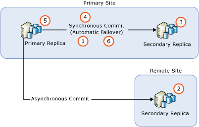
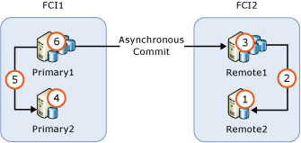

# Upgrade and Update of Availability Group Servers with Minimal Downtime and Data Loss
  When updating or upgrading server instances from SQL Server 2012 to a service pack or a newer version, you can reduce downtime for an availability group to only a single manual failover by performing a sequential update or upgrade. For upgrading SQL Server versions, it is known as rolling upgrade; for updating the current SQL Server version with hotfixes or service packs, it is known as rolling update.  
  
 This topic limits the discussion to SQL Server upgrades/updates only. For operating system-related upgrades/updates that the highly-available SQL Server instances are running on, see [Cross-cluster Migration of AlwaysOn Availability Groups for Operating System Upgrades](https://msdn.microsoft.com/library/jj873730.aspx)  
  
## Rolling Upgrade/Update Best Practices for AlwaysOn Availability Groups  
 The following best practices should be observed when performing server upgrades/updates in order to minimize downtime and data loss for your availability groups:  
  
-   Before starting the rolling upgrade/update,  
  
    -   Perform a practice manual failover on at least one of your synchronous-commit replicas  
  
    -   Protect your data by performing a full database backup on every availability database  
  
    -   Run DBCC CHECKDB on every availability database  
  
-   Always upgrade/update the remote secondary replica nodes first, then local secondary replica nodes next, and the primary replica node last.  
  
-   Backups cannot occur on a database that is in the process of being upgraded.  Prior to upgrading the secondary replicas, configure the automated backup preference to run backups only on the primary replica.  Prior to upgrading the primary replica, modify this setting to run backups only on the secondary replicas.  
  
-   To prevent the availability group from unintended failovers during the upgrade/update process, remove availability failover from all synchronous-commit replicas before you begin.  
  
-   Do not upgrade the primary replica node before failing over the availability group to an upgraded node with a secondary replica first. Otherwise, client applications may suffer extended downtime during the upgrade/update on the primary replica.  
  
-   Always fail over the availability group to a synchronous-commit secondary replica node. If you fail over to an asynchronous-commit secondary replica, the databases will suffer data loss, and data movement is automatically suspended until you manually resume data movement.  
  
-   Do not upgrade/update the primary replica node before upgrading/updating any other secondary replica nodes. An upgraded primary replica can no longer ship logs to any secondary replica that has not yet been upgraded to the same version. When data movement to a secondary replica is suspended, no automatic failover can occur for that replica, and your availability databases are vulnerable to data loss.  
  
-   Before failing over an availability group, verify that the synchronization state of the failover target is SYNCHRONIZED.  
  
## Rolling Upgrade/Update Process  
 In practice, the exact process will depend on factors such as the deployment topology of your availability groups and the commit mode of each replica. But in the simplest scenario, a rolling upgrade/update is a multi-stage process that in its simplest form involves the following steps:  
  
   
  
1.  Remove automatic failover on all synchronous-commit replicas  
  
2.  Upgrade/update all remote server instances running asynchronous-commit secondary replicas  
  
3.  Upgrade/update the all local server instances that are not currently running the primary replica  
  
4.  Manually fail over the availability group to a synchronous-commit secondary replica  
  
5.  Upgrade/update the server instance that formerly hosted the primary replica  
  
6.  Configure automatic failover partners as desired  
  
 If necessary, you can perform an extra manual failover to return the availability group to its original configuration.  
  
## Availability Group with One Remote Secondary Replica  
 If you have deployed an availability group only for disaster recovery, you may need to fail over the availability group to an asynchronous-commit secondary replica. Such configuration is illustrated by the following figure:  
  
   
  
 In this situation, you must fail over the availability group to the asynchronous-commit secondary replica during the rolling upgrade/update. To prevent data loss, change the commit mode to synchronous commit and wait for the secondary replica to be synchronized before you fail over the availability group. Therefore, the rolling upgrade/update process may look as follows:  
  
1.  Upgrade/update the remote server  
  
2.  Change the commit mode to synchronous commit  
  
3.  Wait until synchronization state is SYNCHRONIZED  
  
4.  Fail over the availability group to the remote site  
  
5.  Upgrade/update the local (primary site) server  
  
6.  Fail over the availability group to the primary site  
  
7.  Change the commit mode to asynchronous commit  
  
 Since the synchronous-commit mode is not a recommended setting for data synchronization to a remote site, client applications may notice an immediate increase in database latency after the setting change. Moreover, performing a failover will cause all unacknowledged log messages to be discarded. The amount of discarded log messages can be quite large due to the high network latency between the two sites, causing clients to experience a high volume of transactional failure. You can minimize impact to client applications by doing the following:  
  
-   Carefully select a maintenance window during low client traffic  
  
-   While upgrading/updating SQL Server on the primary site, change the availability mode back to asynchronous commit, then revert to synchronous commit when you are ready to fail over to the primary site again  
  
## Availability Group with Failover Cluster Instance Nodes  
 If an availability group contains failover cluster instance (FCI) nodes, you should upgrade/update the inactive nodes before you upgrade/update the active nodes. The figure below illustrates a common availability group scenario with FCIs for local high availability and asynchronous commit between the FCIs for remote disaster recovery, and the upgrade sequence.  
  
   
  
1.  Upgrade/update REMOTE2  
  
2.  Fail over FCI2 to REMOTE2  
  
3.  Upgrade/update REMOTE1  
  
4.  Upgrade/update PRIMARY2  
  
5.  Fail over FCI1 to PRIMARY2  
  
6.  Upgrade/update PRIMARY1  
  
## Upgrade/Update SQL Server Instances with Multiple Availability Groups  
 If you are running multiple availability groups with primary replicas on separate server nodes (an Active/Active configuration), the upgrade/update path involves more failover steps to preserve high availability in the process. Suppose you are running three availability groups on three server nodes as shown in the following table, and all secondary replicas are running in synchronous-commit mode.  
  
|Availability Group|Node1|Node2|Node3|  
|------------------------|-----------|-----------|-----------|  
|AG1|Primary|||  
|AG2||Primary||  
|AG3|||Primary|  
  
 It may be appropriate in your situation to perform a load-balanced rolling upgrade/update in the following sequence:  
  
1.  Fail over AG2 to Node3 (to free up Node2)  
  
2.  Upgrade/update Node2  
  
3.  Fail over AG1 to Node2 (to free up Node1)  
  
4.  Upgrade/update Node1  
  
5.  Fail over both AG2 and AG3 to Node1 (to free up Node3)  
  
6.  Upgrade/update Node3  
  
7.  Fail over AG3 to Node3  
  
 This upgrade/update sequence has an average downtime of less than two failovers per availability group. The resulting configuration is shown in the table below.  
  
|Availability Group|Node1|Node2|Node3|  
|------------------------|-----------|-----------|-----------|  
|AG1||Primary||  
|AG2|Primary|||  
|AG3|||Primary|  
  
 Based on your specific implementation, your upgrade/update path may vary, and the downtime that client applications experience may vary as well.  
  
  
