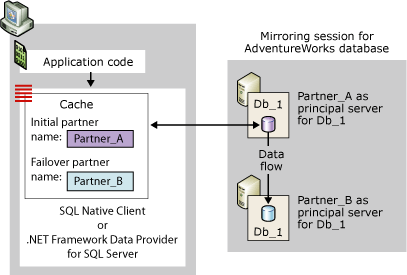
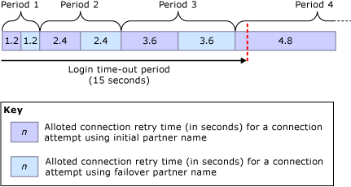

# Connect Clients to a Database Mirroring Session (SQL Server)
  To connect to a database mirroring session, a client can use either [!INCLUDE[ssNoVersion](../../includes/ssnoversion-md.md)] Native Client or .NET Framework Data Provider for [!INCLUDE[ssNoVersion](../../includes/ssnoversion-md.md)]. When configured for a [!INCLUDE[ssCurrent](../../includes/sscurrent-md.md)] database, these data access providers both fully support database mirroring. For information about programming considerations for using a mirrored database, see [Using Database Mirroring](../../relational-databases/native-client/features/using-database-mirroring.md). In addition, the current principal server instance must be available and the login of the client must have been created on the server instance. For more information, see [Troubleshoot Orphaned Users &#40;SQL Server&#41;](../../sql-server/failover-clusters/troubleshoot-orphaned-users-sql-server.md). Client connections to a database mirroring session do not involve the witness server instance, if one exists.  
  
 ##  <a name="InitialConnection"></a> Making the Initial Connection to a Database Mirroring Session  
 For the initial connection to a mirrored database, a client must supply a connection string that minimally supplies the name of a server instance. This required server name should identify the current principal server instance and is known as the *initial partner name*.  
  
 Optionally, the connection string can also supply the name of another server instance, which should identify the current mirror server instance, for use if the initial partner is unavailable during the first connection attempt. The second name is known as the *failover partner name*.  
  
 The connection string must also supply a database name. This is necessary to enable failover attempts by the data access provider.  
  
 On receiving a connection string, the data access provider stores the initial partner name and the failover partner name, if supplied, in a cache in the client's volatile memory (for managed code, the cache is scoped to the application domain). Once cached, the initial partner name is never updated by the data access provider. When the client supplies the failover partner name, the data access provider also stores this failover partner name temporarily in case the provider cannot connect using the initial partner name.  
  
 A database mirroring session does not protect against server-access problems that are specific to clients, such as when a client computer is having a problems communicating with the network. A connection attempt to a mirrored database can also fail for a variety of reasons that are unrelated to the data-access provider; for example, a connection attempt can fail because the principal server instance is inactive, as occurs when the database is failing over, or because of a network error.  
  
 When attempting to connect, the data access provider begins by using the initial partner name. If the specified server instance is available and is the current principal server instance, the connection attempt typically succeeds.  
  
> [!NOTE]  
>  If the mirroring session is paused, the client typically connects to the principal server and the downloads the partner name. However, the database is unavailable to the client until mirroring resumes.  
  
 If that attempt does not work, the data access provider tries the failover partner name, if available. If either partner name correctly identifies the current principal server, the data access provider normally succeeds in opening the initial connection. On completing this connection, the data access provider downloads the server instance name of the current mirror server. This name is stored in the cache as the failover partner name, overwriting the client-supplied failover partner name, if any. Thereafter, the .NET Framework Data Provider for [!INCLUDE[ssNoVersion](../../includes/ssnoversion-md.md)] does not update the failover partner name. In contrast, [!INCLUDE[ssNoVersion](../../includes/ssnoversion-md.md)] Native Client updates the cache whenever a subsequent connection or connection reset returns a different partner name.  
  
 The following figure illustrates a client connection to the initial partner, **Partner_A**, for a mirrored database named **Db_1**. This figure shows a case in which the initial partner name supplied by the client correctly identifies the current principal server, **Partner_A**. The initial connection attempt succeeds, and the data access provider stores the name of the mirror server (currently **Partner_B**) as the failover partner name in the local cache. Finally, the client connects to the principal copy of the **Db_1** database.  
  
   
  
 The initial connection attempt may fail, for example, because of a network error or an inactive server instance. Because the initial partner is unavailable, for the data access provider to attempt to connect to the failover partner, the client must have supplied the failover partner name in the connection string.  
  
 In that case, if the failover partner name is unavailable, the original connection attempt continues until the network connection timeout or an error is returned (just as for a non-mirrored database).  
  
 When the failover partner name is supplied in the connection string, the behavior of the data access provider depends on the network protocol and operating system of the client, as follows:  
  
-   For TCP/IP, the connection attempts are regulated by a connection retry algorithm that is specific to database mirroring. The *connection retry algorithm* determines the maximum time (the *retry time*) allotted for opening a connection in a given connection attempt.  
  
-   For other network protocols  
  
     If an error occurs or if the initial partner is unavailable, the initial connection attempt waits until the network connection timeout period expires or the login timeout period expires on the data access provider. Typically, this wait is on the order of 20 to 30 seconds. Thereafter, if the data access provider has not timed out, it attempts to connect to the failover partner. If the connection timeout period expires before the connection succeeds or the failover partner is unavailable, the connection attempt fails. If failover partner is available within the login timeout period and is now the principal server, the connection attempt normally succeeds.  

  
### Connection Strings for a Mirrored Database  
 The connection string supplied by the client contains information that the data access provider uses to connect to the database. This section discusses the keywords that are specifically relevant for connecting to a mirrored database using a [!INCLUDE[ssNoVersion](../../includes/ssnoversion-md.md)] Native Client ODBC Driver Connection.  
  
#### Network Attribute  
 The connection string should contain the **Network** attribute to specify the network protocol. This ensures that the specified network protocol persists between connections to different partners. The best protocol for connecting to a mirrored database is TCP/IP. To ensure that the client requests TCP/IP for every connection to the partners, a connection string supplies the following attribute:  
  
```  
Network=dbmssocn;   
```  
  
> [!IMPORTANT]  
>  We recommend keeping TCP/IP at the top of a client's protocol list. However, if the connection string specifies the **Network** attribute, this overrides the list order.  
  
 Alternatively, to ensure that the client requests named pipes for every connection to the partners, a connection string supplies the following attribute:  
  
```  
Network=dbnmpntw;   
```  
  
> [!IMPORTANT]  
>  Because named pipes does not use the TCP/IP retry algorithm, in many cases, a named pipes connection attempt may time out before connecting to a mirrored database.  
  
#### Server Attribute  
 The connection string must contain a `Server` attribute that supplies the initial partner name, which should identify the current principal server instance.  
  
 The simplest way to identify the server instance is by specifying its name , *<server_name>*[**\\**_<SQL_Server_instance_name>_]. For example:  
  
 `Server=Partner_A;`  
  
 or  
  
 `Server=Partner_A\Instance_2;`  
  
 However, when the system name is used, the client must perform a DNS lookup to obtain the IP address of the server and a SQL Server Browser query to obtain the port number of the server on which the partner resides. Those lookups and queries can be bypassed by specifying the IP address and port number of the partner in the `Server` attribute, rather than specifying the server name. This is recommended to minimize the possibility of external delays while connecting to that partner.  
  
> [!NOTE]  
>  A SQL Server Browser query is necessary if the connection string specifies the named instance name and not the port.  
  
 To specify the IP address and port, the `Server` attribute takes the following form, `Server=`*<ip_address>*`,`*\<port>*, for example:  
  
```  
Server=123.34.45.56,4724;   
```  
  
> [!NOTE]  
>  The IP address can be IP Version 4 (IPv4) or IP Version 6 (IPv6).  
  
#### Database Attribute  
 In addition, the connection string must specify the `Database` attribute to supply the name of the mirrored database. If the database is unavailable when the client attempts to connect, an exception is raised.  
  
 For example, to expressly connect to the **AdventureWorks** database on the principal server Partner_A, a client uses the following connection string:  
  
 `" Server=Partner_A; Database=AdventureWorks "`  
  
> [!NOTE]  
>  This string omits authentication information.  
  
> [!IMPORTANT]  
>  Bundling the protocol prefix with the `Server` attribute (`Server=tcp:`*\<servername>*) is incompatible with the **Network** attribute, and specifying the protocol in both places will likely result in an error. Therefore, we recommend that a connection string specify the protocol using the **Network** attribute and specify only the server name in the `Server` attribute (`"Network=dbmssocn; Server=`*\<servername>*`"`).  
  
#### Failover Partner Attribute  
 In addition to the initial partner name, the client can also specify failover partner name, which should identify the current mirror server instance. The failover partner is specified by one of the keywords for the failover partner attribute. The keyword for this attribute depends on the API that you are using. The following table lists these keywords:  
  
|API|Keyword for failover partner attribute|  
|---------|--------------------------------------------|  
|OLE DB Provider|`FailoverPartner`|  
|ODBC Driver|`Failover_Partner`|  
|ActiveX Data Objects (ADO)|`Failover Partner`|  
  
 The simplest way to identify the server instance is by its system name, *<server_name>*[**\\**_<SQL_Server_instance_name>_].  
  
 Alternatively, the IP address and port number can be supplied in the `Failover Partner` attribute. If the initial connection attempt fails during the first connection to the database, the attempt to connect to the failover partner will be freed from relying on DNS and SQL Server Browser. Once a connection is established, the failover partner name will be overwritten with the failover partner name, so if a failover occurs, the redirected connections will require DNS and SQL Server Browser.  
  
> [!NOTE]  
>  When only the initial partner name is provided, application developers do not need to take any action or write any code except about how to reconnect.  
  
> [!NOTE]  
>  Managed code application developers supply the failover partner name in the `ConnectionString` of the `SqlConnection` object. For information on using this connection string, see "Database Mirroring Support in the .NET Framework Data Provider for SQL Server" in the ADO.NET documentation, which is part of the [!INCLUDE[msCoName](../../includes/msconame-md.md)] .NET Framework SDK.  
  
#### Example Connection String  
 For example, to explicitly connect using TCP/IP to the **AdventureWorks** database on either Partner_A or Partner_B, a client application that uses the ODBC Driver could supply the following connection string:  
  
```  
"Server=Partner_A; Failover_Partner=Partner_B; Database=AdventureWorks; Network=dbmssocn"  
```  
  
 Alternatively, the client could use the IP address and port number to identify the initial partner, Partner_A; for example, if the IP address is 250.65.43.21 and the port number is 4734, the connection string would be:  
  
```  
"Server=250.65.43.21,4734; Failover_Partner=Partner_B; Database=AdventureWorks; Network=dbmssocn"  
```  
  
##  <a name="RetryAlgorithm"></a> Connection Retry Algorithm (for TCP/IP Connections)  
 For a TCP/IP connection, when both partner names are in the cache, the data access provider adheres to a connection retry algorithm. This is true both for making the initial connection to the session and for reconnecting after losing an established connection. Once a connection has been opened, completing the pre-login and login steps takes additional time.  
  
> [!NOTE]  
>  The time spent in opening a connection can exceed the retry time because of external factors, such as slow DNS lookups, slow domain controller/Kerberos Key Distribution Center (KDC), time spent contacting SQL Server Browser, network congestion, and so forth. Such external factors can prevent a client from connecting to a mirrored database. Also, external factors can cause a connection to take longer to open than the allotted retry time. For information on bypassing DNS and SQL Server Browser for connection attempt to the initial partner, see [Making the Initial Connection to a Database Mirroring Session](#InitialConnection), earlier in this topic.  
  
 If a connection attempt fails or the retry time expires before it succeeds, the data access provider tries the other partner. If a connection is not opened by this point, the provider alternately tries the initial and failover partner names, until a connection is opened or the login period times out. The default login time-out period is 15 seconds. We recommend that the login time-out period be at least 5 seconds. Specifying a smaller time-out period might prevent any of the connection attempts from succeeding.  
  
 The retry time is a percentage of the login period. The retry time for a connection attempt is larger in each successive round. In the first round, the retry time for each of the two attempts is 8 percent of the total login period. In each successive round, the retry algorithm increases the maximum retry time by the same amount. Thus, the retry times for the first eight connection attempts is as follows:  
  
 8%, 8%, 16%, 16%, 24%, 24%, 32%, 32%  
  
 The retry time is calculated using the following formula:  
  
 _RetryTime_ **=** _PreviousRetryTime_ **+(** 0.08 **&#42;**_LoginTimeout_**)**  
  
 Where *PreviousRetryTime* is initially 0.  
  
 For example, if using the default login time-out period of 15 seconds, *LoginTimeout* *= 15*. In this case, the retry times allotted in the first three rounds are as follows:  
  
|Round|*RetryTime* calculation|Retry time per attempt|  
|-----------|-----------------------------|----------------------------|  
|1|0 **+(**0.08 **&#42;** 15**)**|1.2 seconds|  
|2|1.2 **+(**0.08 **&#42;** 15**)**|2.4 seconds|  
|3|2.4 **+(**0.08 **&#42;** 15**)**|3.6 seconds|  
|4|3.6 **+(**0.08 **&#42;** 15**)**|4.8 seconds|   
  
 The following figure illustrates these retry times for successive connection attempts, each of which times out.  
  
   
  
 For the default login time-out period, the maximum time allotted to the first three rounds of connection attempts is 14.4 seconds. If every attempt were to use all of its allotted time, only 0.6 seconds of time would remain before the login period times out. In that case, the fourth round would be curtailed, allowing only a final quick attempt to connect using the initial partner name. However, a connection attempt may fail in less than its allotted retry time, particularly in later rounds. For example, receiving a network error can cause an attempt to end before the retry time expires. If earlier attempts fail due to a network error, additional time would be available for the fourth round and, perhaps, additional rounds.  
  
 Another cause of a failed attempt is an inactive server instance, as occurs when a server instance is engaged in failing over its database. In this case, a retry delay is imposed to prevent clients from overloading the partners with a rapid succession of connection attempts.  
  
> [!NOTE]  
>  When both partner names are available, if the login time-out period is infinite, the client attempts to reconnect to the servers indefinitely, alternating between the initial partner name and the failover partner name.  
)  
  
### Retry Delays During Failover  
 If a client attempts to connect to a partner that is failing over, the partner immediately responds that it is inactive. In this case, each round of connection attempts are much briefer than the allotted retry time. This means that many rounds of connection attempts could happen before the login period times out. To avoid overloading the partners with a rapid series of connection attempts during a failover, the data access provider adds a brief retry delay after each retry cycle. The length of a given retry delay is determined by the retry-delay algorithm. After the first round, the delay is 100 milliseconds. After each of the next three rounds, the retry delay doubles-to 200, 400, and 800. For all later rounds, the retry delay is 1 second until the connection attempt succeeds or times out.  
  
> [!NOTE]  
>  If the server instance is stopped, then the connection request fails immediately.  
  
 The following figure illustrates how the retry delay affects connection attempts during a manual failover, in which the partners switch their roles. The login time-out period is 15 seconds.  
  
   
  
##  <a name="Reconnecting"></a> Reconnecting to a Database Mirroring Session  
 If an established connection to a database mirroring session fails for any reason, for example, due to a database mirroring failover, and the application attempts to reconnect to the initial server, the data access provider can attempt to reconnect using the failover partner name stored in the client's cache. Reconnecting is not automatic, however. The application must become aware of the error. Then, the application needs to close the failed connection and open a new connection using the same connection string attributes. At this point, the data access provider redirects the connection to the failover partner. If the server instance identified by this name is currently the principal server, the connection attempt usually succeeds. If it is unclear whether a transaction was committed or rolled back, the application must check on the state of the transaction, in the same way as when reconnecting to a stand-alone server instance.  
  
 Reconnecting resembles an initial connection for which the connection string supplied a failover partner name. If the first connection attempt fails, connection attempts alternate back and forth between the initial partner name and failover partner name until either the client connects to the  principal server or the data access provider times out.  
  
> [!NOTE]  
>  [!INCLUDE[ssNoVersion](../../includes/ssnoversion-md.md)] Native Client verifies that it connects to a principal server instance but not whether this instance is the partner of server instance specified in the initial partner name of the connection string.  
  
 If the connections use TCP/IP, the connection retry algorithm determines the amount of time allotted to the connection attempts in each round.  
  
> [!IMPORTANT]  
>  If the client gets disconnected from the database, the data access provider does not attempt to reconnect. The client must issue a new connection request. Also, if an application shuts down on losing the connection, it will lose the cached partner names. If the connection was lost because the principal server became unavailable, the only way that the application can reconnect to the mirror server is by supplying the failover partner name in its connection string.  
  
  
### Impact of Redirection on a Client Application  
 After a failover, the data access provider redirects the connection to the current principal server instance. However, the redirection is transparent to clients. To a client, a redirected connection appears to be a connection to the server instance identified by the initial partner name. When the initial partner is currently the mirror server, the client can appear to be connected to the mirror server and updating the mirror database. Actually, however, the client has been redirected to the failover partner, which is the current principal database, and the client is updating the new principal database.  
  
 After being redirected to the failover partner, a client can experience unexpected results when using a [!INCLUDE[tsql](../../includes/tsql-md.md)] USE statement to use a different database. This can happen if the current principal server instance (the failover partner) has a different set of databases than the original principal server (the initial partner).  
  
##  <a name="StalePartnerName"></a> The Impact of a Stale Failover Partner Name  
 The database administrator can change the failover partner at any time. Therefore, a client-supplied failover partner name might be out of date, or *stale*. For example, consider a failover partner named Partner_B that is replaced by another server instance, Partner_C. Now, if a client supplies Partner_B as the failover partner name, that name is stale. When the client-supplied failover partner name is stale, the behavior of the data access provider equates to the case in which a failover partner name is not supplied by the client.  
  
 For example, consider situation in which a client uses one connection string for a series of four connection attempts. In the connection string, the initial partner name is Partner_A, and the failover partner name is Partner_B:  
  
```  
"Server=Partner_A; Failover Partner=Partner_B; Database=AdventureWorks"  
```  
  
 The following table shows four partner configurations and indicates for each whether this connection string works for connecting the client for the first time.  
  
> [!NOTE]  
>  An application can track configuration changes and change its connection string accordingly. This requires extra code but reduces the administrative burden.  
  
|Configuration|Principal server|Mirror server|Behavior when attempting to connect specifying Partner_A and Partner_B|  
|-------------------|----------------------|-------------------|------------------------------------------------------------------------------|  
|Original mirroring configuration.|Partner_A|Partner_B|Partner_A is cached as the initial partner name. The client succeeds in connecting to Partner_A. The client downloads the name of mirror server, Partner_B, and caches it, ignoring the client-supplied failover partner name.|  
|Partner_A experiences a hardware failure, and failover occurs (disconnecting clients).|Partner_B|none|The Partner_A is still cached as the initial partner name, but the client-supplied failover partner name, Partner_B, permits the client to connect to the current principal server.|  
|The database administrator stops mirroring (disconnecting clients), replaces Partner_A with Partner_C, and restarts mirroring.|Partner_B|Partner_C|The client attempts to connect to Partner_A and fails; then the client tries Partner_B (the current principal server) and succeeds. The data access provider downloads the name of the current mirror server, Partner_C, and caches it as the current failover partner name.|  
|Service is manually failed over to Partner_C (disconnecting clients).|Partner_C|Partner_B|Client attempts to connect to Partner_A initially, and then to Partner_B. Both names fail, and eventually the connection request times out and fails.|  
  
## See Also  
 [Database Mirroring &#40;SQL Server&#41;](database-mirroring-sql-server.md)   
 [Possible Failures During Database Mirroring](possible-failures-during-database-mirroring.md)  
  
  
