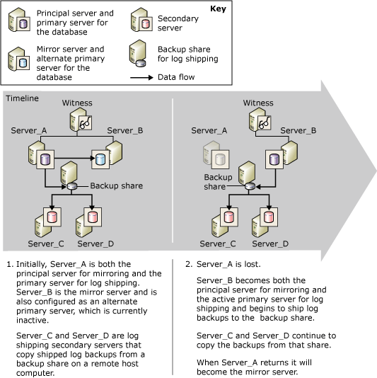

# Database Mirroring and Log Shipping (SQL Server)
  A given database can be mirrored or log shipped; it can also be simultaneously mirrored and log shipped. To choose what approach to use, consider the following:  
  
-   How many destination servers do you require?  
  
     If you require only a single destination database, database mirroring is the recommended solution.  
  
     If you require more than one destination database, you need to use log shipping, either alone or with database mirroring. Combining these approaches gives you the benefits of database mirroring along with the support for multiple destinations provided by log shipping.  
  
-   If you need to delay restoring log on the destination database (typically, to protect against logical errors), use log shipping, alone or with database mirroring.  
  
 This topic discusses considerations for combining log shipping and database mirroring.  
  
> [!NOTE]  
>  For introductions to these technologies, see [Database Mirroring &#40;SQL Server&#41;](database-mirroring-sql-server.md) and [About Log Shipping &#40;SQL Server&#41;](../log-shipping/about-log-shipping-sql-server.md).  
  
## Combining Log Shipping and Database Mirroring  
 The principal database in a mirroring session can also act as the primary database in a log shipping configuration, or vice versa, as the log shipping backup share is intact. The database mirroring session run in any operating mode, whether synchronous (with transaction safety set to FULL) or asynchronous (with transaction safety set to OFF).  
  
> [!NOTE]  
>  To use database mirroring on a database, the full recovery model is always required.  
  
 Typically, when combining log shipping and database mirroring, the mirroring session is established before log shipping, although this is not required. Then the current principal database is configured as the log shipping primary (the *principal/primary database*), along with one or more remote secondary databases. Also, the mirror database must be configured as a log shipping primary (the *mirror/primary database*). The log shipping secondary databases should be on different server instances than either the principal/primary server or mirror/primary server.  
  
> [!NOTE]  
>  The case sensitivity settings of the servers involved in log shipping should match.  
  
 During a log shipping session, backup jobs on the primary database create log backups in a backup folder. From there, the backups are copied by the copy jobs of the secondary servers. For the backup jobs and copy jobs to succeed, they must have access to the log shipping backup folder. To maximize availability of the primary server, we recommend that you establish the backup folder in a shared backup location on a separate host computer. Ensure that all the log shipping servers, including the mirror/primary server, can access the shared backup location (known as a *backup share*).  
  
 To allow log shipping to continue after database mirroring fails over, you must also configure the mirror server as a primary server, using the same configuration you use for the primary on the principal database. The mirror database is in the restoring state, which prevents the backup jobs from backing up the log on the mirror database. This ensures that the mirror/primary database does not interfere with the principal/primary database whose log backups are currently being copied by secondary servers. To prevent spurious alerts, after the backup job executes on the mirror/primary database, the backup job logs a message to the l**og_shipping_monitor_history_detail** table, and the agent job returns a status of success.  
  
 The mirror/primary database is inactive in the log shipping session. However, if mirroring fails over, the former mirror database comes online as the principal database. At that point, that database also becomes active as the log shipping primary database. The log shipping backup jobs that were previously unable to ship log on that database, begin shipping log. Conversely, a failover causes the former principal/primary database to become the new mirror/primary database and enter the restoring state, and backup jobs on that database cease to backup log.  
  
> [!NOTE]  
>  In the event of an automatic failover, the switch to the mirror role occurs when the former principal/primary database rejoins the mirroring session.  
  
 To run in high-safety mode with automatic failover the mirroring session is configured with an additional server instance known as the *witness*. If the principal database is lost for any reason after the database is synchronized and if the mirror server and witness can still communicate with each other, automatic failover occurs. An automatic failover causes mirror server to assume the principal role and bring its database online as the principal database. If the log shipping backup location is accessible to the new principal/primary server, its backup jobs begin to ship log backups to that location. The database mirroring synchronous mode guarantees that the log chain is unaffected by a mirroring failover and that only valid log is restored. The secondary servers continue to copy log backups without knowing that a different server instance has become the primary server.  
  
 When using a local log shipping monitor, no special considerations are necessary to accommodate this scenario. For information about using a remote monitoring instance with this scenario, see, "The Impact of Database Mirroring on a Remote Monitoring Instance," later in this topic.  
  
## Failing over from the Principal to the Mirror database  
 The following figure shows how log shipping and database mirroring work together when mirroring is running in high-safety mode with automatic failover. Initially, **Server_A** is both the principal server for mirroring and the primary server for log shipping. **Server_B** is the mirror server and is also configured as a primary server, which is currently inactive. **Server_C** and **Server_D** are log shipping secondary servers. To maximize availability of the log shipping session, the backup location is on a share directory on a separate host computer.  
  
   
  
 After a mirroring failover, the primary server name defined on the secondary server is unchanged. .  
  
## The Impact of Database Mirroring on a Remote Monitoring Instance  
 When log shipping uses with a remote monitoring instance, combining the log shipping session and database mirroring affects the information in the monitor tables. The information about the primary is a combination of the one configured at the principal/primary and the monitor configured on each secondary.  
  
 To keep monitoring as seamless as possible, when you use a remote monitor, we recommend that you specify the original primary name when configuring the primary at the secondary. This approach also facilitates changing the log shipping configuration from Microsoft [!INCLUDE[ssNoVersion](../../includes/ssnoversion-md.md)] Agent. For more information about monitoring, see [Monitor Log Shipping &#40;Transact-SQL&#41;](../log-shipping/monitor-log-shipping-transact-sql.md).  
  
## Setting Up Mirroring and Log Shipping Together  
 To set up database mirroring and log shipping together, the following steps are required:  
  
1.  Restore backups of the principal/primary database with NORECOVERY onto another server instance to be later used as database mirroring mirror database for the principal/primary database. For more information, see [Prepare a Mirror Database for Mirroring &#40;SQL Server&#41;](prepare-a-mirror-database-for-mirroring-sql-server.md).  
  
2.  Set up database mirroring. For more information, see [Establish a Database Mirroring Session Using Windows Authentication &#40;SQL Server Management Studio&#41;](establish-database-mirroring-session-windows-authentication.md) or [Setting Up Database Mirroring &#40;SQL Server&#41;](setting-up-database-mirroring-sql-server.md).  
  
3.  Restore backups of the principal/primary database to other server instances to be later used as log shipping secondary databases for the primary database.  
  
4.  Set up log shipping on the principal database as the primary database for one or more secondary databases.  
  
     You should set up a single share as the backup directory (a backup share). This ensures that after role switching between the principal and mirror servers, backup jobs continue to write to the same directory as before. A best practice is to ensure that this share is located on a different physical server from the servers hosting the databases involved in mirroring and log shipping.  
  
     For more information, see [Configure Log Shipping &#40;SQL Server&#41;](../log-shipping/configure-log-shipping-sql-server.md).  
  
5.  Manually failover from the principal to the mirror.  
  
     To perform a manual failover:  
  
    -   [Manually Fail Over a Database Mirroring Session &#40;SQL Server Management Studio&#41;](manually-fail-over-a-database-mirroring-session-sql-server-management-studio.md)  
  
    -   [Manually Fail Over a Database Mirroring Session &#40;Transact-SQL&#41;](manually-fail-over-a-database-mirroring-session-transact-sql.md)  
  
6.  Set up log shipping on the new principal (previously mirror) as the primary database.  
  
    > [!IMPORTANT]  
    >  Do not perform any setup from a secondary.  
  
     You must use the same backup share that you used in step 4.  
  
     The **Transaction Log Shipping** interface in [!INCLUDE[ssManStudioFull](../../includes/ssmanstudiofull-md.md)] supports only one primary database per log shipping configuration. Therefore, you must use stored procedures to set up the new principal as primary.  
  
7.  Perform another manual failover to fail back to the original principal.  
  
  
