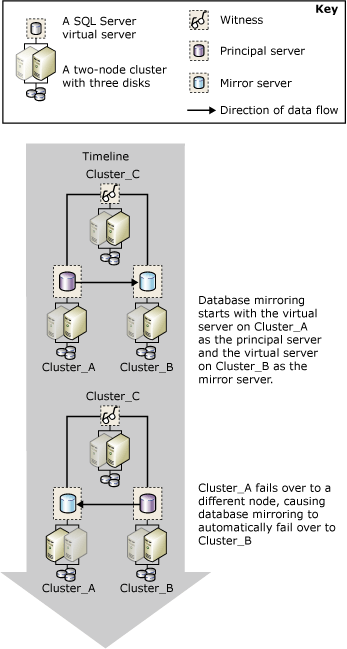

# Database Mirroring and SQL Server Failover Cluster Instances
  A failover cluster is a combination of one or more physical disks in a [!INCLUDE[msCoName](../../includes/msconame-md.md)] Cluster Service (MSCS) cluster group, known as a resource group, that are participating nodes of the cluster. The resource group is configured as a failover clustered instance that hosts an instance of [!INCLUDE[ssNoVersion](../../includes/ssnoversion-md.md)]. A [!INCLUDE[ssNoVersion](../../includes/ssnoversion-md.md)] failover clustered instance appears on the network as if it were a single computer, but has functionality that provides failover from one node to another if one node becomes unavailable. For more information, see [AlwaysOn Failover Cluster Instances (SQL Server)](../../sql-server/failover-clusters/windows/always-on-failover-cluster-instances-sql-server.md).  
  
 Failover clusters provide high-availability support for an entire [!INCLUDE[msCoName](../../includes/msconame-md.md)] [!INCLUDE[ssNoVersion](../../includes/ssnoversion-md.md)] instance, in contrast to database mirroring, which provides high-availability support for a single database. Database mirroring works between failover clusters and, also, between a failover cluster and a nonclustered host.  
  
> [!NOTE]  
>  For an introduction to database mirroring, see [Database Mirroring &#40;SQL Server&#41;](database-mirroring-sql-server.md).  
  
## Mirroring and Clustering  
 Typically, when mirroring is used with clustering, the principal server and mirror server both reside on clusters, with the principal server running on the failover clustered instance of one cluster and the mirror server running on the failover clustered instance of a different cluster. You can establish a mirroring session in which one partner resides on the failover clustered instance of a cluster and the other partner resides on a separate, unclustered computer, however.  
  
 If a cluster failover makes a principal server temporarily unavailable, client connections are disconnected from the database. After the cluster failover completes, clients can reconnect to the principal server on the same cluster, or on a different cluster or an unclustered computer, depending on the [operating mode](database-mirroring-operating-modes.md). Therefore, when deciding how to configure database mirroring in a clustered environment, the operating mode you use for mirroring is significant.  
  
### High-Safety mode Session with Automatic Failover  
 If you intend to mirror a database in high-safety mode with automatic failover, a two-cluster configuration is recommended for the partners. This configuration provides maximum availability. The witness can reside either on a third cluster or on an unclustered computer.  
  
 If the node running the current principal server fails, automatic failover of the database begins within a few seconds, while the cluster is still failing over to another node. The database mirroring session fails over to the mirror server on the other cluster or unclustered computer, and the former mirror server becomes the principal server. The new principal server rolls forward its copy of the database as quickly as possible and brings it online as the principal database. After the cluster failover completes, which typically takes several minutes, the failover clustered instance that was formerly the principal server becomes the mirror server.  
  
 The following illustration shows an automatic failover between clusters in a mirroring session running in high-safety mode with a witness (which supports automatic failover).  
  
   
  
 The three server instances in the mirroring session reside on three distinct clusters: **Cluster_A**, **Cluster_B**, and **Cluster_C**. On each cluster, a default instance of [!INCLUDE[ssNoVersion](../../includes/ssnoversion-md.md)] is running as a [!INCLUDE[ssNoVersion](../../includes/ssnoversion-md.md)] failover clustered instance. When the mirroring session starts, the failover clustered instance on **Cluster_A** is the principal server, the failover clustered instance on **Cluster_B** is the mirror server, and the failover clustered instance on **Cluster_C** is the witness in the mirroring session. Eventually, the active node on **Cluster_A** fails, which causes the principal server to become unavailable.  
  
 Before the cluster has time to fail over, the loss of the principal server is detected by the mirror server, with the help of the witness. The mirror server rolls forward its database and brings it online as the new principal database as quickly as possible. When **Cluster_A** finishes failing over, the former principal server is now the mirror server, and it synchronizes its database with the current principal database on **Cluster_B**.  
  
### High-Safety Mode Session Without Automatic Failover  
 If you are mirroring a database in high-safety mode without automatic failover, another node in the cluster will act as the principal server if the node running the current principal server fails. Note that while the cluster is unavailable, the database is unavailable.  
  
### High-Performance Mode Session  
 If you intend to mirror a database in high-performance mode, consider placing the principal server on the failover clustered instance of a cluster and placing the mirror server on an unclustered server in a remote location. If the cluster fails over to a different node, the failover clustered instance will continue as the principal server in the mirroring session. If the entire cluster has problems, you can force service onto the mirror server.  
  
 **To set up a new SQL Server failover cluster**  
  
-   [Create a New SQL Server Failover Cluster &#40;Setup&#41;](../../sql-server/failover-clusters/install/create-a-new-sql-server-failover-cluster-setup.md)  
  
 **To set up database mirroring**  
  
-   [Setting Up Database Mirroring &#40;SQL Server&#41;](setting-up-database-mirroring-sql-server.md)  
  
-   [Establish a Database Mirroring Session Using Windows Authentication &#40;SQL Server Management Studio&#41;](establish-database-mirroring-session-windows-authentication.md)  
  
## See Also  
 [Database Mirroring &#40;SQL Server&#41;](database-mirroring-sql-server.md)   
 [Database Mirroring Operating Modes](database-mirroring-operating-modes.md)   
 [AlwaysOn Failover Cluster Instances (SQL Server)](../../sql-server/failover-clusters/windows/always-on-failover-cluster-instances-sql-server.md) 
  
  
