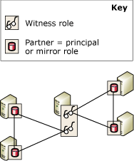

# Database Mirroring Witness
  To support automatic failover, a database mirroring session must be configured in high-safety mode and also possess a third server instance, known as the *witness*. The witness is an optional instance of [!INCLUDE[ssNoVersion](../../includes/ssnoversion-md.md)] that enables the mirror server in a high-safety mode session to recognize whether to initiate an automatic failover. Unlike the two partners, the witness does not serve the database. Supporting automatic failover is the only role of the witness.  
  
> [!NOTE]  
>  In high-performance mode, the witness can adversely affect availability. If a witness is configured for a database mirroring session, the principal server must be connected at least to one of the other server instances, the mirror server or the witness, or both of them. Otherwise, the database becomes unavailable and forcing service (with possible data loss) is impossible. Therefore, for high-performance mode, we strongly recommend that you always keep the witness set to OFF. For information about the impact of a witness on high-performance mode, see [Database Mirroring Operating Modes](database-mirroring-operating-modes.md).  
  
 The following illustration shows a high-safety mode session with a witness.  
  
   
  
 **In This Topic:**  
  
-   [Using a Witness in Multiple Sessions](#InMultipleSessions)  
  
-   [Software and Hardware Recommendations](#SwHwRecommendations)  
  
-   [Role of the Witness in Automatic Failover](#InAutoFo)  
  
-   [To Add or Remove a Witness](#AddRemoveWitness)  
  
##   Using a Witness in Multiple Sessions  
 A specific server instance can act as a witness in concurrent database mirroring sessions, each for a different database. Different sessions can be with different partners. The following illustration shows a server instance that is a witness in two database mirroring sessions with different partners.  
  
   
  
 A single-server instance can also function at the same time as a witness in some sessions and a partner in other sessions. However, in practice, a server instance typically functions as either a witness or a partner. This is because the partners require sophisticated computers that have enough hardware to support a production database, whereas the witness can run on any available Windows system that supports [!INCLUDE[ssCurrent](../../includes/sscurrent-md.md)].  
  
##   Software and Hardware Recommendations  
 We strongly recommend that the witness reside on a separate computer from the partners. Database mirroring partners are supported only by [!INCLUDE[ssNoVersion](../../includes/ssnoversion-md.md)] Standard edition and by [!INCLUDE[ssNoVersion](../../includes/ssnoversion-md.md)] Enterprise edition. Witnesses, in contrast, are also supported by [!INCLUDE[ssNoVersion](../../includes/ssnoversion-md.md)] Workgroup and by [!INCLUDE[ssNoVersion](../../includes/ssnoversion-md.md)] Express. Except during an upgrade from an earlier version of [!INCLUDE[ssNoVersion](../../includes/ssnoversion-md.md)], the server instances in a mirroring session must all be running the same version of [!INCLUDE[ssNoVersion](../../includes/ssnoversion-md.md)]. For example, a [!INCLUDE[ssKatmai](../../includes/sskatmai-md.md)] witness is supported when you are upgrading from a [!INCLUDE[ssKatmai](../../includes/sskatmai-md.md)] mirroring configuration but cannot be added to an existing or new [!INCLUDE[ssKilimanjaro](../../includes/sskilimanjaro-md.md)] or later mirroring configuration.  
  
 A witness can run on any reliable computer system that supports any of these editions of [!INCLUDE[ssNoVersion](../../includes/ssnoversion-md.md)]. However, we recommend that every server instance that is used as a witness correspond to the minimum configuration that is required for the [!INCLUDE[ssNoVersion](../../includes/ssnoversion-md.md)] Standard version that you are running. For more information about these requirements, see [Hardware and Software Requirements for Installing SQL Server 2014](../../sql-server/install/hardware-and-software-requirements-for-installing-sql-server.md).  
  
##   Role of the Witness in Automatic Failover  
 Throughout a database mirroring session, all the server instances monitor their connection status. If the partners become disconnected from each other, they rely on the witness to make sure that only one of them is currently serving the database. If a synchronized mirror server loses its connection to the principal server but remains connected to the witness, the mirror server contacts the witness to determine whether the witness has lost its connection to the principal server:  
  
-   If the principal server is still connected to the witness, automatic failover does not occur. Instead, the principal server continues to server the database while accumulating log records to send the mirror server when the partners reconnect.  
  
-   If the witness is also disconnected from the principal server, the mirror server knows that principal database has become unavailable. In this case, the mirror server immediately initiates an automatic failover.  
  
-   If the mirror server is disconnected from the witness and also from the principal server, automatic failover is not possible, regardless of the state of the principal server.  
  
 The requirement that at least two of the server instances be connected is known as *quorum*. Quorum makes sure that the database can only be served by one partner at a time. For information about how quorum works and its impact on a session, see [Quorum: How a Witness Affects Database Availability &#40;Database Mirroring&#41;](quorum-how-a-witness-affects-database-availability-database-mirroring.md).  
  
##   To Add or Remove a Witness  
 **To add a witness**  
  
-   [Add or Replace a Database Mirroring Witness &#40;SQL Server Management Studio&#41;](../database-mirroring/add-or-replace-a-database-mirroring-witness-sql-server-management-studio.md)  
  
-   [Add a Database Mirroring Witness Using Windows Authentication &#40;Transact-SQL&#41;](add-a-database-mirroring-witness-using-windows-authentication-transact-sql.md)  
  
 **To remove the witness**  
  
-   [Remove the Witness from a Database Mirroring Session &#40;SQL Server&#41;](remove-the-witness-from-a-database-mirroring-session-sql-server.md)  
  
## See Also  
 [Role Switching During a Database Mirroring Session &#40;SQL Server&#41;](role-switching-during-a-database-mirroring-session-sql-server.md)   
 [Database Mirroring Operating Modes](database-mirroring-operating-modes.md)   
 [Quorum: How a Witness Affects Database Availability &#40;Database Mirroring&#41;](quorum-how-a-witness-affects-database-availability-database-mirroring.md)   
 [Possible Failures During Database Mirroring](possible-failures-during-database-mirroring.md)   
 [Mirroring States &#40;SQL Server&#41;](mirroring-states-sql-server.md)  
  
  
