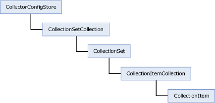

# Data Collector Programming
  The data collector API, in <xref:Microsoft.SqlServer.Management.Collector>, allows programmatic control of all configuration operations through the object model. In addition, many of the data collection operations that use the API are implemented as stored procedures that are installed on the server.  
  
 The following illustration shows key elements of the data collector object model.  
  
   
  
  
