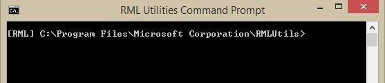
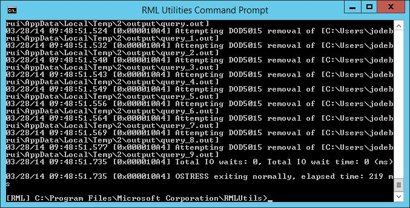

# Extensions to AdventureWorks to Demonstrate In-Memory OLTP
    
## Overview  
 This sample showcases the new [!INCLUDE[hek_2](../includes/hek-2-md.md)] feature, which is part of [!INCLUDE[ssSQL14](../includes/sssql14-md.md)]. It shows the new memory-optimized tables and natively-compiled stored procedures, and can be used to demonstrate performance benefits of [!INCLUDE[hek_2](../includes/hek-2-md.md)].  
  
> [!NOTE]  
>  To view this topic for SQL Server 2016, see [Extensions to AdventureWorks to Demonstrate In-Memory OLTP](https://msdn.microsoft.com/library/mt465764.aspx)  
  
 The sample migrates 5 tables in the AdventureWorks database to memory-optimized, and it includes a demo workload for sales order processing. You can use this demo workload to see the performance benefit of using [!INCLUDE[hek_2](../includes/hek-2-md.md)] on your server.  
  
 In the description of the sample we discuss the tradeoffs that were made in migrating the tables to [!INCLUDE[hek_2](../includes/hek-2-md.md)] to account for the features that are not (yet) supported for memory-optimized tables in [!INCLUDE[ssSQL14](../includes/sssql14-md.md)].  
  
 The documentation of this sample is structured as follows:  
  
-   [Prerequisites](#Prerequisites) for installing the sample and running the demo workload  
  
-   Instructions for [Installing the In-Memory OLTP sample based on AdventureWorks](#InstallingtheIn-MemoryOLTPsamplebasedonAdventureWorks)  
  
-   [Description of the sample tables and procedures](#Descriptionofthesampletablesandprocedures) - this includes descriptions of the tables and procedures added to AdventureWorks by the [!INCLUDE[hek_2](../includes/hek-2-md.md)] sample, as well as considerations for migrating some of the original AdventureWorks tables to memory-optimized  
  
-   Instructions for performing [Performance Measurements using the Demo Workload](#PerformanceMeasurementsusingtheDemoWorkload) - this includes instructions for installing and running ostress, a tool using for driving the workload, as well as running the demo workload itself  
  
-   [Memory and Disk Space Utilization in the Sample](#MemoryandDiskSpaceUtilizationintheSample)  
  
##  <a name="Prerequisites"></a> Prerequisites  
  
-   [!INCLUDE[ssSQL14](../includes/sssql14-md.md)] RTM - Evaluation, Developer, or Enterprise edition  
  
-   For performance testing, a server with specifications similar to your production environment. For this particular sample you should have at least 16GB of memory available to [!INCLUDE[ssNoVersion](../includes/ssnoversion-md.md)]. For general guidelines on hardware for [!INCLUDE[hek_2](../includes/hek-2-md.md)], see the following blog post:[http://blogs.technet.com/b/dataplatforminsider/archive/2013/08/01/hardware-considerations-for-in-memory-oltp-in-sql-server-2014.aspx](http://blogs.technet.com/b/dataplatforminsider/archive/2013/08/01/hardware-considerations-for-in-memory-oltp-in-sql-server-2014.aspx)  
  
##  <a name="InstallingtheIn-MemoryOLTPsamplebasedonAdventureWorks"></a> Installing the [!INCLUDE[hek_2](../includes/hek-2-md.md)] sample based on AdventureWorks  
 Follow these steps to install the sample:  
  
1.  Download the archive for the full backup of the AdventureWorks2014 database:  
  
    1.  Open the following: [http://msftdbprodsamples.codeplex.com/downloads/get/880661](http://msftdbprodsamples.codeplex.com/downloads/get/880661).  
  
    2.  When prompted to save the file to a local folder.  
  
2.  Extract the **AdventureWorks2014.bak** file to a local folder, for example 'c:\temp'.  
  
3.  Restore the database backup using [!INCLUDE[tsql](../includes/tsql-md.md)] or [!INCLUDE[ssManStudioFull](../includes/ssmanstudiofull-md.md)]:  
  
    1.  Identify the target folder and filename for the data file, for example  
  
         'h:\DATA\AdventureWorks2014_Data.mdf'  
  
    2.  Identify the target folder and filename for the log file, for example  
  
         'i:\DATA\AdventureWorks2014_log.ldf'  
  
        1.  The log file should be placed on a different drive than the data file, ideally a low latency drive such as an SSD or PCIe storage, for maximum performance.  
  
     Example T-SQL script:  
  
    ```  
    RESTORE DATABASE [AdventureWorks2014]   
      FROM DISK = N'C:\temp\AdventureWorks2014.bak'   
        WITH FILE = 1,    
      MOVE N'AdventureWorks2014_Data' TO N'h:\DATA\AdventureWorks2014_Data.mdf',    
      MOVE N'AdventureWorks2014_Log' TO N'i:\DATA\AdventureWorks2014_log.ldf'  
     GO  
    ```  
  
4.  Change the database owner to a login on your server, by running the following command in the query window of [!INCLUDE[ssManStudioFull](../includes/ssmanstudiofull-md.md)]:  
  
    ```  
    ALTER AUTHORIZATION ON DATABASE::AdventureWorks2014 TO [<NewLogin>]  
    ```  
  
5.  Download the sample script '[!INCLUDE[ssSQL14](../includes/sssql14-md.md)] RTM [!INCLUDE[hek_2](../includes/hek-2-md.md)] Sample.sql' from [SQL Server 2014 RTM In-Memory OLTP Sample](https://go.microsoft.com/fwlink/?LinkID=396372) to a local folder.  
  
6.  Update the value for the variable 'checkpoint_files_location' in the script '[!INCLUDE[ssSQL14](../includes/sssql14-md.md)] RTM [!INCLUDE[hek_2](../includes/hek-2-md.md)] Sample.sql', to point to the target location for the [!INCLUDE[hek_2](../includes/hek-2-md.md)] checkpoint files. The checkpoint files should be placed on a drive with good sequential IO performance.  
  
     Update the value for the variable 'database_name' to point to the AdventureWorks2014 database.  
  
    1.  Be sure to include the backslash '\' as part of the path name  
  
    2.  Example:  
  
        ```  
        :setvar checkpoint_files_location "d:\DBData\"  
        ...  
        :setvar database_name "AdventureWorks2014"  
        ```  
  
7.  Execute the sample script, in one of two ways:  
  
    1.  Using the sqlcmd command-line utility. For example, for example by running the following command from the command-line prompt in the folder containing the script:  
  
        ```  
        sqlcmd -S . -E -i "ssSQL14 RTM hek_2 Sample.sql"  
        ```  
  
    2.  Using Management Studio:  
  
        1.  Open the script '[!INCLUDE[ssSQL14](../includes/sssql14-md.md)] RTM [!INCLUDE[hek_2](../includes/hek-2-md.md)] Sample.sql' in a query window  
  
        2.  Connect to the target server that contains the database AdventureWorks2014  
  
        3.  Enable SQLCMD Mode, by clicking on 'Query -> SQLCMD Mode'  
  
        4.  Click the button 'Execute' to run the script  
  
##  <a name="Descriptionofthesampletablesandprocedures"></a> Description of the sample tables and procedures  
 The sample creates new tables for products and sales orders, based on existing tables in AdventureWorks. The schema of the new tables is similar to the existing tables, with a few differences, as explained below.  
  
 The new memory-optimized tables carry the suffix '_inmem'. The sample also includes corresponding tables carrying the suffix '_ondisk' - these tables can be used to make a one-to-one comparison between the performance of memory-optimized tables and disk-based tables on your system..  
  
 Note that the memory-optimized tables used in the workload for performance comparison are fully durable and fully logged. They do not sacrifice durability or reliability to attain the performance gain.  
  
 The target workload for this sample is sales order processing, where we consider also information about products and discounts. To this end, the table SalesOrderHeader, SalesOrderDetail, Product, SpecialOffer, and SpecialOfferProduct.  
  
 Two new stored procedures, Sales.usp_InsertSalesOrder_inmem and Sales.usp_UpdateSalesOrderShipInfo_inmem, are used to insert sales orders and to update the shipping information of a given sales order.  
  
 The new schema 'Demo' contains helper tables and stored procedures to execute a demo workload.  
  
 Concretely, the [!INCLUDE[hek_2](../includes/hek-2-md.md)] sample adds the following objects to AdventureWorks:  
  
### Tables added by the sample  
  
#### The New Tables  
 Sales.SalesOrderHeader_inmem  
  
-   Header information about sales orders. Each sales order has one row in this table.  
  
 Sales.SalesOrderDetail_inmem  
  
-   Details of sales orders. Each line item of a sales order has one row in this table.  
  
 Sales.SpecialOffer_inmem  
  
-   Information about special offers, including the discount percentage associated with each special offer.  
  
 Sales.SpecialOfferProduct_inmem  
  
-   Reference table between special offers and products. Each special offer can feature zero or more products, and each product can be featured in zero or more special offers.  
  
 Production.Product_inmem  
  
-   Information about products, including their list price.  
  
 Demo.DemoSalesOrderDetailSeed  
  
-   Used in the demo workload to construct sample sales orders.  
  
 Disk-based variations of the tables:  
  
-   Sales.SalesOrderHeader_ondisk  
  
-   Sales.SalesOrderDetail_ondisk  
  
-   Sales.SpecialOffer_ondisk  
  
-   Sales.SpecialOfferProduct_ondisk  
  
-   Production.Product_ondisk  
  
#### Differences between original disk-based and the and new memory-optimized tables  
 For the most part, the new tables introduced by this sample use the same columns and the same data types as the original tables. However, there are a few differences. We list the differences below, along with a rationale for the changes.  
  
 Sales.SalesOrderHeader_inmem  
  
-   *Default constraints* are supported for memory-optimized tables, and most default constraints we migrated as is. However, the original table Sales.SalesOrderHeader contains two default constraints that retrieve the current date, for the columns OrderDate and ModifiedDate. In a high throughput order processing workload with a lot of concurrency, any global resource can become a point of contention. System time is such a global resource, and we have observed that it can become a bottleneck when running an [!INCLUDE[hek_2](../includes/hek-2-md.md)] workload that inserts sales orders, in particular if the system time needs to be retrieved for multiple columns in the sales order header, as well as the sales order details. The problem is addressed in this sample by retrieving the system time only once for each sales order that is inserted, and use that value for the datetime columns in SalesOrderHeader_inmem and SalesOrderDetail_inmem, in the stored procedure Sales.usp_InsertSalesOrder_inmem.  
  
-   *Alias UDTs* - The original table uses two alias user-defined data types (UDTs) dbo.OrderNumber and dbo.AccountNumber, for the columns PurchaseOrderNumber and AccountNumber, respectively. [!INCLUDE[ssSQL14](../includes/sssql14-md.md)] does not support alias UDT for memory-optimized tables, thus the new tables use system data types nvarchar(25) and nvarchar(15), respectively.  
  
-   *Nullable columns in index keys* - In the original table, the column SalesPersonID is nullable, while in the new tables the column is not nullable and has a default constraint with value (-1). This is because indexes on memory-optimized tables cannot have nullable columns in the index key; -1 is a surrogate for NULL in this case.  
  
-   *Computed columns* - The computed columns SalesOrderNumber and TotalDue are omitted, as [!INCLUDE[ssSQL14](../includes/sssql14-md.md)] does not support computed columns in memory-optimized tables. The new view Sales.vSalesOrderHeader_extended_inmem reflects the columns SalesOrderNumber and TotalDue. Therefore, you can use this view if these columns are needed.  
  
-   *Foreign key constraints* are not supported for memory-optimized tables in [!INCLUDE[ssSQL14](../includes/sssql14-md.md)]. In addition, SalesOrderHeader_inmem is a hot table in the example workload, and foreign keys constraints require additional processing for all DML operations, as it requires lookups in all the other tables referenced in these constraints. Therefore, the assumption is that the app ensures referential integrity, and referential integrity is not validated when rows are inserted. Referential integrity for the data in this table can be verified using the stored procedure dbo.usp_ValidateIntegrity, using the following script:  
  
    ```  
    DECLARE @o int = object_id(N'Sales.SalesOrderHeader_inmem')  
    EXEC dbo.usp_ValidateIntegrity @o  
    ```  
  
-   *Check constraints* are not supported for memory-optimized tables in SQ Server 2014. Domain integrity is validated along with referential integrity using this script:  
  
    ```  
    DECLARE @o int = object_id(N'Sales.SalesOrderHeader_inmem')  
    EXEC dbo.usp_ValidateIntegrity @o  
    ```  
  
-   *Rowguid* - The rowguid column is omitted. While uniqueidentifier is support for memory-optimized tables, the option ROWGUIDCOL is not supported in [!INCLUDE[ssSQL14](../includes/sssql14-md.md)]. Columns of this kind are typically used for either merge replication or tables that have filestream columns. This sample includes neither.  
  
 Sales.SalesOrderDetail  
  
-   *Default constraints* - similar to SalesOrderHeader, the default constraint requiring the system date/time is not migrated, instead the stored procedure inserting sales orders takes care of inserting the current system date/time on first insert.  
  
-   *Computed columns* - the computed column LineTotal was not migrated as computed columns are not supported with memory-optimized tables in [!INCLUDE[ssSQL14](../includes/sssql14-md.md)]. To access this column use the view Sales.vSalesOrderDetail_extended_inmem.  
  
-   *Rowguid* - The rowguid column is omitted. For details see the description for the table SalesOrderHeader.  
  
-   For *check* and *foreign key* constraints see the description of SalesOrderHeader. The following script can be used to verify domain and referential integrity for this table:  
  
    ```  
    DECLARE @o int = object_id(N'Sales.SalesOrderHeader_inmem')  
    EXEC dbo.usp_ValidateIntegrity @o  
    ```  
  
 Production.Product  
  
-   *Alias UDTs* - the original table uses the user-defined data type dbo.Flag, which is equivalent to the system data type bit. The migrated table uses the bit data type instead.  
  
-   *BIN2 collation* - The columns Name and ProductNumber are included in index keys, and must thus have BIN2 collations in [!INCLUDE[ssSQL14](../includes/sssql14-md.md)]. Here, the assumption is that the app does not rely on collation specifics, like case insensitivity.  
  
-   *Rowguid* - The rowguid column is omitted. For details see the description for the table SalesOrderHeader.  
  
-   *Unique*, *Check* and *Foreign Key constraints* are accounted for in two ways: the stored procedures Product.usp_InsertProduct_inmem and Product.usp_DeleteProduct_inmem can be used to insert and delete products; these procedures validate domain and referential integrity, and will fail if integrity is violated. In addition, the follow script can be used to validate domain and referential integrity as is:  
  
    ```  
    DECLARE @o int = object_id(N'Production.Product')  
    EXEC dbo.usp_ValidateIntegrity @o  
    ```  
  
    -   Note that the store procedures usp_InsertProduct_inmem and usp_DeleteProduct_inmem consider only foreign keys between the migrated tables. References to other tables ProductModel, ProductSubcategory, and UnitMeasure are not considered.  
  
 Sales.SpecialOffer  
  
-   *Check* and *Foreign Key constraints* are accounted for in two ways: the stored procedures Sales.usp_InsertSpecialOffer_inmem and Sales.usp_DeleteSpecialOffer_inmem can be used to insert and delete special offers; these procedures validate domain and referential integrity, and will fail if integrity is violated. In addition, the follow script can be used to validate domain and referential integrity as is:  
  
    ```  
    DECLARE @o int = object_id(N'Sales.SpecialOffer_inmem')  
    EXEC dbo.usp_ValidateIntegrity @o  
    ```  
  
-   *Rowguid* - The rowguid column is omitted. For details see the description for the table SalesOrderHeader.  
  
 Sales.SpecialOfferProduct  
  
-   *Foreign Key constraints* are accounted for in two ways: the stored procedure Sales.usp_InsertSpecialOfferProduct_inmem can be used to insert relationships between special offers and products; this procedures validates referential integrity, and will fail if integrity is violated. In addition, the follow script can be used to validate referential integrity as is:  
  
    ```  
    DECLARE @o int = object_id(N'Sales.SpecialOfferProduct_inmem')  
    EXEC dbo.usp_ValidateIntegrity @o  
    ```  
  
-   *Rowguid* - The rowguid column is omitted. For details see the description for the table SalesOrderHeader.  
  
#### Considerations for indexes on memory-optimized tables  
 The baseline index for memory-optimized tables is the NONCLUSTERED index, which supports point lookups (index seek on equality predicate), range scans (index seek in inequality predicate), full index scans, and ordered scans. In addition, NONCLUSTERED indexes support searching on leading columns of the index key. In fact memory-optimized NONCLUSTERED indexes support all the operations supported by disk-based NONCLUSTERED indexes, with the only exception being backward scans. Therefore, using NONCLUSTERED indexes is a safe choice for your indexes.  
  
 HASH indexes are can be used to further optimize the workload. They are particularly optimized for point lookups and row inserts. However, one must consider that they do not support range scans, ordered scans, or search on leading index key columns. Therefore, care needs to be taken when using these indexes. In addition, it is necessary to specify the bucket_count at create time. It should usually be set at between one and two times the number of index key values, but overestimating is usually not a problem.  
  
 See Books Online for more details about [index guidelines](https://technet.microsoft.com/library/dn133166\(v=sql.120\).aspx) and guidelines for [choosing the right bucket_count](https://technet.microsoft.com/library/dn494956\(v=sql.120\).aspx).  
  
 The indexes on the migrated tables have been tuned for the demo sales order processing workload. The workload relies on inserts and point lookups in the tables Sales.SalesOrderHeader_inmem and Sales.SalesOrderDetail_inmem, and it also relies on point lookups on the primary key columns in the tables Production.Product_inmem and Sales.SpecialOffer_inmem.  
  
 Sales.SalesOrderHeader_inmem has three indexes, which are all HASH indexes for performance reasons, and because no ordered or range scans are needed for the workload.  
  
-   HASH index on (SalesOrderID): bucket_count is sized at 10 million (rounded up to 16 million), because the expected number of sales orders is 10 million  
  
-   HASH index on (SalesPersonID): bucket_count is 1 million. The data set provided does not have a lot of sales persons, but this allows for future growth, plus you don't pay a performance penalty for point lookups if the bucket_count is oversized.  
  
-   HASH index on (CustomerID): bucket_count is 1 million. The data set provided does not have a lot of customers, but this allows for future growth.  
  
 Sales.SalesOrderDetail_inmem has three indexes, which are all HASH indexes for performance reasons, and because no ordered or range scans are needed for the workload.  
  
-   HASH index on (SalesOrderID, SalesOrderDetailID): this is the primary key index, and even though lookups on (SalesOrderID, SalesOrderDetailID) will be infrequent, using a hash index for the key speeds up row inserts. The bucket_count is sized at 50 million (rounded up to 67 million): the expected number of sales orders is 10 million, and this is sized to have an average of 5 items per order  
  
-   HASH index on (SalesOrderID): lookups by sales order are frequent: you will want to find all the line items corresponding to a single order.  bucket_count is sized at 10 million (rounded up to 16 million), because the expected number of sales orders is 10 million  
  
-   HASH index on (ProductID): bucket_count is 1 million. The data set provided does not have a lot of product, but this allows for future growth.  
  
 Production.Product_inmem has three indexes  
  
-   HASH index on (ProductID): lookups on ProductID are in the critical path for the demo workload, therefore this is a hash index  
  
-   NONCLUSTERED index on (Name): this will allow ordered scans of product names  
  
-   NONCLUSTERED index on (ProductNumber): this will allow ordered scans of product numbers  
  
 Sales.SpecialOffer_inmem has one HASH index on (SpecialOfferID): point lookups of special offers are in the critical part of the demo workload. The bucket_count is sized at 1 million to allow for future growth.  
  
 Sales.SpecialOfferProduct_inmem is not referenced in the demo workload, and thus there is no apparent need to use hash indexes on this table to optimize the workload - the indexes on (SpecialOfferID, ProductID) and (ProductID) are NONCLUSTERED.  
  
 Notice that in the above some of the bucket_counts are over-sized, but not the bucket_counts for the indexes on SalesOrderHeader_inmem and SalesOrderDetail_inmem: they are sized for just 10 million sales orders. This was done to allow installing the sample on systems with low memory availability, although in those cases the demo workload will fail with out-of-memory. If you do want to scale well beyond 10 million sales orders, feel free to increase the bucket counts accordingly.  
  
#### Considerations for memory utilization  
 Memory utilization in the sample database, both before and after running the demo workload, is discussed in the Section [Memory utilization for the memory-optimized tables](#Memoryutilizationforthememory-optimizedtables).  
  
### Stored Procedures added by the sample  
 The two key stored procedures for inserting sales order and updating shipping details are as follows:  
  
-   Sales.usp_InsertSalesOrder_inmem  
  
    -   Inserts a new sales order in the database and outputs the SalesOrderID for that sales order. As input parameters it takes details for the sales order header, as well as the line items in the order.  
  
    -   Output parameter:  
  
        -   @SalesOrderID int - the SalesOrderID for the sales order that was just inserted  
  
    -   Input parameters (required):  
  
        -   @DueDate datetime2  
  
        -   @CustomerID int  
  
        -   @BillToAddressID [int]  
  
        -   @ShipToAddressID [int]  
  
        -   @ShipMethodID [int]  
  
        -   @SalesOrderDetails Sales.SalesOrderDetailType_inmem - TVP that contains the line items of the order  
  
    -   Input parameters (optional):  
  
        -   @Status [tinyint]  
  
        -   @OnlineOrderFlag [bit]  
  
        -   @PurchaseOrderNumber [nvarchar](25\)  
  
        -   @AccountNumber [nvarchar](15\)  
  
        -   @SalesPersonID [int]  
  
        -   @TerritoryID [int]  
  
        -   @CreditCardID [int]  
  
        -   @CreditCardApprovalCode [varchar](15\)  
  
        -   @CurrencyRateID [int]  
  
        -   @Comment nvarchar(128)  
  
-   Sales.usp_UpdateSalesOrderShipInfo_inmem  
  
    -   Update the shipping information for a given sales order. This will also update the shipping information for all line items of the sales order.  
  
    -   This is a wrapper procedure for the natively compiled stored procedures Sales.usp_UpdateSalesOrderShipInfo_native with retry logic to deal with (unexpected) potential conflicts with concurrent transactions updating the same order. For more information about retry logic see the Books Online topic [here](https://technet.microsoft.com/library/dn169141\(v=sql.120\).aspx).  
  
-   Sales.usp_UpdateSalesOrderShipInfo_native  
  
    -   This is the natively compiled stored procedure that actually processes the update to the shipping information. It is means to be called from the wrapper stored procedure Sales.usp_UpdateSalesOrderShipInfo_inmem. If the client can deal with failures and implements retry logic, you can call this procedure directly, rather than using the wrapper stored procedure.  
  
 The following stored procedure is used for the demo workload.  
  
-   Demo.usp_DemoReset  
  
    -   Resets the demo by emptying and reseeding the SalesOrderHeader and SalesOrderDetail tables.  
  
 The following stored procedures are used for inserting in and deleting from memory-optimized tables while guaranteeing domain and referential integrity.  
  
-   Production.usp_InsertProduct_inmem  
  
-   Production.usp_DeleteProduct_inmem  
  
-   Sales.usp_InsertSpecialOffer_inmem  
  
-   Sales.usp_DeleteSpecialOffer_inmem  
  
-   Sales.usp_InsertSpecialOfferProduct_inmem  
  
 Finally the following stored procedure is used to verify domain and referential integrity.  
  
1.  dbo.usp_ValidateIntegrity  
  
    -   Optional parameter: @object_id - ID of the object to validate integrity for  
  
    -   This procedure relies on the tables dbo.DomainIntegrity, dbo.ReferentialIntegrity, and dbo.UniqueIntegrity for the integrity rules that need to be verified - the sample populates these tables based on the check, foreign key, and unique constraints that exist for the original tables in the AdventureWorks database.  
  
    -   It relies on the helper procedures dbo.usp_GenerateCKCheck, dbo.usp_GenerateFKCheck, and dbo.GenerateUQCheck to generate the T-SQL needed for performing the integrity checks.  
  
##  <a name="PerformanceMeasurementsusingtheDemoWorkload"></a> Performance Measurements using the Demo Workload  
 Ostress is a command-line tool that was developed by the [!INCLUDE[msCoName](../includes/msconame-md.md)] CSS [!INCLUDE[ssNoVersion](../includes/ssnoversion-md.md)] support team. This tool can be used to execute queries or run stored procedures in parallel. You can configure the number of threads to run a given T-SQL statement in parallel, and you can specify how many times the statement should be executed on this thread; ostress will spin up the threads and execute the statement on all threads in parallel. After execution finishes for all threads, ostress will report the time taken for all threads to finish execution.  
  
### Installing ostress  
 Ostress is installed as part of the RML Utilities; there is no standalone installation for ostress.  
  
 Installation steps:  
  
1.  Download and run the x64 installation package for the RML utilities from the following page: [https://blogs.msdn.com/b/psssql/archive/2013/10/29/cumulative-update-2-to-the-rml-utilities-for-microsoft-sql-server-released.aspx](https://blogs.msdn.com/b/psssql/archive/2013/10/29/cumulative-update-2-to-the-rml-utilities-for-microsoft-sql-server-released.aspx)  
  
2.  If there is a dialog box saying certain files are in use, click 'Continue'  
  
### Running ostress  
 Ostress is run from the command-line prompt. It is most convenient to run the tool from the "RML Cmd Prompt", which is installed as part of the RML Utilities.  
  
 To open the RML Cmd Prompt follow these instructions:  
  
 In Windows Server 2012 [R2] and in Windows 8 and 8.1, open the start menu by clicking the Windows key, and type 'rml'. Click on "RML Cmd Prompt", which will be in the list of search results.  
  
 Ensure that the command prompt is located in the RML Utilities installation folder. For example:  
  
   
  
 The command-line options for ostress can be seen when simply running ostress.exe without any command-line options. The main options to consider for running ostress with this sample are:  
  
-   -S name of [!INCLUDE[msCoName](../includes/msconame-md.md)][!INCLUDE[ssNoVersion](../includes/ssnoversion-md.md)] instance to connect to  
  
-   -E use Windows authentication to connect (default); if you use [!INCLUDE[ssNoVersion](../includes/ssnoversion-md.md)] authentication, use the options -U and -P to specify the username and password, respectively  
  
-   -d name of the database, for this example AdventureWorks2014  
  
-   -Q the T-SQL statement to be executed  
  
-   -n number of connections processing each input file/query  
  
-   -r the number of iterations for each connection to execute each input file/query  
  
### Demo Workload  
 The main stored procedure used in the demo workload is Sales.usp_InsertSalesOrder_inmem/ondisk. The script in the below constructs a table-valued parameter (TVP) with sample data, and calls the procedure to insert a sales order with 5 line items.  
  
 The ostress tool is used to execute the stored procedure calls in parallel, to simulate clients inserting sales orders concurrently.  
  
 Reset the demo after each stress run executing Demo.usp_DemoReset. This procedure deletes the rows in the memory-optimized tables, truncates the disk-based tables, and executes a database checkpoint.  
  
 The following script is executed concurrently to simulate a sales order processing workload:  
  
```  
DECLARE   
      @i int = 0,   
      @od Sales.SalesOrderDetailType_inmem,   
      @SalesOrderID int,   
      @DueDate datetime2 = sysdatetime(),   
      @CustomerID int = rand() * 8000,   
      @BillToAddressID int = rand() * 10000,   
      @ShipToAddressID int = rand() * 10000,   
      @ShipMethodID int = (rand() * 5) + 1;   
  
INSERT INTO @od   
SELECT OrderQty, ProductID, SpecialOfferID   
FROM Demo.DemoSalesOrderDetailSeed   
WHERE OrderID= cast((rand()*106) + 1 as int);   
  
WHILE (@i < 20)   
BEGIN;   
      EXEC Sales.usp_InsertSalesOrder_inmem @SalesOrderID OUTPUT, @DueDate, @CustomerID, @BillToAddressID, @ShipToAddressID, @ShipMethodID, @od;   
      SET @i += 1   
END  
  
```  
  
 With this script, each sample order that is constructed is inserted 20 times, through 20 stored procedures executed in a WHILE loop. The loop is used to account for the fact that the database is used to construct the sample order. In typical production environments, the mid-tier application will construct the sales order to be inserted.  
  
 The above script inserts sales orders into memory-optimized tables. The script to insert sales orders into disk-based tables is derived by replacing the two occurrences of '_inmem' with '_ondisk'.  
  
 We will use the ostress tool to execute the scripts using several concurrent connections. We will use the parameter '-n' to control the number of connections, and the parameter 'r' to control how many times the script is executed on each connection.  
  
#### Functional Validation of the Workload  
 To verify everything works, we will start with a sample test, using 10 concurrent connects and 5 iterations, inserting a total of 10 * 5 \* 20 = 1000 sales order.  
  
 With the below command we assume using the default instance on the local machine. If you are using a named instance or using a remote server, change the server name accordingly, using the parameter -S.  
  
 Insert 1000 sales orders in memory-optimized tables use the following command in the RML Cmd Prompt:  
  
 Click the Copy button to copy the command, and paste it into the RML Utilities command prompt.  
  
```  
ostress.exe -n10 -r5 -S. -E -dAdventureWorks2014 -q -Q"DECLARE @i int = 0, @od Sales.SalesOrderDetailType_inmem, @SalesOrderID int, @DueDate datetime2 = sysdatetime(), @CustomerID int = rand() * 8000, @BillToAddressID int = rand() * 10000, @ShipToAddressID int = rand() * 10000, @ShipMethodID int = (rand() * 5) + 1; INSERT INTO @od SELECT OrderQty, ProductID, SpecialOfferID FROM Demo.DemoSalesOrderDetailSeed WHERE OrderID= cast((rand()*106) + 1 as int); while (@i < 20) begin; EXEC Sales.usp_InsertSalesOrder_inmem @SalesOrderID OUTPUT, @DueDate, @CustomerID, @BillToAddressID, @ShipToAddressID, @ShipMethodID, @od; set @i += 1 end"  
```  
  
 If everything works as expected, your command window will look similar to the following. Error messages are not expected.  
  
   
  
 Validate that also the workload functions as expected for disk-based tables by running the following command in the RML Cmd Prompt:  
  
 Click the Copy button to copy the command, and paste it into the RML Utilities command prompt.  
  
```  
ostress.exe -n10 -r5 -S. -E -dAdventureWorks2014 -q -Q"DECLARE @i int = 0, @od Sales.SalesOrderDetailType_ondisk, @SalesOrderID int, @DueDate datetime2 = sysdatetime(), @CustomerID int = rand() * 8000, @BillToAddressID int = rand() * 10000, @ShipToAddressID int = rand() * 10000, @ShipMethodID int = (rand() * 5) + 1; INSERT INTO @od SELECT OrderQty, ProductID, SpecialOfferID FROM Demo.DemoSalesOrderDetailSeed WHERE OrderID= cast((rand()*106) + 1 as int); while (@i < 20) begin; EXEC Sales.usp_InsertSalesOrder_ondisk @SalesOrderID OUTPUT, @DueDate, @CustomerID, @BillToAddressID, @ShipToAddressID, @ShipMethodID, @od; set @i += 1 end"  
```  
  
#### Running the Workload  
 To test at scale we insert 10 million sales orders, using 100 connections. This test performs reasonably on a modest server (e.g., 8 physical, 16 logical cores), and basic SSD storage for the log. If the test does not perform well on your hardware, take look at the Section [Troubleshooting slow-running tests](#Troubleshootingslow-runningtests).If you want to reduce the level of stress for this test, lower the number of connections by changing the parameter '-n'. For example to lower the connection count to 40, change the parameter '-n100' to '-n40'.  
  
 As a performance measure for the workload we use the elapsed time as reported by ostress.exe after running the workload.  
  
##### Memory-optimized tables  
 We will start by running the workload on memory-optimized tables. The following command opens 100 threads, each running for 5,000 iterations.  Each iteration inserts 20 sales orders in separate transactions. There are 20 inserts per iteration to compensate for the fact that the database is used to generate the data to be inserted. This yield a total of 20 * 5,000 \* 100 = 10,000,000 sales order inserts.  
  
 Open the RML Cmd Prompt, and execute the following command:  
  
 Click the Copy button to copy the command, and paste it into the RML Utilities command prompt.  
  
```  
ostress.exe -n100 -r5000 -S. -E -dAdventureWorks2014 -q -Q"DECLARE @i int = 0, @od Sales.SalesOrderDetailType_inmem, @SalesOrderID int, @DueDate datetime2 = sysdatetime(), @CustomerID int = rand() * 8000, @BillToAddressID int = rand() * 10000, @ShipToAddressID int = rand() * 10000, @ShipMethodID int = (rand() * 5) + 1; INSERT INTO @od SELECT OrderQty, ProductID, SpecialOfferID FROM Demo.DemoSalesOrderDetailSeed WHERE OrderID= cast((rand()*106) + 1 as int); while (@i < 20) begin; EXEC Sales.usp_InsertSalesOrder_inmem @SalesOrderID OUTPUT, @DueDate, @CustomerID, @BillToAddressID, @ShipToAddressID, @ShipMethodID, @od; set @i += 1 end"  
```  
  
 On one test server with a total number of 8 physical (16 logical) cores, this took 2 minutes and 5 seconds. On a second test server with 24 physical (48 logical) cores, this took 1 minute and 0 seconds.  
  
 Observe the CPU utilization while the workload is running, for example using task manager. You will see that CPU utilization is close to 100%. If this is not the case, you have a log IO bottleneck see also [Troubleshooting slow-running tests](#Troubleshootingslow-runningtests).  
  
##### Disk-based tables  
 The following command will run the workload on disk-based tables. Note that this workload may take a while to execute, which is largely due to latch contention in the system. Memory-optimized table are latch-free and thus do not suffer from this problem.  
  
 Open the RML Cmd Prompt, and execute the following command:  
  
 Click the Copy button to copy the command, and paste it into the RML Utilities command prompt.  
  
```  
ostress.exe -n100 -r5000 -S. -E -dAdventureWorks2014 -q -Q"DECLARE @i int = 0, @od Sales.SalesOrderDetailType_ondisk, @SalesOrderID int, @DueDate datetime2 = sysdatetime(), @CustomerID int = rand() * 8000, @BillToAddressID int = rand() * 10000, @ShipToAddressID int = rand() * 10000, @ShipMethodID int = (rand() * 5) + 1; INSERT INTO @od SELECT OrderQty, ProductID, SpecialOfferID FROM Demo.DemoSalesOrderDetailSeed WHERE OrderID= cast((rand()*106) + 1 as int); while (@i < 20) begin; EXEC Sales.usp_InsertSalesOrder_ondisk @SalesOrderID OUTPUT, @DueDate, @CustomerID, @BillToAddressID, @ShipToAddressID, @ShipMethodID, @od; set @i += 1 end"  
```  
  
 On one test server with a total number of 8 physical (16 logical) cores, this took 41 minutes and 25 seconds. On a second test server with 24 physical (48 logical) cores, this took 52 minutes and 16 seconds.  
  
 The main factor in the performance difference between memory-optimized tables and disk-based tables in this test is the fact that when using disk-based tables, [!INCLUDE[ssNoVersion](../includes/ssnoversion-md.md)] cannot not fully utilize the CPU. The reason is latch contention: concurrent transactions are attempting to write to the same data page; latches are used to ensure only one transaction at a time can write to a page. The [!INCLUDE[hek_2](../includes/hek-2-md.md)] engine is latch-free, and data rows are not organized in pages. Thus, concurrent transactions do not block each other's inserts, thus enabling [!INCLUDE[ssNoVersion](../includes/ssnoversion-md.md)] to fully utilize the CPU.  
  
 You can observe the CPU utilization while the workload is running, for example using task manager. You will see with disk-based tables the CPU utilization is far from 100%. On a test configuration with 16 logical processors, the utilization would hover around 24%.  
  
 Optionally, you can view the number of latch waits per second using Performance Monitor, with the performance counter '\SQL Server:Latches\Latch Waits/sec'.  
  
#### Resetting the demo  
 To reset the demo, open the RML Cmd Prompt, and execute the following command:  
  
```  
ostress.exe -S. -E -dAdventureWorks2014 -Q"EXEC Demo.usp_DemoReset"  
```  
  
 Depending on the hardware this may take a few minutes to run.  
  
 We recommend a reset after every demo run. Because this workload is insert-only, each run will consume more memory, and thus a reset is required to prevent running out of memory. The amount of memory consumed after a run is discussed in Section [Memory utilization after running the workload](#Memoryutilizationafterrunningtheworkload).  
  
###  <a name="Troubleshootingslow-runningtests"></a> Troubleshooting slow-running tests  
 Test results will typically vary with hardware, and also the level of concurrency used in the test run. A couple of things to look for if the results are not as expected:  
  
-   Number of concurrent transactions: When running the workload on a single thread, performance gain with [!INCLUDE[hek_2](../includes/hek-2-md.md)] will likely be less than 2X. Latch contention is only a big problem if there is a high level of concurrency.  
  
-   Low number of cores available to [!INCLUDE[ssNoVersion](../includes/ssnoversion-md.md)]: This means there will be a low level of concurrency in the system, as there can only be as many concurrently executing transactions as there are cores available to SQL.  
  
    -   Symptom: if the CPU utilization is high when running the workload on disk-based tables, this means there is not a lot of contention, pointing to a lack of concurrency.  
  
-   Speed of the log drive: If the log drive cannot keep up with the level of transaction throughput in the system, the workload becomes bottlenecked on log IO. Although logging is more efficient with [!INCLUDE[hek_2](../includes/hek-2-md.md)], if log IO is a bottleneck, the potential performance gain is limited.  
  
    -   Symptom: if the CPU utilization is not close to 100% or is very spiky when running the workload on memory-optimized tables, it is possible there is a log IO bottleneck. This can be confirmed by opening Resource Monitor and looking at the queue length for the log drive.  
  
##  <a name="MemoryandDiskSpaceUtilizationintheSample"></a> Memory and Disk Space Utilization in the Sample  
 In the below we describe what to expect in terms of memory and disk space utilization for the sample database. We also show the results we have seen in on a test server with 16 logical cores.  
  
###  <a name="Memoryutilizationforthememory-optimizedtables"></a> Memory utilization for the memory-optimized tables  
  
#### Overall utilization of the database  
 The following query can be used to obtain the total memory utilization for [!INCLUDE[hek_2](../includes/hek-2-md.md)] in the system.  
  
```  
SELECT type  
   , name  
, pages_kb/1024 AS pages_MB   
FROM sys.dm_os_memory_clerks WHERE type LIKE '%xtp%'  
```  
  
 Snapshot after the database has just been created:  
  
||||  
|-|-|-|  
|**type**|**name**|**pages_MB**|  
|MEMORYCLERK_XTP|Default|94|  
|MEMORYCLERK_XTP|DB_ID_5|877|  
|MEMORYCLERK_XTP|Default|0|  
|MEMORYCLERK_XTP|Default|0|  
  
 The default memory clerks contain system-wide memory structures and are relatively small. The memory clerk for the user database, in this case database with ID 5, is about 900MB.  
  
#### Memory utilization per table  
 The following query can be used to drill down into the memory utilization of the individual tables and their indexes:  
  
```  
SELECT object_name(t.object_id) AS [Table Name]  
     , memory_allocated_for_table_kb  
 , memory_allocated_for_indexes_kb  
FROM sys.dm_db_xtp_table_memory_stats dms JOIN sys.tables t   
ON dms.object_id=t.object_id  
WHERE t.type='U'  
```  
  
 The following shows the results of this query for a fresh installation of the sample:  
  
||||  
|-|-|-|  
|**Table Name**|**memory_allocated_for_table_kb**|**memory_allocated_for_indexes_kb**|  
|SpecialOfferProduct_inmem|64|3840|  
|DemoSalesOrderHeaderSeed|1984|5504|  
|SalesOrderDetail_inmem|15316|663552|  
|DemoSalesOrderDetailSeed|64|10432|  
|SpecialOffer_inmem|3|8192|  
|SalesOrderHeader_inmem|7168|147456|  
|Product_inmem|124|12352|  
  
 As you can see the tables are fairly small: SalesOrderHeader_inmem is about 7MB, and SalesOrderDetail_inmem is about 15MB in size.  
  
 What is striking here is the size of the memory allocated for indexes, compared to the size of the table data. That is because the hash indexes in the sample are pre-sized for a larger data size. Note that hash indexes have a fixed size, and thus their size will not grow with the size of data in the table.  
  
####  <a name="Memoryutilizationafterrunningtheworkload"></a> Memory utilization after running the workload  
 After insert 10 million sales orders, the all-up memory utilization looks similar to the following:  
  
```  
SELECT type  
, name  
, pages_kb/1024 AS pages_MB   
FROM sys.dm_os_memory_clerks WHERE type LIKE '%xtp%'  
```  
  
||||  
|-|-|-|  
|**type**|**name**|**pages_MB**|  
|MEMORYCLERK_XTP|Default|146|  
|MEMORYCLERK_XTP|DB_ID_5|7374|  
|MEMORYCLERK_XTP|Default|0|  
|MEMORYCLERK_XTP|Default|0|  
  
 As you can see, [!INCLUDE[ssNoVersion](../includes/ssnoversion-md.md)] is using a bit under 8GB for the memory-optimized tables and indexes in the sample database.  
  
 Looking at the detailed memory usage per table after one example run:  
  
```  
SELECT object_name(t.object_id) AS [Table Name]  
     , memory_allocated_for_table_kb  
 , memory_allocated_for_indexes_kb  
FROM sys.dm_db_xtp_table_memory_stats dms JOIN sys.tables t   
ON dms.object_id=t.object_id  
WHERE t.type='U'  
```  
  
||||  
|-|-|-|  
|**Table Name**|**memory_allocated_for_table_kb**|**memory_allocated_for_indexes_kb**|  
|SalesOrderDetail_inmem|5113761|663552|  
|DemoSalesOrderDetailSeed|64|10368|  
|SpecialOffer_inmem|2|8192|  
|SalesOrderHeader_inmem|1575679|147456|  
|Product_inmem|111|12032|  
|SpecialOfferProduct_inmem|64|3712|  
|DemoSalesOrderHeaderSeed|1984|5504|  
  
 We can see a total of about 6.5GB of data. Notice that the size of the indexes on the table SalesOrderHeader_inmem and SalesOrderDetail_inmem is the same as the size of the indexes before inserting the sales orders. The index size did not change because both tables are using hash indexes, and hash indexes are static.  
  
#### After demo reset  
 The stored procedure Demo.usp_DemoReset can be used to reset the demo. It deletes the data in the tables SalesOrderHeader_inmem and SalesOrderDetail_inmem, and re-seeds the data from the original tables SalesOrderHeader and SalesOrderDetail.  
  
 Now, even though the rows in the tables have been deleted, this does not mean that memory is reclaimed immediately. [!INCLUDE[ssNoVersion](../includes/ssnoversion-md.md)] reclaims memory from deleted rows in memory-optimized tables in the background, as needed. You will see that immediately after demo reset, with no transactional workload on the system, memory from deleted rows is not yet reclaimed:  
  
```  
SELECT type  
, name  
, pages_kb/1024 AS pages_MB   
FROM sys.dm_os_memory_clerks WHERE type LIKE '%xtp%'  
```  
  
||||  
|-|-|-|  
|**type**|**name**|**pages_MB**|  
|MEMORYCLERK_XTP|Default|2261|  
|MEMORYCLERK_XTP|DB_ID_5|7396|  
|MEMORYCLERK_XTP|Default|0|  
|MEMORYCLERK_XTP|Default|0|  
  
 This is expected: memory will be reclaimed when the transactional workload is running.  
  
 If you start a second run of the demo workload you will see the memory utilization decrease initially, as the previously deleted rows are cleaned up. At some point the memory size will increase again, until the workload finishes. After inserting 10 million rows after demo reset, the memory utilization will be very similar to the utilization after the first run. For example:  
  
```  
SELECT type  
, name  
, pages_kb/1024 AS pages_MB   
FROM sys.dm_os_memory_clerks WHERE type LIKE '%xtp%'  
```  
  
||||  
|-|-|-|  
|**type**|**name**|**pages_MB**|  
|MEMORYCLERK_XTP|Default|1863|  
|MEMORYCLERK_XTP|DB_ID_5|7390|  
|MEMORYCLERK_XTP|Default|0|  
|MEMORYCLERK_XTP|Default|0|  
  
### Disk utilization for memory-optimized tables  
 The overall on-disk size for the checkpoint files of a database at a given time can be found using the query:  
  
```  
SELECT SUM(df.size) * 8 / 1024 AS [On-disk size in MB]  
FROM sys.filegroups f JOIN sys.database_files df   
   ON f.data_space_id=df.data_space_id  
WHERE f.type=N'FX'  
  
```  
  
#### Initial state  
 When the sample filegroup and sample memory-optimized tables are created initially, a number of checkpoint files are pre-created and the system starts filling the files - the number of checkpoint files pre-created depends on the number of logical processors in the system. As the sample is initially very small, the pre-created files will be mostly empty after initial create.  
  
 The following shows the initial on-disk size for the sample on a machine with 16 logical processors:  
  
```  
SELECT SUM(df.size) * 8 / 1024 AS [On-disk size in MB]  
FROM sys.filegroups f JOIN sys.database_files df   
   ON f.data_space_id=df.data_space_id  
WHERE f.type=N'FX'  
```  
  
||  
|-|  
|**On-disk size in MB**|  
|2312|  
  
 As you can see, there is a big discrepancy between the on-disk size of the checkpoint files, which is 2.3GB, and the actual data size, which is closer to 30MB.  
  
 Looking closer at where the disk-space utilization comes from, you can use the following query. The size on disk returned by this query is approximate for files with state in 5 (REQUIRED FOR BACKUP/HA), 6 (IN TRANSITION TO TOMBSTONE), or 7 (TOMBSTONE).  
  
```  
SELECT state_desc  
 , file_type_desc  
 , COUNT(*) AS [count]  
 , SUM(CASE  
   WHEN state = 5 AND file_type=0 THEN 128*1024*1024  
   WHEN state = 5 AND file_type=1 THEN 8*1024*1024  
   WHEN state IN (6,7) THEN 68*1024*1024  
   ELSE file_size_in_bytes  
    END) / 1024 / 1024 AS [on-disk size MB]   
FROM sys.dm_db_xtp_checkpoint_files  
GROUP BY state, state_desc, file_type, file_type_desc  
ORDER BY state, file_type  
```  
  
 For the initial state of the sample, the result will look something like for a server with 16 logical processors:  
  
|||||  
|-|-|-|-|  
|**state_desc**|**file_type_desc**|**count**|**on-disk size MB**|  
|PRECREATED|DATA|16|2048|  
|PRECREATED|DELTA|16|128|  
|UNDER CONSTRUCTION|DATA|1|128|  
|UNDER CONSTRUCTION|DELTA|1|8|  
  
 As you can see, most of the space is used by precreated data and delta files. [!INCLUDE[ssNoVersion](../includes/ssnoversion-md.md)] pre-created one pair of (data, delta) files per logical processor. In addition, data files are pre-sized at 128MB, and delta files at 8MB, in order to make inserting data into these files more efficient.  
  
 The actual data in the memory-optimized tables is in the single data file.  
  
#### After running the workload  
 After a single test run that inserts 10 million sales orders, the overall on-disk size looks something like this (for a 16-core test server):  
  
```  
SELECT SUM(df.size) * 8 / 1024 AS [On-disk size in MB]  
FROM sys.filegroups f JOIN sys.database_files df   
   ON f.data_space_id=df.data_space_id  
WHERE f.type=N'FX'  
```  
  
||  
|-|  
|**On-disk size in MB**|  
|8828|  
  
 The on-disk size is close to 9GB, which comes close to the in-memory size of the data.  
  
 Looking more closely at the sizes of the checkpoint files across the various states:  
  
```  
SELECT state_desc  
 , file_type_desc  
 , COUNT(*) AS [count]  
 , SUM(CASE  
   WHEN state = 5 AND file_type=0 THEN 128*1024*1024  
   WHEN state = 5 AND file_type=1 THEN 8*1024*1024  
   WHEN state IN (6,7) THEN 68*1024*1024  
   ELSE file_size_in_bytes  
    END) / 1024 / 1024 AS [on-disk size MB]   
FROM sys.dm_db_xtp_checkpoint_files  
GROUP BY state, state_desc, file_type, file_type_desc  
ORDER BY state, file_type  
```  
  
|||||  
|-|-|-|-|  
|**state_desc**|**file_type_desc**|**count**|**on-disk size MB**|  
|PRECREATED|DATA|16|2048|  
|PRECREATED|DELTA|16|128|  
|UNDER CONSTRUCTION|DATA|1|128|  
|UNDER CONSTRUCTION|DELTA|1|8|  
  
 We still have 16 pairs of pre-created files, ready to go as checkpoints are closed.  
  
 There is one pair under construction, which is used until the current checkpoint is closed. Along with the active checkpoint files this gives about 6.5GB of disk utilization for 6.5GB of data in memory. Recall that indexes are not persisted on disk, and thus the overall size on disk is smaller than the size in memory in this case.  
  
#### After demo reset  
 After demo reset, disk space is not reclaimed immediately if there is no transactional workload on the system, and there are not database checkpoints. For checkpoint files to be moved through their various stages and eventually be discarded, a number of checkpoints and log truncation events need to happen, to initiate merge of checkpoint files, as well as to initiate garbage collection. These will happen automatically if you have a transactional workload in the system [and take regular log backups, in case you are using the FULL recovery model], but not when the system is idle, as in a demo scenario.  
  
 In the example, after demo reset, you may see something like  
  
```  
SELECT SUM(df.size) * 8 / 1024 AS [On-disk size in MB]  
FROM sys.filegroups f JOIN sys.database_files df   
   ON f.data_space_id=df.data_space_id  
WHERE f.type=N'FX'  
```  
  
||  
|-|  
|**On-disk size in MB**|  
|11839|  
  
 At nearly 12GB, this is significantly more than the 9GB we had before the demo reset. This is because some checkpoint file merges have been started, but some of the merge targets have not yet been installed, and some of the merge source files have not yet been cleaned up, as can be seen from the following:  
  
```  
SELECT state_desc  
 , file_type_desc  
 , COUNT(*) AS [count]  
 , SUM(CASE  
   WHEN state = 5 AND file_type=0 THEN 128*1024*1024  
   WHEN state = 5 AND file_type=1 THEN 8*1024*1024  
   WHEN state IN (6,7) THEN 68*1024*1024  
   ELSE file_size_in_bytes  
    END) / 1024 / 1024 AS [on-disk size MB]   
FROM sys.dm_db_xtp_checkpoint_files  
GROUP BY state, state_desc, file_type, file_type_desc  
ORDER BY state, file_type  
```  
  
|||||  
|-|-|-|-|  
|**state_desc**|**file_type_desc**|**count**|**on-disk size MB**|  
|PRECREATED|DATA|16|2048|  
|PRECREATED|DELTA|16|128|  
|ACTIVE|DATA|38|5152|  
|ACTIVE|DELTA|38|1331|  
|MERGE TARGET|DATA|7|896|  
|MERGE TARGET|DELTA|7|56|  
|MERGED SOURCE|DATA|13|1772|  
|MERGED SOURCE|DELTA|13|455|  
  
 Merge targets are installed and merged source are cleaned up as transactional activity happens in the system.  
  
 After a second run of the demo workload, inserting 10 million sales orders after the demo reset, you will see that the files constructed during the first run of the workload have been cleaned up. If you run the above query several times while the workload is running, you can see the checkpoint files make their way through the various stages.  
  
 After the second run of the workload insert 10 million sales orders you will see disk utilization very similar to, though not necessarily the same as after the first run, as the system is dynamic in nature. For example:  
  
```  
SELECT state_desc  
 , file_type_desc  
 , COUNT(*) AS [count]  
 , SUM(CASE  
   WHEN state = 5 AND file_type=0 THEN 128*1024*1024  
   WHEN state = 5 AND file_type=1 THEN 8*1024*1024  
   WHEN state IN (6,7) THEN 68*1024*1024  
   ELSE file_size_in_bytes  
    END) / 1024 / 1024 AS [on-disk size MB]   
FROM sys.dm_db_xtp_checkpoint_files  
GROUP BY state, state_desc, file_type, file_type_desc  
ORDER BY state, file_type  
```  
  
|||||  
|-|-|-|-|  
|**state_desc**|**file_type_desc**|**count**|**on-disk size MB**|  
|PRECREATED|DATA|16|2048|  
|PRECREATED|DELTA|16|128|  
|UNDER CONSTRUCTION|DATA|2|268|  
|UNDER CONSTRUCTION|DELTA|2|16|  
|ACTIVE|DATA|41|5608|  
|ACTIVE|DELTA|41|328|  
  
 In this case, there are two checkpoint file pairs in the 'under construction' state, which means multiple file pairs were moved to the 'under construction' state, likely due to the high level of concurrency in the workload. Multiple concurrent threads required a new file pair at the same time, and thus moved a pair from 'precreated' to 'under construction'.  
  
## See Also  
 [In-Memory OLTP &#40;In-Memory Optimization&#41;](../relational-databases/in-memory-oltp/in-memory-oltp-in-memory-optimization.md)  
  
  
