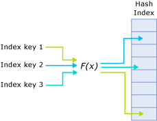
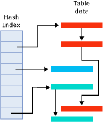

# Hash Indexes
  Indexes are used as entry points for memory-optimized tables. Reading rows from a table requires an index to locate the data in memory.  
  
 A hash index consists of a collection of buckets organized in an array. A hash function maps index keys to corresponding buckets in the hash index. The following figure shows three index keys that are mapped to three different buckets in the hash index. For illustration purposes the hash function name is f(x).  
  
   
  
 The hashing function used for hash indexes has the following characteristics:  
  
-   [!INCLUDE[ssNoVersion](../includes/ssnoversion-md.md)] has one hash function that is used for all hash indexes.  
  
-   The hash function is deterministic. The same index key is always mapped to the same bucket in the hash index.  
  
-   Multiple index keys may be mapped to the same hash bucket.  
  
-   The hash function is balanced, meaning that the distribution of index key values over hash buckets typically follows a Poisson distribution.  
  
     Poisson distribution is not an even distribution. Index key values are not evenly distributed in the hash buckets. For example, a Poisson distribution of *n* distinct index keys over *n* hash buckets results in approximately one third empty buckets, one third of the buckets containing one index key, and the other third containing two index keys. A small number of buckets will contain more than two keys.  
  
 If two index keys are mapped to the same hash bucket, there is a hash collision. A large number of hash collisions can have a performance impact on read operations.  
  
 The in-memory hash index structure consists of an array of memory pointers. Each bucket maps to an offset in this array. Each bucket in the array points to the first row in that hash bucket. Each row in the bucket points to the next row, thus resulting in a chain of rows for each hash bucket, as illustrated in the following figure.  
  
   
  
 The figure has three buckets with rows. The second bucket from the top contains the three red rows. The fourth bucket contains the single blue row. The bottom bucket contains the two green rows. These could be different versions of the same row.  
  
 For more information about indexes for memory-optimized tables, see [Guidelines for Using Indexes on Memory-Optimized Tables](../relational-databases/in-memory-oltp/memory-optimized-tables.md).  
  
## See Also  
 [Indexes on Memory-Optimized Tables](../../2014/database-engine/indexes-on-memory-optimized-tables.md)  
  
  
