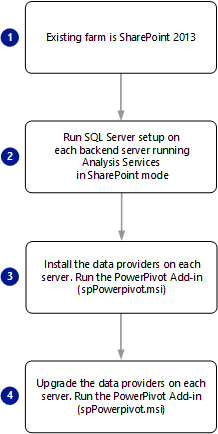

# Upgrade PowerPivot for SharePoint
  This topic summarizes the steps required to upgrade a deployment of [!INCLUDE[ssGeminiShort](../../includes/ssgeminishort-md.md)] to [!INCLUDE[ssGeminiLong](../../includes/ssgeminilong-md.md)]. The specific steps depend on the version of SharePoint your environment is currently running and include the PowerPivot for SharePoint Add-in (**spPowerPivot.msi**).  
  
 **[!INCLUDE[applies](../../includes/applies-md.md)]**  SharePoint 2010 | SharePoint 2013  
  
 For release notes, see [SQL Server 2014 Release Notes](https://go.microsoft.com/fwlink/?LinkID=296445).  
  

  
## Background  
  
-   If you are upgrading a multi-server SharePoint 2010 farm that has two or more [!INCLUDE[ssGeminiShort](../../includes/ssgeminishort-md.md)] instances, you must fully upgrade each server **before** continuing to the next server. A full upgrade includes running SQL Server Setup to upgrade [!INCLUDE[ssGeminiShort](../../includes/ssgeminishort-md.md)] program files, followed by SharePoint upgrade actions that configure the upgraded services. Server availability will be limited until you run upgrade actions in the appropriate PowerPivot Configuration Tool or Windows PowerShell.  
  
-   All instances of PowerPivot System Service and Analysis Services in a SharePoint 2010 farm must be the same version. For information on how to verify the version, see the section [Verify the Versions of PowerPivot Components and Services](#bkmk_verify_versions) in this topic.  
  
-   The PowerPivot configuration tools are one of the SQL Server shared features and all shared features upgrade at the same time. If during an upgrade process you select other SQL Server instances or features that require a shared feature upgrade, then the PowerPivot configuration tool will also be upgraded. You may have issues if the PowerPivot configuration tool is upgraded but your PowerPivot instance is not. For more information about SQL Server shared features, see [Upgrade to SQL Server 2014 Using the Installation Wizard &#40;Setup&#41;](../../database-engine/install-windows/upgrade-sql-server-using-the-installation-wizard-setup.md).  
  
-   The PowerPivot for SharePoint Add-in (**spPowerPivot.msi**) installs side by side with previous versions. For example the [!INCLUDE[ssCurrent](../../includes/sscurrent-md.md)] add-in installs to the folder `c:\Program Files\Microsoft SQL Server\120\Tools\PowerPivotTools`.  
  

  
##  <a name="bkmk_prereq"></a> Prerequisites  
 **Permissions**  
  
-   You must be a farm administrator to upgrade a PowerPivot for SharePoint installation. You must be a local administrator to run SQL Server Setup.  
  
-   You must have **db_owner** permissions on the farm configuration database.  
  
 **SQL Server:**  
  
-   If the existing PowerPivot installation is [!INCLUDE[ssKilimanjaro](../../includes/sskilimanjaro-md.md)], the [!INCLUDE[ssKilimanjaro](../../includes/sskilimanjaro-md.md)] Service Pack 2 (SP2) is required for an upgrade to [!INCLUDE[ssSQL14](../../includes/sssql14-md.md)] [!INCLUDE[ssGeminiShort](../../includes/ssgeminishort-md.md)].  
  
-   If the existing PowerPivot installation is [!INCLUDE[ssSQL11](../../includes/sssql11-md.md)], the [!INCLUDE[ssSQL11](../../includes/sssql11-md.md)] Service Pack 1 (SP1) is required for an upgrade to [!INCLUDE[ssSQL14](../../includes/sssql14-md.md)] [!INCLUDE[ssGeminiShort](../../includes/ssgeminishort-md.md)].  
  
 **SharePoint 2010:**  
  
-   If the existing installation is running SharePoint 2010, install the SharePoint 2010 Service Pack 2 before upgrading to [!INCLUDE[ssCurrent](../../includes/sscurrent-md.md)][!INCLUDE[ssGeminiShort](../../includes/ssgeminishort-md.md)]. For more information, see [Service Pack 2 for Microsoft SharePoint 2010](https://www.microsoft.com/download/details.aspx?id=39672). Use the PowerShell command `(Get-SPfarm).BuildVersion.ToString()` to verify the version. To reference the build version to release date, see [SharePoint 2010 Build Numbers](http://www.toddklindt.com/blog/Lists/Posts/Post.aspx?ID=224).  
  
 
  
##  <a name="bkmk_uprgade_sharepoint2013"></a> Upgrade an Existing SharePoint 2013 Farm  
 To upgrade [!INCLUDE[ssGeminiShort](../../includes/ssgeminishort-md.md)] deployed in SharePoint 2013, do the following:  
  
   
  
1.  Run [!INCLUDE[ssCurrent](../../includes/sscurrent-md.md)] Setup on backend server(s) that run [!INCLUDE[ssASnoversion](../../includes/ssasnoversion-md.md)] in SharePoint mode. If the server hosts multiple instances of [!INCLUDE[ssASnoversion](../../includes/ssasnoversion-md.md)], upgrade at least the **POWERPIVOT** instance. The following list is a summary of setup wizard steps related to a [!INCLUDE[ssGemini](../../includes/ssgemini-md.md)] upgrade:  
  
    1.  In the [!INCLUDE[ssNoVersion](../../includes/ssnoversion-md.md)] Setup Wizard, click **Installation**.  
  
    2.  Click **Upgrade from SQL Server.....**.  
  
    3.  On the **Select Instance** page, select the **POWERPIVOT** instance name and then click **Next**.  
  
    4.  For more information, see [Upgrade to SQL Server 2014 Using the Installation Wizard &#40;Setup&#41;](../../database-engine/install-windows/upgrade-sql-server-using-the-installation-wizard-setup.md)  
  
2.  Restart the server.  
  
3.  Run the [!INCLUDE[ssGemini](../../includes/ssgemini-md.md)] for SharePoint add-in (**spPowerPivot.msi**) on each server in the SharePoint 2013 farm to install the data providers. The exception is servers where you ran the SQL Server setup wizard, which also upgrades data providers. For more information, see [Install or Uninstall the PowerPivot for SharePoint Add-in &#40;SharePoint 2013&#41;](../../analysis-services/instances/install-windows/install-or-uninstall-the-power-pivot-for-sharepoint-add-in-sharepoint-2013.md).  
  
4.  **Run the PowerPivot for SharePoint 2013 Configuration** tool on one of the SharePoint application servers to configure the SharePoint farm with the updated solution files that the add-in installed. You cannot use Central SharePoint Administration for this step. For more information, see the following:  
  
    1.  From the Windows Start page, type **PowerPivot** and in the search results, click **PowerPivot for SharePoint 2013 Configuration**. Note the search may return both versions of the configuration tool.  
  
           
  
         Or  
  
         On the **Start** menu, point to **All Programs**, click [!INCLUDE[ssCurrentUI](../../includes/sscurrentui-md.md)], click **Configuration Tools**, and then click **PowerPivot for SharePoint 2013 Configuration Too**. Note that this tool is listed only when [!INCLUDE[ssGeminiShort](../../includes/ssgeminishort-md.md)] is installed on the local server.  
  
    2.  At startup, the configuration tool checks the upgrade status of the PowerPivot farm solution and PowerPivot web application solutions. If older versions of these solutions are detected, you will see the message "**Newer versions of the PowerPivot solution files have been detected. Please select the upgrade option to upgrade your farm**." Click **OK** to close the system validation message.  
  
    3.  Click **Upgrade Features, Services, Applications and Solutions**, and then click **OK**.  
  
    4.  Review the actions in the left pane task list and exclude any that you do not want the tool to perform. All actions are included by default. To remove an action, select it in the left task list, and then on the **Parameters** page, clear the **Include this action in the task list** checkbox.  
  
    5.  Optionally, review detailed information in the **Script** or **Output** tab.  
  
         The Output tab is a summary of the actions that will be performed by the tool. This information is saved in log files at `C:\Program Files\Microsoft SQL Server\120\Tools\PowerPivotTools\SPAddinConfiguration\Log`.  
  
         The Script tab shows the PowerShell cmdlets or references the PowerShell script files that the tool will run.  
  
    6.  Click **Validate** to check whether each action is valid. If **Validate** is not available, it means that all of the actions are valid for your system. If **Validate** is available, you might have modified an input value (for example, the Excel service application name), or the tool might have determined that a particular action cannot be performed. If an action cannot be performed, you must exclude it or fix the underlying conditions that cause the action to be flagged as invalid.  
  
        > [!IMPORTANT]  
        >  The first action, **Upgrade Farm Solution**, must always be processed first. It registers the PowerShell cmdlets that are used to configure the server. If you get an error on this action, do not continue. Instead, use the information provided by the error to diagnose and resolve the problem before processing additional actions in the task list.  
  
    7.  Click **Run** to perform all of the actions that are valid for this task. **Run** is available only after the validation check is passed. When you click **Run**, the following warning appears, reminding you that actions are processed in batch mode: "**All of the configuration settings that are flagged as valid in the tool will be applied to the SharePoint farm. Do you want to continue?**".  
  
    8.  Click **Yes** to continue.  
  
    9. Upgrading solutions and features in the farm can take several minutes to complete. During this time, connection requests for PowerPivot data **will fail** with errors similar to "**Unable to refresh data**" or "**An error has occurred trying to perform the requested action. Please try again**." After upgrade is finished, the server will become available and these errors will no longer occur.  
  
     For more information, see the following:  
  
    -   [PowerPivot Configuration Tools](../../analysis-services/power-pivot-sharepoint/power-pivot-configuration-tools.md)  
  
    -   [Configure or Repair PowerPivot for SharePoint 2013 &#40;PowerPivot Configuration Tool&#41;](../../analysis-services/power-pivot-sharepoint/configure-or-repair-power-pivot-for-sharepoint-2013.md)  
  
    -   [PowerPivot Configuration using Windows PowerShell](../../analysis-services/power-pivot-sharepoint/power-pivot-configuration-using-windows-powershell.md)  
  
    -   [PowerShell Reference for PowerPivot for SharePoint](/sql/analysis-services/powershell/powershell-reference-for-power-pivot-for-sharepoint)  
  
5.  Verify that upgrade succeeded by performing the post-upgrade steps and by checking the version of PowerPivot servers in the farm. For more information, see [Post-upgrade verification tasks](#verify) in this topic and the following section.  
  
 
  
##  <a name="bkmk_uprgade_sharepoint2010"></a> Upgrade an Existing SharePoint 2010 Farm  
 To upgrade [!INCLUDE[ssGeminiShort](../../includes/ssgeminishort-md.md)] deployed in SharePoint 2010, do the following:  
  
   
  
1.  Download [Service Pack 2 for Microsoft SharePoint 2010](https://www.microsoft.com/download/details.aspx?id=39672) and apply it on all servers in the farm. Verify that SharePoint SP2 installation succeeded. In Central Administration, on the Upgrade and Migration page, open the Check product and patch installation status page to view status messages related to SP2.  
  
2.  Verify that the SharePoint 2010 Administration Windows service is running.  
  
    ```  
    Get-Service | where {$_.displayname -like "*SharePoint*"}  
    ```  
  
3.  Verify the **SharePoint** services **SQL Server Analysis Services** and **SQL Server PowerPivot System Service** are started in SharePoint Central Administration or use the following PowerShell command:.  
  
    ```  
    get-SPserviceinstance | where {$_.typename -like "*sql*"}  
    ```  
  
4.  Verify the **Windows** service **SQL Server Analysis Services (PowerPivot)** is running.  
  
    ```  
    Get-Service | where {$_.displayname -like "*powerpivot*"}  
    ```  
  
5.  **Run [!INCLUDE[ssCurrent](../../includes/sscurrent-md.md)] Setup** on the first SharePoint application server that runs the **SQL Server Analysis Services (PowerPivot)** Windows service to upgrade the POWERPIVOT instance. On the Installation page of the SQL Server Setup Wizard, choose the upgrade option. For more information, see [Upgrade to SQL Server 2014 Using the Installation Wizard &#40;Setup&#41;](../../database-engine/install-windows/upgrade-sql-server-using-the-installation-wizard-setup.md).  
  
6.  **Restart the server** before running the configuration tool. This step ensures that any updates or prerequisites installed by SQL Server Setup are fully configured on the system.  
  
7.  **Run the PowerPivot Configuration Tool** on the first SharePoint application server that runs SQL Server Analysis Services (PowerPivot) service to upgrade the solutions and Web services in SharePoint. You cannot use Central Administration for this step.  
  
    1.  On the **Start** menu, point to **All Programs**, click [!INCLUDE[ssCurrentUI](../../includes/sscurrentui-md.md)], click **Configuration Tools**, and then click **PowerPivot Configuration Tool**. Note that this tool is listed only when [!INCLUDE[ssGeminiShort](../../includes/ssgeminishort-md.md)] is installed on the local server.  
  
    2.  At startup, the configuration tool checks the upgrade status of the PowerPivot farm solution and PowerPivot web application solutions. If older versions of these solutions are detected, you will see the message "Newer versions of the PowerPivot solution files have been detected. Please select the upgrade option to upgrade your farm." Click **OK** to close the message.  
  
    3.  Click **Upgrade Features, Services, Applications and Solutions**, and then click **OK** to continue.  
  
    4.  The following warning appears: "Workbooks in the PowerPivot Management Dashboard are about to be upgraded to the latest version. Any customizations you made to the existing workbooks will be lost. Do you want to continue?"  
  
         This warning refers to workbooks in the PowerPivot Management Dashboard that report on data refresh activity. If you customized these workbooks, any changes you made to those workbooks will be lost when existing files are replaced with newer versions.  
  
         Click **Yes** to overwrite the workbooks with newer versions. Otherwise, click **No** to return to the home page. Save the workbooks to a different location so that you have a copy, and then return to this step when you are ready to continue.  
  
         For more information about customizing workbooks used in the dashboard, see [Customizing the PowerPivot Management Dashboard](https://go.microsoft.com/fwlink/?linkID=229639).  
  
    5.  Review the actions in the task list and exclude any that you do not want the tool to perform. All actions are included by default. To remove an action, select it in the task list, and then clear the **Include this action in the task list** checkbox on the Parameters page.  
  
    6.  Optionally, review detailed information in the **Output** tab or **Script** tab.  
  
         The Output tab is a summary of the actions that will be performed by the tool. This information is saved in log files at `c:\Program Files\Microsoft SQL Server\120\Tools\PowerPivotTools\ConfigurationTool\Log`.  
  
         The Script tab shows the PowerShell cmdlets or references the PowerShell script files that the tool will run.  
  
    7.  Click **Validate** to check whether each action is valid. If **Validate** is not available, it means that all of the actions are valid for your system. If **Validate** is available, you might have modified an input value (for example, the Excel service application name), or the tool might have determined that a particular action cannot be performed. If an action cannot be performed, you must exclude it or fix the underlying conditions that cause the action to be flagged as invalid.  
  
        > [!IMPORTANT]  
        >  The first action, **Upgrade Farm Solution**, must always be processed first. It registers the PowerShell cmdlets that are used to configure the server. If you get an error on this action, do not continue. Instead, use the information provided by the error to diagnose and resolve the problem before processing additional actions in the task list.  
  
    8.  Click **Run** to perform all of the actions that are valid for this task. **Run** is available only after the validation check is passed. When you click **Run**, the following warning appears, reminding you that actions are processed in batch mode: "All of the configuration settings that are flagged as valid in the tool will be applied to the SharePoint farm. Do you want to continue?"  
  
    9. Click **Yes** to continue.  
  
    10. Upgrading solutions and features in the farm can take several minutes to complete. During this time, connection requests for PowerPivot data will fail with errors like "Unable to refresh data" or "An error has occurred trying to perform the requested action. Please try again." After upgrade is finished, the server will become available and these errors will no longer occur.  
  
8.  **Repeat the process** for each SQL Server Analysis Services (PowerPivot) service in the farm: 1) Run SQL Server setup 2) Run the PowerPivot Configuration tool.  
  
9. Verify that upgrade succeeded by performing the post-upgrade steps and by checking the version of PowerPivot servers in the farm. For more information, see [Post-upgrade verification tasks](#verify) in this topic and the following section.  
  
10. **Troubleshooting errors**  
  
     You can view error information in the Parameters pane for each action.  
  
     For problems related to solution deployment or retraction, verify the SharePoint 2010 Administrator service is started. This service runs the timer jobs that trigger configuration changes in a farm. If the service is not running, solution deployment or retraction will fail. Persistent errors indicate that an existing deployment or retraction job is already in the queue and blocking further action from the configuration tool.  
  
    1.  Start the SharePoint 2010 Management Shell as an administrator and then run the following command to view jobs in the queue:  
  
        ```  
        Stsadm -o enumdeployments  
        ```  
  
    2.  Review existing deployments for the following information: **Type** is Retraction or Deployment, **File** is powerpivotwebapp.wsp or powerpivotfarm.wsp.  
  
    3.  For deployments or retractions related to PowerPivot solutions, copy the GUID value for **JobId** and then paste it into the following command (use the Mark, Copy, and Paste commands on the Shell's Edit menu to copy the GUID):  
  
        ```  
        Stsadm -o canceldeployment -id "<GUID>"  
        ```  
  
    4.  Retry the task in the configuration tool by clicking **Validate** followed by **Run**.  
  
     For all other errors, check the ULS logs. For more information, see [Configure and View SharePoint Log Files  and Diagnostic Logging &#40;PowerPivot for SharePoint&#41;](../../analysis-services/power-pivot-sharepoint/configure-and-view-sharepoint-and-diagnostic-logging.md).  
  

  
##  <a name="bkmk_workbooks"></a> Workbooks  
 Upgrading a server does not necessarily upgrade the PowerPivot workbooks that run on it, but older workbooks created in the previous version of PowerPivot for Excel will continue to work as before, using the features available in that release. Workbooks remain functional because an upgraded server has the version of the Analysis Services OLE DB provider that was part of the previous installation.  
  
  
  
##  <a name="bkmk_datarefresh"></a> Data Refresh  
 Upgrade will impact data refresh operations. Scheduled data refresh on the server is available only for workbooks that match the server version. If you are hosting workbooks from the previous version, data refresh might no longer work for those workbooks. To re-enable data refresh, you must upgrade the workbooks. You can upgrade each workbook manually in PowerPivot for Excel, or enable the auto-upgrade for data refresh feature in SharePoint 2010. Auto-upgrade will upgrade a workbook to the current version prior to running data refresh, allowing data refresh operations to remain on schedule.  
  

  
##  <a name="bkmk_verify_versions"></a> Verify the Versions of PowerPivot Components and Services  
 All instances of [!INCLUDE[ssGemini](../../includes/ssgemini-md.md)] System Service and Analysis Services must be the same version. To verify that all server components are at the same version, check version information for the following:  
  
### Verify the version of PowerPivot Solutions and the PowerPivot System Service  
 Run the following PowerShell command:  
  
```  
Get-PowerPivotSystemService  
```  
  
 Verify the **CurrentSolutionVersion**. [!INCLUDE[ssCurrent](../../includes/sscurrent-md.md)] is version 12.0.\<major build>.\<minor build>  
  
### Verify the version of the Analysis Services Windows Service  
 If you upgraded only some of your [!INCLUDE[ssGeminiShort](../../includes/ssgeminishort-md.md)] servers in a SharePoint 2010 farm, the instance of [!INCLUDE[ssASnoversion](../../includes/ssasnoversion-md.md)] on un-upgraded servers will be older than the version expected in the farm. You will need to upgrade all of your servers to the same version in order for them to be usable. Use one of the following methods to verify the version of the SQL Server Analysis Services (PowerPivot) Windows service on each computer.  
  
 **Windows File Explorer**:  
  
1.  Navigate to the **Bin** folder for the [!INCLUDE[ssGemini](../../includes/ssgemini-md.md)] instance. For example `C:\Program Files\Microsoft SQL Server\MSAS12.POWERPIVOT\OLAP\bin`.  
  
2.  Right-click `msmdsrv.exe`, and select **Properties**.  
  
3.  Click **Details**.  
  
4.  [!INCLUDE[ssCurrent](../../includes/sscurrent-md.md)] file version should be 12.00.\<major build>.\<minor build>.  
  
5.  Verify that this number is identical to the PowerPivot solution and system service version.  
  
 **Service start information:**  
  
 When the PowerPivot service starts, it writes version information into the Windows event log.  
  
1.  Run Windows `eventvwr`  
  
2.  Create a filter for source `MSOLAP$POWERPIVOT`.  
  
3.  Look for an information level event similar to the following  
  
     Service started. Microsoft SQL Server Analysis Services 64 Bit Evaluation (x64) RTM **12.0.2000.8**.  
  
 **Use PowerShell to verify file version.**  
  
 You can use PowerShell to verify the product version. PowerShell is a good option if you want to script or automate version verification.  
  
```  
(get-childitem "C:\Program Files\Microsoft SQL Server\MSAS12.POWERPIVOT2000\OLAP\bin\msmdsrv.exe").VersionInfo  
```  
  
 The above PowerShell command returns information similar to the following:  
  
 ProductVersion   FileVersion           FileName  
  
 **12.0.2000.8** 2014.0120.200    C:\Program Files\Microsoft SQL Server\MSAS12.POWERPIVOT2000\OLAP\bin\msmdsrv.exe  
  
### Verify the MSOLAP Data Provider Version on SharePoint  
 Use the following instructions to check which versions of the Analysis Services OLE DB providers are trusted by Excel Services. You must be a farm or service application administrator to check the trusted data provider settings of Excel Services.  
  
1.  In Central Administration, in Application Management, click **Manage service applications**.  
  
2.  Click the name of the Excel Services service application, for example **ExcelServiceApp1**.  
  
3.  Click **Trusted Data Providers**. You should see MSOLAP.5 (Microsoft OLE DB Provider for OLAP Services 11.0). If you upgraded your [!INCLUDE[ssGeminiShort](../../includes/ssgeminishort-md.md)] installation, you will also see MSOLAP.4 from the previous version.  
  
4.  For more information, see [Add MSOLAP.5 as a Trusted Data Provider in Excel Services](../../analysis-services/power-pivot-sharepoint/add-msolap-5-as-a-trusted-data-provider-in-excel-services.md).  
  
 MSOLAP.4 is described as the Microsoft OLE DB Provider for OLAP Services 10.0. This version might be the default version from [!INCLUDE[ssKatmai](../../includes/sskatmai-md.md)] that is installed with Excel Services, or it might be the [!INCLUDE[ssKilimanjaro](../../includes/sskilimanjaro-md.md)] version. The default version that SharePoint installs does not support PowerPivot data access. You must have the [!INCLUDE[ssKilimanjaro](../../includes/sskilimanjaro-md.md)] version or later to connect to PowerPivot workbooks on SharePoint. To verify you have the [!INCLUDE[ssKilimanjaro](../../includes/sskilimanjaro-md.md)] version, use the instructions in the previous section that explain how to verify the version by viewing file properties.  
  
### Verify the ADOMD.NET Data Provider Version  
 Use the following instructions to check which version of ADOMD.NET is installed. You must be a farm or service application administrator to check the trusted data provider settings of Excel Services.  
  
1.  On your SharePoint application server, browse to `c:\Windows\Assembly`.  
  
2.  Sort by assembly name and find the **Microsoft.Analysis Services.Adomd.Client**.  
  
3.  Verify you have version 12.0.\<build number>.  
  
  
  
##  <a name="geminifarm"></a> Upgrading Multiple PowerPivot for SharePoint Servers in a SharePoint Farm  
 In a multi-server topology that includes more than one [!INCLUDE[ssGeminiShort](../../includes/ssgeminishort-md.md)] server, all server instances and components must be the same version. The server that runs the highest version of the software sets the level for all servers in the farm. If you upgrade just some of the servers, the ones that are running older versions of the software will become unavailable until they are also upgraded.  
  
 After you upgrade the first server, additional servers that are not yet upgraded **will become unavailable**. Availability is restored after all servers run at the same level.  
  
 SQL Server Setup upgrades the PowerPivot solution files in place on the physical computer, but to upgrade the solutions in use by the farm, you must use the PowerPivot Configuration Tool described in a previous section of this topic..  
  
 
  
##  <a name="qfe"></a> Applying a QFE to a PowerPivot instance in the farm  
 Patching a PowerPivot for SharePoint server updates existing program files with a newer version that includes a fix for a specific problem. When applying a QFE to a multi-server topology, there is no primary server that you must begin with. You can start with any server as long as you apply the same QFE to the other PowerPivot servers in the farm.  
  
 When you apply the QFE, you must also perform a configuration step that updates the server version information in the farm configuration database. The version of the patched server becomes the new expected version for the farm. Until the QFE is applied and configured across all machines, the PowerPivot for SharePoint instances that do not have the QFE will be unavailable to handle requests for PowerPivot data.  
  
 To ensure the QFE is applied and configured correctly, follow these instructions:  
  
1.  Install the patch using the instructions that are provided with the QFE.  
  
2.  Start the PowerPivot Configuration Tool.  
  
3.  Click **Upgrade Features, Services, Applications and Solutions**, and then click **OK**.  
  
4.  Review the actions that are included in the upgrade task, and then click **Validate**.  
  
5.  Click **Run** to apply the actions.  
  
6.  Repeat for additional PowerPivot for SharePoint instances in the farm.  
  
    > [!IMPORTANT]  
    >  In a multi-server deployment, be sure to both patch and configure each instance before continuing to the next machine. The PowerPivot Configuration Tool must complete the upgrade task for the current instance before you move on to the next instance.  
  
 To check version information for services in the farm, use the **Check product and patch installation status** page in the Upgrade and Patch Management section in Central Administration.  
  
##  <a name="verify"></a> Post-upgrade verification tasks  
 After upgrade is complete, use the following steps to verify the server is operational.  
  
|Task|Link|  
|----------|----------|  
|Verify the service is running on all computers that run PowerPivot for SharePoint.|[Start or Stop a PowerPivot for SharePoint Server](../../analysis-services/power-pivot-sharepoint/start-or-stop-a-power-pivot-for-sharepoint-server.md)|  
|Verify feature activation at the site collection level.|[Activate PowerPivot Feature Integration for Site Collections in Central Administration](../../analysis-services/power-pivot-sharepoint/activate-power-pivot-integration-for-site-collections-in-ca.md)|  
|Verify individual PowerPivot workbooks are loading properly by opening a workbook and clicking on filters and slicers to initiate a query.|Check for the presence of cached files on the hard drive. A cached file confirms that the data file was loaded on that physical server. Look for cached files in the c:\Program Files\Microsoft SQL Server\MSAS12.POWERPIVOT\OLAP\Backup folder.|  
|Test data refresh on selected workbooks that are configured for data refresh.|The easiest way to test data refresh is to modify a data refresh schedule, choosing the **Also refresh as soon as possible** checkbox so that data refresh runs immediately. This step will determine whether data refresh is successful for the current workbook. Repeat these steps for other frequently used workbooks to ensure that data refresh is functional. For more information about scheduling data refresh, see [Schedule a Data Refresh &#40;PowerPivot for SharePoint&#41;](../../../2014/analysis-services/schedule-a-data-refresh-powerpivot-for-sharepoint.md).|  
|Over time, monitor the data refresh reports in PowerPivot Management Dashboard to confirm there are no data refresh errors.|[PowerPivot Management Dashboard and Usage Data](../../analysis-services/power-pivot-sharepoint/power-pivot-management-dashboard-and-usage-data.md)|  
  
 For more information about how to configure PowerPivot settings and features, see [PowerPivot Server Administration and Configuration in Central Administration](../../analysis-services/power-pivot-sharepoint/power-pivot-server-administration-and-configuration-in-central-administration.md).  
  
 For step-by-step instructions that guide you through all of the post-installation configuration tasks, see [Initial Configuration &#40;PowerPivot for SharePoint&#41;](../../../2014/sql-server/install/initial-configuration-powerpivot-for-sharepoint.md).  
  

  
## See Also  
 [Features Supported by the Editions of SQL Server 2014](../../../2014/getting-started/features-supported-by-the-editions-of-sql-server-2014.md)   
 [PowerPivot for SharePoint 2010 Installation](../../../2014/sql-server/install/powerpivot-for-sharepoint-2010-installation.md)  
  
  
