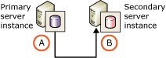
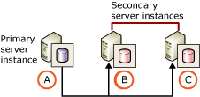

# Upgrade Log Shipping to SQL Server 2014 (Transact-SQL)
  It is possible to preserve log shipping configurations when upgrading from [!INCLUDE[ssVersion2005](../../includes/ssversion2005-md.md)], [!INCLUDE[ssKatmai](../../includes/sskatmai-md.md)], [!INCLUDE[ssKilimanjaro](../../includes/sskilimanjaro-md.md)], or [!INCLUDE[ssSQL11](../../includes/sssql11-md.md)] to [!INCLUDE[ssCurrent](../../includes/sscurrent-md.md)]. This topic describes alternative scenarios and best practices for upgrading a log shipping configuration.  
  
> [!NOTE]  
>  [Backup compression](../../relational-databases/backup-restore/backup-compression-sql-server.md) was introduced in [!INCLUDE[ssEnterpriseEd10](../../includes/ssenterpriseed10-md.md)]. An upgraded log shipping configuration uses the **backup compression default** server-level configuration option to control whether backup compression is used for the transaction log backup files. The backup compression behavior of log backups can be specified for each log shipping configuration. For more information, see [Configure Log Shipping &#40;SQL Server&#41;](configure-log-shipping-sql-server.md).  
  
  
##  <a name="ProtectData"></a> Protect Your Data Before the Upgrade  
 As a best practice, we recommend that you protect your data before a log shipping upgrade.  
  
 **To protect your data**  
  
1.  Perform a full database backup on every primary database.  
  
     For more information, see [Create a Full Database Backup &#40;SQL Server&#41;](../../relational-databases/backup-restore/create-a-full-database-backup-sql-server.md).  
  
2.  Run the [DBCC CHECKDB](/sql/t-sql/database-console-commands/dbcc-checkdb-transact-sql) command on every primary database.  
  
##  <a name="UpgradeMonitor"></a> Upgrading the Monitor Server Instance  
 The monitor server instance, if any, can be upgraded at any time.  
  
 While the monitor server is being upgraded, the log shipping configuration continues to work, but its status is not recorded in the tables on the monitor. Any alerts that have been configured will not be triggered while the monitor server is being upgraded. After the upgrade, you can update the information in the monitor tables by executing the [sp_refresh_log_shipping_monitor](/sql/relational-databases/system-stored-procedures/sp-refresh-log-shipping-monitor-transact-sql) system stored procedure.  
  
##  <a name="UpgradeSingleSecondary"></a> Upgrading Log Shipping Configurations with a Single Secondary Server  
 The upgrade process described in this section assumes a configuration consisting of the primary server and only one secondary server. This configuration is represented in the following illustration, which shows a primary server instance, A, and a single secondary server instance, B.  
  
   
  
 For information about upgrading multiple secondary servers, see [Upgrading Multiple Secondary Server Instances](#MultipleSecondaries), later in this topic.  
 
  
###  <a name="UpgradeSecondary"></a> Upgrading the Secondary Server Instance  
 The upgrade process involves upgrading the secondary server instances of a [!INCLUDE[ssVersion2005](../../includes/ssversion2005-md.md)] or higher log shipping configuration to [!INCLUDE[ssCurrent](../../includes/sscurrent-md.md)] before upgrading the primary server instance. Always upgrade the secondary server instance first. If the primary server were upgraded before a secondary server, log shipping would fail because a backup created on a newer version of [!INCLUDE[ssNoVersion](../../includes/ssnoversion-md.md)] cannot be restored on an older version of [!INCLUDE[ssNoVersion](../../includes/ssnoversion-md.md)].  
  
 Log shipping continues throughout the upgrade process because the upgraded secondary servers continue to restore the log backups from the [!INCLUDE[ssVersion2005](../../includes/ssversion2005-md.md)] or higher primary server. The process for upgrading the secondary server instances depends partly on whether the log shipping configuration possesses multiple secondary servers. For more information, see [Upgrading Multiple Secondary Server Instances](#MultipleSecondaries), later in this topic.  
  
 While the secondary server instance is being upgraded, the log shipping copy and restore jobs do not run, so unrestored transaction log backups will accumulate. The amount of accumulation depends on the frequency of scheduled backup on the primary server. Also, if a separate monitor server has been configured, alerts might be raised indicating restores have not been performed for longer than the configured interval.  
  
 Once the secondary server has been upgraded, the log shipping agents jobs resume and continue to copy and restore log backups from the primary server instance, server A. The amount of time required for the secondary server to bring the secondary database up to date varies, depending on the time taken to upgrade the secondary server and the frequency of the backups on the primary server.  
  
> [!NOTE]  
>  During the server upgrade, the secondary database is not upgraded to a [!INCLUDE[ssCurrent](../../includes/sscurrent-md.md)] database. It will get upgraded only if it is brought online.  
  
> [!IMPORTANT]  
>  The RESTORE WITH STANDBY option is not supported for a database that requires upgrading. If an upgraded secondary database has been configured by using RESTORE WITH STANDBY, transaction logs can no longer be restored after upgrade. To resume log shipping on that secondary database, you will need to set up log shipping again on that standby server. For more information about the STANDBY option, see [RESTORE Arguments &#40;Transact-SQL&#41;](/sql/t-sql/statements/restore-statements-arguments-transact-sql).  
  
###  <a name="UpgradePrimary"></a> Upgrading the Primary Server Instance  
 When planning an upgrade, a significant consideration is the amount of time that your database will be unavailable. The simplest upgrade scenario involves the database being unavailable while you upgrade the primary server (scenario 1, below).  
  
 At the cost of a more complicated upgrade process, you can maximize your database availability by failing over the [!INCLUDE[ssVersion2005](../../includes/ssversion2005-md.md)] or higher primary server to a [!INCLUDE[ssCurrent](../../includes/sscurrent-md.md)] secondary server before upgrading the original primary server (scenario 2, below). There are two variants of the failover scenario. You can switch back to the original primary server and keep the original log shipping configuration. Alternatively, you can remove the original log shipping configuration before upgrading the original primary server and later create a new configuration using the new primary server. This section describes both these scenarios.  
  
> [!IMPORTANT]  
>  Be sure to upgrade the secondary server instance before upgrading the primary server instance. For more information, see [Upgrading the Secondary Server Instance](#UpgradeSecondary), earlier in this topic.  
  
  
####  <a name="Scenario1"></a> Scenario 1: Upgrade Primary Server Instance Without Failover  
 This is the simpler scenario, but it causes more downtime than using failover. The primary server instance is simply upgraded and the database is unavailable during this upgrade.  
  
 Once the server is upgraded, the database is automatically brought back online, which causes it to be upgraded. After the database is upgraded, the log shipping jobs resume.  
  
#### Scenario 2: Upgrade Primary Server Instance with Failover  
 This scenario maximizes availability and minimizes downtime. It utilizes a controlled failover to the secondary server instance, which keeps the database available while the original primary server instance is upgraded. Downtime is limited to the relatively short time required to fail over, rather than the time required to upgrade the primary server instance.  
  
 Upgrading the primary server instance with failover involves three general procedures: performing a controlled failover to the secondary server, upgrading the original primary server instance to [!INCLUDE[ssCurrent](../../includes/sscurrent-md.md)], and setting up log shipping on a [!INCLUDE[ssCurrent](../../includes/sscurrent-md.md)] primary server instance. These procedures are described in this section.  
  
> [!IMPORTANT]  
>  If you plan to have the secondary server instance as the new primary server instance, you need to remove the log shipping configuration. Log shipping will need to be reconfigured from the new primary to the new secondary, after the original primary server instance has been upgraded. For more information, see [Remove Log Shipping &#40;SQL Server&#41;](remove-log-shipping-sql-server.md).  
  
  
#####  <a name="Procedure1"></a> Procedure 1: Perform a Controlled Failover to the Secondary Server  
 Controlled failover to the secondary server:  
  
1.  Manually perform a [tail-log backup](../../relational-databases/backup-restore/tail-log-backups-sql-server.md) of the transaction log on the primary database specifying WITH NORECOVERY. This log backup captures any log records that have not been backed up yet and takes the database offline. Note that while the database is offline, the log shipping backup job will fail.  
  
     The following example creates a tail log backup of the `AdventureWorks` database on the primary server. The backup file is named `Failover_AW_20080315.trn`:  
  
    ```  
    BACKUP LOG AdventureWorks   
      TO DISK = N'\\FileServer\LogShipping\AdventureWorks\Failover_AW_20080315.trn'   
       WITH NORECOVERY;  
    GO  
    ```  
  
     We recommend that you use a distinct file naming convention to differentiate the manually-created backup file from the backup files created by the log shipping backup job.  
  
2.  On the secondary server:  
  
    1.  Ensure that all backups taken automatically by the log shipping backup jobs have been applied. To check which backup jobs have been applied, use the [sp_help_log_shipping_monitor](/sql/relational-databases/system-stored-procedures/sp-help-log-shipping-monitor-transact-sql) system stored procedure on the monitor server or on the primary and secondary servers. The same file should be listed in the **last_backup_file**, **last_copied_file**, and **last_restored_file** columns. If any of the backup files have not been copied and restored, manually invoke the agent copy and restore jobs for the log shipping configuration.  
  
         For information about starting a job, see [Start a Job](../../ssms/agent/start-a-job.md).  
  
    2.  Copy your the final log backup file that you created in step 1 from the file share to the local location that is used by log shipping on the secondary server.  
  
    3.  Restore the final log backup specifying WITH RECOVERY to bring the database online. As part of being brought online, the database will upgraded to [!INCLUDE[ssCurrent](../../includes/sscurrent-md.md)].  
  
         The following example restores the tail log backup of the `AdventureWorks` database on the secondary database. The example uses the WITH RECOVERY option, which brings the database online:  
  
        ```  
        RESTORE LOG AdventureWorks   
          FROM DISK = N'c:\logshipping\Failover_AW_20080315.trn'   
           WITH RECOVERY;  
        GO  
        ```  
  
        > [!NOTE]  
        >  For a configuration that contains more than one secondary server, there are additional considerations. For more information, see [Upgrading Multiple Secondary Server Instances](#MultipleSecondaries), later in this topic.  
  
    4.  Fail over the database by redirecting clients from the original primary server (server A) to the online secondary server (server B).  
  
    5.  Take care that the transaction log of the secondary database does not fill while the database is online. To prevent the transaction log from filling, you might need to back it up. If so, we recommend that you back it up to a shared location, a *backup share*, to make the backups available for restoring on the other server instance.  
  
#####  <a name="Procedure2 "></a> Procedure 2: Upgrade the Original Primary Server Instance to [!INCLUDE[ssCurrent](../../includes/sscurrent-md.md)]  
 After you upgrade the original primary server instance to [!INCLUDE[ssCurrent](../../includes/sscurrent-md.md)], the database will still be offline and in the format.  
  
#####  <a name="Procedure3"></a> Procedure 3: Set Up Log Shipping on [!INCLUDE[ssCurrent](../../includes/sscurrent-md.md)]  
 The rest of the upgrade process depends on whether log shipping is still configured, as follows:  
  
-   If you have kept the [!INCLUDE[ssVersion2005](../../includes/ssversion2005-md.md)]or higher log shipping configuration, switch back to the original primary server instance. For more information, see [To Switch Back to the Original Primary Server Instance](#SwitchToOrigPrimary), later in this section.  
  
-   If you removed the log shipping configuration before failing over, create a new log shipping configuration in which the original secondary server instance is the new primary server instance. For more information, see [To Keep the Old Secondary Server Instance As the New Primary Server Instance](#KeepOldSecondaryAsNewPrimary), later in this section.  
  
######  <a name="SwitchToOrigPrimary"></a> To Switch Back to the Original Primary Server Instance  
  
1.  On the interim primary server (server B), back up the tail of the log using WITH NORECOVERY to create a tail-log backup and take the database offline. The tail log backup is named `Switchback_AW_20080315.trn`.For example:  
  
    ```  
    BACKUP LOG AdventureWorks   
      TO DISK = N'\\FileServer\LogShipping\AdventureWorks\Switchback_AW_20080315.trn'   
       WITH NORECOVERY;  
    GO  
    ```  
  
2.  If any transaction log backups were taken on the interim primary database, other than the tail backup that you created in step 1, restore those log backups using WITH NORECOVERY to the offline database on the original primary server (server A). The database is upgraded to [!INCLUDE[ssCurrent](../../includes/sscurrent-md.md)] format when the first log backup is restored.  
  
3.  Restore the tail-log backup, `Switchback_AW_20080315.trn`, on the original primary database (on server A) using WITH RECOVERY to bring the database online.  
  
4.  Fail over back to the original primary database (on server A) by redirecting clients to the online secondary server from the original primary server.  
  
 After the database comes online, the original log shipping configuration will resume.  
  
######  <a name="KeepOldSecondaryAsNewPrimary"></a> To Keep the Old Secondary Server Instance As the New Primary Server Instance  
 Establish a new log shipping configuration using the old secondary server instance, B, as the primary server and the old primary server instance, A, as the new secondary server, as follows:  
  
> [!IMPORTANT]  
>  The old log shipping configuration should have been removed from the original primary server at the start of the process before taking the manual transaction log backup that took the database offline.  
  
1.  To avoid performing a complete backup and restore of the database on the new secondary server (server A), apply the log backups from the new primary database to the new secondary database. In the example configuration, this involves restoring the log backups taken on server B to the database on server A.  
  
2.  Back up the log from the new primary database (on server B).  
  
3.  Restore the log backups to the new secondary server instance (server A) using WITH NORECOVERY. The first restore operation updates the database to [!INCLUDE[ssCurrent](../../includes/sscurrent-md.md)].  
  
4.  Configure log shipping with the former secondary server (server B) as the primary server instance.  
  
    > [!IMPORTANT]  
    >  If you use [!INCLUDE[ssManStudioFull](../../includes/ssmanstudiofull-md.md)], specify that the secondary database is already initialized.  
  
     For more information, see [Configure Log Shipping &#40;SQL Server&#41;](configure-log-shipping-sql-server.md).  
  
5.  Fail over the database by redirecting clients from the original primary server (server A) to the online secondary server (server B).  
  
    > [!IMPORTANT]  
    >  When you failover to a new primary database, you should ensure that its metadata is consistent with the metadata of the original primary database. For more information, see [Manage Metadata When Making a Database Available on Another Server Instance &#40;SQL Server&#41;](../../relational-databases/databases/manage-metadata-when-making-a-database-available-on-another-server.md).  
  
##  <a name="MultipleSecondaries"></a> Upgrading Multiple Secondary Server Instances  
 This configuration is represented in the following illustration, which shows a primary server instance, A, and two secondary server instances, B and C.  
  
   
  
 This section discusses how to upgrade using a failover and then switching back to the original primary server. When upgrading the primary instance with failover the process is more complex when there are multiple secondary server instances. In the following procedure, after all the secondary servers are upgraded, the primary server is failed over to one of the upgraded secondary databases. The original primary server is upgraded, and log shipping is failed over back to it.  
  
> [!IMPORTANT]  
>  Always upgrade all the secondary server instances before you upgrade the primary server.  
  
 **To upgrade using a failover and then switching back to original primary server**  
  
1.  Upgrade all the secondary server instances (server B and server C).  
  
2.  Obtain the tail of the transaction log of the primary database (on server A), and take the database offline, by backing up the transaction log using WITH NORECOVERY.  
  
3.  On the secondary server to which you plan to fail over (server B), bring the secondary database online, by restoring the log backup using WITH RECOVERY.  
  
4.  On every other secondary server (server C), leave the secondary database offline by restoring the log backup using WITH NORECOVERY.  
  
    > [!NOTE]  
    >  The log shipping copy and restore jobs will run on the secondary servers, but the jobs will do nothing because new log-backup files will not be placed on the backup share.  
  
5.  Fail over the database by redirecting clients from the original primary server (server A) to the online secondary server (server B). The online database becomes an interim primary server, keeping the database available while the original primary server is offline (server A).  
  
6.  Upgrade the original primary server (server A).  
  
7.  On the database to which you failed over-the interim primary database (on server B), manually back up the transaction log using WITH NORECOVERY. This takes the database offline.  
  
8.  Restore all transaction log backups that you created on the interim primary database (on server B) to every other secondary database (on server C) using WITH NORECOVERY. This allows log shipping to continue from the original primary database after its upgrade, without requiring a full database restore on each secondary database.  
  
9. Restore the transaction log from the interim primary server (server B) to the original primary database (on server A) using WITH RECOVERY.  
  
##  <a name="Redeploying"></a> Redeploying Log Shipping  
 If you do not want to migrate your log shipping configuration using one of the procedures shown above, you can redeploy log shipping from scratch by reinitializing your secondary database with a full backup and restore of the primary database. This may be a desirable option if you have a small database or if high availability is not crucial during the upgrade procedure.  
  
 For information about enabling log shipping, see [Configure Log Shipping &#40;SQL Server&#41;](configure-log-shipping-sql-server.md).  
  
## See Also  
 [Transaction Log Backups &#40;SQL Server&#41;](../../relational-databases/backup-restore/transaction-log-backups-sql-server.md)   
 [Apply Transaction Log Backups &#40;SQL Server&#41;](../../relational-databases/backup-restore/apply-transaction-log-backups-sql-server.md)   
 [Log Shipping Tables and Stored Procedures](log-shipping-tables-and-stored-procedures.md)  
  
  
