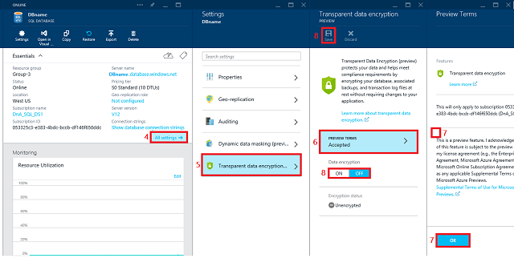

# Transparent Data Encryption with Azure SQL Database
  [!INCLUDE[ssSDSfull](../includes/sssdsfull-md.md)] transparent data encryption (preview) helps protect against the threat of malicious activity by performing real-time encryption and decryption of the database, associated backups, and transaction log files at rest without requiring changes to the application.  
  
 TDE encrypts the storage of an entire database by using a symmetric key called the database encryption key. In [!INCLUDE[ssSDS](../includes/sssds-md.md)] the database encryption key is protected by a built-in server certificate. The built-in server certificate is unique for each [!INCLUDE[ssSDS](../includes/sssds-md.md)] server. If a database is in a GeoDR relationship, it is protected by a different key on each server. If 2 databases are connected to the same server, they share the same built-in certificate. [!INCLUDE[msCoName](../includes/msconame-md.md)] automatically rotates these certificates at least every 90 days. For a general description of TDE, see [Transparent Data Encryption &#40;TDE&#41;](../relational-databases/security/encryption/transparent-data-encryption.md).  
  
 [!INCLUDE[ssSDSfull](../includes/sssdsfull-md.md)] does not support Azure Key Vault integration with TDE. [!INCLUDE[ssNoVersion](../includes/ssnoversion-md.md)] running on an Azure virtual machine can use an asymmetric key from the Key Vault. For more information, see [Example A: Transparent Data Encryption by Using an Asymmetric Key from the Key Vault](../relational-databases/security/encryption/extensible-key-management-using-azure-key-vault-sql-server.md#ExampleA).  
  
||  
|-|  
|**Applies to**: [!INCLUDE[sqldbesa](../includes/sqldbesa-md.md)] ([Preview in some regions](http://azure.microsoft.com/documentation/articles/sql-database-preview-whats-new/?WT.mc_id=TSQL_GetItTag)).|  
  
> [!IMPORTANT]  
>  This is currently a preview feature. I acknowledge and agree that implementation of [!INCLUDE[ssSDS](../includes/sssds-md.md)] transparent data encryption in my database(s) is subject to the preview terms in my license agreement (e.g. the Enterprise Agreement, Microsoft Azure Agreement, or Microsoft Online Subscription Agreement), as well as any applicable [Supplemental Terms of Use for Microsoft Azure Preview](http://azure.microsoft.com/support/legal/preview-supplemental-terms/).  
  
 The preview of status of TDE applies even in the subset of geographic regions where version family V12 of [!INCLUDE[ssSDS](../includes/sssds-md.md)] is announced as now being in general availability status. TDE for [!INCLUDE[ssSDS](../includes/sssds-md.md)] is not intended for use in production databases until [!INCLUDE[msCoName](../includes/msconame-md.md)] announces that TDE is promoted from preview to GA. For more information about [!INCLUDE[ssSDS](../includes/sssds-md.md)] V12, see [What's new in Azure SQL Database](http://azure.microsoft.com/documentation/articles/sql-database-preview-whats-new/).  
  
##  <a name="Permissions"></a> Permissions  
 To sign up for the preview and to configure TDE through the Azure portal, by using the REST API, or by using PowerShell, you must be connected as the Azure Owner, Contributor, or SQL Security Manager.  
  
 To configure TDE by using [!INCLUDE[tsql](../includes/tsql-md.md)] requires the following:  
  
-   You must be already signed up for the TDE preview.  
  
-   To create the database encryption key you must be a [!INCLUDE[ssSDS](../includes/sssds-md.md)] administrator or you must be a member of the **dbmanager** role in the master database and have the **CONTROL** permission on the database.  
  
-   To execute the ALTER DATABASE statement with the SET option only requires membership in the **dbmanager** role.  
  
##  <a name="Preview"></a> Sign Up for the Preview of TDE and Enable TDE on a Database  
  
1.  Visit the Azure Portal at [https://portal.azure.com](https://portal.azure.com) and sign-in with your Azure Administrator or Contributor account.  
  
2.  On the left banner, click to **BROWSE**, and then click **SQL databases**.  
  
3.  With **SQL databases** selected in the left pane, click your user database.  
  
4.  In the database blade, click **All settings**.  
  
5.  In the **Settings** blade, click **Transparent data encryption (preview)** part to open the **Transparent data encryption PREVIEW** blade. If you have not already signed up for the TDE preview, the data encryption settings will be disabled until you complete signup.  
  
6.  Click **PREVIEW TERMS**.  
  
7.  Read the terms of the preview, and if you agree to the terms, select the **Transparent Data encryptionPreview terms** check box, and then click **OK** near the bottom of the page. Returning to the **Data encryptionPREVIEW** blade, where the **Data encryption** button should now be enabled.  
  
8.  In the **Data encryption PREVIEW** blade, move the **Data encryption** button to **On**, and then click **Save** (at the top of the page) to apply the setting. The **Encryption status** will approximate the progress of the transparent data encryption.  
  
       
  
     You can also monitor the progress of encryption by connecting to [!INCLUDE[ssSDS](../includes/sssds-md.md)] using a query tool such as [!INCLUDE[ssManStudioFull](../includes/ssmanstudiofull-md.md)] as a database user with the **VIEW DATABASE STATE** permission. Query the `encryption_state` column of the [sys.dm_database_encryption_keys](/sql/relational-databases/system-dynamic-management-views/sys-dm-database-encryption-keys-transact-sql) view.  
  
##  <a name="Encrypt"></a> Enabling TDE on [!INCLUDE[ssSDS](../includes/sssds-md.md)] by Using Transact-SQL  
 The following steps, assume you have already signed up for the preview.  
  
###  <a name="TsqlProcedure"></a>  
  
1.  Connect to the database using a login that is an administrator or a member of the **dbmanager** role in the master database.  
  
2.  Execute the following statements to create a database encryption key and encrypt the database.  
  
    ```  
    -- Create the database encryption key that will be used for TDE.  
    CREATE DATABASE ENCRYPTION KEY   
    WITH ALGORITHM = AES_256   
    ENCRYPTION BY SERVER CERTIFICATE ##MS_TdeCertificate##;  
  
    -- Enable encryption  
    ALTER DATABASE [AdventureWorks] SET ENCRYPTION ON;  
    GO  
    ```  
  
3.  To monitor the progress of encryption on [!INCLUDE[ssSDS](../includes/sssds-md.md)], database users with the **VIEW DATABASE STATE** permission can query the `encryption_state` column of the [sys.dm_database_encryption_keys](/sql/relational-databases/system-dynamic-management-views/sys-dm-database-encryption-keys-transact-sql) view.  
  
## Enabling TDE on SQL Database by Using PowerShell  
 Using the Azure PowerShell you can run the following command to turn TDE on/off. You do have to connect your account to the PS window before running the command. The following steps, assume you have already signed up for the preview. For additional information about PowerShell, see [How to install and configure Azure PowerShell](http://azure.microsoft.com/documentation/articles/powershell-install-configure/).  
  
1.  To enable TDE, return the TDE status, and view the encryption activity.  
  
    ```  
    PS C:\> Switch-AzureMode -Name AzureResourceManager  
  
    PS C:\> Set-AzureSqlDatabaseTransparentDataEncryption -ServerName "myserver" -ResourceGroupName "Default-SQL-WestUS" -DatabaseName "database1" -State "Enabled"  
  
    PS C:\> Get-AzureSqlDatabaseTransparentDataEncryption -ServerName "myserver" -ResourceGroupName "Default-SQL-WestUS" -DatabaseName "database1"  
  
    PS C:\> Get-AzureSqlDatabaseTransparentDataEncryptionActivity -ServerName "myserver" -ResourceGroupName "Default-SQL-WestUS" -DatabaseName "database1"  
  
    ```  
  
2.  To disable TDE:  
  
    ```  
    PS C:\> Set-AzureSqlDatabaseTransparentDataEncryption -ServerName "myserver" -ResourceGroupName "Default-SQL-WestUS" -DatabaseName "database1" -State "Disabled"  
  
    PS C:\> Switch-AzureMode -Name AzureServiceManagement  
    ```  
  
##  <a name="Decrypt"></a> Decrypting a TDE Protected Database on [!INCLUDE[ssSDS](../includes/sssds-md.md)]  
  
#### To Disable TDE by Using the Azure Portal  
  
1.  Visit the Azure Portal at [https://portal.azure.com](https://portal.azure.com) and sign-in with your Azure Administrator or Contributor account.  
  
2.  On the left banner, click to **BROWSE**, and then click **SQL databases**.  
  
3.  With **SQL databases** selected in the left pane, click your user database.  
  
4.  In the database blade, click **All settings**.  
  
5.  In the **Settings** blade, click **Transparent data encryption (preview)** part to open the **Transparent data encryption PREVIEW** blade.  
  
6.  In the **Transparent data encryption PREVIEW** blade, move the **Data encryption** button to **Off**, and then click **Save** (at the top of the page) to apply the setting. The **Encryption status** will approximate the progress of the transparent data decryption.  
  
     You can also monitor the progress of decryption by connecting to [!INCLUDE[ssSDS](../includes/sssds-md.md)] using a query tool such as [!INCLUDE[ssManStudio](../includes/ssmanstudio-md.md)] as a database user with the **VIEW DATABASE STATE** permission. Query the `encryption_state` column of the [sys.dm_database_encryption_keys](/sql/relational-databases/system-dynamic-management-views/sys-dm-database-encryption-keys-transact-sql)view.  
  
#### To Disable TDE by Using Transact-SQL  
  
1.  Connect to the database using a login that is an administrator or a member of the **dbmanager** role in the master database.  
  
2.  Execute the following statements to decrypt the database.  
  
    ```  
    -- Enable encryption  
    ALTER DATABASE [AdventureWorks] SET ENCRYPTION OFF;  
    GO  
    ```  
  
3.  To monitor the progress of encryption on [!INCLUDE[ssSDS](../includes/sssds-md.md)], database users with the **VIEW DATABASE STATE** permission can query the `encryption_state` column of the [sys.dm_database_encryption_keys](/sql/relational-databases/system-dynamic-management-views/sys-dm-database-encryption-keys-transact-sql) view.  
  
##  <a name="Working"></a> Working with TDE Protected Databases on [!INCLUDE[ssSDS](../includes/sssds-md.md)]  
 You do not need to decrypt databases for operations within Azure. The TDE settings on the source database or primary database are transparently inherited on the target. This includes operations involving:  
  
-   Geo-Restore  
  
-   Self-Service Point in Time Restore  
  
-   Restore a Deleted Database  
  
-   Active Geo_Replication  
  
-   Creating a Database Copy  
  
##  <a name="Moving"></a> Moving a TDE Protected Database on using .Bacpac Files  
 When exporting a TDE protected database using the Export Database function in the [!INCLUDE[ssSDSfull](../includes/sssdsfull-md.md)] Portal or the [!INCLUDE[ssNoVersion](../includes/ssnoversion-md.md)] Import and Export Wizard, the content of the database is not encrypted. The content is stored in .bacpac files which are not encrypted.  Be sure to protect the .bacpac files appropriately and enable TDE once import of the new database is completed.  
  
## Related SQL Server Topic  
 [Enable TDE Using EKM](../relational-databases/security/encryption/enable-tde-on-sql-server-using-ekm.md)  
  
## See Also  
 [Transparent Data Encryption &#40;TDE&#41;](../relational-databases/security/encryption/transparent-data-encryption.md)   
 [CREATE CREDENTIAL &#40;Transact-SQL&#41;](/sql/t-sql/statements/create-credential-transact-sql)   
 [CREATE ASYMMETRIC KEY &#40;Transact-SQL&#41;](/sql/t-sql/statements/create-asymmetric-key-transact-sql)   
 [CREATE DATABASE ENCRYPTION KEY &#40;Transact-SQL&#41;](/sql/t-sql/statements/create-database-encryption-key-transact-sql)   
 [ALTER DATABASE &#40;Transact-SQL&#41;](/sql/t-sql/statements/alter-database-transact-sql)   
 [ALTER DATABASE SET Options &#40;Transact-SQL&#41;](/sql/t-sql/statements/alter-database-transact-sql-set-options)  
  
  
