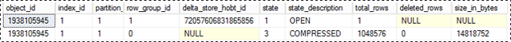

# Using Clustered Columnstore Indexes
  Tasks for using clustered columnstore indexes in [!INCLUDE[ssNoVersion](../includes/ssnoversion-md.md)].  
  
 For an overview of columnstore indexes, see [Columnstore Indexes Described](../relational-databases/indexes/columnstore-indexes-described.md).  
  
 For information about clustered columnstore indexes, see [Using Clustered Columnstore Indexes](../relational-databases/indexes/indexes.md).  
  
## Contents  
  
-   [Create a Clustered Columnstore Index](#create)  
  
-   [Drop a Clustered Columnstore Index](#drop)  
  
-   [Load Data into a Clustered Columnstore Index](#load)  
  
-   [Change Data in a Clustered Columnstore Index](#change)  
  
-   [Rebuild a Clustered Columnstore Index](#rebuild)  
  
-   [Reorganize a Clustered Columnstore Index](#reorganize)  
  
##  <a name="create"></a> Create a Clustered Columnstore Index  
 To create a clustered columnstore index, first create a rowstore table as a heap or clustered index, and then use the [CREATE CLUSTERED COLUMNSTORE INDEX &#40;Transact-SQL&#41;](/sql/t-sql/statements/create-columnstore-index-transact-sql) statement to convert the table to a clustered columnstore index. If you want the clustered columnstore index to have the same name as the clustered index, use the DROP_EXISTING option.  
  
 This example creates a table as a heap and then converts it to a clustered columnstore index named cci_Simple. This changes the storage for the entire table from rowstore to columnstore.  
  
```  
CREATE TABLE T1(  
    ProductKey [int] NOT NULL,   
    OrderDateKey [int] NOT NULL,   
    DueDateKey [int] NOT NULL,   
    ShipDateKey [int] NOT NULL);  
GO  
CREATE CLUSTERED COLUMNSTORE INDEX cci_T1 ON T1;  
GO  
```  
  
 For more examples, see the Examples section in [CREATE CLUSTERED COLUMNSTORE INDEX &#40;Transact-SQL&#41;](/sql/t-sql/statements/create-columnstore-index-transact-sql).  
  
##  <a name="drop"></a> Drop a Clustered Columnstore Index  
 Use the [DROP INDEX &#40;Transact-SQL&#41;](/sql/t-sql/statements/drop-index-transact-sql) statement to drop a clustered columnstore index. This operation will drop the index and convert the columnstore table to a rowstore heap.  
  
##  <a name="load"></a> Load Data into a Clustered Columnstore Index  
 You can add data to an existing clustered columnstore index by using any of the standard loading methods.  For example, the bcp bulk loading tool, Integration Services, and INSERT ... SELECT can all load data into a clustered columnstore index.  
  
 Clustered columnstore indexes leverage the deltastore in order to prevent fragmentation of column segments in the columnstore.  
  
### Loading into a partitioned table  
 For partitioned data, [!INCLUDE[ssNoVersion](../includes/ssnoversion-md.md)] first assigns each row to a partition, and then performs columnstore operations on the data within the partition. Each partition has its own rowgroups and at least one deltastore.  
  
### Deltastore loading scenarios  
 Rows accumulate in the deltastore until the number of rows is the maximum number of rows allowed for a rowgroup. When the deltastore contains the maximum number of rows per rowgroup, [!INCLUDE[ssNoVersion](../includes/ssnoversion-md.md)] marks the rowgroup as "CLOSED". A background process, called the "tuple-mover", finds the CLOSED rowgroup and moves into the columnstore, where the rowgroup is compressed into column segments and the column segments are stored in the columnstore.  
  
 For each clustered columnstore index there can be multiple deltastores.  
  
-   If a deltastore is locked, [!INCLUDE[ssNoVersion](../includes/ssnoversion-md.md)] will try to obtain a lock on a different deltastore. If there are no deltastores available, [!INCLUDE[ssNoVersion](../includes/ssnoversion-md.md)] will create a new deltastore.  
  
-   For a partitioned table, there can be one or more deltastores for each partition.  
  
 For clustered columnstore indexes only, the following scenarios describe when loaded rows go directly to the columnstore or when they go to the deltastore.  
  
 In the example, each rowgroup can have 102,400-1,048,576 rows per rowgroup.  
  
|Rows to Bulk Load|Rows Added to the Columnstore|Rows Added to the Deltastore|  
|-----------------------|-----------------------------------|----------------------------------|  
|102,000|0|102,000|  
|145,000|145,000<br /><br /> Rowgroup size: 145,000|0|  
|1,048,577|1,048,576<br /><br /> Rowgroup size: 1,048,576.|1|  
|2,252,152|2,252,152<br /><br /> Rowgroup sizes: 1,048,576, 1,048,576, 155,000.|0|  
  
 The following example shows the results of loading 1,048,577 rows into a partition. The results show that one COMPRESSED rowgroup in the columnstore (as compressed column segments), and 1 row in the deltastore.  
  
```  
SELECT * FROM sys.column_store_row_groups  
```  
  
   
  

  
##  <a name="change"></a> Change Data in a Clustered Columnstore Index  
 Clustered columnstore indexes support insert, update, and delete DML operations.  
  
 Use [INSERT &#40;Transact-SQL&#41;](/sql/t-sql/statements/insert-transact-sql) to insert a row. The row will be added to the deltastore.  
  
 Use [DELETE &#40;Transact-SQL&#41;](/sql/t-sql/statements/delete-transact-sql) to delete a row.  
  
-   If the row is in the columnstore, [!INCLUDE[ssNoVersion](../includes/ssnoversion-md.md)] marks the row as logically deleted but does not reclaim the physical storage for the row until the index is rebuilt.  
  
-   If the row is in the deltastore, [!INCLUDE[ssNoVersion](../includes/ssnoversion-md.md)] logically and physically deletes the row.  
  
 Use [UPDATE &#40;Transact-SQL&#41;](/sql/t-sql/queries/update-transact-sql) to update a row.  
  
-   If the row is in the columnstore, [!INCLUDE[ssNoVersion](../includes/ssnoversion-md.md)] marks the row as logically deleted, and then inserts the updated row into the deltastore.  
  
-   If the row is in the deltastore, [!INCLUDE[ssNoVersion](../includes/ssnoversion-md.md)] updates the row in the deltastore.  
  
##  <a name="rebuild"></a> Rebuild a Clustered Columnstore Index  
 Use [CREATE CLUSTERED COLUMNSTORE INDEX &#40;Transact-SQL&#41;](/sql/t-sql/statements/create-columnstore-index-transact-sql) or [ALTER INDEX &#40;Transact-SQL&#41;](/sql/t-sql/statements/alter-index-transact-sql) to perform a full rebuild of an existing clustered columnstore index. Additionally, you can use ALTER INDEX ... REBUILD to rebuild a specific partition.  
  
### Rebuild Process  
 To rebuild a clustered columnstore index, [!INCLUDE[ssNoVersion](../includes/ssnoversion-md.md)]:  
  
-   Acquires an exclusive lock on the table or partition while the rebuild occurs.  The data is "offline" and unavailable during the rebuild.  
  
-   Defragments the columnstore by physically deleting rows that have been logically deleted from the table; the deleted bytes are reclaimed on the physical media.  
  
-   Merges the rowstore data in the deltastore with the data in the columnstore before it rebuilds the index. When the rebuild is finished, all data is stored in columnstore format, and the deltastore is empty.  
  
-   Re-compresses all data into the columnstore. Two copies of the columnstore index exist while the rebuild is taking place. When the rebuild is finished, [!INCLUDE[ssNoVersion](../includes/ssnoversion-md.md)] deletes the original columnstore index.  
  
### Recommendations for Rebuilding a Clustered Columnstore Index  
 Rebuilding a clustered columnstore index is useful for removing fragmentation, and for moving all rows into the columnstore. We have the following recommendations:  
  
-   Rebuild a partition instead of the entire table.  
  
    1.  Rebuilding the entire table takes a long time if the index is large, and it requires enough disk space to store an additional copy of the index during the rebuild. Usually it is only necessary to rebuild the most recently used partition.  
  
    2.  For partitioned tables, you do not need to rebuild the entire columnstore index because fragmentation is likely to occur in only the partitions that have been modified recently. Fact tables and large dimension tables are usually partitioned in order to perform backup and management operations on chunks of the table.  
  
-   Rebuild a partition after heavy DML operations.  
  
     Rebuilding a partition will defragment the partition and reduce disk storage. Rebuilding will delete all rows from the columnstore that are marked for deletion, and it will move all rows from the deltastore into the columnstore.  
  
-   Rebuild a partition after loading data.  
  
     This ensures all data is stored in the columnstore. If multiple loads occur at the same time, each partition could end up having multiple deltastores. Rebuilding will move all deltastore rows into the columnstore.  
  
##  <a name="reorganize"></a> Reorganize a Clustered Columnstore Index  
 Reorganizing a clustered columnstore index moves all CLOSED rowgroups into the columnstore. To perform a reorganize, use [ALTER INDEX &#40;Transact-SQL&#41;](/sql/t-sql/statements/alter-index-transact-sql)with the REORGANIZE option.  
  
 Reorganizing is not required in order to move CLOSED rowgroups into the columnstore. The tuple-mover process will eventually find all CLOSED rowgroups and move them. However, the tuple-mover is single-threaded and might not move rowgroups fast enough for your workload.  
  
### Recommendations for Reorganizing  
 When to reorganize a clustered columnstore index:  
  
-   Reorganize a clustered columnstore index after one or more data loads to achieve query performance benefits as quickly as possible. Reorganizing will initially require additional CPU resources to compress the data, which could slow overall system performance. However, as soon as the data is compressed, query performance can improve.  
  
  
