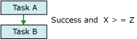

# Add Expressions to Precedence Constraints
  A precedence constraint can use an expression to define the constraint between two executables: the precedence executable and the constrained executable. The executables can be tasks or containers. The expression can be used alone or in combination with the execution result of the precedence executable. The execution result of an executable is either success or failure. When you configure the execution result of a precedence constraint, you can set the execution result to `Success`, `Failure`, or `Completion`. `Success` requires that the precedence executable succeed, `Failure` requires that the precedence executable fail, and `Completion` indicates that the constrained executable should run regardless of whether the precedence task succeeds or fails. For more information, see [Precedence Constraints](control-flow/precedence-constraints.md).  
  
 The expression must evaluate to `True` or `False` and it must be a valid [!INCLUDE[ssISnoversion](../includes/ssisnoversion-md.md)] expression. The expression can use literals, system and custom variables, and the functions and operators that the [!INCLUDE[ssIS](../includes/ssis-md.md)] expression grammar provides. For example, the expression `@Count == SQRT(144) + 10` uses the variable `Count`, the SQRT function , and the equal (==) and add (+) operators. For more information, see [Integration Services &#40;SSIS&#41; Expressions](expressions/integration-services-ssis-expressions.md).  
  
 In the following illustration, task A and task B are linked by a precedence constraint that uses an execution result and an expression. The constraint value is set to `Success` and the expression is  `@X >== @Z`. Task B, the constrained task, runs only if task A completes successfully and the value of variable `X` is greater than or equal to the value of variable `Z`.  
  
   
  
 Executables can also be linked by using multiple precedence constraints that contain different expressions. For example, in the following illustration, tasks B and C are linked to task A by precedence constraints that use execution results and expressions. Both of the constraint values are set to `Success.` One precedence constraint includes the expression `@X >== @Z`, and the other precedence constraint includes the expression `@X < @Z`. Depending on the values of variable `X` and variable `Z`, either task C or task B runs.  
  
   
  
 You can add or modify an expression by using the **Precedence Constraint Editor** in [!INCLUDE[ssIS](../includes/ssis-md.md)] Designer and the Properties window that [!INCLUDE[ssBIDevStudioFull](../includes/ssbidevstudiofull-md.md)] provides. However, the Properties window does not provide verification of the expression syntax.  
  
 If a precedence constraint includes an expression, an icon appears on the design surface of the **Control Flow** tab, next to the precedence constraint, and the ToolTip on the icon displays the expression.  
  
## Combining Execution Values and Expressions  
 The following table describes the effects of combining an execution value constraint and an expression in a precedence constraint.  
  
|Evaluation operation|Constraint evaluates to|Expression evaluates to|Constrained executable runs|  
|--------------------------|-----------------------------|-----------------------------|---------------------------------|  
|Constraint|True|N/A|True|  
|Constraint|False|N/A|False|  
|Expression|N/A|True|True|  
|Expression|N/A|False|False|  
|Constraint and Expression|True|True|True|  
|Constraint and Expression|True|False|False|  
|Constraint and Expression|False|True|False|  
|Constraint and Expression|False|False|False|  
|Constraint or Expression|True|True|True|  
|Constraint or Expression|True|False|True|  
|Constraint or Expression|False|True|True|  
|Constraint or Expression|False|False|False|  
  
### To add an expression to a precedence constraint  
  
-   [Use an Expression in a Precedence Constraint](../../2014/integration-services/use-an-expression-in-a-precedence-constraint.md)  
  
-   [Set the Properties of a Precedence Constraint](../../2014/integration-services/set-the-properties-of-a-precedence-constraint.md)  
  
## External Resources  
 Technical article, [SSIS Expression Examples](https://go.microsoft.com/fwlink/?LinkId=220761), on social.technet.microsoft.com  
  
## See Also  
 [Multiple Precedence Constraints](../../2014/integration-services/multiple-precedence-constraints.md)   
 [Precedence Constraints](control-flow/precedence-constraints.md)  
  
  
