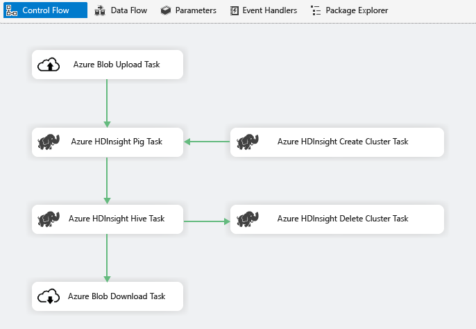
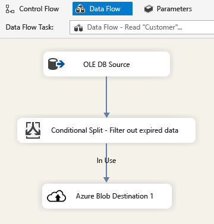
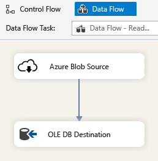
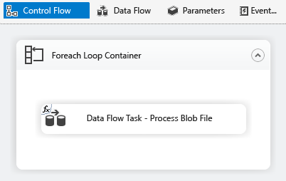

# Azure Feature Pack
SQL Server Integration Services (SSIS) Feature Pack for Azure is an extension that provides the components listed on this page for SSIS to connect to Azure services, transfer data between Azure and on-premises data sources, and process data stored in Azure.

## Components in the Feature Pack
  
-   Connection Managers  
  
    -   [Azure Storage Connection Manager](connection-manager/azure-storage-connection-manager.md)  
  
    -   [Azure Subscription Connection Manager](connection-manager/azure-subscription-connection-manager.md)  
    
    -   [Azure Data Lake Store Connection Manager](../../2014/integration-services/azure-data-lake-store-connection-manager.md)
    
    -   [Azure Resource Manager Connection Manager](../../2014/integration-services/azure-resource-manager-connection-manager.md)
    
    -   [Azure HDInsight Connection Manager](../../2014/integration-services/azure-hdinsight-connection-manager.md)
  
-   Tasks  
  
    -   [Azure Blob Upload Task](control-flow/azure-blob-upload-task.md)  
  
    -   [Azure Blob Download Task](control-flow/azure-blob-download-task.md)  
  
    -   [Azure HDInsight Hive Task](control-flow/azure-hdinsight-hive-task.md)  
  
    -   [Azure HDInsight Pig Task](https://msdn.microsoft.com/library/mt146781(v=sql.120).aspx)
  
    -   [Azure HDInsight Create Cluster Task](control-flow/azure-hdinsight-create-cluster-task.md)  
  
    -   [Azure HDInsight Delete Cluster Task](control-flow/azure-hdinsight-delete-cluster-task.md)
    
    -   [Azure SQL DW Upload Task](../../2014/integration-services/azure-sql-dw-upload-task.md)    
    
    -   [Azure Data Lake Store File System Task](control-flow/file-system-task.md)    
  
-   Data Flow Components  
  
    -   [Azure Blob Source](https://msdn.microsoft.com/library/mt146775(v=sql.120).aspx)  
  
    -   [Azure Blob Destination](data-flow/azure-blob-destination.md)  
    
    -   [Azure Data Lake Store Source](../../2014/integration-services/azure-data-lake-store-source.md)
    
    -   [Azure Data Lake Store Destination](../../2014/integration-services/azure-data-lake-store-destination.md)
  
-   Azure Blob Enumerator & ADLS File Enumerator. See [Foreach Loop Container](control-flow/foreach-loop-container.md).  
  
 
## Download the Feature Pack  
Download the SQL Server Integration Services (SSIS) Feature Pack for Azure.  
  
-   [Microsoft SQL Server 2014 Integration Services Feature Pack for Azure](https://www.microsoft.com/download/details.aspx?id=47366)  

## Prerequisites  
You must install the following prerequisites before installing this feature pack.  
  
-   SQL Server Integration Services  
-   .Net Framework 4.5  
  
## Scenarios  
  
### Big Data Processing  
 Use Azure Connector to complete following big data processing work:  
  
1.  Use the Azure Blob Upload Task to upload input data to Azure Blob Storage.  
  
2.  Use the Azure HDInsight Create Cluster Task to create an Azure HDInsight cluster. This step is optional if you want to use your own cluster.  
  
3.  Use the Azure HDInsight Hive Task or Azure HDInsight Pig Task to invoke a Pig or Hive job on the Azure HDInsight cluster.  
  
4.  Use the Azure HDInsight Delete Cluster Task to delete the HDInsight Cluster after use if you have created an on-demand HDInsight cluster in step #2.  
  
5.  Use the Azure HDInsight Blob Download Task to download the Pig/Hive output data from the Azure Blob Storage.  
  
   
  
### Cloud Data Archiving  
 Use the Azure Blob Destination in an SSIS package to write output data to an Azure Blob Storage, or use the Azure Blob Source to read data from an Azure Blob Storage.  
  
   
  
   
  
 And use the Foreach Loop Container with Azure Blob Enumerator to process data in multiple bob files.  
  
   
  
  
