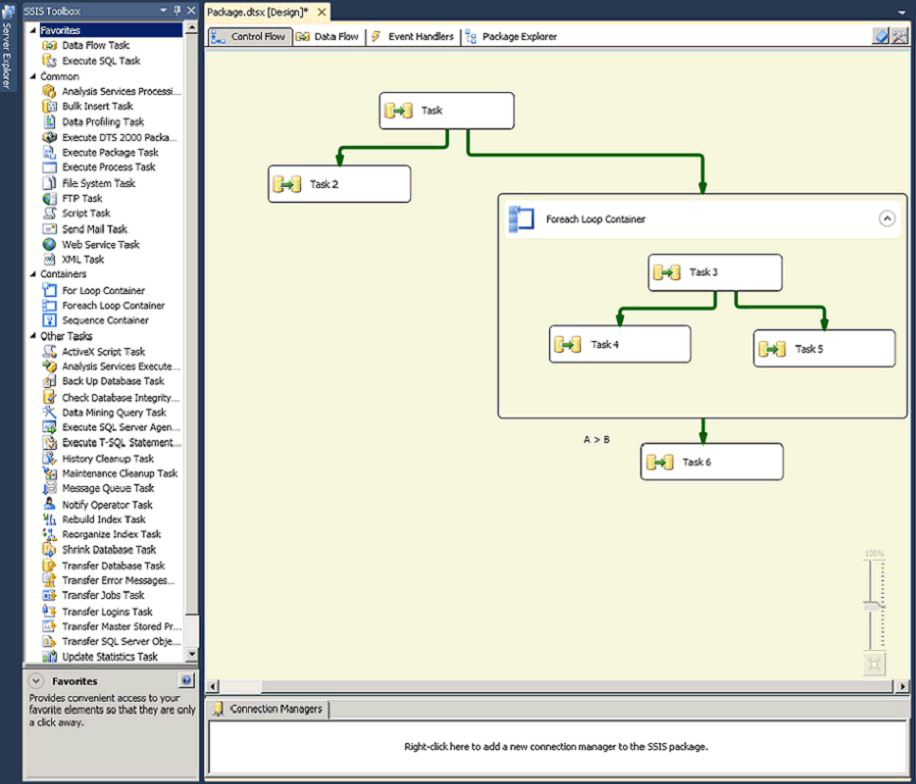

# Control Flow
  A package consists of a control flow and, optionally, one or more data flows. [!INCLUDE[ssNoVersion](../../includes/ssnoversion-md.md)] [!INCLUDE[ssISnoversion](../../../includes/ssisnoversion-md.md)] provides three different types of control flow elements: containers that provide structures in packages, tasks that provide functionality, and precedence constraints that connect the executables, containers, and tasks into an ordered control flow.  
  
 For more information, see [Precedence Constraints](precedence-constraints.md), [Integration Services Containers](integration-services-containers.md), and [Integration Services Tasks](integration-services-tasks.md).  
  
 The following diagram shows a control flow that has one container and six tasks. Five of the tasks are defined at the package level, and one task is defined at the container level. The task is inside a container.  
  
   
  
 The [!INCLUDE[ssISnoversion](../../../includes/ssisnoversion-md.md)] architecture supports the nesting of containers, and a control flow can include multiple levels of nested containers. For example, a package could contain a container such as a Foreach Loop container, which in turn could contain another Foreach Loop container and so on.  
  
 Event handlers also have control flows, which are built using the same kinds of control flow elements.  
  
## Control Flow Implementation  
 You create the control flow in a package by using the **Control Flow** tab in [!INCLUDE[ssIS](../../../includes/ssis-md.md)] Designer. When the **Control Flow** tab is active, the Toolbox lists the tasks and containers that you can add to the control flow.  
  
 The following diagram shows the control flow of a simple package in the control flow designer. The control flow shown in the diagram is made up of three package-level tasks and one package-level container that contains three tasks. The tasks and container are connected by using precedence constraints.  
  
   
  
 Creating a control flow includes the following tasks:  
  
-   Adding containers that implement repeating workflows in a package or divide a control flow into subsets.  
  
-   Adding tasks that support data flow, prepare data, perform workflow and business intelligence functions, and implement script.  
  
     [!INCLUDE[ssISnoversion](../../../includes/ssisnoversion-md.md)] includes a variety of tasks that you can use to create control flow that meets the business requirements of the package. If the package has to work with data, the control flow must include at least one Data Flow task. For example, a package might have to extract data, aggregate data values, and then write the results to a data source.  For more information, see [Integration Services Tasks](integration-services-tasks.md) and [Add or Delete a Task or a Container in a Control Flow](add-or-delete-a-task-or-a-container-in-a-control-flow.md).  
  
-   Connecting containers and tasks into an ordered control flow by using precedence constraints.  
  
     After you add a task or container to the design surface of the **Control Flow** tab, [!INCLUDE[ssIS](../../../includes/ssis-md.md)] Designer automatically adds a connector to the item. If a package includes two or more items, tasks or containers, you can join them into a control flow by dragging their connectors from one item to another.  
  
     The connector between two items represents a precedence constraint. A precedence constraint defines the relationship between the two connected items. It specifies the order in which tasks and containers are executed at run time and the conditions under which tasks and containers run. For example, a precedence constraint can specify that a task must succeed for the next task in the control flow to run. For more information, see [Precedence Constraints](precedence-constraints.md).  
  
-   Adding connection managers.  
  
     Many tasks require a connection to a data source, and you have to add the connection managers that the task requires to the package. Depending on the enumerator type it uses, the Foreach Loop container may also require a connection manager. You can add the connection managers as you construct the control flow item by item or before you start to construct the control flow. For more information, see [Integration Services &#40;SSIS&#41; Connections](../connection-manager/integration-services-ssis-connections.md) and [Create Connection Managers](../create-connection-managers.md).  
  
 [!INCLUDE[ssIS](../../../includes/ssis-md.md)] Designer also includes many design-time features that you can use to manage the design surface and make the control flow self-documenting.  
  
## Related Tasks  
  
-   [Add or Delete a Task or a Container in a Control Flow](add-or-delete-a-task-or-a-container-in-a-control-flow.md)  
  
-   [Set the Properties of a Task or Container](../set-the-properties-of-a-task-or-container.md)  
  
-   [Group or Ungroup Components](../group-or-ungroup-components.md)  
  
  
