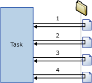

# Foreach Loop Container
  The Foreach Loop container defines a repeating control flow in a package. The loop implementation is similar to **Foreach** looping structure in programming languages. In a package, looping is enabled by using a Foreach enumerator.  The Foreach Loop container repeats the control flow for each member of a specified enumerator.  
  
 [!INCLUDE[ssNoVersion](../../../includes/ssnoversion-md.md)] [!INCLUDE[ssISnoversion](../../../includes/ssisnoversion-md.md)] provides the following enumerator types:  
  
-   Foreach ADO enumerator to enumerate rows in tables. For example, you can get the rows in an ADO recordset.  
  
     The Recordset destination saves data in memory in a recordset that is stored in a package variable of `Object` data type. You typically use a Foreach Loop container with the Foreach ADO enumerator to process one row of the recordset at a time. The variable specified for the Foreach ADO enumerator must be of Object data type. For more information about the Recordeset destination, see [Use a Recordset Destination](../data-flow/recordset-destination.md).  
  
-   Foreach ADO.NET Schema Rowset enumerator to enumerate the schema information about a data source. For example, you can enumerate and get a list of the tables in the [!INCLUDE[ssSampleDBnormal](../../includes/sssampledbnormal-md.md)] [!INCLUDE[ssNoVersion](../../../includes/ssnoversion-md.md)] database.  
  
-   Foreach File enumerator to enumerate files in a folder. The enumerator can traverse subfolders. For example, you can read all the files that have the *.log file name extension in the Windows folder and its subfolders.  
  
-   Foreach From Variable enumerator to enumerate the enumerable object that a specified variable contains. The enumerable object can be an array, an ADO.NET `DataTable`, an [!INCLUDE[ssISnoversion](../../../includes/ssisnoversion-md.md)] enumerator, and so on. For example, you can enumerate the values of an array that contains the name of servers.  
  
-   Foreach Item enumerator to enumerate items that are collections. For example, you can enumerate the names of executables and working directories that an Execute Process task uses.  
  
-   Foreach Nodelist enumerator to enumerate the result set of an XML Path Language (XPath) expression. For example, this expression enumerates and gets a list of all the authors in the classical period: `/authors/author[@period='classical']`.  
  
-   Foreach SMO enumerator to enumerate [!INCLUDE[ssNoVersion](../../../includes/ssnoversion-md.md)] Management Objects (SMO) objects. For example, you can enumerate and get a list of the views in a [!INCLUDE[ssNoVersion](../../../includes/ssnoversion-md.md)] database.  
  
-   Foreach Azure Blob enumerator to enumerate blobs in a blob container in an Azure Storage.  
  
-   Foreach ADLS File enumerator to enumerate files in an ADLS directory.
  
 The following diagram shows a Foreach Loop container that has a File System task. The Foreach loop uses the Foreach File enumerator, and the File System task is configured to copy a file. If the folder that the enumerator specifies contains four files, the loop repeats four times and copies four files.  
  
   
  
 You can use a combination of variables and property expressions to update the property of the package object with the enumerator collection value. First you map the collection value to a user-defined variable, and then you implement a property expression on the property that uses the variable. For example, the collection value of the Foreach File enumerator is mapped to a variable called `MyFile` and the variable is then used in the property expression for the Subject property of a Send Mail task. When the package runs, the Subject property is updated with the name of a file each time that the loop repeats. For more information, see [Use Property Expressions in Packages](../expressions/use-property-expressions-in-packages.md).  
  
 Variables that are mapped to the enumerator collection value can also be used in expressions and scripts.  
  
 A Foreach Loop container can include multiple tasks and containers, but it can use only one type of enumerator. If the Foreach Loop container includes multiple tasks, you can map the enumerator collection value to multiple properties of each task.  
  
 You can set a transaction attribute on the Foreach Loop container to define a transaction for a subset of the package control flow. In this way, you can manage transactions at the level of the Foreach Loop instead of the package level. For example, if a Foreach Loop container repeats a control flow that updates dimensions and fact tables in a star schema, you can configure a transaction to ensure that all fact tables are updated successfully, or none are updated. For more information, see [Integration Services Transactions](../integration-services-transactions.md).  
  
## Enumerator Types  
 Enumerators are configurable, and you must provide different information, depending on the enumerator.  
  
 The following table summarizes the information each enumerator type requires.  
  
|Enumerator|Configuration requirements|  
|----------------|--------------------------------|  
|Foreach ADO|Specify the ADO object source variable and the enumerator mode. The variable must be of Object data type.|  
|Foreach ADO.NET Schema Rowset|Specify the connection to a database and the schema to enumerate.|  
|Foreach File|Specify a folder and the files to enumerate, the format of the file name of the retrieved files, and whether to traverse subfolders.|  
|Foreach From Variable|Specify the variable that contains the objects to enumerate.|  
|Foreach Item|Define the items in the Foreach Item collection, including columns and column data types.|  
|Foreach Nodelist|Specify the source of the XML document and configure the XPath operation.|  
|Foreach SMO|Specify the connection to a database and the SMO objects to enumerate.|  
|Foreach Azure Blob|Specify the Azure blob container that contains blobs to be enumerated.|  
|Foreach ADLS File|Specify the ADLS directory that contains files to be enumerated, along with some filters.|
  
## Property Expressions in Foreach Loop Containers  
 Packages can be configured to concurrently run multiple executables. This configuration should be used with caution when the package includes a Foreach Loop container that implements property expressions.  
  
 It is often useful to implement a property expression to set the value of the ConnectionString property of the connection managers that the Foreach Loop enumerators use. The property expression of ConnectionString is set by a variable that maps to the collection value of the enumerator and is updated at each iteration of the loop.  
  
 To avoid negative consequences of nondeterminative timing of parallel execution of tasks in the loop, the package should be configured to run only one executable at a time. For example, if a package can run multiple tasks concurrently, a Foreach Loop container that enumerates files in the folder, retrieves the file names, and then uses an Execute SQL task to insert the file names into a table may incur write conflicts when two instances of the Execute SQL task attempt to write at the same time. For more information, see [Use Property Expressions in Packages](../expressions/use-property-expressions-in-packages.md).  
  
## Related Tasks  
 You can set properties through [!INCLUDE[ssIS](../../../includes/ssis-md.md)] Designer or programmatically.  
  
 For details about how to set these properties in [!INCLUDE[ssIS](../../../includes/ssis-md.md)] Designer, click one of the following topics:  
  
-   [Configure a Foreach Loop Container](foreach-loop-container.md)  
  
-   [Set the Properties of a Task or Container](../set-the-properties-of-a-task-or-container.md)  
  
 For details about programmatically setting these properties, click the following topic:  
  
-   <xref:Microsoft.SqlServer.Dts.Runtime.ForEachLoop>  
  
## Related Content  
 Blog entry, [SSIS For Each Node List Enumerator](https://go.microsoft.com/fwlink/?LinkId=220671), on bidn.com.  
  
## See Also  
 [Control Flow](control-flow.md)   
 [Integration Services Containers](integration-services-containers.md)  
  
  
