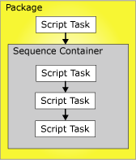

# Precedence Constraints
  Precedence constraints link executables, containers, and tasks in packages in a control flow, and specify conditions that determine whether executables run. An executable can be a For Loop, Foreach Loop, or Sequence container; a task; or an event handler. Event handlers also use precedence constraints to link their executables into a control flow.  
  
 A precedence constraint links two executables: the precedence executable and the constrained executable. The precedence executable runs before the constrained executable, and the execution result of the precedence executable may determine whether the constrained executable runs. The following diagram shows two executables linked by a precedence constraint.  
  
   
  
 In a linear control flow, that is, one without branching, precedence constraints alone govern the sequence in which tasks run. If a control flow branches, the [!INCLUDE[ssISnoversion](../../../includes/ssisnoversion-md.md)] run-time engine determines the execution order among the tasks and containers that immediately follow the branching. The run-time engine also determines execution order among unconnected workflows in a control flow.  
  
 The nested-container architecture of [!INCLUDE[ssISnoversion](../../../includes/ssisnoversion-md.md)] enables all containers, except for the task host container that encapsulates only a single task, to include other containers, each with its own control flow. The For Loop, Foreach Loop, and Sequence containers can include multiple tasks and other containers, which in turn can include multiple tasks and containers. For example, a package with a Script task and a Sequence container has a precedence constraint that links the Script task and the Sequence container. The Sequence container includes three Script tasks, and its precedence constraints link the three Script tasks into a control flow. The following diagram shows the precedence constraints in a package with two levels of nesting.  
  
   
  
 Because the package is at the top of the [!INCLUDE[ssIS](../../../includes/ssis-md.md)] container hierarchy, multiple packages cannot be linked by precedence constraints; however, you can add an Execute Package task to a package and indirectly link another package into the control flow.  
  
 You can configure precedence constraints in the following ways:  
  
-   Specify an evaluation operation. The precedence constraint uses a constraint value, an expression, both, or either to determine whether the constrained executable runs.  
  
-   If the precedence constraint uses an execution result, you can specify the execution result to be success, failure, or completion.  
  
-   If the precedence constraint uses an evaluation result, you can provide an expression that evaluates to a Boolean.  
  
-   Specify whether the precedence constraint is evaluated singly or together with other constraints that apply to the constrained executable.  
  
## Evaluation Operations  
 [!INCLUDE[ssISnoversion](../../../includes/ssisnoversion-md.md)] provides the following evaluation operations:  
  
-   A constraint that uses only the execution result of the precedence executable to determine whether the constrained executable runs. The execution result of the precedence executable can be completion, success, or failure. This is the default operation.  
  
-   An expression that is evaluated to determine whether the constrained executable runs. If the expression evaluates to true, the constrained executable runs.  
  
-   An expression and a constraint that combines the requirements of execution results of the precedence executable and the return results of evaluating the expression.  
  
-   An expression or a constraint that uses either the execution results of the precedence executable or the return results of evaluating the expression.  
  
 [!INCLUDE[ssIS](../../../includes/ssis-md.md)] Designer uses color to identify the type of precedence constraint. The Success constraint is green, the Failure constraint is red, and the Completion constraint is blue. To display text labels in [!INCLUDE[ssIS](../../../includes/ssis-md.md)] designer that show the type of the constraint, you must configure the accessibility features of [!INCLUDE[ssIS](../../../includes/ssis-md.md)] Designer.  
  
 The expression must be a valid [!INCLUDE[ssIS](../../../includes/ssis-md.md)] expression, and it can include functions, operators, and system and custom variables. For more information, see [Integration Services &#40;SSIS&#41; Expressions](../expressions/integration-services-ssis-expressions.md) and [Integration Services &#40;SSIS&#41; Variables](../integration-services-ssis-variables.md).  
  
## Execution Results  
 The precedence constraint can use the following execution results alone or in combination with an expression.  
  
-   Completion requires only that the precedence executable has completed, without regard to outcome, in order for the constrained executable to run.  
  
-   Success requires that the precedence executable must complete successfully for the constrained executable to run.  
  
-   Failure requires that the precedence executable fail for the constrained executable to run.  
  
> [!NOTE]  
>  Only precedence constraints that are members of the same `Precedence Constraint` collection can be grouped in a logical AND condition. For example, you cannot combine precedence constraints from two Foreach Loop containers.  
  
## Configuration of the Precedence Constraint  
 You can set properties through [!INCLUDE[ssIS](../../../includes/ssis-md.md)] Designer or programmatically.  
  
 For information about the properties that you can set in [!INCLUDE[ssIS](../../../includes/ssis-md.md)] Designer, see [Precedence Constraint Editor](../precedence-constraint-editor.md).  
  
 For information about programmatically setting these properties, see <xref:Microsoft.SqlServer.Dts.Runtime.PrecedenceConstraint>.  
  
## Related Tasks  
 For details about how to set these properties in [!INCLUDE[ssIS](../../../includes/ssis-md.md)] Designer, click one of the following topics:  
  
-   [Set the Properties of a Precedence Constraint](../set-the-properties-of-a-precedence-constraint.md)  
  
-   [Set the Value of a Precedence Constraint by Using the Shortcut Menu](../set-the-value-of-a-precedence-constraint-by-using-the-shortcut-menu.md)  
  
-   [Connect Tasks and Containers by Using a Default Precedence Constraint](../connect-tasks-and-containers-by-using-a-default-precedence-constraint.md)  
  
     This topic provides information on how to set the default behavior for precedence constraints, and how to connect executables using the default precedence constraints, see.  
  
## Related Content  
 Technical article, [SSIS Expression Examples](https://go.microsoft.com/fwlink/?LinkId=220761), on social.technet.microsoft.com  
  
## See Also  
 [Add Expressions to Precedence Constraints](../add-expressions-to-precedence-constraints.md)   
 [Multiple Precedence Constraints](../multiple-precedence-constraints.md)  
  
  
