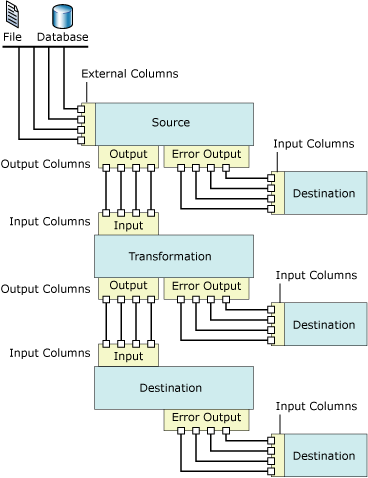

# Data Flow
  [!INCLUDE[ssNoVersion](../../includes/ssnoversion-md.md)] [!INCLUDE[ssISnoversion](../../../includes/ssisnoversion-md.md)] provides three different types of data flow components: sources, transformations, and destinations. Sources extract data from data stores such as tables and views in relational databases, files, and [!INCLUDE[ssASnoversion](../../includes/ssasnoversion-md.md)] databases. Transformations modify, summarize, and clean data. Destinations load data into data stores or create in-memory datasets.  
  
> [!NOTE]  
>  When you use custom providers, you need to update the ProviderDescriptors.xml file with the metadata column values.  
  
 Additionally, [!INCLUDE[ssISnoversion](../../../includes/ssisnoversion-md.md)] provides paths that connect the output of one component to the input of another component. Paths define the sequence of components, and let you add annotations to the data flow or view the source of the column.  
  
 You connect data flow components by connecting the output of sources and destinations to the input of transformations and destinations. When constructing a data flow you typically connect the second and subsequent components as you add them to the data flow. After you connect the component, the input columns are available for use in configuring the component. When no input columns are available, you will have to complete the configuration of the component after it is connected to the data flow. For more information, see [Integration Services Paths](integration-services-paths.md) and [Connect Components with Paths](../connect-components-with-paths.md).  
  
 The following diagram shows a data flow that has a source, a transformation with one input and one output, and a destination. The diagram includes the inputs, outputs, and error outputs in addition to the input, output, and external columns.  
  
   
  
## Data Flow Implementation  
 Adding a Data Flow task to the control flow of a package is the first step in implementing a data flow in a package. A package can include multiple Data Flow tasks, each with its own data flow. For example, if a package requires that data flows be run in a specified sequence, or that other tasks be performed between the data flows, you must use a separate Data Flow task for each data flow.  
  
 After the control flow includes a Data Flow task, you can begin to build the data flow that a package uses. For more information, see [Data Flow Task](../control-flow/data-flow-task.md).  
  
 Creating a data flow includes the following steps:  
  
-   Adding one or more sources to extract data from files and databases, and add connection managers to connect to the sources.  
  
-   Adding the transformations that meet the business requirements of the package. A data flow is not required to include transformations.  
  
     Some transformations require a connection manager. For example, the Lookup transformation uses a connection manager to connect to the database that contains the lookup data.  
  
-   Connecting data flow components by connecting the output of sources and transformations to the input of transformations and destinations.  
  
-   Adding one or more destinations to load data into data stores such as files and databases, and adding connection managers to connect to the data sources.  
  
-   Configuring error outputs on components to handle problems.  
  
     At run time, row-level errors may occur when data flow components convert data, perform a lookup, or evaluate expressions. For example, a data column with a string value cannot be converted to an integer, or an expression tries to divide by zero. Both operations cause errors, and the rows that contain the errors can be processed separately using an error flow. For more information about how to use error flows in package data flow, see [Error Handling in Data](error-handling-in-data.md).  
  
-   Include annotations to make the data flow self-documenting. For more information, see [Use Annotations in Packages](../use-annotations-in-packages.md).  
  
> [!NOTE]  
>  When you create a new package, you can also use a wizard to help you configure connection managers, sources, and destinations correctly. For more information, see [Create Packages in SQL Server Data Tools](../create-packages-in-sql-server-data-tools.md).  
  
 When the **Data Flow** tab is active, the Toolbox contains the sources, transformations, and destinations that you can add to the data flow.  
  
## Expressions  
 A number of the data flow components-sources, transformations, and destinations-support the use of property expressions in some of their properties. A property expression is an expression that replaces the value of the property when the package is loaded. At run time, the package uses the updated property values. The expressions are built using the [!INCLUDE[ssISnoversion](../../../includes/ssisnoversion-md.md)] expression syntax and can include [!INCLUDE[ssISnoversion](../../../includes/ssisnoversion-md.md)] functions, operators, identifiers, and variables. For more information, see [Integration Services &#40;SSIS&#41; Expressions](../expressions/integration-services-ssis-expressions.md), [Integration Services &#40;SSIS&#41; Expressions](../expressions/integration-services-ssis-expressions.md), and [Use Property Expressions in Packages](../expressions/use-property-expressions-in-packages.md).  
  
 If you construct a package in [!INCLUDE[ssBIDevStudioFull](../../includes/ssbidevstudiofull-md.md)], the properties of any data flow components that support property expressions are exposed on the Data Flow task to which they belong. To add, change, and remove the property expressions of data flow components, click the Data Flow task, and then use the Properties window or the editor for the task to add, change, or delete property expressions. Property expressions for the Data Flow task itself are managed in the Properties window.  
  
 If the data flow contains any components that use expressions, the expressions are also exposed in the Properties window. To view expressions, select the Data Flow task to which the component belongs. You can view properties by categories, or in alphabetical order. If you use the categorized view in the Properties window, any expressions that are not used in a specific property are listed in the **Misc** category. If you use the alphabetical view, expressions are listed in order of the name of the data flow component.  
  
## Sources  
 In [!INCLUDE[ssISnoversion](../../../includes/ssisnoversion-md.md)], a source is the data flow component that makes data from different external data sources available to the other components in the data flow. You can extract data from flat files, XML files, Microsoft Excel workbooks, and files that contain raw data. You can also extract data by accessing tables and views in databases and by running queries.  
  
 A data flow can include a single source or multiple sources.  
  
 The source for a data flow typically has one regular output. The regular output contains output columns, which are columns the source adds to the data flow.  
  
 The regular output references external columns. An external column is a column in the source. For example, the **MadeFlag** column in the **Product** table of the **AdventureWorks** database is an external column that can be added to the regular output. Metadata for external columns includes such information as the name, data type, and length of the source column.  
  
 An error output for a source contains the same columns as the regular output, and also contains two additional columns that provide information about errors. The [!INCLUDE[ssISnoversion](../../../includes/ssisnoversion-md.md)] object model does not restrict the number of regular outputs and error outputs that sources can have. Most of the sources that [!INCLUDE[ssISnoversion](../../../includes/ssisnoversion-md.md)] includes, except the Script component, have one regular output, and many of the sources have one error output. Custom sources can be coded to implement multiple regular outputs and error outputs.  
  
 All the output columns are available as input columns to the next data flow component in the data flow.  
  
 You can also write custom sources. For more information, see [Developing a Custom Data Flow Component](../extending-packages-custom-objects/data-flow/developing-a-custom-data-flow-component.md) and [Developing Specific Types of Data Flow Components](../extending-packages-custom-objects-data-flow-types/developing-specific-types-of-data-flow-components.md).  
  
 The following sources have properties that can be updated by property expressions:  
  
-   [ADO NET Source](ado-net-source.md)  
  
-   [XML Source](xml-source.md)  
  
### Sources Available for Download  
 The following table lists additional sources that you can download from the [!INCLUDE[msCoName](../../../includes/msconame-md.md)] website.  
  
|Source|Description|  
|------------|-----------------|  
|Oracle Source|The Oracle source is the source component of the [!INCLUDE[msCoName](../../../includes/msconame-md.md)] Connector for Oracle by Attunity. The [!INCLUDE[msCoName](../../../includes/msconame-md.md)] Connector for Oracle by Attunity also includes a connection manager and a destination. For more information, see the download page, [Microsoft Connectors for Oracle and Teradata by Attunity](https://go.microsoft.com/fwlink/?LinkId=254963).|  
|SAP BI Source|The SAP BI source is the source component of the [!INCLUDE[msCoName](../../../includes/msconame-md.md)] Connector for SAP BI. The [!INCLUDE[msCoName](../../../includes/msconame-md.md)] Connector for SAP BI also includes a connection manager and a destination. For more information, see the download page, [Microsoft SQL Server 2008 Feature Pack](https://go.microsoft.com/fwlink/?LinkId=110393).|  
|Teradata Source|The Teradata source is the source component of the [!INCLUDE[msCoName](../../../includes/msconame-md.md)] Connector for Teradata by Attunity. The [!INCLUDE[msCoName](../../../includes/msconame-md.md)] Connector for Teradata by Attunity also includes a connection manager and a destination. For more information, see the download page, [Microsoft Connectors for Oracle and Teradata by Attunity](https://go.microsoft.com/fwlink/?LinkId=254963).|  
  
 For a demonstration on how to leverage the performance gains of the [!INCLUDE[msCoName](../../../includes/msconame-md.md)] Connector for Oracle by Attunity, see [Performance of Microsoft Connector for Oracle by Attunity (SQL Server Video)](https://go.microsoft.com/fwlink/?LinkID=210369).  
  
## Transformations  
 The capabilities of transformations vary broadly. Transformations can perform tasks such as updating, summarizing, cleaning, merging, and distributing data. You can modify values in columns, look up values in tables, clean data, and aggregate column values.  
  
 The inputs and outputs of a transformation define the columns of incoming and outgoing data. Depending on the operation performed on the data, some transformations have a single input and multiple outputs, while other transformations have multiple inputs and a single output. Transformations can also include error outputs, which provide information about the error that occurred, together with the data that failed: For example, string data that could not be converted to an integer data type. The [!INCLUDE[ssISnoversion](../../../includes/ssisnoversion-md.md)] object model does not restrict the number of inputs, regular outputs, and error outputs that transformations can contain. You can create custom transformations that implement any combination of multiple inputs, regular outputs, and error outputs.  
  
 The input of a transformation is defined as one or more input columns. Some [!INCLUDE[ssISnoversion](../../../includes/ssisnoversion-md.md)] transformations can also refer to external columns as input. For example, the input to the OLE DB Command transformation includes external columns. An output column is a column that the transformation adds to the data flow. Both regular outputs and error outputs contain output columns. These output columns in turn act as input columns to the next component in the data flow, either another transformation or a destination.  
  
 The following transformations have properties that can be updated by property expressions:  
  
-   [Conditional Split Transformation](transformations/conditional-split-transformation.md)  
  
-   [Derived Column Transformation](transformations/derived-column-transformation.md)  
  
-   [Fuzzy Grouping Transformation](transformations/fuzzy-grouping-transformation.md)  
  
-   [Fuzzy Lookup Transformation](transformations/lookup-transformation.md)  
  
-   [OLE DB Command Transformation](transformations/ole-db-command-transformation.md)  
  
-   [Percentage Sampling Transformation](transformations/percentage-sampling-transformation.md)  
  
-   [Pivot Transformation](transformations/pivot-transformation.md)  
  
-   [Row Sampling Transformation](transformations/row-sampling-transformation.md)  
  
-   [Sort Transformation](transformations/sort-transformation.md)  
  
-   [Unpivot Transformation](transformations/unpivot-transformation.md)  
  
 For more information, see [Integration Services Transformations](transformations/integration-services-transformations.md).  
  
## Destinations  
 A destination is the data flow component that writes the data from a data flow to a specific data store, or creates an in-memory dataset. You can load data into flat files, process analytic objects, and provide data to other processes. You can also load data by accessing tables and views in databases and by running queries.  
  
 A data flow can include multiple destinations that load data into different data stores.  
  
 An [!INCLUDE[ssISnoversion](../../../includes/ssisnoversion-md.md)] destination must have at least one input. The input contains input columns, which come from another data flow component. The input columns are mapped to columns in the destination.  
  
 Many destinations also have one error output. The error output for a destination contains output columns, which typically contain information about errors that occur when writing data to the destination data store. Errors occur for many different reasons. For example, a column may contain a null value, whereas the destination column cannot be set to null.  
  
 The [!INCLUDE[ssISnoversion](../../../includes/ssisnoversion-md.md)] object model does not restrict the number of regular inputs and error outputs that destinations can have, and you can create custom destinations that implement multiple inputs and error outputs.  
  
 You can also write custom destinations. For more information, see [Developing a Custom Data Flow Component](../extending-packages-custom-objects/data-flow/developing-a-custom-data-flow-component.md) and [Developing Specific Types of Data Flow Components](../extending-packages-custom-objects-data-flow-types/developing-specific-types-of-data-flow-components.md).  
  
 The following destinations have properties that can be updated by property expressions:  
  
-   [Flat File Destination](flat-file-destination.md)  
  
-   [SQL Server Compact Edition Destination](sql-server-compact-edition-destination.md)  
  
### Destinations Available for Download  
 The following table lists additional destinations that you can download from the [!INCLUDE[msCoName](../../../includes/msconame-md.md)] website.  
  
|Source|Description|  
|------------|-----------------|  
|Oracle Destination|The Oracle destination is the destination component of the [!INCLUDE[msCoName](../../../includes/msconame-md.md)] Connector for Oracle by Attunity. The [!INCLUDE[msCoName](../../../includes/msconame-md.md)] Connector for Oracle by Attunity also includes a connection manager and a source. For more information, see the download page, [Microsoft Connectors for Oracle and Teradata by Attunity](https://go.microsoft.com/fwlink/?LinkId=254963).|  
|SAP BI Destination|The SAP BI destination is the destination component of the [!INCLUDE[msCoName](../../../includes/msconame-md.md)] Connector for SAP BI. The [!INCLUDE[msCoName](../../../includes/msconame-md.md)] Connector for SAP BI also includes a connection manager and a source. For more information, see the download page, [Microsoft SQL Server 2008 Feature Pack](https://go.microsoft.com/fwlink/?LinkId=110393).|  
|Teradata Destination|The Teradata destination is the destination component of the [!INCLUDE[msCoName](../../../includes/msconame-md.md)] Connector for Teradata by Attunity. The [!INCLUDE[msCoName](../../../includes/msconame-md.md)] Connector for Teradata by Attunity also includes a connection manager and a source. For more information, see the download page, [Microsoft Connectors for Oracle and Teradata by Attunity](https://go.microsoft.com/fwlink/?LinkId=254963).|  
  
 For a demonstration on how to leverage the performance gains of the [!INCLUDE[msCoName](../../../includes/msconame-md.md)] Connector for Oracle by Attunity, see [Performance of Microsoft Connector for Oracle by Attunity (SQL Server Video)](https://go.microsoft.com/fwlink/?LinkID=210369).  
  
## Connection Managers  
 Many data flow components connect to data sources, and you must add the connection managers that the components require to the package before the component can be configured correctly. You can add the connection managers as you construct the data flow, or before you start to construct the data flow. For more information, see [Integration Services &#40;SSIS&#41; Connections](../connection-manager/integration-services-ssis-connections.md) and [Create Connection Managers](../create-connection-managers.md).  
  
## External Metadata  
 When you create a data flow in a package using [!INCLUDE[ssIS](../../../includes/ssis-md.md)] Designer, the metadata from the sources and destinations is copied to the external columns on sources and destinations, serving as a snapshot of the schema. When [!INCLUDE[ssISnoversion](../../../includes/ssisnoversion-md.md)] validates the package, [!INCLUDE[ssIS](../../../includes/ssis-md.md)] Designer compares this snapshot against the schema of the source or destination, and posts errors and warnings, depending on the changes.  
  
 The [!INCLUDE[ssISnoversion](../../../includes/ssisnoversion-md.md)] project provides an offline mode. When you work offline no connections are made to the sources or destinations the package uses, and the metadata of external columns is not updated.  
  
## Inputs and Outputs  
 Sources have outputs, destinations have inputs, and transformations have both inputs and outputs. Additionally, many data flow components can be configured to use an error output.  
  
### Inputs  
 Destinations and transformations have inputs. An input contains one or more input columns, which can refer to external columns if the data flow component has been configured to use them. Inputs can be configured to monitor and control the flow of data: For example, you can specify if the component should fail in response to an error, ignore errors, or redirect error rows to the error output. You can also assign a description to the input or update the input name. In [!INCLUDE[ssIS](../../../includes/ssis-md.md)] Designer, inputs are configured by using the **Advanced Editor** dialog box. For more information about the **Advanced Editor,** see [Integration Services User Interface](../integration-services-user-interface.md).  
  
### Outputs  
 Sources and transformations always have outputs. An output contains one or more output columns, which can refer to external columns if the data flow component has been configured to use them. Outputs can be configured to provide information useful to downstream processing of the data. For example, you can indicate whether the output is sorted. You can also provide a description for the output, or update the output name. In [!INCLUDE[ssIS](../../../includes/ssis-md.md)] Designer, outputs are configured by using the **Advanced Editor** dialog box.  
  
### Error Outputs  
 Sources, destinations, and transformations can include error outputs. You can specify how the data flow component responds to errors in each input or column by using the **Configure Error Output** dialog box. If an error or data truncation occurs at run time and the data flow component is configured to redirect rows, the data rows with the error are sent to the error output. The error output can be connected to transformations that apply additional transformations or direct data to a different destination. By default, an error output contains the output columns and two error columns: **ErrorCode** and **ErrorColumn**. The output columns contain the data from the row that failed, **ErrorCode** provides the error code, and **ErrorColumn** identifies the failing column.  
  
 For more information, see [Error Handling in Data](error-handling-in-data.md).  
  
### Columns  
 Inputs, outputs, and error outputs are collections of columns. Each column is configurable and depending on the column type-input, output, or external- [!INCLUDE[ssISnoversion](../../../includes/ssisnoversion-md.md)] provides different properties for the column. [!INCLUDE[ssISnoversion](../../../includes/ssisnoversion-md.md)] provides three different ways of setting column properties: programmatically, by using component-specific dialog boxes, or by using the **Advanced Editor** dialog box.  
  
## Paths  
 Paths connect data flow components. In [!INCLUDE[ssIS](../../../includes/ssis-md.md)] Designer, you can view and modify the path properties, view the output metadata for the path start point, and attach data viewers to a path.  
  
 For more information, see [Integration Services Paths](integration-services-paths.md) and [Debugging Data Flow](../troubleshooting/debugging-data-flow.md).  
  
## Configuration of Data Flow Components  
 Data flow components can be configured at the component level; at the input, output, and error output levels; and at the column level.  
  
-   At the component level, you set properties that are common to all components, and you set the custom properties of the component.  
  
-   At the input, output, and error output levels, you set the common properties of inputs, outputs, and the error output. If the component supports multiple outputs, you can add outputs.  
  
-   At the column level, you set the properties that are common to all columns, in addition to any custom properties that the component provides for columns. If the component supports the addition of output columns, you can add columns to outputs.  
  
 You can set properties through [!INCLUDE[ssIS](../../../includes/ssis-md.md)] Designer or programmatically. In [!INCLUDE[ssIS](../../../includes/ssis-md.md)] Designer, you can set element properties using the custom dialog boxes provided for each element type, or by using the Properties window or the **Advanced Editor** dialog box.  
  
 For more information about how to set properties by using [!INCLUDE[ssIS](../../../includes/ssis-md.md)] Designer, see [Set the Properties of a Data Flow Component](set-the-properties-of-a-data-flow-component.md).  
  
## Related Tasks  
  
-   [Add or Delete a Component in a Data Flow](add-or-delete-a-component-in-a-data-flow.md)  
  
-   [Connect Components in a Data Flow](connect-components-in-a-data-flow.md)  
  
## Related Content  
 Video, [Performance of Microsoft Connector for Oracle by Attunity (SQL Server Video)](https://go.microsoft.com/fwlink/?LinkID=210369), on technet.microsoft.com.  
  
 Curated Answer, [How to Create a Dynamic Connection String in SSIS](http://kevine323.blogspot.com/2012/04/dynamic-connection-strings-in-ssis.html).  
  
  
