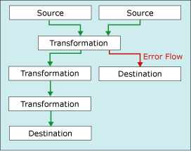

# Error Handling in Data
  When a data flow component applies a transformation to column data, extracts data from sources, or loads data into destinations, errors can occur. Errors frequently occur because of unexpected data values. For example, a data conversion fails because a column contains a string instead of a number, an insertion into a database column fails because the data is a date and the column has a numeric data type, or an expression fails to evaluate because a column value is zero, resulting in a mathematical operation that is not valid.  
  
 Errors typically fall into one the following categories:  
  
-   Data conversion errors, which occur if a conversion results in loss of significant digits, the loss of insignificant digits, and the truncation of strings. Data conversion errors also occur if the requested conversion is not supported.  
  
-   Expression evaluation errors, which occur if expressions that are evaluated at run time perform invalid operations or become syntactically incorrect because of missing or incorrect data values.  
  
-   Lookup errors, which occur if a lookup operation fails to locate a match in the lookup table.  
  
 Many data flow components support error outputs, which let you control how the component handles row-level errors in both incoming and outgoing data. You specify how the component behaves when truncation or an error occurs by setting options on individual columns in the input or output. For example, you can specify that the component should fail if customer name data is truncated, but ignore errors on another column that contains less important data.  
  
 The error output can be connected to the input of another transformation or loaded into a different destination than the non-error output. For example, the error output can be a connected to a Derived Column transformation that provides a string for a column that is blank.  
  
 The following diagram shows a simple data flow including an error output.  
  
   
  
 In addition to the data columns, the error output includes the **ErrorCode** and **ErrorColumn** columns. The **ErrorCode** column identifies the error and the **ErrorColumn** contains the lineage identifier of the error column. To view the metadata of these columns, click the path that connects the error output to the next component in the data flow. Under some circumstances, the value of the **ErrorColumn** column is set to zero. This occurs when the error condition affects the entire row instead of a single column. An example is when a lookup fails in the Lookup transformation.  
  
 For more information, see [Data Flow](data-flow.md) and [Integration Services Paths](integration-services-paths.md).  
  
 For a list of Integration Services errors, warnings, and other messages, see [Integration Services Error and Message Reference](../integration-services-error-and-message-reference.md).  
  
## Error and Truncation Options  
 Errors fall into one of two categories: errors or truncations. An error indicates an unequivocal failure, and generates a NULL result. Such errors can include data conversion errors or expression evaluation errors. For example, an attempt to convert a string that contains alphabetical characters to a number causes an error. Data conversions, expression evaluations, and assignments of expression results to variables, properties, and data columns may fail because of illegal casts and incompatible data types. For more information see, [Cast &#40;SSIS Expression&#41;](../expressions/cast-ssis-expression.md), [Integration Services Data Types in Expressions](../expressions/integration-services-data-types-in-expressions.md), and [Integration Services Data Types](integration-services-data-types.md).  
  
 A truncation is less serious than an error. A truncation generates results that might be usable or even desirable. You can elect to treat truncations as errors or as acceptable conditions. For example, if you are inserting a 15-character string into a column that is only one character wide, you can elect to truncate the string.  
  
 You can configure how sources, transformations, and destinations handle errors and truncations. The following table describes the options.  
  
|Option|Description|  
|------------|-----------------|  
|Fail Component|The Data Flow task fails when an error or a truncation occurs. Failure is the default option for an error and a truncation.|  
|Ignore Failure|The error or the truncation is ignored and the data row is directed to the output of the transformation or source.|  
|Redirect Row|The error or the truncation data row is directed to the error output of the source, transformation, or destination.|  
  
## Adding the Error Description  
 By default an error output provides the numeric error code and usually contains the identifier of the column in which the error occurred. You can use the Script component to include the error description in an additional column by using a single line of script to call the <xref:Microsoft.SqlServer.Dts.Pipeline.Wrapper.IDTSComponentMetaData100.GetErrorDescription%2A> method of the <xref:Microsoft.SqlServer.Dts.Pipeline.Wrapper.IDTSComponentMetaData100> interface.  
  
 The Script component can be added to the error segment of the data flow anywhere downstream from the data flow components whose errors that you want to capture, but is typically placed immediately before the error rows are written to a destination. This way, the script looks up only descriptions for error rows that are written. For example, the error segment of the data flow may correct some errors and not write those rows to an error destination. For more information, see [Enhancing an Error Output with the Script Component](../extending-packages-scripting-data-flow-script-component-examples/enhancing-an-error-output-with-the-script-component.md).  
  
### To configure an error output  
  
-   [Configure an Error Output in a Data Flow Component](../configure-an-error-output-in-a-data-flow-component.md)  
  
## See Also  
 [Data Flow](data-flow.md)   
 [Transform Data with Transformations](transformations/transform-data-with-transformations.md)   
 [Connect Components with Paths](../connect-components-with-paths.md)   
 [Data Flow Task](../control-flow/data-flow-task.md)   
 [Data Flow](data-flow.md)  
  
  
