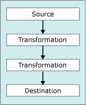

# Transform Data with Transformations
  [!INCLUDE[ssISnoversion](../../../includes/ssisnoversion-md.md)] includes three types of data flow components: sources, transformations, and destinations.  
  
 The following diagram shows a simple data flow that has a source, two transformations, and a destination.  
  
   
  
 [!INCLUDE[ssISnoversion](../../../includes/ssisnoversion-md.md)] transformations provide the following functionality:  
  
-   Splitting, copying, and merging rowsets and performing lookup operations.  
  
-   Updating column values and creating new columns by applying transformations such as changing lowercase to uppercase.  
  
-   Performing business intelligence operations such as cleaning data, mining text, or running data mining prediction queries.  
  
-   Creating new rowsets that consist of aggregate or sorted values, sample data, or pivoted and unpivoted data.  
  
-   Performing tasks such as exporting and importing data, providing audit information, and working with slowly changing dimensions.  
  
 For more information, see [Integration Services Transformations](integration-services-transformations.md).  
  
 You can also write custom transformations. For more information, see [Developing a Custom Data Flow Component](../../extending-packages-custom-objects/data-flow/developing-a-custom-data-flow-component.md) and [Developing Specific Types of Data Flow Components](../../extending-packages-custom-objects-data-flow-types/developing-specific-types-of-data-flow-components.md).  
  
 After you add the transformation to the data flow designer, but before you configure the transformation, you connect the transformation to the data flow by connecting the output of another transformation or source in the data flow to the input of this transformation. The connector between two data flow components is called a path. For more information about connecting components and working with paths, see [Connect Components with Paths](../../connect-components-with-paths.md).  
  
### To add a transformation to a data flow  
  
-   [Add or Delete a Component in a Data Flow](../add-or-delete-a-component-in-a-data-flow.md)  
  
### To connect a transformation to a data flow  
  
-   [Connect Components in a Data Flow](../connect-components-in-a-data-flow.md)  
  
### To set the properties of a transformation  
  
-   [Set the Properties of a Data Flow Component](../set-the-properties-of-a-data-flow-component.md)  
  
## See Also  
 [Data Flow Task](../../control-flow/data-flow-task.md)   
 [Data Flow](../data-flow.md)   
 [Connect Components with Paths](../../connect-components-with-paths.md)   
 [Error Handling in Data](../error-handling-in-data.md)   
 [Data Flow](../data-flow.md)  
  
  
