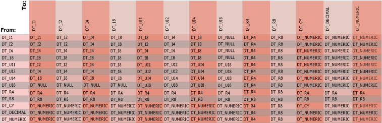

# Integration Services Data Types in Expressions
  The expression evaluator uses [!INCLUDE[ssISnoversion](../../../includes/ssisnoversion-md.md)] data types. When data first enters a data flow in an [!INCLUDE[ssISnoversion](../../../includes/ssisnoversion-md.md)] package, the data flow engine converts all column data to an [!INCLUDE[ssISnoversion](../../../includes/ssisnoversion-md.md)] data type, and the column data that an expression uses already has an [!INCLUDE[ssISnoversion](../../../includes/ssisnoversion-md.md)] data type. Expressions used in the Conditional Split and the Derived Column transformations can reference columns because they are part of a data flow that includes column data.  
  
## Variables  
 Expressions can also use variables. Variables have a Variant data type and the expression evaluator converts the data type of a variable from a Variant subtype to an [!INCLUDE[ssISnoversion](../../../includes/ssisnoversion-md.md)] data type before it evaluates the expression. Variables can use only a subset of the [!INCLUDE[ssISnoversion](../../../includes/ssisnoversion-md.md)] data types. For example, a variable cannot use a Binary Large Object Block (BLOB) data type.  
  
 For more information about [!INCLUDE[ssISnoversion](../../../includes/ssisnoversion-md.md)] data types and the mapping of Variant data types to [!INCLUDE[ssISnoversion](../../../includes/ssisnoversion-md.md)] data types, see [Integration Services Data Types](../data-flow/integration-services-data-types.md).  
  
## Literals  
 In addition, expressions can include string, Boolean, and numeric literals. For more information about converting numeric literals to numeric [!INCLUDE[ssISnoversion](../../../includes/ssisnoversion-md.md)] data types, see [Literals &#40;SSIS&#41;](numeric-string-and-boolean-literals.md).  
  
## Implicit Data Conversion  
 An implicit conversion of a data type occurs when the expression evaluator automatically converts the data from one data type to another. For example, if a `smallint` is compared to an `int`, the `smallint` is implicitly converted to `int` before the comparison is performed.  
  
 The expression evaluator cannot perform implicit data conversion when the arguments and operands have incompatible data types. In addition, the expression evaluator cannot implicitly convert any value to a Boolean. Instead, the arguments and operands must be explicitly converted by using the cast operator. For more information, see [Cast &#40;SSIS Expression&#41;](cast-ssis-expression.md).  
  
 The following diagram shows the result type of implicit conversions of BINARY operations. The intersection of column and row in this table is the result type of a binary operation with operands of the left (From) and right (To) types.  
  
   
  
 The intersection of a signed and an unsigned integer is a signed integer that is potentially larger than either argument.  
  
 Operators compare strings, dates, Booleans, and other data types. Before an operator compares two values, the expression evaluator performs certain implicit conversions. The expression evaluator always converts string literals to the DT_WSTR data type and converts Boolean literals to the DT_BOOL data type. The expression evaluator interprets all values enclosed in quotation marks as strings. Numeric literals are converted to one of the numeric [!INCLUDE[ssISnoversion](../../../includes/ssisnoversion-md.md)] data types.  
  
> [!NOTE]  
>  Boolean values are logical values, not numbers. Although Boolean values may be displayed as numbers in some environments, they are not stored as numbers, and various programming languages represent Boolean values as numeric values differently, as do the .NET Framework methods.  
>   
>  For example, the conversion functions available in Visual Basic convert `True` to -1; however, the `System.Convert.ToInt32` method in the .NET Framework converts `True` to +1. The [!INCLUDE[ssISnoversion](../../../includes/ssisnoversion-md.md)] Expression Language converts `True` to -1.  
>   
>  To avoid errors or unexpected results, you should not write code that relies on particular numeric values for `True` and `False`. Wherever possible, you should restrict usage of Boolean variables to the logical values for which they are designed.  
  
 For more information, see the following topics:  
  
-   [== &#40;Equal&#41; &#40;SSIS Expression&#41;](equal-ssis-expression.md)  
  
-   [!= &#40;Unequal&#41; &#40;SSIS Expression&#41;](unequal-ssis-expression.md)  
  
-   [&#62; &#40;Greater Than&#41; &#40;SSIS Expression&#41;](greater-than-ssis-expression.md)  
  
-   [&#60; &#40;Less Than&#41; &#40;SSIS Expression&#41;](less-than-ssis-expression.md)  
  
-   [&#62;= &#40;Greater Than or Equal To&#41; &#40;SSIS Expression&#41;](greater-than-or-equal-to-ssis-expression.md)  
  
-   [&#60;= &#40;Less Than or Equal To&#41; &#40;SSIS Expression&#41;](less-than-or-equal-to-ssis-expression.md)  
  
 A function that uses a single argument returns a result with the same data type as the argument, with the following exceptions:  
  
-   DAY, MONTH, and YEAR accept a date and return an integer (DT_I4) result.  
  
-   ISNULL accepts an expression of any [!INCLUDE[ssIS](../../includes/ssis-md.md)] data type and returns a Boolean (DT_BOOL) result.  
  
-   SQUARE and SQRT accept a numeric expression and return a non-integral numeric (DT_R8) result.  
  
 If the arguments have the same data type, the result is of that type. The only exception is the result of a binary operation on two values with the DT_DECIMAL data type, which returns a result with the DT_NUMERIC data type.  
  
## Requirements for Data Used in Expressions  
 The expression evaluator supports all [!INCLUDE[ssISnoversion](../../../includes/ssisnoversion-md.md)] data types. However, depending on the operation or the function, the operands and arguments require certain data types. The expression evaluator imposes the following data type requirements on data used in expressions:  
  
-   Operands used in **logical** operations must evaluate to a Boolean. For example, ColumnA > 1&&ColumnB < 2.  
  
-   Operands used in **mathematical** operations must evaluate to a numeric value. For example, 23.75 * 4.  
  
-   Operands used in comparison operations, such as logical and equality operations, must evaluate to compatible data types.  
  
     For example, one of the expressions in the following example uses the DT_DBTIMESTAMPOFFSET data type:  
  
     `(DT_DBTIMESTAMPOFFSET,3) "1999-10-11 20:34:52.123 -3:30" != (DT_DBDATE)"1999-10-12"`  
  
     The system converts the expression, `(DT_DBDATE)"1999-10-12"`, to DT_DBTIMESTAMPOFFSET. The example evaluates to TRUE because the converted expression becomes "1999-10-12 00:00:00.000 +00:00", which is not equal to the value of the other expression, `(DT_DBTIMESTAMPOFFSET,3) "1999-10-11 20:34:52.123 -3:30"`.  
  
-   Arguments passed to mathematical functions must evaluate to a numeric data type. Depending on the function or operation, a specific numeric data type may be required. For example, the HEX function requires a signed or unsigned integer.  
  
-   Arguments passed to string functions must evaluate to a character data type: DT_STR or DT_WSTR. For example, UPPER("flower"). Some string functions, such as SUBSTRING, require additional integer arguments for the start position and the length of the string.  
  
-   Arguments passed to date and time functions must evaluate to a valid date. For example, DAY(GETDATE()). Some functions, such as DATEADD, require an additional integer argument for the number of days the function adds to a date.  
  
 Operations that combine an unsigned eight-byte integer and a signed integer require an explicit cast to clarify the result format. For more information, see [Cast &#40;SSIS Expression&#41;](cast-ssis-expression.md).  
  
 Results of many operations and functions have predetermined data types. This can be the data type of the argument or the data type to which the expression evaluator casts the result. For example, the result of a logical OR operator (||) is always a Boolean, the result of the ABS function is the numeric data type of the argument, and the result of multiplication is the smallest numeric data type that can hold the result without loss. For more information about the data types of results, see [Operators &#40;SSIS Expression&#41;](operators-ssis-expression.md) and [Functions &#40;SSIS Expression&#41;](functions-ssis-expression.md).  
  
## Related Tasks  
 [Use an Expression in a Data Flow Component](../use-an-expression-in-a-data-flow-component.md)  
  
## Related Content  
  
-   Technical article, [SSIS Expression Cheat Sheet](https://pragmaticworks.com/Resources/Cheat-Sheets/SSIS-Expression-Cheat-Sheet3), on pragmaticworks.com  
  
-   Technical article, [SSIS Expression Examples](https://go.microsoft.com/fwlink/?LinkId=220761), on social.technet.microsoft.com  
  
  
