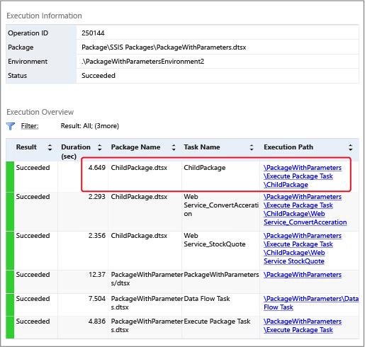

# Implementation of the Parent Package
  When load balancing SSIS packages across various servers, the next step after the child packages have been created, deployed, and remote SQL Server Agent Jobs created to run them, is to create the parent package. The parent package will contain many Execute SQL Server Agent Job tasks, each task responsible for calling a different SQL Server Agent job that runs one of the child packages. The Execute SQL Server Agent Job tasks in the parent package in turn run the various SQL Server Agent jobs. Each task in the parent package contains information such as how to connect to the remote server and what job to run on that server. For more information, see [Execute SQL Server Agent Job Task](control-flow/execute-sql-server-agent-job-task.md).  
  
 To identify the parent package that executes child packages, in [!INCLUDE[ssBIDevStudioFull](../includes/ssbidevstudiofull-md.md)] right click the package in Solution Explorer and then click **Entry-point Package**.  
  
## Listing Child Packages  
 If you deploy your project that contains a parent package and child package(s) to the [!INCLUDE[ssISnoversion](../includes/ssisnoversion-md.md)] server, you can view a list of the child packages that are executed by the parent package. When you run the parent package, an **Overview** report for the parent package is automatically generated in [!INCLUDE[ssManStudioFull](../includes/ssmanstudiofull-md.md)]. The report lists the child packages that were executed by the Execute Package task contained in the parent package, as shown in the following image.  
  
   
  
 For information about accessing the **Overview** report, see [Reports for the Integration Services Server](../../2014/integration-services/reports-for-the-integration-services-server.md).  
  
## Precedence Constraints in the Parent Package  
 When you create precedence constraints between the Execute SQL Server Agent Job tasks in the parent package, these precedence constraints control only the time that the SQL Server Agent jobs on the remote servers are started. Precedence constraints cannot receive information regarding the success or failure of the child packages that are run from the steps of the SQL Server Agent jobs.  
  
 This means that success or failure of a child package does not propagate to the parent, because the sole function of the Execute SQL Server Agent job in the parent package is to request the SQL Server Agent job to run the child package. After the SQL Server Agent job is called successfully, the parent package receives a result of <xref:Microsoft.SqlServer.Dts.Runtime.DTSExecResult.Success>.  
  
 Failure in this scenario means only that there has been a failure in calling the remote SQL Server Agent Job task. One situation where this can occur is when the remote server is down and the agent does not respond. However, as long as the agent fires, the parent package has successfully completed its task.  
  
> [!NOTE]  
>  You can use an Execute SQL Task that contains a Transact-SQL statement of **sp_start_job N'package_name'**. For more information, see [sp_start_job &#40;Transact-SQL&#41;](/sql/relational-databases/system-stored-procedures/sp-start-job-transact-sql).  
  
## Debugging Environment  
 When testing the parent package, use the debugging environment of the designer by running it using Debug / Start Debugging (F5). Alternatively, you can use the command prompt utility, **dtexec**. For more information, see [dtexec Utility](packages/dtexec-utility.md).  
  
  
