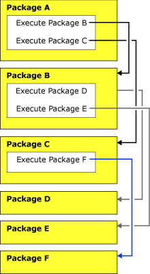

# Inherited Transactions
  A package can run another package by using the Execute Package task. The child package, which is the package run by the Execute Package task, may create its own package transaction, or it may inherit the parent package transaction.  
  
 A child package inherits the parent package transaction if both of the following are true:  
  
-   The package is invoked by an Execute Package task.  
  
-   The Execute Package task that invoked the package also joined the parent package transaction.  
  
 Containers and tasks in the child package cannot join the parent package transaction unless the child package itself joins the transaction.  
  
## Illustration of Package Transactions  
 In the following diagram, there are three packages that all use transactions. Each package contains multiple tasks. To emphasize the behavior of the transactions, only the Execute Package tasks are shown. Package A runs packages B and C. In turn, package B runs packages D and E, and package C runs package F.  
  
 Packages and tasks have the following transaction attributes:  
  
-   **TransactionOption** is set to **Required** on packages A and C  
  
-   **TransactionOption** is set to **Supported** on packages B and D, and on the tasks Execute Package B, Execute Package D, and Execute Package F.  
  
-   **TransactionOption** is set to **NotSupported** on package E, and on the tasks Execute Package C and Execute Package E.  
  
   
  
 Only packages B, D, and F can inherit transactions from their parent packages.  
  
 Packages B and D inherit the transaction that was started by package A.  
  
 Package F inherits the transaction that was started by package C.  
  
 Packages A and C control their own transactions.  
  
 Package E does not use transactions.  
  
## Related Tasks  
 [Configure a Package to Use Transactions](../relational-databases/native-client-ole-db-transactions/transactions.md)  
  
  
