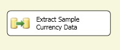

# Step 9: Testing the Lesson 1 Tutorial Package
  In this lesson, you have done the following tasks:  
  
-   Created a new [!INCLUDE[ssIS](../includes/ssis-md.md)] project.  
  
-   Configured the connection managers that the package needs to connect to the source and destination data.  
  
-   Added a data flow that takes the data from a flat file source, performs the necessary Lookup transformations on the data, and configures the data for the destination.  
  
 Your package is now complete! It is time to test your package.  
  
## Checking the Package Layout  
 Before you test the package you should verify that the control and data flows in the Lesson 1 package contain the objects shown in the following diagrams.  
  
 **Control Flow**  
  
   
  
 **Data Flow**  
  
   
  
### To run the Lesson 1 tutorial package  
  
1.  On the **Debug** menu, click **Start Debugging**.  
  
     The package will run, resulting in 1097 rows successfully added into the **FactCurrency** fact table in **AdventureWorksDW2012**.  
  
2.  After the package has completed running, on the **Debug** menu, click **Stop Debugging**.  
  
## Next Lesson  
 [Lesson 2: Adding Looping](../integration-services/lesson-2-adding-looping-with-ssis.md)  
  
## See Also  
 [Execution of Projects and Packages](packages/run-integration-services-ssis-packages.md)  
  
  
