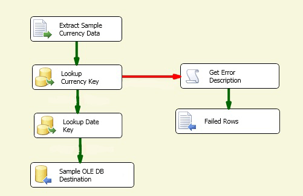

# Step 5: Testing the Lesson 4 Tutorial Package
  At run time, the corrupted file, Currency_BAD.txt, will fail to generate a match within the Currency Key Lookup transformation. Because the error output of Currency Key Lookup has now been configured to redirect failed rows to the new Failed Rows destination, the component does not fail, and the package runs successfully. All failed error rows are written to ErrorOutput.txt.  
  
 In this task, you will test the revised error output configuration by running the package. Upon successful package execution, you will then view the contents of the ErrorOutput.txt file.  
  
> [!NOTE]  
>  If you do not want to accumulate error rows in the ErrorOutput.txt file, you should manually delete the file content between package runs.  
  
## Checking the Package layout  
 Before you test the package you should verify that the control flow and the data flow in the Lesson 4 package contain the objects shown in the following diagrams. The control flow should be identical to the control flow in lessons 2 - 4.  
  
 **Control Flow**  
  
   
  
 **Data Flow**  
  
   
  
### To run the Lesson 4 tutorial package  
  
1.  On the **Debug** menu, click **Start Debugging**.  
  
2.  After the package has completed running, on the **Debug** menu, click **Stop Debugging**.  
  
### To verify the contents of the ErrorOutput.txt file  
  
-   In Notepad or any other text editor, open the ErrorOutput.txt file. The default column order is: AverageRate, CurrencyID, CurrencyDate, EndOfDateRate, ErrorCode, ErrorColumn, ErrorDescription.  
  
     Notice that all the rows in the file contain the unmatched CurrencyID value of BAD, the ErrorCode value of -1071607778, the ErrorColumn value of 0, and the ErrorDescription value "Row yielded no match during lookup". The value of the ErrorColumn is set to 0 because the error is not column specific. It is the lookup operation that failed. .  
  
  
