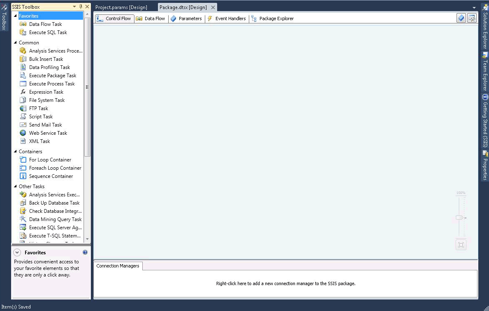

# SSIS Designer
  [!INCLUDE[ssIS](../includes/ssis-md.md)] Designer is a graphical tool that you can use to create and maintain [!INCLUDE[ssISnoversion](../includes/ssisnoversion-md.md)] packages. [!INCLUDE[ssIS](../includes/ssis-md.md)] Designer is available in [!INCLUDE[ssBIDevStudioFull](../includes/ssbidevstudiofull-md.md)] as part of an [!INCLUDE[ssISnoversion](../includes/ssisnoversion-md.md)] project.  
  
 You can use [!INCLUDE[ssIS](../includes/ssis-md.md)] Designer to perform the following tasks:  
  
-   Constructing the control flow in a package.  
  
-   Constructing the data flows in a package.  
  
-   Adding event handlers to the package and package objects.  
  
-   Viewing the package content.  
  
-   At run time, viewing the execution progress of the package.  
  
 The following diagram shows [!INCLUDE[ssIS](../includes/ssis-md.md)] Designer and the **Toolbox** window.  
  
   
  
 [!INCLUDE[ssISnoversion](../includes/ssisnoversion-md.md)] includes additional dialog boxes and windows for adding functionality to packages, and [!INCLUDE[ssBIDevStudioFull](../includes/ssbidevstudiofull-md.md)] provides windows and dialog boxes for configuring the development environment and working with packages. For more information, see [Integration Services User Interface](integration-services-user-interface.md).  
  
 [!INCLUDE[ssIS](../includes/ssis-md.md)] Designer has no dependency on the [!INCLUDE[ssISnoversion](../includes/ssisnoversion-md.md)] service, the service that manages and monitors packages, and it is not required that the service be running to create or modify packages in [!INCLUDE[ssIS](../includes/ssis-md.md)] Designer. However, if you stop the service while [!INCLUDE[ssIS](../includes/ssis-md.md)] Designer is open, you can no longer open the dialog boxes that [!INCLUDE[ssIS](../includes/ssis-md.md)] Designer provides and you may receive the error message "RPC server is unavailable." To reset [!INCLUDE[ssIS](../includes/ssis-md.md)] Designer and continue working with the package, you must close the designer, exit [!INCLUDE[ssBIDevStudioFull](../includes/ssbidevstudiofull-md.md)], and then reopen [!INCLUDE[ssBIDevStudioFull](../includes/ssbidevstudiofull-md.md)], the [!INCLUDE[ssISnoversion](../includes/ssisnoversion-md.md)] project, and the package.  
  
## Undo and Redo  
 You can undo and redo up to 20 actions in the [!INCLUDE[ssIS](../includes/ssis-md.md)] Designer. For a package, undo /redo is available in the **Control Flow**, **Data Flow**, **Event Handlers**, and **Parameters** tabs, and in the **Variables** window. For a project, undo/redo is available in the **Project Parameters** window.  
  
 You can't undo/redo changes to the new **SSIS Toolbox**.  
  
 When you make changes to a component using the component editor, you undo and redo the changes as a set rather than undoing and redoing individual changes. The set of changes appears as a single action in the undo and redo drop-down list.  
  
 To undo an action, click the undo toolbar button, **Edit/Undo** menu item, or press CTRL+Z. To redo an action, click the redo toolbar button, **Edit/Redo** menu item or press CTRL + Y. You can undo and redo multiple actions, by clicking the arrow next to the toolbar button, highlighting multiple actions in the drop-down list, and then clicking in the list.  
  
## Parts of the SSIS Designer  
 [!INCLUDE[ssIS](../includes/ssis-md.md)] Designer has five permanent tabs: one each for building package control flow, data flows, parameters, and event handlers, and one tab for viewing the contents of a package. At run time a sixth tab appears that shows the execution progress of a package while it is running and the execution results after it finishes.  
  
 In addition, [!INCLUDE[ssIS](../includes/ssis-md.md)] Designer includes the Connection Managers area for adding and configuring the connection managers that a package uses to connect to data.  
  
### Control Flow Tab  
 You construct the control flow in a package on the design surface of the **Control Flow** tab. Drag items from **Toolbox** to the design surface and connect them into a control flow by clicking the icon for the item, and then dragging the arrow from one item to another.  
  
 For more information, see [Control Flow](control-flow/control-flow.md).  
  
### Data Flow Tab  
 If a package contains a Data flow task, you can add data flows to the package. You construct the data flows in a package on the design surface of the **Data Flow** tab. Drag items from **Toolbox** to the design surface and connect them into a data flow by clicking the icon for the item, and then dragging the arrow from one item to another.  
  
 For more information, see [Data Flow](data-flow/data-flow.md).  
  
### Parameters Tab  
 Integration Services (SSIS) parameters allow you to assign values to properties within packages at the time of package execution. You can create project parameters at the project level and package parameters at the package level. Project parameters are used to supply any external input the project receives to one or more packages in the project. Package parameters allow you to modify package execution without having to edit and redeploy the package. This tab allows you to manage package parameters.  
  
 For more information about parameters, see [Integration Services &#40;SSIS&#41; Parameters](integration-services-ssis-package-and-project-parameters.md).  
  
> [!IMPORTANT]  
>  Parameters are available only to projects developed for the project deployment model. Therefore, you will see the Parameters tab only for packages that are part of a project configured to use the project deployment model.  
  
### Event Handlers Tab  
 You construct the events in a package on the design surface of the **Event Handlers** tab. On the **Event Handlers** tab, you select the package or package object that you want to create an event handler for, and then select the event to associate with the event handler. An event handler has a control flow and optional data flows.  
  
 For more information, see [Add an Event Handler to a Package](../../2014/integration-services/add-an-event-handler-to-a-package.md).  
  
### Package Explorer Tab  
 Packages can be complex, including many tasks, connection managers, variables, and other elements. The explorer view of the package lets you see a complete list of package elements.  
  
 For more information, see [View Package Objects](view-package-objects.md).  
  
#### Progress/Execution Result Tab  
 While a package is running, the **Progress** tab shows the execution progress of the package. After the package has finished running, the execution results remain available on the **Execution Result** tab.  
  
> [!NOTE]  
>  To enable or disable the display of messages on the **Progress** tab, toggle the **Debug Progress Reporting** option on the **SSIS** menu.  
  
##### Connection Managers Area  
 You add and modify the connection managers that a package uses in the **Connection Managers** area. [!INCLUDE[ssISnoversion](../includes/ssisnoversion-md.md)] includes connection managers to connect to a variety of data sources, such as text files, OLE DB databases, and .NET providers.  
  
 For more information, see [Integration Services &#40;SSIS&#41; Connections](connection-manager/integration-services-ssis-connections.md) and [Create Connection Managers](../../2014/integration-services/create-connection-managers.md).  
  
## Related Tasks  
  
-   [Create Packages in SQL Server Data Tools](create-packages-in-sql-server-data-tools.md)  
  
## See Also  
 [Integration Services User Interface](integration-services-user-interface.md)  
  
  
