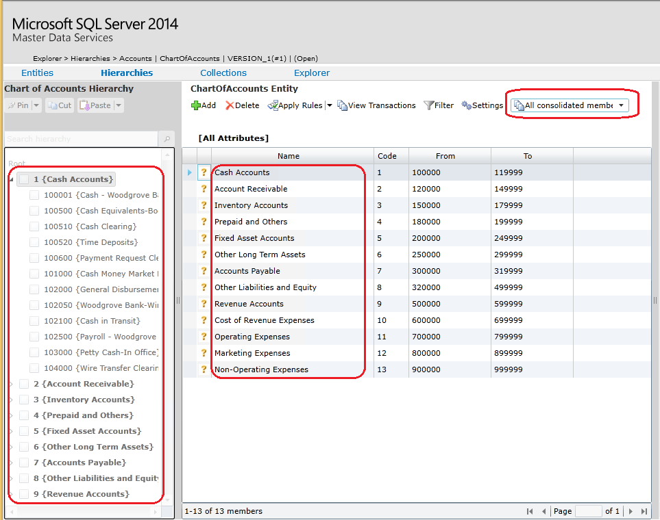

# Create a Consolidated Member (Master Data Services)
  In [!INCLUDE[ssMDSmdm](../includes/ssmdsmdm-md.md)], create a consolidated member when you want a parent node for an explicit hierarchy. Consolidated members can have their own attributes. They are used for grouping. As shown in the following example, consolidated members can be used for account groups that have accounts under them.  
  
   
  
## Prerequisites  
 To perform this procedure:  
  
-   You must have permission to access the **Explorer** functional area.  
  
-   You must have a minimum of **Update** permission to the consolidated model object for the entity you are adding a member to.  
  
### To create a consolidated member  
  
1.  On the [!INCLUDE[ssMDSmdm](../includes/ssmdsmdm-md.md)] home page, from the **Model** list, select a model.  
  
2.  From the **Version** list, select a version.  
  
3.  Click **Explorer**.  
  
4.  From the menu bar, point to **Hierarchies** and click the name of the hierarchy you want to add a consolidated member to.  
  
5.  Above the grid, select either the **Consolidated members** or the **All consolidated members in hierarchy** option.  
  
6.  Click **Add**.  
  
7.  In the pane on the right, complete the fields.  
  
8.  Optional. In the **Annotations** box, type a comment about why the member was added. All users who have access to the member can view the annotation.  
  
9. Click **OK**.  
  
## Next Steps  
  
-   [Move Members within a Hierarchy &#40;Master Data Services&#41;](move-members-within-a-hierarchy-master-data-services.md)  
  
## See Also  
 [Create an Explicit Hierarchy &#40;Master Data Services&#41;](../../2014/master-data-services/create-an-explicit-hierarchy-master-data-services.md)   
 [Create a Leaf Member &#40;Master Data Services&#41;](../../2014/master-data-services/create-a-leaf-member-master-data-services.md)   
 [Load or Update Members in Master Data Services by Using the Staging Process](/sql/2014/master-data-services/add-update-and-delete-data-master-data-services)   
 [Members &#40;Master Data Services&#41;](../../2014/master-data-services/members-master-data-services.md)   
 [Explicit Hierarchies &#40;Master Data Services&#41;](../../2014/master-data-services/explicit-hierarchies-master-data-services.md)  
  
  
