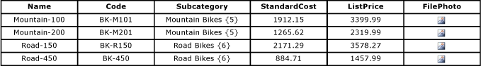

# Entities (Master Data Services)
  Entities are objects that are contained in [!INCLUDE[ssMDSshort](../includes/ssmdsshort-md.md)] models. Each entity contains members, which are the rows of master data that you manage.  
  
## How Many Entities are Appropriate?  
 Models can contain as many entities as you want to manage. Each entity should group a similar kind of data. For example, you might want an entity for all of your corporate accounts, or an entity for your master list of employees.  
  
 Typically, there are one or more central entities that are important to your business, and to which other objects in the model relate. For example, in a Product model, you could have a central entity called Product and entities called Subcategory and Category that relate to the Product entity. However, you do not need to have a central entity. Depending on your needs, you might have several entities that you consider to be of equal importance.  
  
## How Entities Relate to Other Model Objects  
 You can think of an entity as a table that contains master data, where the rows represent members and the columns represent attributes.  
  
   
  
 You populate the entity with a list of master data that you want to manage.  
  
 Entities can be used to build derived hierarchies, which are level-based hierarchies based on multiple entities. For more information, see [Derived Hierarchies &#40;Master Data Services&#41;](derived-hierarchies-master-data-services.md).  
  
 Entities can also be enabled to contain explicit hierarchies (ragged structures based on a single entity) and collections (one-off combinations of subsets of members). For more information, see [Explicit Hierarchies &#40;Master Data Services&#41;](../../2014/master-data-services/explicit-hierarchies-master-data-services.md) and [Collections &#40;Master Data Services&#41;](../../2014/master-data-services/collections-master-data-services.md).  
  
## Using Entities as Constrained Lists  
 When users are assigning attributes to the members in an entity, you can have them choose from a constrained list of values. To do this, you use an entity to populate the list of values for the attribute. This is called a domain-based attribute. For more information, see [Domain-Based Attributes &#40;Master Data Services&#41;](../../2014/master-data-services/domain-based-attributes-master-data-services.md).  
  
## Base Entities  
 A base entity is a starting point for users when navigating objects in the model. A base entity determines the layout of the screen when a user opens the **Explorer** functional area and clicks **Explorer** on the menu bar. To specify an entity as a base entity, navigate to the **System Administration** functional area. On the **Model View** page, drag the entity from the tree control on the right to the name of the model in the tree control on the left.  
  
## Entity Security  
 You can give users permission to an entity, which includes related model objects. For more information, see [Entity Permissions &#40;Master Data Services&#41;](../../2014/master-data-services/entity-permissions-master-data-services.md).  
  
## Entity Examples  
 The following example shows an entity that has these attributes: Name, Code, Subcategory, StandardCost, ListPrice, and FilePhoto. These attributes describe the members. Each member is represented by a single row of attribute values.  
  
   
  
 In the following example, the Product entity is the central entity. The Subcategory entity is a domain-based attribute of the Product entity. The Category entity is a domain-based attribute of the Subcategory entity. StandardCost and ListPrice are free-form attributes of the Product entity, and FilePhoto is a file attribute of the Product entity.  
  
   
  
> [!NOTE]  
>  This is an example based on the [!INCLUDE[ssMDSmdm](../includes/ssmdsmdm-md.md)] user interface (UI). The hierarchical tree structure shows relationships between entities and domain-based attributes. It is intended to show relationships rather than represent levels of importance.  
  
## Related Tasks  
  
|Task Description|Topic|  
|----------------------|-----------|  
|Create a new entity.|[Create an Entity &#40;Master Data Services&#41;](../../2014/master-data-services/create-an-entity-master-data-services.md)|  
|Specify that an entity can contain explicit hierarchies and collections.|[Enable an Entity for Explicit Hierarchies and Collections &#40;Master Data Services&#41;](../../2014/master-data-services/enable-an-entity-for-explicit-hierarchies-and-collections-master-data-services.md)|  
|Change the name of an existing entity.|[Change an Entity Name &#40;Master Data Services&#41;](edit-an-entity-master-data-services.md)|  
|Delete an existing entity.|[Delete an Entity &#40;Master Data Services&#41;](../../2014/master-data-services/delete-an-entity-master-data-services.md)|  
|Assign permission to entities.|[Assign Model Object Permissions &#40;Master Data Services&#41;](../../2014/master-data-services/assign-model-object-permissions-master-data-services.md)|  
  
## Related Content  
  
-   [Models &#40;Master Data Services&#41;](../../2014/master-data-services/models-master-data-services.md)  
  
-   [Members &#40;Master Data Services&#41;](../../2014/master-data-services/members-master-data-services.md)  
  
-   [Attributes &#40;Master Data Services&#41;](../../2014/master-data-services/attributes-master-data-services.md)  
  
  
