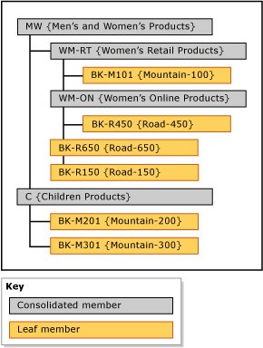

# Explicit Hierarchies (Master Data Services)
  In [!INCLUDE[ssMDSshort](../includes/ssmdsshort-md.md)], an explicit hierarchy organizes members from a single entity in any way you specify. The structure can be ragged and unlike derived hierarchies, explicit hierarchies are not based on domain-based attribute relationships.  
  
## Consolidated Members Group Other Members  
 An explicit hierarchy uses consolidated members that you create for the purpose of grouping other members. These consolidated members can belong to only one explicit hierarchy at a time. An explicit hierarchy also includes all of the leaf members from the associated entity.  
  
 An explicit hierarchy can be ragged, which means that the hierarchy can end at different levels simultaneously. Each consolidated member can have an unlimited number of consolidated and leaf members underneath, or can have none. The leaf members can be under a single consolidated member or under multiple levels of consolidated members.  
  
> [!NOTE]  
>  Before you can create an explicit hierarchy, the entity must be enabled for explicit hierarchies. For more information, see [Enable an Entity for Explicit Hierarchies and Collections &#40;Master Data Services&#41;](enable-an-entity-for-explicit-hierarchies-and-collections-master-data-services.md).  
  
## Types of Explicit Hierarchies  
 There are two types of explicit hierarchies: mandatory and non-mandatory.  
  
### Mandatory Explicit Hierarchy  
 A mandatory explicit hierarchy is a hierarchy in which all leaf members must be included in the hierarchy tree. By default, all members are included at the root of the tree. You can rearrange the members as needed.  
  
### Non-Mandatory Explicit Hierarchy  
 A non-mandatory explicit hierarchy is a hierarchy in which all leaf members are in a system-created **Unused** node. You can move members out of this node as you need them. The rest of the members can remain in the **Unused** node.  
  
 When you use non-mandatory explicit hierarchies, any reporting or analysis done on the hierarchy may not match reporting or analysis done on mandatory hierarchies.  
  
## Rules  
 The following rules apply to explicit hierarchies (both mandatory and non-mandatory).  
  
-   Each leaf member can be included in the hierarchy only once.  
  
-   All consolidated members must be included in a hierarchy.  
  
-   Consolidated members cannot be in more than one explicit hierarchy.  
  
-   Consolidated members in the hierarchy tree do not have to contain leaf members underneath them.  
  
-   If you delete an explicit hierarchy, all consolidated members that were used in the hierarchy are deleted.  
  
-   If you delete a consolidated member that was in an explicit hierarchy, all leaf members that were grouped by that consolidated member are moved to the root.  
  
## Explicit Hierarchies versus Derived Hierarchies  
 The following table shows some of the differences between explicit and derived hierarchies.  
  
|Explicit Hierarchies|Derived Hierarchies|  
|--------------------------|-------------------------|  
|Structure is defined by the user|Structure is derived from the relationships between domain-based attributes|  
|Contains members from a single entity|Contains members from multiple entities|  
|Uses consolidated members to group other members|Uses leaf members from one entity to group leaf members from another entity|  
|Can be ragged|Always contains a consistent number of levels|  
  
## Explicit Hierarchy Example  
 In the following example, the Product entity contains these leaf members: BK-M101 {Mountain-100}, BK-M201 {Mountain-200}, BK-M301 {Mountain-300}, BK-R150 {Road-150}, BK-R450 {Road-450}, and BK-R650 {Road-650}.  
  
 To summarize these leaf members at specific consolidation points, you can create consolidated members in the Product entity. Insert the consolidated members at levels in the hierarchy tree where you want to summarize the leaf members. There is no limitation on where you insert your consolidated members; however, each member (leaf or consolidated) can be used only once.  
  
   
  
 Consolidated members can be used to group members at any level, and leaf and consolidated members are sorted in the order you determine.  
  
## Related Tasks  
  
|Task Description|Topic|  
|----------------------|-----------|  
|Enable an entity for explicit hierarchies and collections.|[Enable an Entity for Explicit Hierarchies and Collections &#40;Master Data Services&#41;](enable-an-entity-for-explicit-hierarchies-and-collections-master-data-services.md)|  
|Create a new explicit hierarchy.|[Create an Explicit Hierarchy &#40;Master Data Services&#41;](../../2014/master-data-services/create-an-explicit-hierarchy-master-data-services.md)|  
|Change the name of an existing explicity hierarchy.|[Change an Explicit Hierarchy Name &#40;Master Data Services&#41;](../../2014/master-data-services/change-an-explicit-hierarchy-name-master-data-services.md)|  
|Delete an existing explicit hierarchy.|[Delete an Explicit Hierarchy &#40;Master Data Services&#41;](../../2014/master-data-services/delete-an-explicit-hierarchy-master-data-services.md)|  
|||  
  
## Related Content  
  
-   [Derived Hierarchies &#40;Master Data Services&#41;](../../2014/master-data-services/derived-hierarchies-master-data-services.md)  
  
-   [Collections &#40;Master Data Services&#41;](../../2014/master-data-services/collections-master-data-services.md)  
  
  
