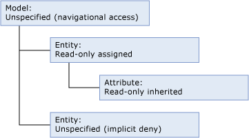
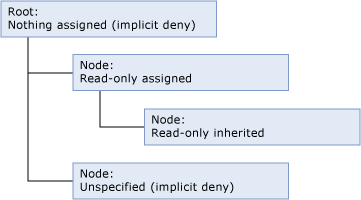
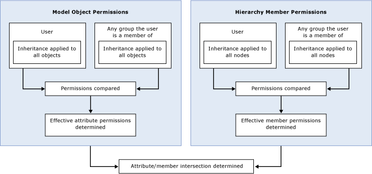

# How Permissions Are Determined (Master Data Services)
  In [!INCLUDE[ssMDSshort](../includes/ssmdsshort-md.md)], the simplest way to configure security is to assign model object permissions to a group that the user is a member of.  
  
 Security becomes more complex when:  
  
-   Both model object and hierarchy member permissions are assigned.  
  
-   The user belongs to groups and permission is assigned to both the user and groups.  
  
-   The user belongs to groups and permission is assigned to multiple groups.  
  
## Permissions assigned to a single group or user  
 If you assign permissions to a single group or user, permissions are determined based on the following workflow.  
  
   
  
### Step 1: Effective attribute permissions are determined.  
 The following list describes how effective attribute permissions are determined:  
  
-   Permissions assigned to model objects determine which attributes a user can access.  
  
-   All model objects automatically inherit permission from the closest object at a higher level in the model structure.  
  
-   Any objects at the same level as the entity are implicitly denied.  
  
-   Any objects at a higher level are given navigational access. For more information about navigational access, see [Navigational Access &#40;Master Data Services&#41;](navigational-access-master-data-services.md).  
  
 In this example, **Read-only** permission is assigned to an entity and that permission is inherited by its attribute, which is at a lower level in the model structure. The model provides navigational access to this entity and its attribute. The other entity in the model has no explicit permission assigned and does not inherit any permissions, so it is implicitly denied.  
  
   
  
### Step 2: If hierarchy member permissions are assigned, effective member permissions are determined.  
 The following list describes how effective hierarchy member permissions are determined:  
  
-   Permissions assigned to hierarchy nodes determine which members a user can access.  
  
-   All nodes in a hierarchy automatically inherit permission from the closest object at a higher level in the hierarchy structure.  
  
-   Any nodes at the same level are implicitly denied.  
  
-   Any nodes at higher levels that do not have permissions assigned are implicitly denied.  
  
 In this example, **Read-only** permission is assigned to one node of the hierarchy and that permission is inherited by a node at a lower level in the hierarchy structure. The root has no permission assigned, so it is implicitly denied. The other node in the hierarchy structure has no explicit permission assigned and does not inherit any permissions, so it is implicitly denied.  
  
   
  
### Step 3: The intersection of attribute and member permissions is determined.  
 If the effective attribute permissions are different than the effective member permissions, permissions must be determined for each individual attribute value. For more information, see [Overlapping Model and Member Permissions &#40;Master Data Services&#41;](../../2014/master-data-services/overlapping-model-and-member-permissions-master-data-services.md).  
  
## Permissions assigned to multiple groups  
 If a user belongs to one or more groups and permissions are assigned to both the user and the groups, the workflow becomes more complex.  
  
   
  
 In this case, overlapping user and group permissions must be resolved before model object and hierarchy member permissions can be compared. For more information, see [Overlapping User and Group Permissions &#40;Master Data Services&#41;](../../2014/master-data-services/overlapping-user-and-group-permissions-master-data-services.md).  
  
## See Also  
 [Overlapping User and Group Permissions &#40;Master Data Services&#41;](../../2014/master-data-services/overlapping-user-and-group-permissions-master-data-services.md)   
 [Overlapping Model and Member Permissions &#40;Master Data Services&#41;](../../2014/master-data-services/overlapping-model-and-member-permissions-master-data-services.md)  
  
  
