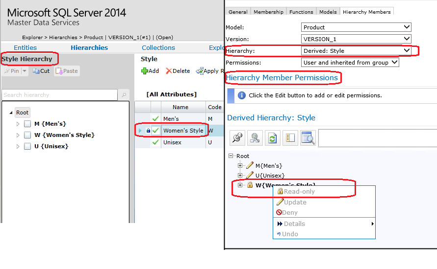

# Security (Master Data Services)
  In [!INCLUDE[ssMDSshort](../includes/ssmdsshort-md.md)], use security to ensure that users have access to the specific master data necessary to do their jobs, and to prevent them from accessing data that should not be available to them.  
  
 You can also use security to make someone an administrator of a specific model and functional area (for example, to allow someone to create versions of the Customer model or to give someone the ability to set security permissions).  
  
 [!INCLUDE[ssMDSshort](../includes/ssmdsshort-md.md)] security is based on local or Active Directory domain users and groups. MDS security allows you to use a granular level of detail when determining the data a user can access. Because of the granularity, security can easily become complicated and you should use caution when using overlapping users and groups. For more information, see [Overlapping User and Group Permissions &#40;Master Data Services&#41;](overlapping-user-and-group-permissions-master-data-services.md).  
  
 You can assign security access in the **User and Group Permissions** functional area of the [!INCLUDE[ssMDSmdm](../includes/ssmdsmdm-md.md)] web application or by using the web service.  
  
## Types of Users  
 There are two types of users in [!INCLUDE[ssMDSshort](../includes/ssmdsshort-md.md)]:  
  
-   Those who access data in the **Explorer** functional area.  
  
-   Those who have the ability to perform administrative tasks in areas other than **Explorer**. These users are called [Administrators &#40;Master Data Services&#41;](../../2014/master-data-services/administrators-master-data-services.md).  
  
## How to Set Security  
 To give a user or group permission to access data or functionality in MDS, you must assign:  
  
-   [Functional area access](../../2014/master-data-services/functional-area-permissions-master-data-services.md), which determines which of the five functional areas of the user interface a user can access.  
  
-   [Model object permissions](../../2014/master-data-services/model-object-permissions-master-data-services.md), which determine the attributes a user can access, and the type of access (Read or Update) that the user has to those attributes.  
  
-   Optionally, [hierarchy member permissions](../../2014/master-data-services/hierarchy-member-permissions-master-data-services.md), which determine the members a user can access, and the type of access (Read or Update) the user has to those members.  
  
 When you assign permissions to attributes and members, the permissions intersect and rules determine which permission takes precedence. For more information, see [How Permissions Are Determined &#40;Master Data Services&#41;](../../2014/master-data-services/how-permissions-are-determined-master-data-services.md).  
  
 To implement record level security, create a hierarchy for an entity and assign user permissions to members of the hierarchy. Members are data records.  Hierarchy member permissions should be used only when you want a user to have limited access to specific members.  
  
 The following image shows the derived hierarchy for the style entity, and style member permissions for a selected user. Update permissions are assigned to the M {Men's} and U {Unisex} members, and read-only permissions are assigned to  the Women's Style member. This means that the user can update the records for the Men's and Unisex products, and only read the records for the Women's Style products.  
  
   
  
 For information on how to create a hierarchy, see [Create an Explicit Hierarchy &#40;Master Data Services&#41;](../../2014/master-data-services/create-an-explicit-hierarchy-master-data-services.md) and [Create a Derived Hierarchy &#40;Master Data Services&#41;](../../2014/master-data-services/create-a-derived-hierarchy-master-data-services.md).  
  
 For information on how to assign members permissions, see [Assign Hierarchy Member Permissions &#40;Master Data Services&#41;](../../2014/master-data-services/assign-hierarchy-member-permissions-master-data-services.md)  
  
## Security in the Add-in for Excel  
 Security set in the [!INCLUDE[ssMDSmdm](../includes/ssmdsmdm-md.md)] web application is also applied to the [!INCLUDE[ssMDSXLS](../includes/ssmdsxls-md.md)]. Users are only able to view and work with data they have permission to. Administrators can perform administrative tasks.  
  
 The only caveat is that all security assigned in [!INCLUDE[ssMDSmdm](../includes/ssmdsmdm-md.md)] does not take effect in Excel until a 20 minute interval passes. The interval is defined by the *MdsMaximumUserInformationCacheInterval* setting in the web.config file. To change the interval, you can change the setting and restart IIS.  
  
## Related Tasks  
  
|Task Description|Topic|  
|----------------------|-----------|  
|Create a user who has full permission to a model.|[Create a Model Administrator &#40;Master Data Services&#41;](../../2014/master-data-services/create-a-model-administrator-master-data-services.md)|  
|Add an Active Directory group to [!INCLUDE[ssMDSshort](../includes/ssmdsshort-md.md)]; this is the first step in giving a group permission to access data in the [!INCLUDE[ssMDSshort](../includes/ssmdsshort-md.md)] web application.|[Add a Group &#40;Master Data Services&#41;](../../2014/master-data-services/add-a-group-master-data-services.md)|  
|Assign permission to a functional area of the [!INCLUDE[ssMDSshort](../includes/ssmdsshort-md.md)] web application.|[Assign Functional Area Permissions &#40;Master Data Services&#41;](../../2014/master-data-services/assign-functional-area-permissions-master-data-services.md)|  
|Assign permission to attribute values by assigning permission to model objects.|[Assign Model Object Permissions &#40;Master Data Services&#41;](../../2014/master-data-services/assign-model-object-permissions-master-data-services.md)|  
|Assign permission to member values by assigning permission to hierarchy nodes.|[Assign Hierarchy Member Permissions &#40;Master Data Services&#41;](../../2014/master-data-services/assign-hierarchy-member-permissions-master-data-services.md)|  
  
## See Also  
 [Administrators &#40;Master Data Services&#41;](../../2014/master-data-services/administrators-master-data-services.md)   
 [Users and Groups &#40;Master Data Services&#41;](../../2014/master-data-services/users-and-groups-master-data-services.md)   
 [Functional Area Permissions &#40;Master Data Services&#41;](../../2014/master-data-services/functional-area-permissions-master-data-services.md)   
 [Model Object Permissions &#40;Master Data Services&#41;](../../2014/master-data-services/model-object-permissions-master-data-services.md)   
 [Hierarchy Member Permissions &#40;Master Data Services&#41;](../../2014/master-data-services/hierarchy-member-permissions-master-data-services.md)   
 [How Permissions Are Determined &#40;Master Data Services&#41;](../../2014/master-data-services/how-permissions-are-determined-master-data-services.md)  
  
  
