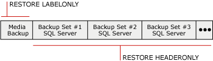

# Backup History and Header Information (SQL Server)
  A complete history of all [!INCLUDE[ssNoVersion](../../includes/ssnoversion-md.md)] backup and restore operations on a server instance is stored in the **msdb** database. This topic introduces the backup and restore history tables and also the [!INCLUDE[tsql](../../includes/tsql-md.md)] statements that are used to access backup history. The topic also discusses when listing database and transaction log files is useful and when to use media-header information compared to when to use backup-header information.  
  
> [!IMPORTANT]  
>  To manage the risk of losing recent changes to your backup and restore history, back up **msdb** frequently. For information about which of the system databases you must back up, see [Back Up and Restore of System Databases &#40;SQL Server&#41;](back-up-and-restore-of-system-databases-sql-server.md).  
  
 **In This Topic:**  
  
-   [Backup and Restore History Tables](#BnRHistoryTables)  
  
-   [Transact-SQL Statements for Accessing Backup History](#TsqlStatementsForBackupHistory)  
  
-   [Database and Transaction Log Files](#ListDbTlogFiles)  
  
-   [Media-Header Information](#MediaHeader)  
  
-   [Backup-Header Information](#BackupHeader)  
  
-   [Comparison of Media-Header and Backup-Header Information](#CompareMediaHeaderBackupHeader)  
  
-   [Backup Verification](#Verification)  
  
-   [Related Tasks](#RelatedTasks)  
  
##   Backup and Restore History Tables  
 This section introduces the history tables that store backup and restore metadata in the **msdb** system database.  
  
|History table|Description|  
|-------------------|-----------------|  
|[backupfile](/sql/relational-databases/system-tables/backupfile-transact-sql)|Contains one row for each data or log file that is backed up.|  
|[backupfilegroup](/sql/relational-databases/system-tables/backupfilegroup-transact-sql)|Contains a row for each filegroup in a backup set.|  
|[backupmediafamily](/sql/relational-databases/system-tables/backupmediafamily-transact-sql)|Contains one row for each media family. If a media family resides in a mirrored media set, the family has a separate row for each mirror in the media set.|  
|[backupmediaset](/sql/relational-databases/system-tables/backupmediaset-transact-sql)|Contains one row for each backup media set.|  
|[backupset](/sql/relational-databases/system-tables/backupset-transact-sql)|Contains a row for each backup set.|  
|[restorefile](/sql/relational-databases/system-tables/restorefile-transact-sql)|Contains one row for each restored file. This includes files restored indirectly by filegroup name.|  
|[restorefilegroup](/sql/relational-databases/system-tables/restorefilegroup-transact-sql)|Contains one row for each restored filegroup.|  
|[restorehistory](/sql/relational-databases/system-tables/restorehistory-transact-sql)|Contains one row for each restore operation.|  
  
> [!NOTE]  
>  When a restore is performed, backup history tables and restore history tables are modified.  
  
##   Transact-SQL Statements for Accessing Backup History  
 The restore information statements correspond with information stored in certain backup history tables.  
  
> [!IMPORTANT]  
>  The RESTORE FILELISTONLY, RESTORE HEADERONLY, RESTORE LABELONLY, and RESTORE VERIFYONLY Transact-SQL statements require CREATE DATABASE permission. This requirement secures your backup files and protects your backup information more fully than in previous versions. For information about this permission, see [GRANT Database Permissions &#40;Transact-SQL&#41;](/sql/t-sql/statements/grant-database-permissions-transact-sql).  
  
|Information statement|Backup history table|Description|  
|---------------------------|--------------------------|-----------------|  
|[RESTORE FILELISTONLY](/sql/t-sql/statements/restore-statements-filelistonly-transact-sql)|[backupfile](/sql/relational-databases/system-tables/backupfile-transact-sql)|Returns a result set that has a list of the database and log files that are contained in the specified backup set.   For more information, see "Listing Database and Transaction Log Files," later in this topic.|  
|[RESTORE HEADERONLY](/sql/t-sql/statements/restore-statements-headeronly-transact-sql)|[backupset](/sql/relational-databases/system-tables/backupset-transact-sql)|Retrieves all the backup header information for all backup sets on a particular backup device. The result from executing RESTORE HEADERONLY is a result set.   For more information, see "Viewing the Backup-Header Information," later in this topic.|  
|[RESTORE LABELONLY](/sql/t-sql/statements/restore-statements-labelonly-transact-sql)|[backupmediaset](/sql/relational-databases/system-tables/backupmediaset-transact-sql)|Returns a result set that contains information about the backup media on a specified backup device.   For more information, see "Viewing the Media-Header Information," later in this topic.|  
  
##   Database and Transaction Log Files  
 Information that is displayed when the database and transaction log files are listed in a backup includes the logical name, physical name, file type (database or log), filegroup membership, file size (in bytes), the maximum allowed file size, and the predefined file growth size (in bytes). This information is useful, in the following situations, to determine the names of the files in a database backup before you restore the database backup:  
  
-   You have lost a disk drive that contains one or more of the files for a database.  
  
     You can list the files in the database backup to determine which files were affected, and then restore those files onto a different drive when you restore the whole database; or restore just those files and apply any transaction log backups created since the database was backed up.  
  
-   You are restoring a database from one server onto another server, but the directory structure and drive mapping does not exist on the server.  
  
     Listing the files in the backup let you determine which files are affected. For example, the backup contains a file that it has to restore to drive E, but the destination server does not have a drive E. The file must be relocated to another location, such as drive Z, when the file is restored.  
  
##   Media-Header Information  
 Viewing the media header displays information about the media itself, instead of about the backups on the media. Media header information that is displayed includes the media name, description, name of the software that created the media header, and the date the media header was written.  
  
> [!NOTE]  
>  Viewing the media header is quick.  
  
 For more information, see [Comparison of Media-Header and Backup-Header Information](#CompareMediaHeaderBackupHeader), later in this topic.  
  
##   Backup-Header Information  
 Viewing the backup header displays information about all [!INCLUDE[ssNoVersion](../../includes/ssnoversion-md.md)] and non-[!INCLUDE[ssNoVersion](../../includes/ssnoversion-md.md)] backup sets on the media. Information that is displayed includes the types of backup devices that are used, the types of backup (for example, database, transaction, file, or differential database), and backup start and stop date/time information. This information is useful when you have to determine which backup set on the tape to restore, or the backups that are contained on the media.  
  
> [!NOTE]  
>  Viewing backup header information can take a long time for high-capacity tapes, because the whole media must be scanned to display information about each backup on the media.  
  
 For more information, see [Comparison of Media-Header and Backup-Header Information](#CompareMediaHeaderBackupHeader), later in this topic.  
  
### Which Backup Set to Restore  
 You can use information in the backup header to identify which backup set to restore. The Database Engine numbers each backup set on the backup media. This lets you identify the backup set you want to restore by using its position on the media. For example, the following media contains three backup sets.  
  
   
  
 To restore a specific backup set, specify the position number of the backup set you want to restore. For example, to restore the second backup set, specify 2 as the backup set to restore.  
  
##   Comparison of Media-Header and Backup-Header Information  
 The following illustration provides an example of the differences between viewing backup-header and media-header information. Obtaining the media header requires retrieving information from only the start of the tape. Obtaining the backup header requires scanning the whole tape to look at the header of every backup set.  
  
   
  
> [!NOTE]  
>  When you use media sets that have multiple media families, the media header and backup set are written to all media families. Therefore, you only have to provide a single media family for these reporting operations.  
  
 For information about how to view the media-header, see "Viewing the Media-Header Information," earlier in this topic.  
  
 For information about how to view the backup header information for all backup sets on a backup device, see "Viewing the Backup-Header Information," earlier in this topic.  
  
##   Backup Verification  
 Although not required, verifying a backup is a useful practice. Verifying a backup checks that the backup is intact physically, to ensure that all the files in the backup are readable and can be restored, and that you can restore your backup in the event you need to use it. It is important to understand that verifying a backup does not verify the structure of the data on the backup. However, if the backup was created using WITH CHECKSUMS, verifying the backup using WITH CHECKSUMS can provide a good indication of the reliability of the data on the backup.  
  
##   Related Tasks  
 **To delete old rows from backup and restore history tables**  
  
-   [sp_delete_backuphistory &#40;Transact-SQL&#41;](/sql/relational-databases/system-stored-procedures/sp-delete-backuphistory-transact-sql)  
  
 **To delete all rows for a specific database from backup and restore history tables**  
  
-   [sp_delete_database_backuphistory &#40;Transact-SQL&#41;](/sql/relational-databases/system-stored-procedures/sp-delete-database-backuphistory-transact-sql)  
  
 **To view the data and log files in a backup set**  
  
-   [RESTORE FILELISTONLY &#40;Transact-SQL&#41;](/sql/t-sql/statements/restore-statements-filelistonly-transact-sql)  
  
-   <xref:Microsoft.SqlServer.Management.Smo.Restore.ReadFileList%2A> (SMO)  
  
 **To view media header information**  
  
-   [RESTORE LABELONLY &#40;Transact-SQL&#41;](/sql/t-sql/statements/restore-statements-labelonly-transact-sql)  
  
-   [View the Properties and Contents of a Logical Backup Device &#40;SQL Server&#41;](view-the-properties-and-contents-of-a-logical-backup-device-sql-server.md)  
  
-   [View the Contents of a Backup Tape or File &#40;SQL Server&#41;](view-the-contents-of-a-backup-tape-or-file-sql-server.md)  
  
-   <xref:Microsoft.SqlServer.Management.Smo.Restore.ReadMediaHeader%2A> (SMO)  
  
 **To view backup header information**  
  
-   [RESTORE HEADERONLY &#40;Transact-SQL&#41;](/sql/t-sql/statements/restore-statements-headeronly-transact-sql)  
  
-   [View the Contents of a Backup Tape or File &#40;SQL Server&#41;](view-the-contents-of-a-backup-tape-or-file-sql-server.md)  
  
-   [View the Properties and Contents of a Logical Backup Device &#40;SQL Server&#41;](view-the-properties-and-contents-of-a-logical-backup-device-sql-server.md)  
  
-   <xref:Microsoft.SqlServer.Management.Smo.Restore.ReadBackupHeader%2A> (SMO)  
  
 **To delete old rows from backup and restore history tables**  
  
-   [sp_delete_backuphistory &#40;Transact-SQL&#41;](/sql/relational-databases/system-stored-procedures/sp-delete-backuphistory-transact-sql)  
  
 **To delete all rows for a specific database from backup and restore history tables**  
  
-   [sp_delete_database_backuphistory &#40;Transact-SQL&#41;](/sql/relational-databases/system-stored-procedures/sp-delete-database-backuphistory-transact-sql)  
  
 **To view media header information**  
  
-   [RESTORE LABELONLY &#40;Transact-SQL&#41;](/sql/t-sql/statements/restore-statements-labelonly-transact-sql)  
  
-   [View the Properties and Contents of a Logical Backup Device &#40;SQL Server&#41;](view-the-properties-and-contents-of-a-logical-backup-device-sql-server.md)  
  
-   [View the Contents of a Backup Tape or File &#40;SQL Server&#41;](view-the-contents-of-a-backup-tape-or-file-sql-server.md)  
  
-   <xref:Microsoft.SqlServer.Management.Smo.Restore.ReadMediaHeader%2A> (SMO)  
  
 **To view backup header information**  
  
-   [RESTORE HEADERONLY &#40;Transact-SQL&#41;](/sql/t-sql/statements/restore-statements-headeronly-transact-sql)  
  
-   [View the Contents of a Backup Tape or File &#40;SQL Server&#41;](view-the-contents-of-a-backup-tape-or-file-sql-server.md)  
  
-   [View the Properties and Contents of a Logical Backup Device &#40;SQL Server&#41;](view-the-properties-and-contents-of-a-logical-backup-device-sql-server.md)  
  
-   <xref:Microsoft.SqlServer.Management.Smo.Restore.ReadBackupHeader%2A> (SMO)  
  
 **To view the files in a backup set**  
  
-   [View the Data and Log Files in a Backup Set &#40;SQL Server&#41;](view-the-data-and-log-files-in-a-backup-set-sql-server.md)  
  
-   [RESTORE HEADERONLY &#40;Transact-SQL&#41;](/sql/t-sql/statements/restore-statements-headeronly-transact-sql)  
  
 **To verify a backup**  
  
-   [RESTORE VERIFYONLY &#40;Transact-SQL&#41;](/sql/t-sql/statements/restore-statements-verifyonly-transact-sql)  
  
-   <xref:Microsoft.SqlServer.Management.Smo.Restore.SqlVerify%2A> (SMO)  
  
## See Also  
 [BACKUP &#40;Transact-SQL&#41;](/sql/t-sql/statements/backup-transact-sql)   
 [Media Sets, Media Families, and Backup Sets &#40;SQL Server&#41;](media-sets-media-families-and-backup-sets-sql-server.md)   
 [Backup Devices &#40;SQL Server&#41;](backup-devices-sql-server.md)   
 [Mirrored Backup Media Sets &#40;SQL Server&#41;](mirrored-backup-media-sets-sql-server.md)   
 [Possible Media Errors During Backup and Restore &#40;SQL Server&#41;](possible-media-errors-during-backup-and-restore-sql-server.md)  
  
  
