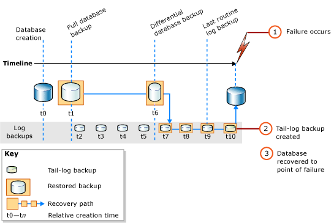

# Complete Database Restores (Full Recovery Model)
  In a complete database restore, the goal is to restore the whole database. The whole database is offline for the duration of the restore. Before any part of the database can come online, all data is recovered to a consistent point in which all parts of the database are at the same point in time and no uncommitted transactions exist.  
  
 Under the full recovery model, after you restore your data backup or backups, you must restore all subsequent transaction log backups and then recover the database. You can restore a database to a specific *recovery point* within one of these log backups. The recovery point can be a specific date and time, a marked transaction, or a log sequence number (LSN).  
  
 When restoring a database, particularly under the full recovery model or bulk-logged recovery model, you should use a single restore sequence. A *restore sequence* consists of one or more restore operations that move data through one or more of the phases of restore.  
  
> [!IMPORTANT]  
>  We recommend that you do not attach or restore databases from unknown or untrusted sources. These databases could contain malicious code that might execute unintended [!INCLUDE[tsql](../../includes/tsql-md.md)] code or cause errors by modifying the schema or the physical database structure. Before you use a database from an unknown or untrusted source, run [DBCC CHECKDB](/sql/t-sql/database-console-commands/dbcc-checkdb-transact-sql) on the database on a nonproduction server and also examine the code, such as stored procedures or other user-defined code, in the database.  
  
 **In this Topic:**  
  
-   [Restoring a Database to the Point of Failure](#PointOfFailure)  
  
-   [Restoring a Database to a Point Within a Log Backup](#PointWithinBackup)  
  
-   [Related Tasks](#RelatedTasks)  
  
> [!NOTE]  
>  For information about support for backups from earlier versions of [!INCLUDE[ssNoVersion](../../includes/ssnoversion-md.md)], see the "Compatibility Support" section of [RESTORE &#40;Transact-SQL&#41;](/sql/t-sql/statements/restore-statements-transact-sql).  
  
##  <a name="PointOfFailure"></a> Restoring a Database to the Point of Failure  
 Typically, recovering a database to the point of failure involves the following basic steps:  
  
1.  Back up the active transaction log (known as the tail of the log). This creates a tail-log backup. If the active transaction log is unavailable, all transactions in that part of the log are lost.  
  
    > [!IMPORTANT]  
    >  Under the bulk-logged recovery model, backing up any log that contains bulk-logged operations requires access to all data files in the database. If the data files cannot be accessed, the transaction log cannot be backed up. In that case, you have to manually redo all changes that were made since the most recent log backup.  
  
     For more information, see [Tail-Log Backups &#40;SQL Server&#41;](tail-log-backups-sql-server.md).  
  
2.  Restore the most recent full database backup without recovering the database (RESTORE DATABASE *database_name* FROM *backup_device* WITH NORECOVERY).  
  
3.  If differential backups exist, restore the most recent one without recovering the database (RESTORE DATABASE *database_name* FROM *differential_backup_device* WITH NORECOVERY).  
  
     Restoring the most recent differential backup reduces the number of log backups that must be restored.  
  
4.  Starting with the first transaction log backup that was created after the backup you just restored, restore the logs in sequence with NORECOVERY.  
  
5.  Recover the database (RESTORE DATABASE *database_name* WITH RECOVERY). Alternatively, this step can be combined with restoring the last log backup.  
  
 The following illustration shows this restore sequence. After a failure occurs (1), a tail-log backup is created (2). Next, the database is restored to the point of the failure. This involves restoring a database backup, a subsequent differential backup, and every log backup taken after the differential backup, including the tail-log backup.  
  
   
  
> [!NOTE]  
>  When you restore a database backup onto a different server instance, see [Copy Databases with Backup and Restore](../databases/copy-databases-with-backup-and-restore.md).  
  
###  <a name="TsqlSyntax"></a> Basic Transact-SQL RESTORE Syntax  
 The basic [RESTORE](/sql/t-sql/statements/restore-statements-transact-sql)[!INCLUDE[tsql](../../includes/tsql-md.md)] syntax for the restore sequence in the preceding illustration is as follows:  
  
1.  RESTORE DATABASE *database* FROM *full database backup* WITH NORECOVERY;  
  
2.  RESTORE DATABASE *database* FROM *full_differential_backup* WITH NORECOVERY;  
  
3.  RESTORE LOG *database* FROM *log_backup* WITH NORECOVERY;  
  
     Repeat this restore-log step for each additional log backup.  
  
4.  RESTORE DATABASE *database* WITH RECOVERY;  
  
###  <a name="ExampleToPoFTsql"></a> Example: Recovering to the Point of Failure (Transact-SQL)  
 The following [!INCLUDE[tsql](../../includes/tsql-md.md)] example shows the essential options in a restore sequence that restores the database to the point of failure. The example creates a tail-log backup of the database. Next, the example restores a full database backup and log backup and then restores the tail-log backup. The example recovers the database in a separate, final step.  
  
> [!NOTE]  
>  This example uses a database backup and log backup that is created in the "Using Database Backups Under the Full Recovery Model" section in [Full Database Backups &#40;SQL Server&#41;](full-database-backups-sql-server.md). Before the database backup, the [!INCLUDE[ssSampleDBobject](../../includes/sssampledbobject-md.md)] sample database was set to use the full recovery model.  
  
```  
USE master;  
--Create tail-log backup.  
BACKUP LOG AdventureWorks2012   
TO DISK = 'Z:\SQLServerBackups\AdventureWorksFullRM.bak'    
   WITH NORECOVERY;   
GO  
--Restore the full database backup (from backup set 1).  
RESTORE DATABASE AdventureWorks2012   
  FROM DISK = 'Z:\SQLServerBackups\AdventureWorksFullRM.bak'   
  WITH FILE=1,   
    NORECOVERY;  
  
--Restore the regular log backup (from backup set 2).  
RESTORE LOG AdventureWorks2012   
  FROM DISK = 'Z:\SQLServerBackups\AdventureWorksFullRM.bak'   
  WITH FILE=2,   
    NORECOVERY;  
  
--Restore the tail-log backup (from backup set 3).  
RESTORE LOG AdventureWorks2012   
  FROM DISK = 'Z:\SQLServerBackups\AdventureWorksFullRM.bak'  
  WITH FILE=3,   
    NORECOVERY;  
GO  
--recover the database:  
RESTORE DATABASE AdventureWorks2012 WITH RECOVERY;  
GO  
```  
  
##  <a name="PointWithinBackup"></a> Restoring a Database to a Point Within a Log Backup  
 Under the full recovery model, a complete database restore can usually be recovered to a point of time, a marked transaction, or an LSN within a log backup. However, under the bulk-logged recovery model, if the log backup contains bulk-logged changes, point-in-time recovery is not possible.  
  
### Sample Point-in-Time Restore Scenarios  
 The following example assumes a mission-critical database system for which a full database backup is created daily at midnight, a differential database backup is created on the hour, Monday through Saturday, and transaction log backups are created every 10 minutes throughout the day. To restore the database to the state is was in at 5:19 A.M. Wednesday, do the following:  
  
1.  Restore the full database backup that was created Tuesday at midnight.  
  
2.  Restore the differential database backup that was created at 5:00 A.M. on Wednesday.  
  
3.  Apply the transaction log backup that was created at 5:10 A.M. on Wednesday.  
  
4.  Apply the transaction log backup that was created 5:20 A.M. on Wednesday, specifying that the recovery process applies only to transactions that occurred before 5:19 A.M.  
  
 Alternatively, if the database needs to be restored to its state at 3:04 A.M. Thursday, but the differential database backup that was created at 3:00 A.M. Thursday is unavailable, do the following:  
  
1.  Restore the database backup that was created Wednesday at midnight.  
  
2.  Restore the differential database backup that was created at 2:00 A.M. on Thursday.  
  
3.  Apply all the transaction log backups created from 2:10 A.M. to 3:00 A.M. on Thursday.  
  
4.  Apply the transaction log backup that was created at 3:10 A.M. on Thursday, stopping the recovery process at 3:04 A.M.  
  
> [!NOTE]  
>  For an example of a point-in-time restore, see [Restore a SQL Server Database to a Point in Time &#40;Full Recovery Model&#41;](restore-a-sql-server-database-to-a-point-in-time-full-recovery-model.md).  
  
##  <a name="RelatedTasks"></a> Related Tasks  
 **To restore a full database backup**  
  
-   [Restore a Database Backup &#40;SQL Server Management Studio&#41;](restore-a-database-backup-using-ssms.md)  
  
-   [Restore a Database to a New Location &#40;SQL Server&#41;](restore-a-database-to-a-new-location-sql-server.md)  
  
 **To restore a differential database backup**  
  
-   [Restore a Differential Database Backup &#40;SQL Server&#41;](restore-a-differential-database-backup-sql-server.md)  
  
 **To restore a transaction log backup**  
  
-   [Restore a Transaction Log Backup &#40;SQL Server&#41;](restore-a-transaction-log-backup-sql-server.md)  
  
 **To restore a backup by using SQL Server Management Objects (SMO)**  
  
-   <xref:Microsoft.SqlServer.Management.Smo.Restore.SqlRestore%2A>  
  
 **To restore a database to a point within a log backup**  
  
-   [Restore a SQL Server Database to a Point in Time &#40;Full Recovery Model&#41;](restore-a-sql-server-database-to-a-point-in-time-full-recovery-model.md)  
  
-   [Recovery of Related  Databases That Contain Marked Transaction](recovery-of-related-databases-that-contain-marked-transaction.md)  
  
-   [Recover to a Log Sequence Number &#40;SQL Server&#41;](recover-to-a-log-sequence-number-sql-server.md)  
  
## See Also  
 [RESTORE &#40;Transact-SQL&#41;](/sql/t-sql/statements/restore-statements-transact-sql)   
 [BACKUP &#40;Transact-SQL&#41;](/sql/t-sql/statements/backup-transact-sql)   
 [Apply Transaction Log Backups &#40;SQL Server&#41;](transaction-log-backups-sql-server.md)   
 [sp_addumpdevice &#40;Transact-SQL&#41;](/sql/relational-databases/system-stored-procedures/sp-addumpdevice-transact-sql)   
 [Full Database Backups &#40;SQL Server&#41;](full-database-backups-sql-server.md)   
 [Differential Backups &#40;SQL Server&#41;](differential-backups-sql-server.md)   
 [Backup Overview &#40;SQL Server&#41;](backup-overview-sql-server.md)   
 [Restore and Recovery Overview &#40;SQL Server&#41;](restore-and-recovery-overview-sql-server.md)  
  
  
