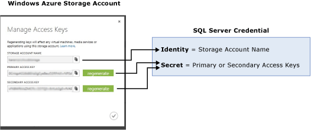
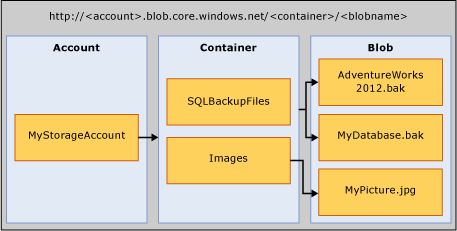

# SQL Server Backup to URL
  This topic introduces the concepts, requirements and components necessary to use the Windows Azure Blob storage service as a backup destination. The backup and restore functionality are same or similar to when using DISK or TAPE, with a few differences. The differences are and any notable exceptions, and a few code examples are included in this topic.  
  
## Requirements, Components, and Concepts  
 **In this section:**  
  
-   [Security](#security)  
  
-   [Introduction to Key Components and Concepts](#intorkeyconcepts)  
  
-   [Windows Azure Blob Storage Service](#Blob)  
  
-   [SQL Server Components](#sqlserver)  
  
-   [Limitations](#limitations)  
  
-   [Support for Backup/Restore Statements](#Support)  
  
-   [Using Backup Task in SQL Server Management Studio](sql-server-backup-to-url.md#BackupTaskSSMS)  
  
-   [SQL Server Backup to URL Using Maintenance Plan Wizard](sql-server-backup-to-url.md#MaintenanceWiz)  
  
-   [Restoring from Windows Azure storage Using SQL Server Management Studio](sql-server-backup-to-url.md#RestoreSSMS)  
  
###  <a name="security"></a> Security  
 The following are security considerations and requirements when backing up to or restoring from the Windows Azure Blob storage services.  
  
-   When creating a container for the Windows Azure Blob storage service, we recommend that you set the access to **private**. Setting the access to private restricts the access to users or accounts able to provide the necessary information to authenticate to the Windows Azure account.  
  
    > [!IMPORTANT]  
    >  [!INCLUDE[ssNoVersion](../../includes/ssnoversion-md.md)] requires Windows Azure account name and access key authentication to be stored in a [!INCLUDE[ssNoVersion](../../includes/ssnoversion-md.md)] Credential. This information is used to authenticate to the Windows Azure account when it performs backup or restore operations.  
  
-   The user account that is used to issue BACKUP or RESTORE commands should be in the **db_backup operator** database role with **Alter any credential** permissions.  
  
###  <a name="intorkeyconcepts"></a> Introduction to Key Components and Concepts  
 The following two sections introduce the Windows Azure Blob storage service, and the [!INCLUDE[ssNoVersion](../../includes/ssnoversion-md.md)] components used when backing up to or restoring from the Windows Azure Blob storage service. It is important to understand the components and the interaction between them to do a backup to or restore from the Windows Azure Blob storage service.  
  
 Creating a Windows Azure account is the first step to this process. [!INCLUDE[ssNoVersion](../../includes/ssnoversion-md.md)] uses the **Windows Azure storage account name** and its **access key** values to authenticate and write and read blobs to the storage service. The [!INCLUDE[ssNoVersion](../../includes/ssnoversion-md.md)] Credential stores this authentication information and is used during the backup or restore operations. For a complete walkthrough of creating a storage account and performing a simple restore, see [Tutorial Using Windows Azure Storage Service for SQL Server Backup and Restore](https://go.microsoft.com/fwlink/?LinkId=271615).  
  
   
  
###  <a name="Blob"></a> Windows Azure Blob Storage Service  
 **Storage Account:** The storage account is the starting point for all storage services. To access the Windows Azure Blob Storage service, first create a Windows Azure storage account. The **storage account name** and its **access key** properties are required to authenticate to the Windows Azure Blob Storage service and its components.  
  
 **Container:** A container provides a grouping of a set of Blobs, and can store an unlimited number of Blobs. To write a [!INCLUDE[ssNoVersion](../../includes/ssnoversion-md.md)] backup to the Windows Azure Blob service, you must have at least the root container created.  
  
 **Blob:** A file of any type and size. There are two types of blobs that can be stored in the Windows Azure Blob storage service: block and page blobs. [!INCLUDE[ssNoVersion](../../includes/ssnoversion-md.md)] backup uses page Blobs as the Blob type. Blobs are addressable using the following URL format: https://\<storage account>.blob.core.windows.net/\<container>/\<blob>  
  
   
  
 For more information about the Windows Azure Blob storage service, see [How to use the Windows Azure Blob Storage Service](http://www.windowsazure.com/develop/net/how-to-guides/blob-storage/)  
  
 For more information about page Blobs, see [Understanding Block and Page Blobs](https://msdn.microsoft.com/library/windowsazure/ee691964.aspx)  
  
###  <a name="sqlserver"></a> [!INCLUDE[ssNoVersion](../../includes/ssnoversion-md.md)] Components  
 **URL:** A URL specifies a Uniform Resource Identifier (URI) to a unique backup file. The URL is used to provide the location and name of the [!INCLUDE[ssNoVersion](../../includes/ssnoversion-md.md)] backup file. In this implementation, the only valid URL is one that points to a page Blob in a Windows Azure storage account. The URL must point to an actual Blob, not just a container. If the Blob does not exist, it is created. If an existing Blob is specified, BACKUP fails, unless the "WITH FORMAT" option is specified.  
  
> [!WARNING]  
>  If you choose to copy and upload a backup file to the Windows Azure Blob storage service, use page blob as your storage option. Restores from Block Blobs are not supported. RESTORE from a block blob type fails with an error.  
  
 Here is a sample URL value: http[s]://ACCOUNTNAME.Blob.core.windows.net/\<CONTAINER>/\<FILENAME.bak>. HTTPS is not required, but is recommended.  
  
 **Credential:** A [!INCLUDE[ssNoVersion](../../includes/ssnoversion-md.md)] credential is an object that is used to store authentication information required to connect to a resource outside of SQL Server.  Here, [!INCLUDE[ssNoVersion](../../includes/ssnoversion-md.md)] backup and restore processes use credential to authenticate to the Windows Azure Blob storage service. The Credential stores the name of the storage account and the storage account **access key** values. Once the credential is created, it must be specified in the WITH CREDENTIAL option when issuing the BACKUP/RESTORE statements. For more information about how to view, copy or regenerate storage account **access keys**, see [Storage Account Access Keys](https://msdn.microsoft.com/library/windowsazure/hh531566.aspx).  
  
 For step by step instructions about how to create a [!INCLUDE[ssNoVersion](../../includes/ssnoversion-md.md)] Credential, see [Create a Credential](#credential) example later in this topic.  
  
 For general information about credentials, see [Credentials](../security/authentication-access/credentials-database-engine.md)  
  
 For information, on other examples where credentials are used, see [Create a SQL Server Agent Proxy](../../ssms/agent/create-a-sql-server-agent-proxy.md).  
  
###  <a name="limitations"></a> Limitations  
  
-   Backup to premium storage is not supported.  
  
-   The maximum backup size supported is 1 TB.  
  
-   You can issue backup or restore statements by using TSQL, SMO, or PowerShell cmdlets. A backup to or restoring from the Windows Azure Blob storage service by using SQL Server Management Studio Backup or Restore wizard is not currently enabled.  
  
-   Creating a logical device name is not supported. So adding URL as a backup device using sp_dumpdevice or through SQL Server Management Studio is not supported.  
  
-   Appending to existing backup blobs is not supported. Backups to an existing Blob can only be overwritten by using the WITH FORMAT option.  
  
-   Backup to multiple blobs in a single backup operation is not supported. For example, the following returns an error:  
  
    ```  
    BACKUP DATABASE AdventureWorks2012   
    TO URL = 'https://mystorageaccount.blob.core.windows.net/mycontainer/AdventureWorks2012_1.bak'   
       URL = 'https://mystorageaccount.blob.core.windows.net/mycontainer/AdventureWorks2012_2.bak'   
          WITH CREDENTIAL = 'mycredential'   
         ,STATS = 5;  
    GO  
  
    ```  
  
-   Specifying a block size with `BACKUP` is not supported.  
  
-   Specifying `MAXTRANSFERSIZE` is not supported.  
  
-   Specifying backupset options - `RETAINDAYS` and `EXPIREDATE` are not supported.  
  
-   [!INCLUDE[ssNoVersion](../../includes/ssnoversion-md.md)] has a maximum limit of 259 characters for a backup device name. The BACKUP TO URL consumes 36 characters for the required elements used to specify the URL - 'https://.blob.core.windows.net//.bak', leaving 223 characters for account, container, and blob names put together.  
  
###  <a name="Support"></a> Support for Backup/Restore Statements  
  
|||||  
|-|-|-|-|  
|Backup/Restore Statement|Supported|Exceptions|Comments|  
|BACKUP|???|BLOCKSIZE, and MAXTRANSFERSIZE are not supported.|Requires WITH CREDENTIAL specified|  
|RESTORE|???||Requires WITH CREDENTIAL specified|  
|RESTORE FILELISTONLY|???||Requires WITH CREDENTIAL specified|  
|RESTORE HEADERONLY|???||Requires WITH CREDENTIAL specified|  
|RESTORE LABELONLY|???||Requires WITH CREDENTIAL specified|  
|RESTORE VERIFYONLY|???||Requires WITH CREDENTIAL specified|  
|RESTORE REWINDONLY|???|||  
  
 For syntax and general information about backup statements, see [BACKUP &#40;Transact-SQL&#41;](/sql/t-sql/statements/backup-transact-sql).  
  
 For syntax and general information about restore statements, see [RESTORE &#40;Transact-SQL&#41;](/sql/t-sql/statements/restore-statements-transact-sql).  
  
### Support for Backup Arguments  
  
|||||  
|-|-|-|-|  
|Argument|Supported|Exception|Comments|  
|DATABASE|???|||  
|LOG|???|||  
||  
|TO (URL)|???|Unlike DISK and TAPE, URL does not support specifying or creating a logical name.|This argument is used to specify the URL path for the backup file.|  
|MIRROR TO|???|||  
|**WITH OPTIONS:**||||  
|CREDENTIAL|???||WITH CREDENTIAL is only supported when using BACKUP TO URL option to back up to the Windows Azure Blob storage service.|  
|DIFFERENTIAL|???|||  
|COPY_ONLY|???|||  
|COMPRESSION&#124;NO_COMPRESSION|???|||  
|DESCRIPTION|???|||  
|NAME|???|||  
|EXPIREDATE &#124; RETAINDAYS|???|||  
|NOINIT &#124; INIT|???||This option is ignored if used.<br /><br /> Appending to blobs is not possible. To overwrite a backup use the FORMAT argument.|  
|NOSKIP &#124; SKIP|???|||  
|NOFORMAT &#124; FORMAT|???||This option is ignored if used.<br /><br /> A backup taken to an existing blob fails unless WITH FORMAT is specified. The existing blob is overwritten when WITH FORMAT is specified.|  
|MEDIADESCRIPTION|???|||  
|MEDIANAME|???|||  
|BLOCKSIZE|???|||  
|BUFFERCOUNT|???|||  
|MAXTRANSFERSIZE|???|||  
|NO_CHECKSUM &#124; CHECKSUM|???|||  
|STOP_ON_ERROR &#124; CONTINUE_AFTER_ERROR|???|||  
|STATS|???|||  
|REWIND &#124; NOREWIND|???|||  
|UNLOAD &#124; NOUNLOAD|???|||  
|NORECOVERY &#124; STANDBY|???|||  
|NO_TRUNCATE|???|||  
  
 For more information about backup arguments, see [BACKUP &#40;Transact-SQL&#41;](/sql/t-sql/statements/backup-transact-sql).  
  
### Support for Restore Arguments  
  
|||||  
|-|-|-|-|  
|Argument|Supported|Exceptions|Comments|  
|DATABASE|???|||  
|LOG|???|||  
|FROM (URL)|???||The FROM URL argument is used to specify the URL path for the backup file.|  
|**WITH Options:**||||  
|CREDENTIAL|???||WITH CREDENTIAL is only supported when using RESTORE FROM URL option to restore from Windows Azure Blob Storage service.|  
|PARTIAL|???|||  
|RECOVERY &#124; NORECOVERY &#124; STANDBY|???|||  
|LOADHISTORY|???|||  
|MOVE|???|||  
|REPLACE|???|||  
|RESTART|???|||  
|RESTRICTED_USER|???|||  
|FILE|???|||  
|PASSWORD|???|||  
|MEDIANAME|???|||  
|MEDIAPASSWORD|???|||  
|BLOCKSIZE|???|||  
|BUFFERCOUNT|???|||  
|MAXTRANSFERSIZE|???|||  
|CHECKSUM &#124; NO_CHECKSUM|???|||  
|STOP_ON_ERROR &#124; CONTINUE_AFTER_ERROR|???|||  
|FILESTREAM|???|||  
|STATS|???|||  
|REWIND &#124; NOREWIND|???|||  
|UNLOAD &#124; NOUNLOAD|???|||  
|KEEP_REPLICATION|???|||  
|KEEP_CDC|???|||  
|ENABLE_BROKER &#124; ERROR_BROKER_CONVERSATIONS &#124; NEW_BROKER|???|||  
|STOPAT &#124; STOPATMARK &#124; STOPBEFOREMARK|???|||  
  
 For more information about Restore arguments, see [RESTORE Arguments &#40;Transact-SQL&#41;](/sql/t-sql/statements/restore-statements-arguments-transact-sql).  
  
##  <a name="BackupTaskSSMS"></a> Using Backup Task in SQL Server Management Studio  
 The Backup task in SQL Server Management Studio has been enhanced to include URL as one of the destination options, and other supporting objects required to backup to Windows Azure storage like the SQL Credential.  
  
 The following steps describe the changes made to the Back Up Database task to allow for backing up to Windows Azure storage.:  
  
1.  Start SQL Server Management Studio and connect to the SQL Server instance.  Select a database you want to backup, and right click on **Tasks**, and select **Back Up..**. This opens the Back Up Database dialog box.  
  
2.  On the general page the **URL** option is used to create a backup to Windows Azure storage. When you select this option, you see other options enabled on this page:  
  
    1.  **File Name:** Name of the backup file.  
  
    2.  **SQL Credential:** You can either specify an existing SQL Server Credential, or can create a new one by clicking on the **Create** next to the SQL Credential box.  
  
        > [!IMPORTANT]  
        >  The dialog that opens when you click **Create** requires a management certificate or the publishing profile for the subscription. SQL Server currently supports publishing profile version 2.0. To download the supported version of the publishing profile, see [Download Publishing Profile 2.0](https://go.microsoft.com/fwlink/?LinkId=396421).  
        >   
        >  If you do not have access to the management certificate or publishing profile, you can create a SQL Credential by specifying the storage account name and access key information using Transact-SQL or SQL Server Management Studio. See the sample code in the [Create a Credential](#credential) section to create a credential using Transact-SQL. Alternatively, using SQL Server Management Studio, from the database engine instance, right click **Security**, select **New**, and select **Credential**. Specify the storage account name for **Identity** and the access key in the **Password** field.  
  
    3.  **Azure storage container:** The name of the Windows Azure storage container to store the backup files.  
  
    4.  **URL prefix:** This is built automatically using the information specified in the fields described in the previous steps. If you do edit this value manually, make sure it matches with the other information you provided previously. For example if you modify the storage URL, make sure the SQL Credential is set to authenticate to the same storage account.  
  
 When you select URL as the destination, certain options in the **Media Options** page are disabled.  The following topics have more information on the Back Up Database dialog:  
  
 [Back Up Database &#40;General Page&#41;](../../integration-services/general-page-of-integration-services-designers-options.md)  
  
 [Back Up Database &#40;Media Options Page&#41;](back-up-database-media-options-page.md)  
  
 [Back Up Database &#40;Backup Options Page&#41;](back-up-database-backup-options-page.md)  
  
 [Create Credential - Authenticate to Azure Storage](create-credential-authenticate-to-azure-storage.md)  
  
##  <a name="MaintenanceWiz"></a> SQL Server Backup to URL Using Maintenance Plan Wizard  
 Similar to the backup task described previously, the Maintenance Plan Wizard in SQL Server Management Studio has been enhanced to include **URL** as one of the destination options, and other supporting objects required to backup to Windows Azure storage like the SQL Credential. For more information, see  the **Define Backup Tasks** section in [Using Maintenance Plan Wizard](../maintenance-plans/use-the-maintenance-plan-wizard.md#SSMSProcedure).  
  
##  <a name="RestoreSSMS"></a> Restoring from Windows Azure storage Using SQL Server Management Studio  
 If you are restoring a database, **URL** is included as the device to restore from. Following steps describe the changes in the Restore task to allow restoring from Windows Azure storage:  
  
1.  When you select **Devices** in the **General** page of the Restore task in SQL Server Management Studio, this takes you to the **Select backup devices** dialog box which includes **URL** as a backup media type.  
  
2.  When you select **URL** and click **Add**, this opens the **Connect to Azure storage** dialog. Specify the SQL Credential information to authenticate to Windows Azure storage.  
  
3.  SQL Server then connects to Windows Azure storage using the SQL Credential information you provided and opens the **Locate Backup File in Windows Azure** dialog. The backup files residing in the storage are displayed on this page. Select the file you want to use to restore and click **OK**. This takes you back to the **Select Backup Devices** dialog, and Clicking **OK** on this dialog takes you back to the main **Restore** dialog where you will be able complete the restore.  For more information see, the following topics:  
  
     [Restore Database &#40;General Page&#41;](restore-database-general-page.md)  
  
     [Restore Database &#40;Files Page&#41;](restore-database-files-page.md)  
  
     [Restore Database &#40;Options Page&#41;](restore-database-options-page.md)  
  
##  <a name="Examples"></a> Code Examples  
 This section contains the following examples.  
  
-   [Create a Credential](#credential)  
  
-   [Backing up a complete database](#complete)  
  
-   [Backing up the database and log](#databaselog)  
  
-   [Creating a full file backup of the primary filegroup](#filebackup)  
  
-   [Creating a differential file backup of the primary filegroups](#differential)  
  
-   [Restoring a database and move files](#restoredbwithmove)  
  
-   [Restoring to a point-in-time using STOPAT](#PITR)  
  
###  <a name="credential"></a> Create a Credential  
 The following example creates a credential that stores the Windows Azure Storage authentication information.  
  
1.  **Tsql**  
  
    ```  
    IF NOT EXISTS  
    (SELECT * FROM sys.credentials   
    WHERE credential_identity = 'mycredential')  
    CREATE CREDENTIAL mycredential WITH IDENTITY = 'mystorageaccount'  
    ,SECRET = '<storage access key>' ;  
  
    ```  
  
2.  **C#**  
  
    ```  
    // Connect to default sql server instance on local machine  
    Server server = new Server(".");  
    string identity = "mystorageaccount";  
    string secret = "<storage access key>";  
  
    // Create a Credential  
    string credentialName = "mycredential";  
    Credential credential = new Credential(server, credentialName);  
    credential.Create(identity, secret);  
    ```  
  
3.  **PowerShell**  
  
    ```  
    # create variables  
    $storageAccount = "mystorageaccount"  
    $storageKey = "<storage access key>"  
    $secureString = convertto-securestring $storageKey  -asplaintext -force  
    $credentialName = "mycredential"  
  
    $srvPath = "SQLSERVER:\SQL\COMPUTERNAME\INSTANCENAME"  
    # for default instance, the $srvpath variable would be "SQLSERVER:\SQL\COMPUTERNAME\DEFAULT"  
  
    # Create a credential  
     New-SqlCredential -Name $credentialName -Path $srvpath -Identity $storageAccount -Secret $secureString  
  
    ```  
  
###  <a name="complete"></a> Backing up a complete database  
 The following example backs up the AdventureWorks2012 database to the Windows Azure Blob storage service.  
  
1.  **Tsql**  
  
    ```  
    BACKUP DATABASE AdventureWorks2012   
    TO URL = 'https://mystorageaccount.blob.core.windows.net/mycontainer/AdventureWorks2012.bak'   
          WITH CREDENTIAL = 'mycredential'   
         ,COMPRESSION  
         ,STATS = 5;  
    GO  
  
    ```  
  
1.  **C#**  
  
    ```  
    // Connect to default sql server instance on local machine  
    Server server = new Server(".");  
    string identity = "mystorageaccount";  
  
    string credentialName = "mycredential";  
    string dbName = "AdventureWorks2012";  
    string blobContainerName = "mycontainer";  
  
    // Generate Unique Url  
    string url = String.Format(@"https://{0}.blob.core.windows.net/{1}/{2}-{3}.bak",  
            identity,  
            blobContainerName,  
            dbName,  
            DateTime.Now.ToString("s").Replace(":", "-"));  
  
    // Backup to Url  
    Backup backup = new Backup();  
    backup.CredentialName = credentialName;  
    backup.Database = dbName;  
    backup.CompressionOption = BackupCompressionOptions.On;  
    backup.Devices.AddDevice(url, DeviceType.Url);  
    backup.SqlBackup(server);  
    ```  
  
2.  **PowerShell**  
  
    ```  
    # create variables  
    $backupUrlContainer = "https://mystorageaccount.blob.core.windows.net/mycontainer/"  
    $credentialName = "mycredential"  
    $srvPath = "SQLSERVER:\SQL\COMPUTERNAME\INSTANCENAME"   
    # for default instance, the $srvpath varilable would be "SQLSERVER:\SQL\COMPUTERNAME\DEFAULT"  
  
    # navigate to SQL Server Instance  
    CD $srvPath   
    $backupFile = $backupUrlContainer + "AdventureWorks2012" +  ".bak"  
    Backup-SqlDatabase -Database AdventureWorks2012 -backupFile $backupFile  -SqlCredential $credentialName -CompressionOption On  
  
    ```  
  
###  <a name="databaselog"></a> Backing up the database and log  
 The following example backups up the AdventureWorks2012 sample database, which uses the simple recovery model by default. To support log backups, the AdventureWorks2012 database is modified to use the full recovery model. The example then creates a full database backup to Windows Azure Blob, and after a period of update activity, backs up the log. This example creates a backup file name with a datetime stamp.  
  
1.  **Tsql**  
  
    ```  
    -- To permit log backups, before the full database backup, modify the database   
    -- to use the full recovery model.  
    USE master;  
    GO  
    ALTER DATABASE AdventureWorks2012  
       SET RECOVERY FULL;  
    GO  
  
    -- Back up the full AdventureWorks2012 database.  
           -- First create a file name for the backup file with DateTime stamp  
  
    DECLARE @Full_Filename AS VARCHAR (300);  
    SET @Full_Filename = 'https://mystorageaccount.blob.core.windows.net/mycontainer/AdventureWorks2012_Full_'+   
    REPLACE (REPLACE (REPLACE (CONVERT (VARCHAR (40), GETDATE (), 120), '-','_'),':', '_'),' ', '_') + '.bak';   
    --Back up Adventureworks2012 database  
  
    BACKUP DATABASE AdventureWorks2012  
    TO URL =  @Full_Filename  
    WITH CREDENTIAL = 'mycredential';  
    ,COMPRESSION  
    GO  
    -- Back up the AdventureWorks2012 log.  
    DECLARE @Log_Filename AS VARCHAR (300);  
    SET @Log_Filename = 'https://mystorageaccount.blob.core.windows.net/mycontainer/AdventureWorks2012_Log_'+   
    REPLACE (REPLACE (REPLACE (CONVERT (VARCHAR (40), GETDATE (), 120), '-','_'),':', '_'),' ', '_') + '.trn';  
    BACKUP LOG AdventureWorks2012  
     TO URL = @Log_Filename  
    WITH CREDENTIAL = 'mycredential'  
    ,COMPRESSION;  
    GO  
    ```  
  
2.  **C#**  
  
    ```  
    // Connect to default sql server instance on local machine  
    Server server = new Server(".");  
    string identity = "mystorageaccount";  
  
    string credentialName = "mycredential";  
    string dbName = "AdventureWorks2012";  
    string blobContainerName = "mycontainer";  
  
    // Generate Unique Url for data backup  
    string urlDataBackup = String.Format(@"https://{0}.blob.core.windows.net/{1}/{2}_Data-{3}.bak",  
            identity,  
            blobContainerName,  
            dbName,  
            DateTime.Now.ToString("s").Replace(":", "-"));  
  
    // Backup Database to Url  
    Backup backupData = new Backup();  
    backupData.CredentialName = credentialName;  
    backupData.Database = dbName;  
    backup.CompressionOption = BackupCompressionOptions.On;  
    backupData.Devices.AddDevice(urlDataBackup, DeviceType.Url);  
    backupData.SqlBackup(server);  
  
    // Generate Unique Url for data backup  
    string urlLogBackup = String.Format(@"https://{0}.blob.core.windows.net/{1}/{2}_Log-{3}.bak",  
            identity,  
            blobContainerName,  
            dbName,  
            DateTime.Now.ToString("s").Replace(":", "-"));  
  
    // Backup Database Log to Url  
    Backup backupLog = new Backup();  
    backupLog.CredentialName = credentialName;  
    backupLog.Database = dbName;  
    backup.CompressionOption = BackupCompressionOptions.On;  
    backupLog.Devices.AddDevice(urlLogBackup, DeviceType.Url);  
    backupLog.Action = BackupActionType.Log;  
    backupLog.SqlBackup(server);  
    ```  
  
3.  **PowerShell**  
  
    ```  
  
    #create variables  
    $backupUrlContainer = "https://mystorageaccount.blob.core.windows.net/mycontainer/"  
    $credentialName = "mycredential"  
    $srvPath = "SQLSERVER:\SQL\COMPUTERNAME\INSTANCENAME"  
    # for default instance, the $srvpath variable would be "SQLSERVER:\SQL\COMPUTERNAME\DEFAULT"  
  
    # navigate to theSQL Server Instance  
  
    CD $srvPath   
    #Create a unique file name for the full database backup  
    $backupFile = $backupUrlContainer + "AdventureWorks2012_" + (Get-Date).ToString("s").Replace("-","_").Replace(":", "_").Replace(" ","_").Replace("/", "_") +  ".bak"  
  
    #Backup Database to URL  
  
    Backup-SqlDatabase -Database AdventureWorks2012 -backupFile $backupFile  -SqlCredential $credentialName -CompressionOption On -BackupAction Database    
  
    #Create a unique file name for log backup  
  
    $backupFile = $backupUrlContainer + "AdventureWorks2012_" + (Get-Date).ToString("s").Replace("-","_").Replace(":", "_").Replace(" ","_").Replace("/", "_") +  ".trn"  
  
    #Backup Log to URL  
  
    Backup-SqlDatabase -Database AdventureWorks2012 -backupFile $backupFile  -SqlCredential $credentialName -CompressionOption On -BackupAction Log  
  
    ```  
  
###  <a name="filebackup"></a> Creating a full file backup of the primary filegroup  
 The following example creates a full file backup of the primary filegroup.  
  
1.  **Tsql**  
  
    ```  
    --Back up the files in Primary:  
    BACKUP DATABASE AdventureWorks2012  
       FILEGROUP = 'Primary'  
       TO URL = 'https://mystorageaccount.blob.core.windows.net/mycontainer/AdventureWorks2012files.bck'  
       WITH CREDENTIAL = 'mycredential'  
       ,COMPRESSION;  
    GO  
    ```  
  
2.  **C#**  
  
    ```  
    // Connect to default sql server instance on local machine  
    Server server = new Server(".");  
    string identity = "mystorageaccount";  
  
    string credentialName = "mycredential";  
    string dbName = "AdventureWorks2012";  
    string blobContainerName = "mycontainer";  
  
    // Generate Unique Url  
    string url = String.Format(@"https://{0}.blob.core.windows.net/{1}/{2}-{3}.bck",  
            identity,  
            blobContainerName,  
            dbName,  
            DateTime.Now.ToString("s").Replace(":", "-"));  
  
    // Backup to Url  
    Backup backup = new Backup();  
    backup.CredentialName = credentialName;  
    backup.Database = dbName;  
    backup.Action = BackupActionType.Files;  
    backup.DatabaseFileGroups.Add("PRIMARY");  
    backup.CompressionOption = BackupCompressionOptions.On;  
    backup.Devices.AddDevice(url, DeviceType.Url);  
    backup.SqlBackup(server);  
  
    ```  
  
3.  **PowerShell**  
  
    ```  
  
    #create variables  
    $backupUrlContainer = "https://mystorageaccount.blob.core.windows.net/mycontainer/"  
    $credentialName = "mycredential"  
    $srvPath = "SQLSERVER:\SQL\COMPUTERNAME\INSTANCENAME"  
    # for default instance, the $srvpath variable would be "SQLSERVER:\SQL\COMPUTERNAME\DEFAULT"  
  
    # navigate to the SQL Server Instance  
  
    CD $srvPath   
    #Create a unique file name for the file backup  
    $backupFile = $backupUrlContainer + "AdventureWorks2012_" + (Get-Date).ToString("s").Replace("-","_").Replace(":", "_").Replace(" ","_").Replace("/", "_") +  ".bck"  
  
    #Backup Primary File Group to URL  
  
    Backup-SqlDatabase -Database AdventureWorks2012 -backupFile $backupFile  -SqlCredential $credentialName -CompressionOption On -BackupAction Files -DatabaseFileGroup Primary  
  
    ```  
  
###  <a name="differential"></a> Creating a differential file backup of the primary filegroup  
 The following example creates a differential file backup of the primary filegroup.  
  
1.  **Tsql**  
  
    ```  
    --Back up the files in Primary:  
    BACKUP DATABASE AdventureWorks2012  
       FILEGROUP = 'Primary'  
       TO URL = 'https://mystorageaccount.blob.core.windows.net/mycontainer/AdventureWorks2012filesdiff.bck'  
       WITH   
          CREDENTIAL = 'mycredential'  
          ,COMPRESSION  
      ,DIFFERENTIAL;  
    GO  
  
    ```  
  
2.  **C#**  
  
    ```  
    // Connect to default sql server instance on local machine  
    Server server = new Server(".");  
    string identity = "mystorageaccount";  
  
    string credentialName = "mycredential";  
    string dbName = "AdventureWorks2012";  
    string blobContainerName = "mycontainer";  
  
    // Generate Unique Url  
    string url = String.Format(@"https://{0}.blob.core.windows.net/{1}/{2}-{3}.bak",  
            identity,  
            blobContainerName,  
            dbName,  
            DateTime.Now.ToString("s").Replace(":", "-"));  
  
    // Backup to Url  
    Backup backup = new Backup();  
    backup.CredentialName = credentialName;  
    backup.Database = dbName;  
    backup.Action = BackupActionType.Files;  
    backup.DatabaseFileGroups.Add("PRIMARY");  
    backup.Incremental = true;  
    backup.CompressionOption = BackupCompressionOptions.On;  
    backup.Devices.AddDevice(url, DeviceType.Url);  
    backup.SqlBackup(server);  
  
    ```  
  
3.  **PowerShell**  
  
    ```  
  
    #create variables  
    $backupUrlContainer = "https://mystorageaccount.blob.core.windows.net/mycontainer/"  
    $credentialName = "mycredential"  
    $srvPath = "SQLSERVER:\SQL\COMUTERNAME\INSTANCENAME"  
    # for default instance, the $srvpath variable would be "SQLSERVER:\SQL\COMPUTERNAME\DEFAULT"  
  
    # navigate to SQL Server Instance  
  
    CD $srvPath   
  
    #create a unique file name for the full backup  
    $backupdbFile = $backupUrlContainer + "AdventureWorks2012_" + (Get-Date).ToString("s").Replace("-","_").Replace(":", "_").Replace(" ","_").Replace("/", "_") +  ".bak"  
  
    #Create a differential backup of the primary filegroup  
  
    Backup-SqlDatabase -Database AdventureWorks2012 -backupFile $backupFile  -SqlCredential $credentialName -CompressionOption On -BackupAction Files -DatabaseFileGroup Primary -Incremental  
  
    ```  
  
###  <a name="restoredbwithmove"></a> Restore a database and move files  
 To restore a full database backup and move the restored database to C:\Program Files\Microsoft SQL Server\MSSQL12.MSSQLSERVER\MSSQL\Data directory, use the following steps.  
  
1.  **Tsql**  
  
    ```  
    -- Backup the tail of the log first  
  
    DECLARE @Log_Filename AS VARCHAR (300);  
    SET @Log_Filename = 'https://mystorageaccount.blob.core.windows.net/mycontainer/AdventureWorks2012_Log_'+   
    REPLACE (REPLACE (REPLACE (CONVERT (VARCHAR (40), GETDATE (), 120), '-','_'),':', '_'),' ', '_') + '.trn';  
    BACKUP LOG AdventureWorks2012  
     TO URL = @Log_Filename  
    WITH CREDENTIAL = 'mycredential'  
    ,NORECOVERY;  
    GO  
  
    RESTORE DATABASE AdventureWorks2012 FROM URL = 'https://mystorageaccount.blob.core.windows.net/mycontainer/AdventureWorks2012.bak'  
    WITH CREDENTIAL = 'mycredential'  
    ,MOVE 'AdventureWorks2012_data' to 'C:\Program Files\Microsoft SQL Server\myinstance\MSSQL\DATA\AdventureWorks2012.mdf'  
    ,MOVE 'AdventureWorks2012_log' to 'C:\Program Files\Microsoft SQL Server\myinstance\MSSQL\DATA\AdventureWorks2012.ldf'  
    ,STATS = 5  
  
    ```  
  
2.  **C#**  
  
    ```  
    // Connect to default sql server instance on local machine  
    Server server = new Server(".");  
    string identity = "mystorageaccount";  
  
    string credentialName = "mycredential";  
    string dbName = "AdventureWorks2012";  
    string blobContainerName = "mycontainer";  
  
    // Generate Unique Url  
    string urlBackupData = String.Format(@"https://{0}.blob.core.windows.net/{1}/{2}-Data{3}.bak",  
            identity,  
            blobContainerName,  
            dbName,  
            DateTime.Now.ToString("s").Replace(":", "-"));  
  
    // Backup to Url  
    Backup backup = new Backup();  
    backup.CredentialName = credentialName;  
    backup.Database = dbName;  
    backup.Devices.AddDevice(urlBackupData, DeviceType.Url);  
    backup.SqlBackup(server);  
  
    // Generate Unique Url for tail log backup  
    string urlTailLogBackup = String.Format(@"https://{0}.blob.core.windows.net/{1}/{2}-TailLog{3}.bak",  
            identity,  
            blobContainerName,  
            dbName,  
            DateTime.Now.ToString("s").Replace(":", "-"));  
  
    // Backup Tail Log to Url  
    Backup backupTailLog = new Backup();  
    backupTailLog.CredentialName = credentialName;  
    backupTailLog.Database = dbName;  
    backupTailLog.Action = BackupActionType.Log;  
    backupTailLog.NoRecovery = true;  
    backupTailLog.Devices.AddDevice(urlTailLogBackup, DeviceType.Url);  
    backupTailLog.SqlBackup(server);  
  
    // Restore a database and move files  
    string newDataFilePath = server.MasterDBLogPath  + @"\" + dbName + DateTime.Now.ToString("s").Replace(":", "-") + ".mdf";  
    string newLogFilePath = server.MasterDBLogPath  + @"\" + dbName + DateTime.Now.ToString("s").Replace(":", "-") + ".ldf";  
  
    Restore restore = new Restore();  
    restore.CredentialName = credentialName;  
    restore.Database = dbName;  
    restore.ReplaceDatabase = true;  
    restore.Devices.AddDevice(urlBackupData, DeviceType.Url);  
    restore.RelocateFiles.Add(new RelocateFile(dbName, newDataFilePath));  
    restore.RelocateFiles.Add(new RelocateFile(dbName+ "_Log", newLogFilePath));  
    restore.SqlRestore(server);  
  
    ```  
  
3.  **PowerShell**  
  
    ```  
  
    #create variables  
    $backupUrlContainer = "https://mystorageaccount.blob.core.windows.net/mycontainer/"  
    $credentialName = "mycredential"  
    $srvPath = "SQLSERVER:\SQL\COMPUTERNAME\INSTNACENAME"  
    # for default instance, the $srvpath variable would be "SQLSERVER:\SQL\COMPUTERNAME\DEFAULT"  
  
    # navigate to SQL Server Instance   
  
    CD $srvPath   
  
    #create a unique file name for the full backup  
    $backupdbFile = $backupUrlContainer + "AdventureWorks2012_" + (Get-Date).ToString("s").Replace("-","_").Replace(":", "_").Replace(" ","_").Replace("/", "_") +  ".bak"  
  
    # Full database backup to URL  
    Backup-SqlDatabase -Database AdventureWorks2012 -backupFile $backupdbFile  -SqlCredential $credentialName -CompressionOption On      
  
    #Create a unique file name for the tail log backup  
    $backuplogFile = $backupUrlContainer + "AdventureWorks2012_" + (Get-Date).ToString("s").Replace("-","_").Replace(":", "_").Replace(" ","_").Replace("/", "_") +  ".trn"  
  
    #Backup tail log to URL  
  
    Backup-SqlDatabase -Database AdventureWorks2012 -backupFile $backupFile  -SqlCredential $credentialName  -BackupAction Log -NoRecovery    
  
    # Restore Database and move files  
  
    $newDataFilePath = New-Object Microsoft.SqlServer.Management.Smo.RelocateFile ("AdventureWorks_Data","C:\Program Files\Microsoft SQL Server\myinstance\MSSQL\DATA\AdventureWorks2012.mdf")  
    $newLogFilePath = New-Object Microsoft.SqlServer.Management.Smo.RelocateFile("AdventureWorks_Log","C:\Program Files\Microsoft SQL Server\myinstance\MSSQL\DATA\AdventureWorks2012.ldf")  
  
    Restore-SqlDatabase -Database AdventureWorks2012 -SqlCredential $credentialName -BackupFile $backupdbFile -RelocateFile @($newDataFilePath,$newLogFilePath)  
  
    ```  
  
###  <a name="PITR"></a> Restoring to a point-in-time using STOPAT  
 The following example restores a database to its state to a point in time, and shows a restore operation.  
  
1.  **Tsql**  
  
    ```  
    RESTORE DATABASE AdventureWorks FROM URL = 'https://mystorageaccount.blob.core.windows.net/mycontainer/AdventureWorks2012.bak'   
    WITH   
     CREDENTIAL = 'mycredential'  
    ,MOVE 'AdventureWorks2012_data' to 'C:\Program Files\Microsoft SQL Server\myinstance\MSSQL\DATA\AdventureWorks2012.mdf'  
    ,Move 'AdventureWorks2012_log' to 'C:\Program Files\Microsoft SQL Server\myinstance\MSSQL\DATA\AdventureWorks2012.ldf'  
    ,NORECOVERY  
    --,REPLACE  
    ,STATS = 5;  
    GO   
  
    RESTORE LOG AdventureWorks FROM URL = 'https://mystorageaccount.blob.core.windows.net/mycontainer/AdventureWorks2012.trn'   
    WITH CREDENTIAL = 'mycredential'  
    ,RECOVERY   
    ,STOPAT = 'Oct 23, 2012 5:00 PM'   
    GO  
    ```  
  
2.  **C#**  
  
    ```  
    // Connect to default sql server instance on local machine  
    Server server = new Server(".");  
    string identity = "mystorageaccount";  
  
    string credentialName = "mycredential";  
    string dbName = "AdventureWorks2012";  
    string blobContainerName = "mycontainer";  
  
    // Generate Unique Url  
    string urlBackupData = String.Format(@"https://{0}.blob.core.windows.net/{1}/{2}-Data{3}.bak",  
            identity,  
            blobContainerName,  
            dbName,  
            DateTime.Now.ToString("s").Replace(":", "-"));  
  
    // Backup to Url  
    Backup backup = new Backup();  
    backup.CredentialName = credentialName;  
    backup.Database = dbName;  
    backup.Devices.AddDevice(urlBackupData, DeviceType.Url);  
    backup.SqlBackup(server);  
  
    // Generate Unique Url for Tail Log backup  
    string urlTailLogBackup = String.Format(@"https://{0}.blob.core.windows.net/{1}/{2}-TailLog{3}.bak",  
            identity,  
            blobContainerName,  
            dbName,  
            DateTime.Now.ToString("s").Replace(":", "-"));  
  
    // Backup Tail Log to Url  
    Backup backupTailLog = new Backup();  
    backupTailLog.CredentialName = credentialName;  
    backupTailLog.Database = dbName;  
    backupTailLog.Action = BackupActionType.Log;  
    backupTailLog.NoRecovery = true;  
    backupTailLog.Devices.AddDevice(urlTailLogBackup, DeviceType.Url);  
    backupTailLog.SqlBackup(server);  
  
    // Restore a database and move files  
    string newDataFilePath = server.MasterDBLogPath + @"\" + dbName + DateTime.Now.ToString("s").Replace(":", "-") + ".mdf";  
    string newLogFilePath = server.MasterDBLogPath + @"\" + dbName + DateTime.Now.ToString("s").Replace(":", "-") + ".ldf";  
  
    Restore restore = new Restore();  
    restore.CredentialName = credentialName;  
    restore.Database = dbName;  
    restore.ReplaceDatabase = true;  
    restore.NoRecovery = true;  
    restore.Devices.AddDevice(urlBackupData, DeviceType.Url);  
    restore.RelocateFiles.Add(new RelocateFile(dbName, newDataFilePath));  
    restore.RelocateFiles.Add(new RelocateFile(dbName + "_Log", newLogFilePath));  
    restore.SqlRestore(server);  
  
    // Restore transaction Log with stop at   
    Restore restoreLog = new Restore();  
    restoreLog.CredentialName = credentialName;  
    restoreLog.Database = dbName;  
    restoreLog.Action = RestoreActionType.Log;  
    restoreLog.Devices.AddDevice(urlBackupData, DeviceType.Url);  
    restoreLog.ToPointInTime = DateTime.Now.ToString();   
    restoreLog.SqlRestore(server);  
  
    ```  
  
3.  **PowerShell**  
  
    ```  
  
    #create variables  
    $backupUrlContainer = "https://mystorageaccount.blob.core.windows.net/mycontainer/"  
    $credentialName = "mycredential"  
    $srvPath = "SQLSERVER:\SQL\COMPUTERNAME\INSTANCENAME"  
    # for default instance, the $srvpath variable would be "SQLSERVER:\SQL\COMPUTERNAME\DEFAULT"  
  
    # Navigate to SQL Server Instance Directory  
  
    CD $srvPath   
  
    #create a unique file name for the full backup  
    $backupdbFile = $backupUrlContainer + "AdventureWorks2012_" + (Get-Date).ToString("s").Replace("-","_").Replace(":", "_").Replace(" ","_").Replace("/", "_") +  ".bak"  
  
    # Full database backup to URL  
    Backup-SqlDatabase -Database AdventureWorks2012 -backupFile $backupdbFile  -SqlCredential $credentialName -CompressionOption On     
  
    #Create a unique file name for the tail log backup  
    $backuplogFile = $backupUrlContainer + "AdventureWorks2012_" + (Get-Date).ToString("s").Replace("-","_").Replace(":", "_").Replace(" ","_").Replace("/", "_") +  ".trn"  
  
    #Backup tail log to URL  
  
    Backup-SqlDatabase -Database AdventureWorks2012 -backupFile $backupFile  -SqlCredential $credentialName  -BackupAction Log -NoRecovery     
  
    # Restore Database and move files  
  
    $newDataFilePath = New-Object Microsoft.SqlServer.Management.Smo.RelocateFile ("AdventureWorks_Data","C:\Program Files\Microsoft SQL Server\myinstance\MSSQL\DATA\AdventureWorks2012.mdf")  
    $newLogFilePath = New-Object Microsoft.SqlServer.Management.Smo.RelocateFile("AdventureWorks_Log","C:\Program Files\Microsoft SQL Server\myinstance\MSSQL\DATA\AdventureWorks2012.ldf")  
  
    Restore-SqlDatabase -Database AdventureWorks2012 -SqlCredential $credentialName -BackupFile $backupdbFile -RelocateFile @($newDataFilePath,$newLogFilePath) -NoRecovery    
  
    # Restore Transaction log with Stop At:  
    Restore-SqlDatabase -Database AdventureWorks2012 -SqlCredential $credentialName -BackupFile $backuplogFile  -ToPointInTime (Get-Date).ToString()  
  
    ```  
  
## See Also  
 [SQL Server Backup to URL Best Practices and Troubleshooting](sql-server-backup-to-url-best-practices-and-troubleshooting.md)   
 [Back Up and Restore of System Databases &#40;SQL Server&#41;](back-up-and-restore-of-system-databases-sql-server.md)   
 [Tutorial: SQL Server Backup and Restore to Windows Azure Blob Storage Service](../tutorial-sql-server-backup-and-restore-to-azure-blob-storage-service.md)  
  
  
