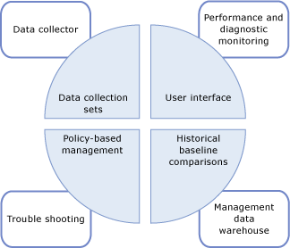
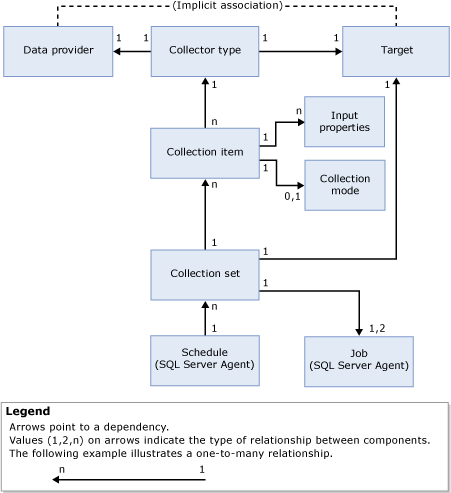

# Data Collection
  The Data Collector is a component of [!INCLUDE[ssCurrent](../../includes/sscurrent-md.md)] that collects different sets of data. Data collection either runs constantly or on a user-defined schedule. The data collector stores the collected data in a relational database known as the management data warehouse.  
  
## Benefits of Data Collector  
 The data collector is a core component of the data collection platform for [!INCLUDE[ssCurrent](../../includes/sscurrent-md.md)] and the tools that are provided by [!INCLUDE[ssNoVersion](../../includes/ssnoversion-md.md)]. The data collector provides one central point for data collection across your database servers and applications. This collection point can obtain data from a variety of sources and is not limited to performance data, unlike SQL Trace.  
  
 The data collector enables you to adjust the scope of data collection to suit your test and production environments. The data collector also uses a data warehouse, a relational database that enables you to manage the data that you collect by setting different retention periods for your data.  
  
 The data collector supports dynamic tuning for data collection and is extensible through its API. For more information, see [Data Collector Programming](../../database-engine/dev-guide/data-collector-programming.md).  
  
 The following illustration shows how the data collector fits in the overall strategy for data collection and data management in [!INCLUDE[ssCurrent](../../includes/sscurrent-md.md)].  
  
   
  
## Data Collector Concepts  
 The data collector is integrated with [!INCLUDE[ssNoVersion](../../includes/ssnoversion-md.md)] Agent and [!INCLUDE[ssISnoversion](../../includes/ssisnoversion-md.md)], and uses both extensively. Before you work with the data collector, you should therefore understand certain concepts related to each of these [!INCLUDE[ssNoVersion](../../includes/ssnoversion-md.md)] components.  
  
 [!INCLUDE[ssNoVersion](../../includes/ssnoversion-md.md)] Agent is used to schedule and run collection jobs. You should understand the following concepts:  
  
-   Job  
  
-   Job step  
  
-   Job schedule  
  
-   Subsystem  
  
-   Proxy accounts  
  
 For more information, see [Automated Administration Tasks &#40;SQL Server Agent&#41;](../../ssms/agent/sql-server-agent.md).  
  
 [!INCLUDE[ssISnoversion](../../includes/ssisnoversion-md.md)] ([!INCLUDE[ssIS](../../includes/ssis-md.md)]) is used to execute packages that collect data from individual data providers. You should be familiar with the following [!INCLUDE[ssIS](../../includes/ssis-md.md)] tools and concepts:  
  
-   [!INCLUDE[ssIS](../../includes/ssis-md.md)] package  
  
-   [!INCLUDE[ssIS](../../includes/ssis-md.md)] package configuration  
  
 For more information, see [Integration Services &#40;SSIS&#41; Packages](../../integration-services/integration-services-ssis-packages.md).  
  
## Data Collector Terminology  
 target  
 An instance of the [!INCLUDE[ssDE](../../includes/ssde-md.md)] in an edition of [!INCLUDE[ssNoVersion](../../includes/ssnoversion-md.md)] that supports Data Collection. For more information about supported editions, see the "Manageability" section of [Features Supported by the Editions of SQL Server 2014](../../getting-started/features-supported-by-the-editions-of-sql-server-2014.md).  
  
 A *target root* defines a subtree in the target hierarchy. A *target set* is the group of targets that results from applying a filter to a subtree defined by a target root. A target root can be a database, an instance of [!INCLUDE[ssNoVersion](../../includes/ssnoversion-md.md)], or a computer instance.  
  
 target type  
 The type of target, which has certain characteristics and behavior. For example, a [!INCLUDE[ssNoVersion](../../includes/ssnoversion-md.md)] instance target has different characteristics than a [!INCLUDE[ssNoVersion](../../includes/ssnoversion-md.md)] database target.  
  
 data provider  
 A known data source, specific to a target type, that provides data to a collector type.  
  
 collector type  
 A logical wrapper around the [!INCLUDE[ssIS](../../includes/ssis-md.md)] packages that provide the actual mechanism for collecting data and uploading it to the management data warehouse.  
  
 collection item  
 An instance of a collector type. A collection item is created with a specific set of input properties and a collection frequency.  
  
 collection set  
 A group of collection items. A collection set is a unit of data collection that a user can interact with through the user interface.  
  
 collection mode  
 The manner in which the data is collected and stored. Collection mode can be cached or non-cached. Cached mode supports continuous collection, whereas non-cached mode is intended for on-demand collection or a collection snapshot.  
  
 management data warehouse  
 A relational database used to store collected data.  
  
 The following illustration shows the dependencies and relationships between data collector components.  
  
   
  
 As shown in the illustration, the data provider is external to the data collector and by definition has an implicit relationship with the target. The data provider is specific to a particular target (for example, a [!INCLUDE[ssNoVersion](../../includes/ssnoversion-md.md)] service such as the relational engine) and provides data such as system views in [!INCLUDE[ssNoVersion](../../includes/ssnoversion-md.md)], Performance Monitor counters, and WMI providers, that can be consumed by the data collector.  
  
 The collector type is specific to a target type, based on the logical association of a data provider to a target type. The collector type defines how data is collected from a specific data provider (by using schematized parameters) and specifies the data storage schema. The data provider schema and storage schema are required in order to store the data that is collected. The collector type also provides the location of the management data warehouse, which can reside on the computer running data collection or on a different computer.  
  
 A collection item, shown in the illustration, is an instance of a specific collector type, parameterized with input parameters, such as the XML schema for the collector type. All collection items must operate on the same target root or on an empty target root. This enables the data collector to combine collector types from the operating system or from a specific target root, but not from different target roots.  
  
 A collection item has a collection frequency defined that determines how often snapshots of values are taken. Although it is a building block for a collection set, a collection item cannot exist on its own.  
  
 Collection sets are defined and deployed on a server instance and can be run independently of each other. Each collection set can be applied to a target that matches the target types of all the collector types that are part of a collection set. The collection set is run by a [!INCLUDE[ssNoVersion](../../includes/ssnoversion-md.md)] Agent job or jobs, and data is uploaded to the management data warehouse on a predefined schedule.  
  
 All the data collected by different instances within the collection set is uploaded to the management data warehouse on the same schedule. This schedule is defined as a shared [!INCLUDE[ssNoVersion](../../includes/ssnoversion-md.md)] Agent schedule and can be used by more than one collection set. A collection set is turned on or turned off as a single entity; collection items cannot be turned on or turned off individually.  
  
 When you create or update a collection set, you can configure the collection mode for collecting data and uploading it to the management data warehouse. The type of scheduling is determined by the type of collection: cached or non-cached. If the collection is cached, data collection and upload each run on a separate job. Collection runs on a schedule that starts when the [!INCLUDE[ssNoVersion](../../includes/ssnoversion-md.md)] Agent starts and it runs on the frequency specified in the collection item. Upload runs according to the schedule specified by the user.  
  
 Under non-cached collection, data collection and upload both run on a single job, but in two steps. Step one is collection, step two is upload. No schedule is required for on-demand collection.  
  
 After a collection set is enabled, data collection can start, either according to a schedule or on demand. When data collection starts, [!INCLUDE[ssNoVersion](../../includes/ssnoversion-md.md)] Agent spawns a process for the data collector, which in turn loads the [!INCLUDE[ssISnoversion](../../includes/ssisnoversion-md.md)] packages for the collection set. The collection items, which represent collection types, gather data from the appropriate data providers on the specified targets. When the collection cycle ends, this data is uploaded to the management data warehouse.  
  
## Data Collector Tasks  
  
|Task Description|Topic|  
|----------------------|-----------|  
|Describes how to manage different aspects of data collection, such as enabling or disabling data collection, changing a collection set configuration, or viewing data in the management data warehouse.|[Manage Data Collection](manage-data-collection.md)|  
|Describes how to use reports to obtain information for monitoring system capacity and troubleshooting system performance.|[System Data Collection Set Reports](system-data-collection-set-reports.md)|  
|Describes how to use the Management Data Warehouse to collect data from a server that is a data collection target.|[Management Data Warehouse](management-data-warehouse.md)|  
  
  
