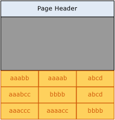
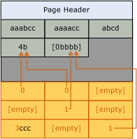

# Page Compression Implementation
  This topic summarizes how the [!INCLUDE[ssDE](../../includes/ssde-md.md)] implements page compression. This summary provides basic information to help you plan the storage space that you need for your data.  
  
 Page compression is similar for tables, table partitions, indexes, and index partitions. The following description of page compression for a table applies equally to page compression for all object types. The following examples compress character strings, but both prefix and dictionary compression apply the same principles to other data types.  
  
 Compressing the leaf level of tables and indexes with page compression consists of three operations in the following order:  
  
1.  Row compression  
  
2.  Prefix compression  
  
3.  Dictionary compression  
  
 When you use page compression, non-leaf-level pages of indexes are compressed by using only row compression. For more information about row compression, see [Row Compression Implementation](../data-compression/row-compression-implementation.md).  
  
## Prefix Compression  
 For each page that is being compressed, prefix compression uses the following steps:  
  
1.  For each column, a value is identified that can be used to reduce the storage space for the values in each column.  
  
2.  A row that represents the prefix values for each column is created and stored in the compression information (CI) structure that immediately follows the page header.  
  
3.  The repeated prefix values in the column are replaced by a reference to the corresponding prefix. If the value in a row does not exactly match the selected prefix value, a partial match can still be indicated.  
  
 The following illustration shows a sample page of a table before prefix compression.  
  
   
  
 The following illustration shows the same page after prefix compression. The prefix is moved to the header, and the column values are changed to references to the prefix.  
  
   
  
 In the first column of the first row, the value 4b indicates that the first four characters of the prefix (aaab) are present for that row, and also the character b. This makes the resultant value aaabb, which is the original value.  
  
## Dictionary Compression  
 After prefix compression has been completed, dictionary compression is applied. Dictionary compression searches for repeated values anywhere on the page, and stores them in the CI area. Unlike prefix compression, dictionary compression is not restricted to one column. Dictionary compression can replace repeated values that occur anywhere on a page. The following illustration shows the same page after dictionary compression.  
  
   
  
 Note that the value 4b has been referenced from different columns of the page.  
  
## When Page Compression Occurs  
 When a new table is created that has page compression, no compression occurs. However, the metadata for the table indicates that page compression should be used. As data is added to the first data page, data is row-compressed. Because the page is not full, no benefit is gained from page compression. When the page is full, the next row to be added initiates the page compression operation. The whole page is reviewed; each column is evaluated for prefix compression, and then all columns are evaluated for dictionary compression. If page compression has created enough room on the page for an additional row, the row is added, and the data is both row- and page-compressed. If the space gained by page compression minus the space that is required for the CI structure is not significant, page compression is not used for that page. Future rows either fit onto the new page or, if they do not fit, a new page is added to the table. Similar to the first page, the new page is not at first page-compressed.  
  
 When an existing table that contains data is converted to page compression, each page is rebuilt and evaluated. Rebuilding all the pages causes the rebuilding of the table, index, or partition.  
  
## See Also  
 [Data Compression](data-compression.md)   
 [Row Compression Implementation](row-compression-implementation.md)  
  
  
