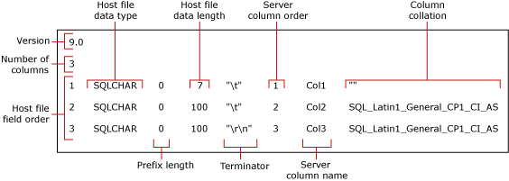

# Use a Format File to Skip a Table Column (SQL Server)
  This topic describes format files. You can use a format file to skip importing a table column when the field does not exist in the data file. A data file can contain fewer fields than the number of columns in the table only if the skipped columns are nullable and/or have default value.  
  
## Sample Table and Data File  
 The following examples require a table named `myTestSkipCol` in the [!INCLUDE[ssSampleDBnormal](../../includes/sssampledbnormal-md.md)] sample database under the **dbo** schema. Create this table as follows:  
  
```  
USE AdventureWorks2012;  
GO  
CREATE TABLE myTestSkipCol   
   (  
   Col1 smallint,  
   Col2 nvarchar(50) NULL,  
   Col3 nvarchar(50) not NULL  
   );  
GO  
```  
  
 The following examples use a sample data file, `myTestSkipCol2.dat`, which contains only two fields, although the corresponding table contains three columns:  
  
```  
1,DataForColumn3  
1,DataForColumn3  
1,DataForColumn3  
  
```  
  
 To bulk import data from `myTestSkipCol2.dat` into the `myTestSkipCol` table, the format file must map the first data field to `Col1`, the second field to `Col3`, skipping `Col2`.  
  
## Using a Non-XML Format File  
 You can modify a non-XML format file to skip a table column. Typically, this involves using the **bcp** utility to create a default non-XML format file and the modifying the default file in a text editor. The modified format file must map each existing fields to its corresponding table column and indicate which table column or columns to skip. Two alternatives exist for modifying a default non-XML data file. Either alternative indicates that the data field does not exist in the data file and that no data will be inserted into the corresponding table column.  
  
### Creating a Default Non-XML Format File  
 This topic uses the default non-XML format file that was created for the `myTestSkipCol` sample table by using the following **bcp** command:  
  
```  
bcp AdventureWorks2012..myTestSkipCol format nul -f myTestSkipCol_Default.fmt -c -T  
```  
  
 The previous command creates a non-XML format file, `myTestSkipCol_Default.fmt`. This format file is called a *default format file* because it is the form generated by **bcp**. Typically, a default format file describes a one-to-one correspondence between data-file fields and table columns.  
  
> [!IMPORTANT]  
>  You might have to specify the name of the server instance to which you are connecting. Also, you might have to specify the user name and password. For more information, see [bcp Utility](../../tools/bcp-utility.md).  
  
 The following illustration shows the values in this sample default format files. The illustration also shows the name of each format-file field.  
  
   
  
> [!NOTE]  
>  For more information about the format-file fields, see [Non-XML Format Files &#40;SQL Server&#41;](xml-format-files-sql-server.md).  
  
### Methods for Modifying a Non-XML Format File  
 To skip a table column, edit the default non-XML format file and modify the file by using one of the following alternative methods:  
  
-   The preferred method involves three basic steps. First, delete any format-file row that describes a field that is missing from the data file. Then, reduce the "Host file field order" value of each format-file row that follows a deleted row. The goal is sequential "Host file field order" values, 1 through *n*, that reflect the actual position of each data field in the data file. Finally, reduce the value in the "Number of columns" field to reflect the actual number of fields in the data file.  
  
     The following example is based on the default format file for the `myTestSkipCol` table, which is created in "Creating a Default Non-XML Format File," earlier in this topic. This modified format file maps the first data field to `Col1`, skips `Col2`, and maps the second data field to `Col3`. The row for `Col2` has been deleted. Other modifications are indicated in bold:  
  
    ```  
    9.0  
    2  
    1       SQLCHAR       0       7       "\t"     1     Col1         ""  
    2       SQLCHAR       0       100     "\r\n"   3     Col3         SQL_Latin1_General_CP1_CI_AS  
    ```  
  
-   Alternatively, to skip a table column, you can modify the definition of the format-file row that corresponds to the table column. In this format-file row, the "prefix length," "host file data length," and "server column order" values must be set to 0. Also, the "terminator" and "column collation" fields must be set to "" (NULL).  
  
     The "server column name" value requires a nonblank string, though the actual column name is not necessary. The remaining format fields require their default values.  
  
     The following example is also derived from the default format file for the `myTestSkipCol` table. Values that must be 0 or NULL are indicated in bold.  
  
    ```  
    9.0  
    3  
    1       SQLCHAR       0       7       "\t"     1     Col1         ""  
    2       SQLCHAR       00""0     Col2         ""  
    3       SQLCHAR       0       100     "\r\n"   3     Col3         SQL_Latin1_General_CP1_CI_AS  
    ```  
  
### Examples  
 The following examples are also based on the `myTestSkipCol` sample table and the `myTestSkipCol2.dat` sample data file that are created in "Sample Table and Data File," earlier in this topic.  
  
#### Using BULK INSERT  
 This example works by using either of the modified non-XML format files created in "Methods for Modifying a Non-XML Format File," earlier in this topic. In this example, the modified format file is named `C:\myTestSkipCol2.fmt`. To use `BULK INSERT` to bulk import the `myTestSkipCol2.dat` data file, in the [!INCLUDE[ssManStudioFull](../../../includes/ssmanstudiofull-md.md)] Query Editor, execute the following code:  
  
```  
USE AdventureWorks2012;  
GO  
BULK INSERT myTestSkipCol   
   FROM 'C:\myTestSkipCol2.dat'   
   WITH (FORMATFILE = 'C:\myTestSkipCol2.fmt');  
GO  
SELECT * FROM myTestSkipCol;  
GO  
```  
  
## Using an XML Format File  
 With an XML format file, you cannot skip a column when you are importing directly into a table by using a **bcp** command or a BULK INSERT statement. However, you can import into all but the last column of a table. If you have to skip any but the last column, you must create a view of the target table that contains only the columns contained in the data file. Then, you can bulk import data from that file into the view.  
  
 To use an XML format file to skip a table column by using OPENROWSET(BULK...), you have to provide explicit list of columns in the select list and also in the target table, as follows:  
  
 INSERT ...<column_list> SELECT <column_list> FROM OPENROWSET(BULK...)  
  
### Creating a Default XML Format File  
 The examples of modified format files are based on the `myTestSkipCol` sample table and data file that are created in "Sample Table and Data File," earlier in this topic. The following **bcp** command creates a default XML format file for the `myTestSkipCol` table:  
  
```  
bcp AdventureWorks2012..myTestSkipCol format nul -f myTestSkipCol_Default.xml -c -x -T  
```  
  
 The resulting default non-XML format file describes a one-to-one correspondence between data-file fields and table columns, as follows:  
  
```  
<?xml version="1.0"?>  
<BCPFORMAT xmlns="https://schemas.microsoft.com/sqlserver/2004/bulkload/format" xmlns:xsi="http://www.w3.org/2001/XMLSchema-instance">  
 <RECORD>  
  <FIELD ID="1" xsi:type="CharTerm" TERMINATOR="\t" MAX_LENGTH="7"/>  
  <FIELD ID="2" xsi:type="CharTerm" TERMINATOR="\t" MAX_LENGTH="100" COLLATION="SQL_Latin1_General_CP1_CI_AS"/>  
  <FIELD ID="3" xsi:type="CharTerm" TERMINATOR="\r\n" MAX_LENGTH="100" COLLATION="SQL_Latin1_General_CP1_CI_AS"/>  
 </RECORD>  
 <ROW>  
  <COLUMN SOURCE="1" NAME="Col1" xsi:type="SQLSMALLINT"/>  
  <COLUMN SOURCE="2" NAME="Col2" xsi:type="SQLNVARCHAR"/>  
  <COLUMN SOURCE="3" NAME="Col3" xsi:type="SQLNVARCHAR"/>  
 </ROW>  
</BCPFORMAT>  
```  
  
> [!NOTE]  
>  For information about the structure of XML format files, see [XML Format Files &#40;SQL Server&#41;](xml-format-files-sql-server.md).  
  
### Examples  
 The examples in this section use the `myTestSkipCol` sample table and the `myTestSkipCol2.dat` sample data file that are created in "Sample Table and Data File," earlier in this topic. To import the data from `myTestSkipCol2.dat` into the `myTestSkipCol` table, the examples use the following modified XML format file, `myTestSkipCol2-x.xml`. This is based on the format file that is created in "Creating a Default XML Format File," earlier in this topic.  
  
```  
<?xml version="1.0"?>  
<BCPFORMAT xmlns="https://schemas.microsoft.com/sqlserver/2004/bulkload/format" xmlns:xsi="http://www.w3.org/2001/XMLSchema-instance">  
 <RECORD>  
  <FIELD ID="1" xsi:type="CharTerm" TERMINATOR="," MAX_LENGTH="7"/>  
  <FIELD ID="2" xsi:type="CharTerm" TERMINATOR="\r\n" MAX_LENGTH="100" COLLATION="SQL_Latin1_General_CP1_CI_AS"/>  
 </RECORD>  
 <ROW>  
  <COLUMN SOURCE="1" NAME="Col1" xsi:type="SQLSMALLINT"/>  
  <COLUMN SOURCE="2" NAME="Col3" xsi:type="SQLNVARCHAR"/>  
 </ROW>  
</BCPFORMAT>  
```  
  
#### Using OPENROWSET(BULK...)  
 The following example uses the `OPENROWSET` bulk rowset provider and the `myTestSkipCol2.xml` format file. The example bulk imports the `myTestSkipCol2.dat` data file into the `myTestSkipCol` table. The statement contains an explicit list of columns in the select list and also in the target table, as required.  
  
 In the [!INCLUDE[ssManStudioFull](../../../includes/ssmanstudiofull-md.md)] Query Editor, execute the following code:  
  
```  
USE AdventureWorks2012;  
GO  
INSERT INTO myTestSkipCol  
  (Col1,Col3)  
    SELECT Col1,Col3  
      FROM  OPENROWSET(BULK  'C:\myTestSkipCol2.Dat',  
      FORMATFILE='C:\myTestSkipCol2.Xml'    
       ) as t1 ;  
GO  
```  
  
#### Using BULK IMPORT on a View  
 The following example creates the `v_myTestSkipCol` on the `myTestSkipCol` table. This view skips the second table column, `Col2`. The example then uses `BULK INSERT` to import the `myTestSkipCol2.dat` data file into this view.  
  
 In the [!INCLUDE[ssManStudioFull](../../../includes/ssmanstudiofull-md.md)] Query Editor, execute the following code:  
  
```  
CREATE VIEW v_myTestSkipCol AS  
    SELECT Col1,Col3  
    FROM myTestSkipCol;  
GO  
  
USE AdventureWorks2012;  
GO  
BULK INSERT v_myTestSkipCol  
FROM 'C:\myTestSkipCol2.dat'  
WITH (FORMATFILE='C:\myTestSkipCol2.xml');  
GO  
```  
  
## See Also  
 [bcp Utility](../../tools/bcp-utility.md)   
 [BULK INSERT &#40;Transact-SQL&#41;](/sql/t-sql/statements/bulk-insert-transact-sql)   
 [OPENROWSET &#40;Transact-SQL&#41;](/sql/t-sql/functions/openrowset-transact-sql)   
 [Use a Format File to Skip a Data Field &#40;SQL Server&#41;](use-a-format-file-to-skip-a-data-field-sql-server.md)   
 [Use a Format File to Map Table Columns to Data-File Fields &#40;SQL Server&#41;](use-a-format-file-to-map-table-columns-to-data-file-fields-sql-server.md)   
 [Use a Format File to Bulk Import Data &#40;SQL Server&#41;](use-a-format-file-to-bulk-import-data-sql-server.md)  
  
  
