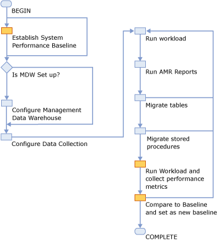

# Determining if a Table or Stored Procedure Should Be Ported to In-Memory OLTP
  The transaction performance collector in [!INCLUDE[ssManStudioFull](../../../includes/ssmanstudiofull-md.md)] helps you evaluate if In-Memory OLTP will improve your database application's performance. The transaction performance analysis report also indicates how much work you must do to enable In-Memory OLTP in your application. After you identify a disk-based table to port to In-Memory OLTP, you can use the [Memory Optimization Advisor](memory-optimization-advisor.md), to help you migrate the table. Similarly, the [Native Compilation Advisor](native-compilation-advisor.md) will help you port a stored procedure to a natively compiled stored procedure.  
  
 This topic will discuss how to:  
  
-   Configure Management Data Warehouse.  
  
-   Configure data collection.  
  
-   Generate transaction performance analysis reports to identify performance-critical tables and stored procedures.  
  
 For information about migration methodologies, see [In-Memory OLTP - Common Workload Patterns and Migration Considerations](https://msdn.microsoft.com/library/dn673538.aspx).  
  
 The transaction performance collector and the transaction performance analysis reports help you accomplish the following tasks:  
  
-   Analyze your workload to determine if In-Memory OLTP will improve performance. The transaction performance collector collects and evaluates the performance characteristics of your workload. . The transaction performance analysis report then recommends tables and stored procedures that would benefit most from conversion to In-Memory OLTP.  
  
-   Help you plan and execute your migration to In-Memory OLTP. The migration path from a disk based table to a memory-optimized table can be time consuming. The Memory-Optimization Advisor helps you identify the incompatibilities in your table that you must remove before moving the table to In-Memory OLTP. The Memory-Optimization Advisor also helps you understand the impact that the migration of a table to a memory-optimized table will have on your application.  
  
     You can see if your application would benefit from In-Memory OLTP, when you want to plan your migration to In-Memory OLTP, and whenever you work to migrate some of your tables and stored procedures to In-Memory OLTP.  
  
    > [!IMPORTANT]  
    >  The performance of a database system is dependent on a variety of factors, not all of which the transaction performance collector can observe and measure. Therefore, the transaction performance analysis report does not guarantee actual performance gains will match its predictions, if any predictions are made.  
  
 The transaction performance collector and the ability to generate a transaction performance analysis report are installed when you select **Management Tools-Basic** or **Management Tools-Advanced** when you install [!INCLUDE[ssCurrent](../../../includes/sscurrent-md.md)].  
  
## Best Practices  
 The recommended workflow is illustrated in the following flowchart. The yellow nodes represent optional procedures:  
  
   
  
 You can use any method to establish a performance baseline, including but not limited to using performance counter logs or the [!INCLUDE[ssNoVersion](../../../includes/ssnoversion-md.md)] Activity Monitor. The information to use in your performance baseline and your comparisons are:  
  
-   CPU consumption of [!INCLUDE[ssNoVersion](../../../includes/ssnoversion-md.md)].  
  
-   Memory consumption of [!INCLUDE[ssNoVersion](../../../includes/ssnoversion-md.md)].  
  
-   I/O activity of [!INCLUDE[ssNoVersion](../../../includes/ssnoversion-md.md)].  
  
-   Transaction throughput of the instance while processing transactions.  
  
 The transaction performance collector captures data every 15 minutes. To obtain usable results, run the transaction performance collector for at least one hour. To obtain best results, run the transaction performance collector for as much time as needed to capture data for your primary scenarios. Generate a transaction performance analysis report only after you have finished gathering data.  
  
 Configure the transaction performance collector to run on your [!INCLUDE[ssNoVersion](../../../includes/ssnoversion-md.md)] instance in production and collect the data on a [!INCLUDE[ssNoVersion](../../../includes/ssnoversion-md.md)] instance in your development (test) environment to ensure minimum overhead. For information on how to save data in a Management Data Warehouse database on a remote [!INCLUDE[ssNoVersion](../../../includes/ssnoversion-md.md)] instance, see [Configure Data Collection on a Remote SQL Server Instance](determining-if-a-table-or-stored-procedure-should-be-ported-to-in-memory-oltp.md#xxx).  
  
## Performance Impacts  
 The transaction performance collector consists of two data collection sets:  
  
-   Table Usage Analysis  
  
-   Stored Procedure Analysis  
  
 The collection sets collect data from three dynamic management views (DMV) every fifteen minutes, and upload the data to the database configured to act as the Management Data Warehouse. Uploading the collected data incurs minimal performance impact.  
  
## Use the Transaction Performance Collector  
 The following steps require [!INCLUDE[ssManStudioFull](../../../includes/ssmanstudiofull-md.md)] in [!INCLUDE[ssCurrent](../../../includes/sscurrent-md.md)].  
  
> [!IMPORTANT]  
>  Do not change the schema (for example, add or remove databases or create or drop tables) during profiling. If you change the schema of a database while collecting data, the database may not be accurately included in the report.  
  
### Configure Management Data Warehouse  
 Management Data Warehouse must be configured to use the transaction performance collector.  
  
 The version of the [!INCLUDE[ssNoVersion](../../../includes/ssnoversion-md.md)] instance that you will collect data on (profile) should be the same version or older than the [!INCLUDE[ssNoVersion](../../../includes/ssnoversion-md.md)] where Management Data Warehouse is configured.  
  
1.  In Object Explorer, expand **Management**.  
  
2.  Right click **Data Collection** and select **Tasks** and then **Configure Management Data Warehouse**. The **Configure Management Data Warehouse Wizard** begins.  
  
3.  Click **Next** to select the database that will act as the Management Data Warehouse.  
  
4.  Click **New** to create a new database to hold the profile data. After you finish creating the database, click **Next** in the wizard.  
  
5.  The next step in the wizard lets you add users and logins. You may map logins to role memberships for the MDW instance. This is not required to collect data from the local instance. If you are not collecting data from the local instance, you can grant database role membership `mdw_admin` to the account that will run transactions that will be profiled. When done, click **Next**.  
  
6.  Make sure that [!INCLUDE[ssNoVersion](../../../includes/ssnoversion-md.md)] Agent is running.  
  
7.  On the next screen, click **Finish** to exit the wizard.  
  
### Configure Data Collection on a Local [!INCLUDE[ssNoVersion](../../../includes/ssnoversion-md.md)] Instance  
 Data collection requires [!INCLUDE[ssNoVersion](../../../includes/ssnoversion-md.md)] Agent to be started. You only need to configure one data collector on a server.  
  
 A data collector can be configured on a SQL Server 2012 or later version of [!INCLUDE[ssNoVersion](../../../includes/ssnoversion-md.md)].  
  
 To configure data collection to upload to a Management Data Warehouse database on the same instance,  
  
1.  In **Object Explorer**, expand **Management**.  
  
2.  Right click **Data Collection**, select **Tasks**, and then **Configure Data Collection**. The **Configure Data Collection Wizard** begins.  
  
3.  Click **Next** to select the database that will collect the profile data.  
  
4.  Select the current [!INCLUDE[ssNoVersion](../../../includes/ssnoversion-md.md)] instance and a Management Data Warehouse database on that instance.  
  
5.  In the box labeled **Select data collector sets you want to enable**, select **Transaction Performance Collection Sets**. Click **Next** when done.  
  
6.  Verify the selections. Click **Back** to modify the settings. Click **Finish** when done.  
  
###   Configure Data Collection on a Remote [!INCLUDE[ssNoVersion](../../../includes/ssnoversion-md.md)] Instance  
 Data collection requires [!INCLUDE[ssNoVersion](../../../includes/ssnoversion-md.md)] Agent to be started on the instance that will collect the data.  
  
 A data collector can be configured on a SQL Server 2012 or later version of [!INCLUDE[ssNoVersion](../../../includes/ssnoversion-md.md)].  
  
 You need a [!INCLUDE[ssNoVersion](../../../includes/ssnoversion-md.md)] Agent proxy established with the correct credential for a data collector to upload data to a Management Data Warehouse database on an instance that is different from where transactions will be profiled. To enable a [!INCLUDE[ssNoVersion](../../../includes/ssnoversion-md.md)] Agent proxy, you must first establish a credential with a domain-enabled login. The domain-enabled login must be a member of `mdw_admin` group for the Management Data Warehouse database. See [How to: Create a Credential (SQL Server Management Studio)](../security/authentication-access/create-a-credential.md) for information on how to create a credential.  
  
 To configure data collection to upload to a Management Data Warehouse database on a different instance,  
  
1.  On the instance that contains the disk-based objects that you want to migrate to In-Memory OLTP, expand the **Management** node in Object Explorer.  
  
2.  Right click **Data Collection** and select **Tasks** and then **Configure Data Collection**. The **Configure Data Collection Wizard** begins.  
  
3.  Click **Next** to select the database that will collect the profile data.  
  
4.  Make sure that a Management Data Warehouse database exists on the other [!INCLUDE[ssNoVersion](../../../includes/ssnoversion-md.md)] instance.  
  
5.  Select another [!INCLUDE[ssNoVersion](../../../includes/ssnoversion-md.md)] instance and a Management Data Warehouse database on that instance.  
  
     The version of the [!INCLUDE[ssNoVersion](../../../includes/ssnoversion-md.md)] instance that you will collect data on (profile) should be the same version or older than the [!INCLUDE[ssNoVersion](../../../includes/ssnoversion-md.md)] where Management Data Warehouse is configured.  
  
6.  In the box labeled **Select data collector sets you want to enable**, select **Transaction Performance Collection Sets**.  
  
7.  Select **Use a [!INCLUDE[ssNoVersion](../../../includes/ssnoversion-md.md)] Agent proxy for remote uploads**.  
  
8.  Click **Next** when done.  
  
9. Select the proxy.  
  
     If you want to create a new [!INCLUDE[ssNoVersion](../../../includes/ssnoversion-md.md)] Agent proxy,  
  
    1.  Click **New** to display the **New Proxy Account** dialog box.  
  
    2.  In the **New Proxy Account** dialog box, enter the name of the proxy, select the credential, and optionally enter a description. Then, click **Principals**.  
  
    3.  Click **Add** and select **Msdb** role.  
  
    4.  Select `dc_proxy` and click **OK**. Then click **OK** again.  
  
     After the correct proxy is selected, click **Next**.  
  
10. To configure System Collection Sets, check **System Collection Sets** and click **Next**.  
  
11. Verify the selections. Click **Back** to modify the settings. Clicck **Finish** when done.  
  
 Data collection sets should now be configured and running on your instance.  
  
### Generate Reports  
 You can generate transaction performance analysis reports by right clicking the database of the Management Data Warehouse and selecting **Reports**, then **Management Data Warehouse**, and then **Transaction Performance Analysis Overview**.  
  
 The report collects information about all user databases on the workload server. If your Management Data Warehouse (MDW) database is on the local computer, you will see the MDW database(s) in the report.  
  
 A stored procedure with high ratio of CPU time to elapsed time is a candidate for migration. The report shows all table references, because natively compiled stored procedures can only reference memory-optimized tables, which can add to the migration cost.  
  
 The details report for a table consists of three sections:  
  
-   Scan Statistics Section  
  
     This section includes a single table that shows the statistics that were collected about scans on the database table. The columns are:  
  
    -   Percent of total accesses. The percentage of scans and seeks on this table with respect to the activity of the entire database. The higher this percentage, the more heavily used the table is compared to other tables in the database.  
  
    -   Lookup Statistics/Range Scan Statistics. This column records the number of point lookups and range scans (index scans and table scans) conducted on the table during profiling. Average per transaction is an estimate.  
  
    -   Interop Gain and Native Gain. These columns estimate the amount of performance benefit a point lookup or range scan would have if the table is converted to a memory-optimized table.  
  
-   Contention Statistics Section  
  
     This section includes a table that shows contention on the database table. For more information regarding database latches and locks, please see [Locking Architecture](https://msdn.microsoft.com/library/aa224738\(v=sql.80\).aspx). The columns are as follows:  
  
    -   Percent of total waits. The percentage of latch and lock waits on this database table compared to activity of the database. The higher this percentage, the more heavily used the table is compared to other tables in the database.  
  
    -   Latch Statistics. These columns record the number of latch waits for queries involving for this table. For information on latches, see [Latching](https://msdn.microsoft.com/library/aa224727\(v=SQL.80\).aspx). The higher this number, the more latch contention on the table.  
  
    -   Lock Statistics. This group of columns record the number of page lock acquisitions and waits for queries for this table. For more information on locks, see [Understanding Locking in SQL Server](https://msdn.microsoft.com/library/aa213039\(v=SQL.80\).aspx). The more waits, the more lock contention on the table.  
  
-   Migration Difficulties Section  
  
     This section includes a table that shows the difficulty of converting this database table to a memory-optimized table. A higher difficulty rating indicates more difficultly to convert the table. To see details to convert this database table, please use the [Memory Optimization Advisor](memory-optimization-advisor.md).  
  
 Scan and contention statistics on the table details report is gathered and aggregated from [sys.dm_db_index_operational_stats &#40;Transact-SQL&#41;](/sql/relational-databases/system-dynamic-management-views/sys-dm-db-index-operational-stats-transact-sql).  
  
 The details report for a stored procedure consists of two sections:  
  
-   Execution Statistics Section  
  
     This section includes a table that shows the statistics that were collected about the stored procedure's executions. The columns are as follows:  
  
    -   Cached Time. The time this execution plan is cached. If the stored procedure drops out of the plan cache and re-enters, there will be times for each cache.  
  
    -   Total CPU Time. The total CPU time that the stored procedure consumed during profiling. The higher this number, the more CPU the stored procedure used.  
  
    -   Total Execution Time. The total amount of execution time the stored procedure used during profiling. The higher the difference between this number and the CPU time is, the less efficiently the stored procedure is using the CPU.  
  
    -   Total Cache Missed. The number of cache misses (reads from physical storage) that is caused by the stored procedure's executions during profiling.  
  
    -   Execution Count. The number of times this stored procedure executed during profiling.  
  
-   Table References Section  
  
     This section includes a table that shows the tables to which this stored procedure refers. Before converting the stored procedure into a natively compiled stored procedure, all of these tables must be converted to memory-optimized tables, and they must stay on the same server and database.  
  
 Execution Statistics on the stored procedure details report is gathered and aggregated from [sys.dm_exec_procedure_stats &#40;Transact-SQL&#41;](/sql/relational-databases/system-dynamic-management-views/sys-dm-exec-procedure-stats-transact-sql). The references are obtained from [sys.sql_expression_dependencies &#40;Transact-SQL&#41;](/sql/relational-databases/system-catalog-views/sys-sql-expression-dependencies-transact-sql).  
  
 To see details about how to convert a stored procedure to a natively compiled stored procedure, please use the [Native Compilation Advisor](native-compilation-advisor.md).  
  
## See Also  
 [Migrating to In-Memory OLTP](migrating-to-in-memory-oltp.md)  
  
  
