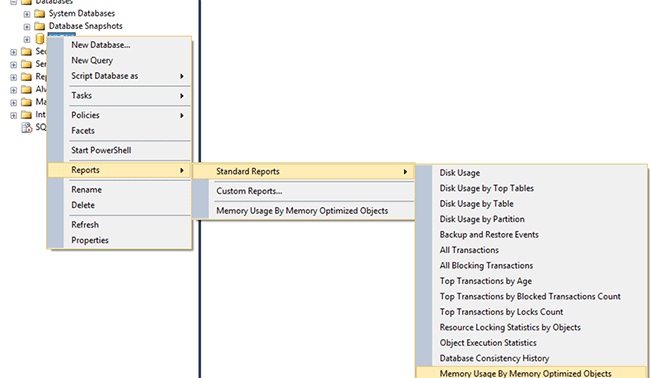

# Monitor and Troubleshoot Memory Usage
  [!INCLUDE[hek_1](../../includes/hek-1-md.md)] consumes memory in different patterns than disk-based tables. You can monitor the amount of memory allocated and used by memory-optimized tables and indexes in your database using the DMVs or performance counters provided for memory and the garbage collection subsystem.  This gives you visibility at both the system and database level and lets you prevent problems due to memory exhaustion.  
  
 This topic covers monitoring your [!INCLUDE[hek_2](../../../includes/hek-2-md.md)] memory usage.  
  
  
##  <a name="bkmk_CreateDB"></a> Create a sample database with memory-optimized tables  
 You can skip this section if you already have a database with memory-optimized tables.  
  
 The following steps create a database with three memory-optimized tables that you can use in the remainder of this topic. In the example, we mapped the database to a resource pool so that we can control how much memory can be taken by memory-optimized tables.  
  
1.  Launch [!INCLUDE[ssManStudioFull](../../../includes/ssmanstudiofull-md.md)].  
  
2.  Click **New Query**.  
  
3.  Paste this code into the new query window and execute each section.  
  
    ```  
    -- create a database to be used  
    CREATE DATABASE IMOLTP_DB  
    GO  
  
    ALTER DATABASE IMOLTP_DB ADD FILEGROUP IMOLTP_DB_xtp_fg CONTAINS MEMORY_OPTIMIZED_DATA  
    ALTER DATABASE IMOLTP_DB ADD FILE( NAME = 'IMOLTP_DB_xtp' , FILENAME = 'C:\Data\IMOLTP_DB_xtp') TO FILEGROUP IMOLTP_DB_xtp_fg;  
    GO  
  
    USE IMOLTP_DB  
    GO  
  
    -- create the resoure pool  
    CREATE RESOURCE POOL PoolIMOLTP WITH (MAX_MEMORY_PERCENT = 60);  
    ALTER RESOURCE GOVERNOR RECONFIGURE;  
    GO  
  
    -- bind the database to a resource pool  
    EXEC sp_xtp_bind_db_resource_pool 'IMOLTP_DB', 'PoolIMOLTP'  
  
    -- you can query the binding using the catalog view as described here  
    SELECT d.database_id  
         , d.name  
         , d.resource_pool_id  
    FROM sys.databases d  
    GO  
  
    -- take database offline/online to finalize the binding to the resource pool  
    USE master  
    GO  
  
    ALTER DATABASE IMOLTP_DB SET OFFLINE  
    GO  
    ALTER DATABASE IMOLTP_DB SET ONLINE  
    GO  
  
    -- create some tables  
    USE IMOLTP_DB  
    GO  
  
    -- create table t1  
    CREATE TABLE dbo.t1 (  
           c1 int NOT NULL CONSTRAINT [pk_t1_c1] PRIMARY KEY NONCLUSTERED  
         , c2 char(40) NOT NULL  
         , c3 char(8000) NOT NULL  
         ) WITH (MEMORY_OPTIMIZED = ON, DURABILITY = SCHEMA_AND_DATA)  
    GO  
  
    -- load t1 150K rows  
    DECLARE @i int = 0  
    BEGIN TRAN  
    WHILE (@i <= 150000)  
       BEGIN  
          INSERT t1 VALUES (@i, 'a', replicate ('b', 8000))  
          SET @i += 1;  
       END  
    Commit  
    GO  
  
    -- Create another table, t2  
    CREATE TABLE dbo.t2 (  
           c1 int NOT NULL CONSTRAINT [pk_t2_c1] PRIMARY KEY NONCLUSTERED  
         , c2 char(40) NOT NULL  
         , c3 char(8000) NOT NULL  
         ) WITH (MEMORY_OPTIMIZED = ON, DURABILITY = SCHEMA_AND_DATA)  
    GO  
  
    -- Create another table, t3   
    CREATE TABLE dbo.t3 (  
           c1 int NOT NULL CONSTRAINT [pk_t3_c1] PRIMARY KEY NONCLUSTERED HASH (c1) WITH (BUCKET_COUNT = 1000000)  
         , c2 char(40) NOT NULL  
         , c3 char(8000) NOT NULL  
         ) WITH (MEMORY_OPTIMIZED = ON, DURABILITY = SCHEMA_AND_DATA)  
    GO  
    ```  
  
##  Monitoring Memory Usage  
  
###  Using [!INCLUDE[ssManStudioFull](../../../includes/ssmanstudiofull-md.md)]  
 [!INCLUDE[ssSQL14](../../includes/sssql14-md.md)] ships with built-in standard reports to monitor the memory consumed by in-memory tables. You can access these reports using Object Explorer as described [here](https://blogs.msdn.com/b/managingsql/archive/2006/05/16/ssms-reports-1.aspx). You can also use the object explorer to monitor memory consumed by individual memory-optimized tables.  
  
#### Consumption at the database level  
 You can monitor memory use at the database level as follows.  
  
1.  Launch [!INCLUDE[ssManStudioFull](../../../includes/ssmanstudiofull-md.md)] and connect to a server.  
  
2.  In Object Explorer, right-click the database you want reports on.  
  
3.  In the context menu select, **Reports** -> **Standard Reports** -> **Memory Usage By Memory Optimized Objects**  
  
   
  
 This report shows memory consumption by the database we created above.  
  
   
  
###  Using DMVs  
 There are a number of DMVs available to monitor memory consumed by memory-optimized tables, indexes, system objects, and by run-time structures.  
  
#### Memory consumption by memory-optimized tables and indexes  
 You can find memory consumption for all user tables, indexes, and system objects by querying `sys.dm_db_xtp_table_memory_stats` as shown here.  
  
```sql  
SELECT object_name(object_id) AS Name  
     , *  
   FROM sys.dm_db_xtp_table_memory_stats  
```  
  
 **Sample Output**  
  
```  
Name       object_id   memory_allocated_for_table_kb memory_used_by_table_kb memory_allocated_for_indexes_kb memory_used_by_indexes_kb  
---------- ----------- ----------------------------- ----------------------- ------------------------------- -------------------------  
t3         629577281   0                             0                       128                             0  
t1         565577053   1372928                       1200008                 7872                            1942  
t2         597577167   0                             0                       128                             0  
NULL       -6          0                             0                       2                               2  
NULL       -5          0                             0                       24                              24  
NULL       -4          0                             0                       2                               2  
NULL       -3          0                             0                       2                               2  
NULL       -2          192                           25                      16                              16  
```  
  
 For more information see [sys.dm_db_xtp_table_memory_stats](https://msdn.microsoft.com/99b8a95f-d04b-4edb-a764-17b95581d071).  
  
#### Memory consumption by internal system structures  
 Memory is also consumed by system objects, such as, transactional structures, buffers for data and delta files, garbage collection structures, and more. You can find the memory used for these system objects by querying `sys.dm_xtp_system_memory_consumers` as shown here.  
  
```sql  
SELECT memory_consumer_desc  
     , allocated_bytes/1024 AS allocated_bytes_kb  
     , used_bytes/1024 AS used_bytes_kb  
     , allocation_count  
   FROM sys.dm_xtp_system_memory_consumers  
```  
  
 **Sample Output**  
  
```  
memory_consumer_ desc allocated_bytes_kb   used_bytes_kb        allocation_count  
------------------------- -------------------- -------------------- ----------------  
VARHEAP                   0                    0                    0  
VARHEAP                   384                  0                    0  
DBG_GC_OUTSTANDING_T      64                   64                   910  
ACTIVE_TX_MAP_LOOKAS      0                    0                    0  
RECOVERY_TABLE_CACHE      0                    0                    0  
RECENTLY_USED_ROWS_L      192                  192                  261  
RANGE_CURSOR_LOOKSID      0                    0                    0  
HASH_CURSOR_LOOKASID      128                  128                  455  
SAVEPOINT_LOOKASIDE       0                    0                    0  
PARTIAL_INSERT_SET_L      192                  192                  351  
CONSTRAINT_SET_LOOKA      192                  192                  646  
SAVEPOINT_SET_LOOKAS      0                    0                    0  
WRITE_SET_LOOKASIDE       192                  192                  183  
SCAN_SET_LOOKASIDE        64                   64                   31  
READ_SET_LOOKASIDE        0                    0                    0  
TRANSACTION_LOOKASID      448                  448                  156  
PGPOOL:256K               768                  768                  3  
PGPOOL: 64K               0                    0                    0  
PGPOOL:  4K               0                    0                    0  
```  
  
 For more information see [sys.dm_xtp_system_memory_consumers &#40;Transact-SQL&#41;](/sql/relational-databases/system-dynamic-management-views/sys-dm-xtp-system-memory-consumers-transact-sql).  
  
#### Memory consumption at run-time when accessing memory-optimized tables  
 You can determine the memory consumed by run time structures, such as the procedure cache with the following query: run this query to get the memory used by run-time structures such as for the procedure cache. All run-time structures are tagged with XTP.  
  
```sql  
SELECT memory_object_address  
     , pages_in_bytes  
     , bytes_used  
     , type  
   FROM sys.dm_os_memory_objects WHERE type LIKE '%xtp%'  
```  
  
 **Sample Output**  
  
```  
memory_object_address pages_ in_bytes bytes_used type  
--------------------- ------------------- ---------- ----  
0x00000001F1EA8040    507904              NULL       MEMOBJ_XTPDB  
0x00000001F1EAA040    68337664            NULL       MEMOBJ_XTPDB  
0x00000001FD67A040    16384               NULL       MEMOBJ_XTPPROCCACHE  
0x00000001FD68C040    16384               NULL       MEMOBJ_XTPPROCPARTITIONEDHEAP  
0x00000001FD284040    16384               NULL       MEMOBJ_XTPPROCPARTITIONEDHEAP  
0x00000001FD302040    16384               NULL       MEMOBJ_XTPPROCPARTITIONEDHEAP  
0x00000001FD382040    16384               NULL       MEMOBJ_XTPPROCPARTITIONEDHEAP  
0x00000001FD402040    16384               NULL       MEMOBJ_XTPPROCPARTITIONEDHEAP  
0x00000001FD482040    16384               NULL       MEMOBJ_XTPPROCPARTITIONEDHEAP  
0x00000001FD502040    16384               NULL       MEMOBJ_XTPPROCPARTITIONEDHEAP  
0x00000001FD67E040    16384               NULL       MEMOBJ_XTPPROCPARTITIONEDHEAP  
0x00000001F813C040    8192                NULL       MEMOBJ_XTPBLOCKALLOC  
0x00000001F813E040    16842752            NULL       MEMOBJ_XTPBLOCKALLOC  
```  
  
 For more information see [sys.dm_os_memory_objects (Transact-SQL)](/sql/relational-databases/system-dynamic-management-views/sys-dm-os-memory-objects-transact-sql).  
  
#### Memory consumed by [!INCLUDE[hek_2](../../../includes/hek-2-md.md)] engine across the instance  
 Memory allocated to the [!INCLUDE[hek_2](../../../includes/hek-2-md.md)] engine and the memory-optimized objects is managed the same way as any other memory consumer within a [!INCLUDE[ssNoVersion](../../includes/ssnoversion-md.md)] instance. The clerks of type MEMORYCLERK_XTP accounts for all the memory allocated to [!INCLUDE[hek_2](../../../includes/hek-2-md.md)] engine. Use the following query to find all the memory used by the [!INCLUDE[hek_2](../../../includes/hek-2-md.md)] engine.  
  
```sql  
-- this DMV accounts for all memory used by the hek_2 engine  
SELECT type  
     , name  
     , memory_node_id  
     , pages_kb/1024 AS pages_MB   
   FROM sys.dm_os_memory_clerks WHERE type LIKE '%xtp%'  
```  
  
 The sample output shows that the total memory allocated is 18 MB system-level memory consumption and 1358MB allocated to database id of 5. Since this database is mapped to a dedicated resource pool, this memory is accounted for in that resource pool.  
  
 **Sample Output**  
  
```  
type                 name       memory_node_id pages_MB  
-------------------- ---------- -------------- --------------------  
MEMORYCLERK_XTP      Default    0              18  
MEMORYCLERK_XTP      DB_ID_5    0              1358  
MEMORYCLERK_XTP      Default    64             0  
```  
  
 For more information see [sys.dm_os_memory_clerks (Transact-SQL)](/sql/relational-databases/system-dynamic-management-views/sys-dm-os-memory-clerks-transact-sql).  
  
##   Managing memory consumed by memory-optimized objects  
 You can control the total memory consumed by memory-optimized tables by binding it to a named resource pool as described in the topic [Bind a Database with Memory-Optimized Tables to a Resource Pool](bind-a-database-with-memory-optimized-tables-to-a-resource-pool.md).  
  
##  Troubleshooting Memory Issues  
 Troubleshooting memory issues is a three step process:  
  
1.  Identify how much memory is being consumed by the objects in your database or instance. You can use a rich set of monitoring tools available for memory-optimized tables as described earlier.  For example the DMVs `sys.dm_db_xtp_table_memory_stats` or `sys.dm_os_memory_clerks`.  
  
2.  Determine how memory consumption is growing and how much head room you have left. By monitoring the memory consumption periodically, you can know how the memory use is growing. For example, if you have mapped the database to a named resource pool, you can monitor the performance counter Used Memory (KB) to see how memory usage is growing.  
  
3.  Take action to mitigate the potential memory issues. For more information see [Resolve Out Of Memory Issues](resolve-out-of-memory-issues.md).  
  
## See Also  
 [Bind a Database with Memory-Optimized Tables to a Resource Pool](bind-a-database-with-memory-optimized-tables-to-a-resource-pool.md)   
 [Change MIN_MEMORY_PERCENT and MAX_MEMORY_PERCENT on an existing pool](bind-a-database-with-memory-optimized-tables-to-a-resource-pool.md#bkmk_ChangeAllocation)  
  
  
