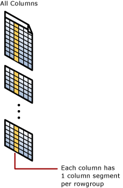
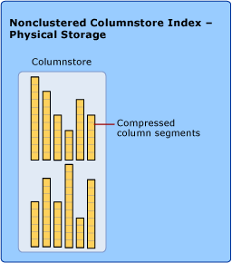
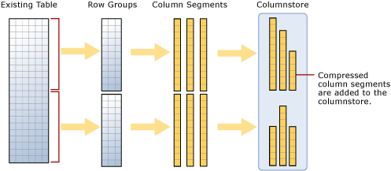

# Columnstore Indexes Described
  The [!INCLUDE[ssNoVersion](../../../includes/ssnoversion-md.md)] *in-memory columnstore index* stores and manages data by using column-based data storage and column-based query processing. Columnstore indexes work well for data warehousing workloads that primarily perform bulk loads and read-only queries. Use the columnstore index to achieve up to **10x query performance** gains over traditional row-oriented storage, and up to **7x data compression** over the uncompressed data size.  
  
> [!NOTE]  
>  We view the clustered columnstore index as the standard for storing large data warehousing fact tables, and expect it will be used in most data warehousing scenarios. Since the clustered columnstore index is updateable, your workload can perform a large number of insert, update, and delete operations.  
  
## Contents  
  
-   [Basics](#basics)  
  
-   [Loading Data](#dataload)  
  
-   [Performance Tips](#performance)  
  
-   [Related Tasks and Topics](#related)  
  
##   Basics  
 A *columnstore index* is a technology for storing, retrieving and managing data by using a columnar data format, called a columnstore. [!INCLUDE[ssNoVersion](../../../includes/ssnoversion-md.md)] supports both clustered and nonclustered columnstore indexes. Both use the same in-memory columnstore technology, but they do have differences in purpose and in features they support.  
  
###   Benefits  
 Columnstore indexes work well for mostly read-only queries that perform analysis on large data sets. Often, these are queries for data warehousing workloads. Columnstore indexes give high performance gains for queries that use full table scans, and are not well-suited for queries that seek into the data, searching for a particular value.  
  
 Columnstore Index benefits:  
  
-   Columns often have similar data, which results in high compression rates.  
  
-   High compression rates improve query performance by using a smaller in-memory footprint. In turn, query performance can improve because [!INCLUDE[ssNoVersion](../../../includes/ssnoversion-md.md)] can perform more query and data operations in-memory.  
  
-   A new query execution mechanism called batch-mode execution has been added to SQL Server that reduces CPU usage by a large amount. Batch-mode execution is closely integrated with, and optimized around, the columnstore storage format. Batch-mode execution is sometimes known as vector-based or vectorized execution.  
  
-   Queries often select only a few columns from a table, which reduces total I/O from the physical media.  
  
### Columnstore Versions  
 SQL Server 2012, SQL Server 2012 Parallel Data Warehouse, and SQL Server 2014 all use columnstore indexes to accelerate common data warehouse queries. SQL Server 2012 introduced two new features: a nonclustered columnstore index and a vector-based query execution capability that processes data in units called "batches." SQL Server 2014 has the features of SQL Server 2012 plus updateable clustered columnstore indexes.  
  
### Key Characteristics  
  
||  
|-|  
|**Applies to**: [!INCLUDE[ssSQL14](../../includes/sssql14-md.md)] through [!INCLUDE[ssCurrent](../../../includes/sscurrent-md.md)].|  
  
 In [!INCLUDE[ssNoVersion](../../../includes/ssnoversion-md.md)], a clustered columnstore index:  
  
-   Is available in Enterprise, Developer, and Evaluation editions.  
  
-   Is updateable.  
  
-   Is the primary storage method for the entire table.  
  
-   Has no key columns. All columns are included columns.  
  
-   Is the only index on the table. It cannot be combined with any other indexes.  
  
-   Can be configured to use columnstore or columnstore archival compression.  
  
-   Does not physically store columns in a sorted order. Instead, it stores data to improve compression and performance.  
  
||  
|-|  
|**Applies to**: [!INCLUDE[ssSQL11](../../includes/sssql11-md.md)] through [!INCLUDE[ssCurrent](../../../includes/sscurrent-md.md)].|  
  
 In [!INCLUDE[ssNoVersion](../../../includes/ssnoversion-md.md)], a nonclustered columnstore index:  
  
-   Can index a subset of columns in the clustered index or heap. For example, it can index the frequently used columns.  
  
-   Requires extra storage to store a copy of the columns in the index.  
  
-   Is updated by rebuilding the index or switching partitions in and out. It is not updateable by using the DML operations such as insert, update, and delete.  
  
-   Can be combined with other indexes on the table.  
  
-   Can be configured to use columnstore or columnstore archival compression.  
  
-   Does not physically store columns in a sorted order. Instead, it stores data to improve compression and performance. Pre-sorting the data before creating the columnstore index is not required, but can improve columnstore compression.  
  
###   Key Concepts and Terms  
 The following key terms and concepts are associated with columnstore indexes.  
  
 columnstore index  
 A *columnstore index* is a technology for storing, retrieving and managing data by using a columnar data format, called a columnstore. [!INCLUDE[ssNoVersion](../../../includes/ssnoversion-md.md)] supports both clustered and nonclustered columnstore indexes. Both use the same in-memory columnstore technology, but they do have differences in purpose and in features they support.  
  
 columnstore  
 A *columnstore* is data that is logically organized as a table with rows and columns, and physically stored in a column-wise data format.  
  
 rowstore  
 A *rowstore* is data that is logically organized as a table with rows and columns, and then physically stored in a row-wise data format. This has been the traditional way to store relational table data.  
  
 rowgroups and column segments  
 For high performance and high compression rates, the columnstore index slices the table into groups of rows, called row groups, and then compresses each row group in a column-wise manner. The number of rows in the row group must be large enough to improve compression rates, and small enough to benefit from in-memory operations.  
  
 row group  
 A *rowgroup* is a group of rows that are compressed into columnstore format at the same time.  
  
 column segment  
 A *column segment* is a column of data from within the rowgroup.  
  
-   A rowgroup usually contains the maximum number of rows per rowgroup which is 1,048,576 rows.  
  
-   Each rowgroup contains one column segment for every column in the table.  
  
-   Each column segment is compressed together and stored on physical media.  
  
   
  
 nonclustered columnstore index  
 A *nonclustered columnstore index* is a read-only index created on an existing clustered index or heap table. It contains a copy of a subset of columns, up to and including all of the columns in the table.. The table is read-only while it contains a non-clustered columnstore index.  
  
 A nonclustered columnstore index provides a way to have a columnstore index for running analysis queries while at the same time performing read-only operations on the original table.  
  
   
  
 clustered columnstore index  
 A *clustered columnstore index* is the physical storage for the entire table and is the only index for the table. The clustered index is updateable. You can perform insert, delete, and update operations on the index and you can bulk load data into the index.  
  
   
  
 To reduce fragmentation of the column segments and improve performance, the columnstore index might store some data temporarily into a rowstore table, called a deltastore, plus a B-Tree of IDs for deleted rows. The deltastore operations are handled behind the scenes. To return the correct query results, the clustered columnstore index combines query results from both the columnstore and the deltastore.  
  
 deltastore  
 Used with clustered columnstore indexes only, a *deltastore* is a rowstore table that stores rows until the number of rows is large enough to be moved into the columnstore. A deltastore is used with clustered columnstore indexes to improve performance for loading and other DML operations.  
  
 During a large bulk load, most of the rows go directly to the columnstore without passing through the deltastore. Some rows at the end of the bulk load might be too few in number to meet the minimum size of a rowgroup which is 102,400 rows. When this happens, the final rows go to the deltastore instead of the columnstore. For small bulk loads with less than 102,400 rows, all of the rows go directly to the deltastore.  
  
 When the deltastore reaches the maximum number of rows, it becomes closed. A tuple-move process checks for closed row groups. When it finds the closed rowgroup, it compresses it and stores it into the columnstore.  
  
##   Loading Data  
  
###   Loading Data into a Nonclustered Columnstore Index  
 To load data into a nonclustered columnstore index, first load data into a traditional rowstore table stored as a heap or clustered index, and then create the nonclustered columnstore index with [CREATE COLUMNSTORE INDEX &#40;Transact-SQL&#41;](/sql/t-sql/statements/create-columnstore-index-transact-sql).  
  
   
  
 A table with a nonclustered columnstore index is read-only until the index is dropped or disabled. To update the table and the nonclustered columnstore index you can switch partitions in and out. You can also disable the index, update the table, and then rebuild the index.  
  
 For more information see [Using Nonclustered Columnstore Indexes](indexes.md)  
  
###   Loading Data into a Clustered Columnstore Index  
   
  
 As the diagram suggests, to load data into a clustered columnstore index, [!INCLUDE[ssNoVersion](../../../includes/ssnoversion-md.md)]:  
  
1.  Inserts maximum-size rowgroups directly into the columnstore. As the data is loaded, [!INCLUDE[ssNoVersion](../../../includes/ssnoversion-md.md)] assigns the data rows in a first-come first-serve order into an open rowgroup.  
  
2.  For each rowgroup, after it reaches the maximum size, [!INCLUDE[ssNoVersion](../../../includes/ssnoversion-md.md)]:  
  
    1.  Marks the rowgroup as CLOSED.  
  
    2.  Bypasses the deltastore.  
  
    3.  Compresses each column segment with the rowgroup with columnstore compression.  
  
    4.  Physically stores each compressed column segment into the columnstore.  
  
3.  Inserts the remaining rows into the columnstore or the deltastore as follows:  
  
    1.  If the number of rows meets the minimum rows per rowgroup requirement, the rows are added to the columnstore.  
  
    2.  If the number of rows is less than the minimum rows per rowgroup, the rows are added to the deltastore.  
  
 For more information about deltastore tasks and processes, see [Using Clustered Columnstore Indexes](../../database-engine/using-clustered-columnstore-indexes.md)  
  
##   Performance Tips  
  
### Plan for enough memory to create columnstore indexes in parallel  
 Creating a columnstore index is by default a parallel operation unless memory is constrained. Creating the index in parallel requires more memory than creating the index serially. When there is ample memory, creating a columnstore index takes on the order of 1.5 times as long as building a B-tree on the same columns.  
  
 The memory required for creating a columnstore index depends on the number of columns, the number of string columns, the degree of parallelism (DOP), and the characteristics of the data. For example, if your table has fewer than one million rows, SQL Server will use only one thread to create the columnstore index.  
  
 If your table has more than one million rows, but SQL Server cannot get a large enough memory grant to create the index using MAXDOP, SQL Server will automatically decrease MAXDOP as needed to fit into the available memory grant.  In some cases, DOP must be decreased to one in order to build the index under constrained memory.  
  
##   Related Tasks and Topics  
  
### Nonclustered Columnstore Indexes  
 For common tasks, see [Using Nonclustered Columnstore Indexes](../../database-engine/using-nonclustered-columnstore-indexes.md).  
  
-   [CREATE COLUMNSTORE INDEX &#40;Transact-SQL&#41;](/sql/t-sql/statements/create-columnstore-index-transact-sql)  
  
-   [ALTER INDEX &#40;Transact-SQL&#41;](/sql/t-sql/statements/alter-index-transact-sql) with REBUILD.  
  
-   [DROP INDEX &#40;Transact-SQL&#41;](/sql/t-sql/statements/drop-index-transact-sql)  
  
### Clustered Columnstore Indexes  
 For common tasks, see [Using Clustered Columnstore Indexes](../../database-engine/using-clustered-columnstore-indexes.md).  
  
-   [CREATE CLUSTERED COLUMNSTORE INDEX &#40;Transact-SQL&#41;](/sql/t-sql/statements/create-columnstore-index-transact-sql)  
  
-   [ALTER INDEX &#40;Transact-SQL&#41;](/sql/t-sql/statements/alter-index-transact-sql) with REBUILD or REORGANIZE.  
  
-   [DROP INDEX &#40;Transact-SQL&#41;](/sql/t-sql/statements/drop-index-transact-sql)  
  
-   [INSERT &#40;Transact-SQL&#41;](/sql/t-sql/statements/insert-transact-sql)  
  
-   [UPDATE &#40;Transact-SQL&#41;](/sql/t-sql/queries/update-transact-sql)  
  
-   [DELETE &#40;Transact-SQL&#41;](/sql/t-sql/statements/delete-transact-sql)  
  
### Metadata  
 All of the columns in a columnstore index are stored in the metadata as included columns. The columnstore index does not have key columns.  
  
-   [sys.indexes &#40;Transact-SQL&#41;](/sql/relational-databases/system-catalog-views/sys-indexes-transact-sql)  
  
-   [sys.index_columns &#40;Transact-SQL&#41;](/sql/relational-databases/system-catalog-views/sys-index-columns-transact-sql)  
  
-   [sys.partitions &#40;Transact-SQL&#41;](/sql/relational-databases/system-catalog-views/sys-partitions-transact-sql)  
  
-   [sys.column_store_segments &#40;Transact-SQL&#41;](/sql/relational-databases/system-catalog-views/sys-column-store-segments-transact-sql)  
  
-   [sys.column_store_dictionaries &#40;Transact-SQL&#41;](/sql/relational-databases/system-catalog-views/sys-column-store-dictionaries-transact-sql)  
  
-   [sys.column_store_row_groups &#40;Transact-SQL&#41;](/sql/relational-databases/system-catalog-views/sys-column-store-row-groups-transact-sql)  
  
  
